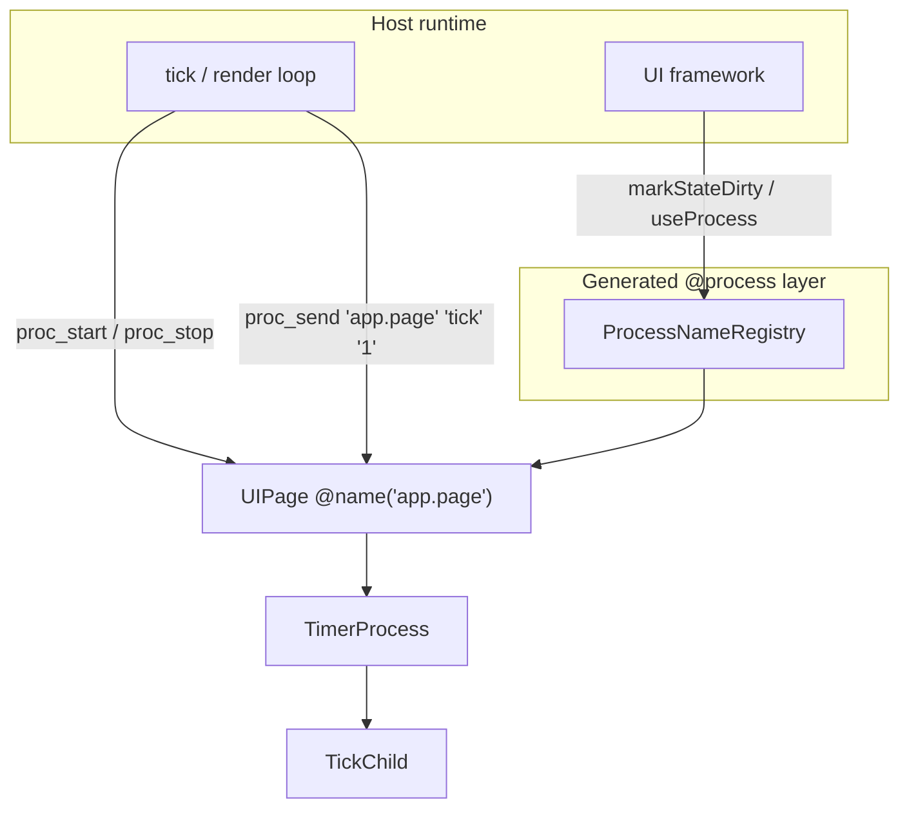
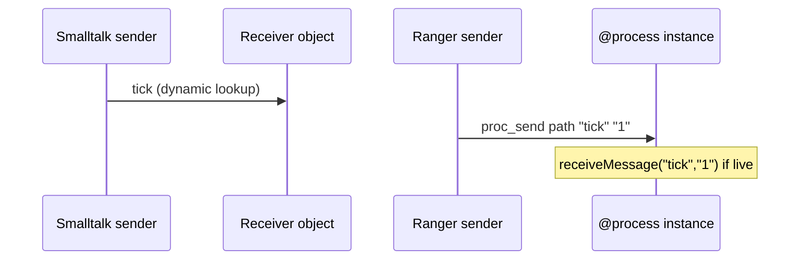
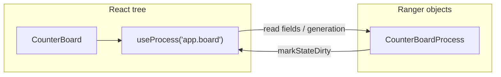

# Ranger `@process` — comparison with other models

A concise map of **Ranger’s process runtime** against familiar object/lifecycle and UI patterns. For implementation status see [PROCESS_STATUS.md](PROCESS_STATUS.md); for Objective-C / UIKit depth see [PROCESS_COMPARE_WITH_OBJECTIVEC.md](PROCESS_COMPARE_WITH_OBJECTIVEC.md).

---

## What Ranger processes are

`@process` classes are **ordinary objects** with compiler-generated **tree wiring**, **app-wide IDs**, **named paths**, and **explicit lifecycle** (`proc_start` / `proc_stop`, optional `start` / `stop` / `hibernate` / `wakeup`). The host (JS, Kotlin, Swift, React) owns the thread/loop and calls into them; there is **no built-in message queue** in the compiler—only `proc_send` → `receiveMessage(name, value)` when the target is live.

---

## At-a-glance comparison

| Model | Unit of work | Hierarchy | Address / lookup | Async delivery | Teardown |
|-------|----------------|-----------|------------------|----------------|----------|
| **Ranger `@process`** | Typed class instance | Parent/child on `new` under live parent | `__rangerId`, `@name` path, `find_process` | Host-driven; `proc_send` → `receiveMessage` (sync if live) | `__rangerStopSubtree()` then `stop()` |
| **Smalltalk** | Object | Class hierarchy + composition | Identity = object reference | `perform:` / `doesNotUnderstand:` | GC; no standard subtree protocol |
| **Objective-C / UIKit** | NSObject subclass | Superclass + owned subviews/children | Pointer; VC hierarchy | Run loop, `performSelector:`, blocks | `dealloc` (ARC); VC lifecycle |
| **Erlang / OTP** | Lightweight process | Supervision trees | PID | Mailbox (`receive`) | `exit`, supervisor restarts |
| **React (hooks)** | Function component | Component tree (virtual) | Closure state per mount | `setState` → re-render | Unmount runs effect cleanup |
| **Android Activity** | Activity / Fragment | Back stack, FM | Component name / tag | Main `Handler`, LiveData | `onDestroy`, fragment transactions |
| **Redux / Flux** | Reducer over store | N/A (flat store) | Action type + dispatch | Dispatch queue (sync by default) | N/A (immutable snapshots) |

---

## Smalltalk — “everything is a message”

Smalltalk made **message sending** the primary abstraction: `receiver selector: arg` is dynamic; the method lookup happens at runtime. Classes are metadata; behavior lives in the object.

| Smalltalk | Ranger |
|-----------|--------|
| Any object can receive any selector (with `doesNotUnderstand:`) | Methods are **statically resolved**; cross-process call is **`proc_send` + `receiveMessage(name, value)`** (string pair) |
| Image-wide object memory | Per-app **registry** and **integer IDs** |
| No prescribed lifecycle tree | **Explicit** parent/child and **ordered subtree stop** |

**Takeaway:** Ranger keeps Smalltalk’s *idea* of named delivery to a live object, but trades full dynamism for **types, codegen, and predictable teardown**—closer to a product kernel than to a research VM.

---

## Objective-C / UIKit — objects + run loop + lifecycle

Apple stacks combine **retained object graphs**, **serial main run loop**, and **view-controller phases** (`viewWillAppear`, …). Ranger’s `proc_start` / `proc_stop` and subtree stop mirror **“tear down children before parent”** without reference counting.

| UIKit-ish concept | Ranger analogue |
|-------------------|-----------------|
| View controller instance | `@process` class + optional `@name("app.screen")` |
| `viewDidLoad` / `viewWillDisappear` | `start()` / `stop()` (optional hooks) |
| Child VCs / subviews | Children registered when `new` runs under a **live** parent process |
| `NSNotificationCenter` | App-level bus; `proc_send` is **point-to-point** by path |
| Main queue | Host **`tick`** / render loop (not emitted by compiler) |

**Further reading:** [PROCESS_COMPARE_WITH_OBJECTIVEC.md](PROCESS_COMPARE_WITH_OBJECTIVEC.md).

---

## React hooks — ephemeral UI state vs long-lived processes

React components are **functions re-invoked on render**; `useState` / `useReducer` hold state keyed to **fiber mount identity**. Effects (`useEffect`) tie side effects to mount/unmount.

| React hooks | Ranger `@process` |
|-------------|-------------------|
| State dies on unmount (unless lifted) | Instances persist until **`proc_stop`**; registry may retain path mapping |
| Re-render when React detects state change | UI refresh via **`markStateDirty`** / host subscription ([gallery](gallery/process_counter_board/README.md)) |
| Tree = JSX hierarchy | Tree = **runtime object graph** (may differ from React tree) |
| `useContext` for shared store | **`ProcessNameRegistry.findProcess(path)`** for named lookup |

**Bridge pattern:** generated TS + `useProcess(path)` treats a process as **external store** the component subscribes to—similar spirit to `useSyncExternalStore`, but lifecycle is **`proc_*`**, not React alone.

**Takeaway:** Hooks excel at **view-local** state and declarative UI; Ranger processes excel at **orchestration** (timers, pages, chat sessions) that should survive individual component remounts and have a **defined stop order**.

---

## Erlang / actors — isolation vs shared heap

Erlang processes are **isolated**, preemptively scheduled, with **mailboxes** and **supervision**. Failure is contained; sharing is message-only.

| Erlang OTP | Ranger |
|------------|--------|
| Separate heaps, copy messages | **Same address space** as host (JS/Kotlin/Swift) |
| `receive` blocks process | `receiveMessage` is a **normal method call** when target is live |
| Supervision policies | **Manual** `proc_stop` / subtree stop; no supervisor codegen yet |
| Spawn is cheap | `new` + `proc_start`; **`spawn local/global`** not implemented |

**Takeaway:** Ranger is an **orchestration layer for OOP instances**, not a distributed actor system. Use Erlang when you need fault isolation; use `@process` when you need **typed trees inside one app** with UI-friendly lifecycle.

---

## Other useful references (one line each)

| System | Relation to Ranger |
|--------|---------------------|
| **Android Activity + FragmentManager** | Back stack and `onDestroy` ≈ page switch + `proc_stop` subtree; fragments ≈ child `@process` instances. |
| **SwiftUI `Observable` / Combine** | Fine-grained property publishing; Ranger uses **generation counter + path notify** (`ProcessUiHost`)—more manual, backend-agnostic. |
| **Redux / Elm** | Single immutable store; Ranger favors **many objects + `proc_send`**—decentralized state, no global reducer. |
| **Game “entity” hierarchies** | Scene graph with parent transforms; same **tree + ordered teardown** mindset as `@process` children. |

---

## Design choices (why Ranger is not a clone of any one model)

| Choice | Rationale |
|--------|-----------|
| **Compile-time `@process` + codegen** | Same Ranger source → JS / Kotlin / Swift; hosts stay thin. |
| **Explicit `proc_start` vs `new`** | Build object graph first, activate when “on screen” (like constructing a VC before appear). |
| **Subtree stop in language** | Navigation and page switches must not leak timers/children—kernel bug class in mobile apps. |
| **String `proc_send` (for now)** | Simple cross-target messaging; typed envelopes can sit in app code or a later compiler pass. |
| **No compiler message queue** | Queues, priorities, and main-thread rules vary by product; [PROCESS_MVP.md](PROCESS_MVP.md) documents **field + `drainInbound` + host tick**. |

---

## When to use which mental model

| Your problem | Reach for |
|--------------|-----------|
| UI that maps 1:1 to components and remounts often | **React hooks** (or local state in any UI toolkit) |
| Apple-style screens, delegates, notifications | **ObjC/UIKit patterns** — see dedicated compare doc |
| Exploratory OO with maximal dynamism | **Smalltalk-style** messaging (Ranger only borrows the metaphor) |
| Fault-tolerant distributed services | **Erlang/actors**, not `@process` alone |
| Multi-screen app with timers, named services, shared codegen | **Ranger `@process` + host loop** |

---

## Related docs

- [PROCESS_MVP.md](PROCESS_MVP.md) — what the MVP proves vs app kernel
- [PROCESS_LIFECYCLE.md](PROCESS_LIFECYCLE.md) — operators and hooks
- [PROCESS_STATUS.md](PROCESS_STATUS.md) — checklist and gaps
- [PROCESS_COMPARE_WITH_OBJECTIVEC.md](PROCESS_COMPARE_WITH_OBJECTIVEC.md) — deep UIKit / ObjC mapping
- [playground/](playground/) — browser compile-and-run for process fixtures
