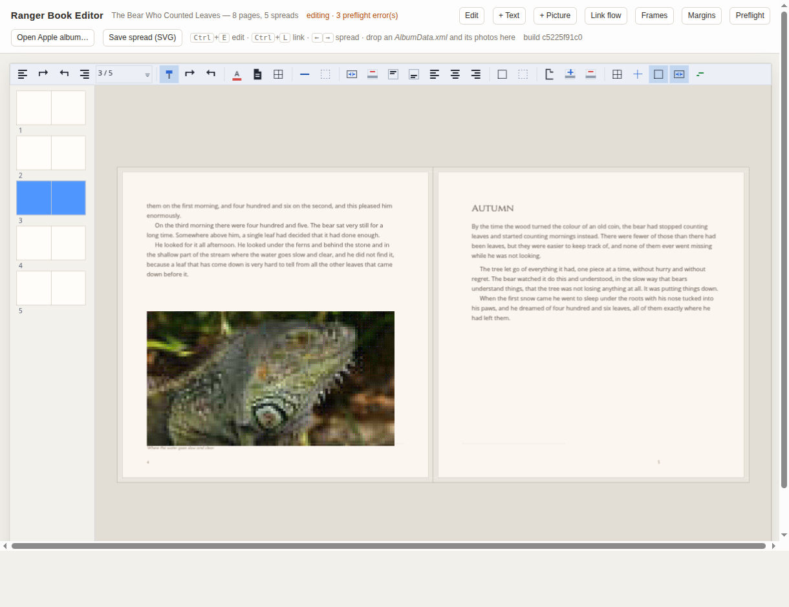
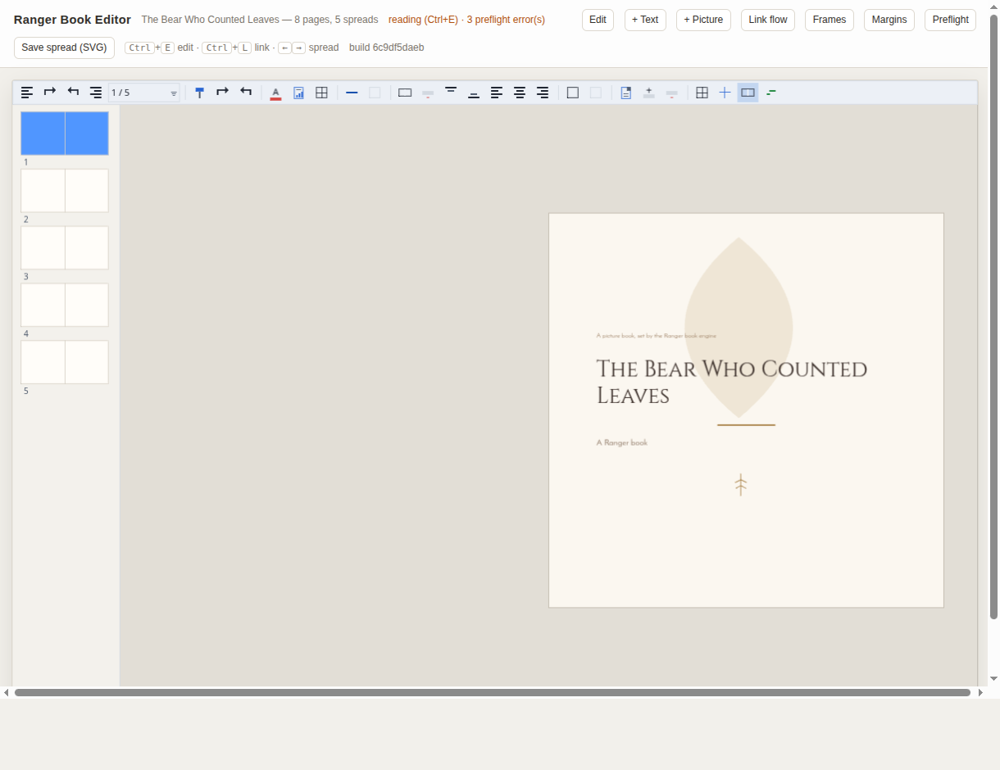
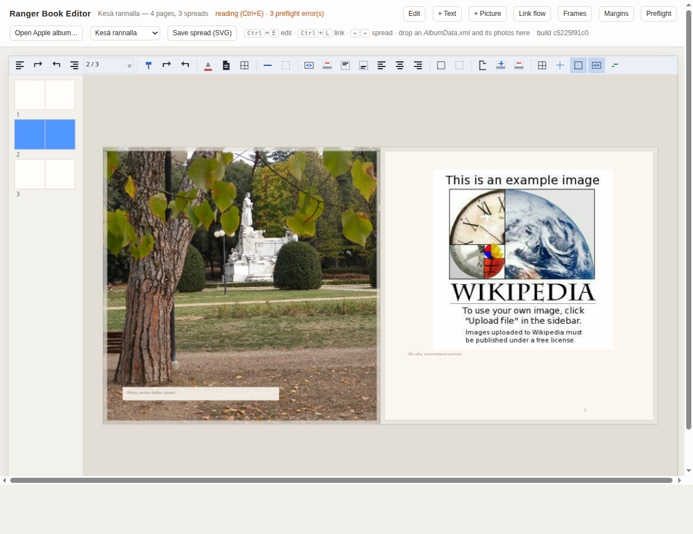

# Book — a visual book composition engine

A page-layout engine for picture books and printed books, written in Ranger.
Not an InDesign clone and not a vector design suite: the smallest set of
structures a book actually needs, plus the one thing a vector editor cannot
give you for free — **text that flows**.

```bash
npm run book:web            # the editor, in a browser, with no server behind it
npm run book:web:serve      # …and serve it at http://localhost:8003
npm run book:demo           # lay the book out, check it, write SVG + TSX
npm run book:pdf            # …and turn it into a PDF with the existing EVG tooling
npm run book:print          # the files a printer wants: interior + cover + manifest
npm run book:album          # make a book out of an Apple photo album
npm run book:test           # 161 assertions on the engine, JavaScript
npm run book:test:go        # the same 161 on Go (and book:test:python on Python)
npm run book:editor:test    # 79 more on the editor and the host seam
npm run book:web:test       # drive the page in a real browser, on WebGL
```



The editor runs **in the page**. `book_web.rgr` compiles the whole engine —
model, flow, preflight — to JavaScript, and the page hands it font bytes and
photographs and draws the display list it gets back through WebGL 2. A pointer
move is a function call, not a round trip; there is no host process. (There is
also `npm run book:window`, which runs the same `BookApp` in Node and posts
events at it over HTTP — useful for driving the editor from a script, and the
wrong shape for a product.)

## Why this and not a vector editor

A drawing program has shapes, layers and transforms. A book has those too, but
what makes it a book is a structure a drawing program has no reason to own:

```
Story                     TextFrame
  the words, in order       an area on a page that borrows part of a story
  page-independent          page-dependent, disposable
```

Text lives in the story. A page only owns a frame that the story happens to be
passing through. Move the frame, resize it, delete the page — the story is
untouched, and the words simply land somewhere else. That single separation is
what a picture-book tool needs and what you cannot bolt onto a path editor
afterwards.

Everything else follows from it: linked frames, overset text, master pages,
automatic pagination, and a preflight check that can say *"page 7 has words on
it that no page shows"*.

## Where the pieces come from

| Reference | Taken | Left behind |
| --- | --- | --- |
| **Scribus** | pages, spreads, master pages, text frames, linked flow, the prepress questions | the prepress UI, the GPL source (this is a behaviour reference, not a port) |
| **Paged.js** | continuous content → paginated output; measure, fill, overflow, next | the CSS engine and the DOM |
| **Typst** | a layout model both the editor and the exporter read, rather than two | the markup language and the compiler |
| **Graphite** | vector decoration, layers, transforms — via EVG, which Ranger already has | the procedural node compositor |

## Architecture

Nine files, each with one job, and none of them rendering anything itself:

```
BookModel.rgr        the document: pages, spreads, masters, frames, stories,
                     styles, assets. Plain data plus lookup — no layout.
BookFlow.rgr         the flow engine: story → lines → columns → frames → pages.
                     Orphans, widows, keep-with-next, hard breaks, overset.
BookAutoLayout.rgr   template + story + photographs → pages, grown until the
                     story fits. Front matter and signature padding.
BookRender.rgr       placed lines → SVG (page or spread) and → TSX (the EVG
                     document form). Transcription, never re-layout.
BookPreflight.rgr    the questions a printer asks: resolution, bleed, safety,
                     overset, signatures, missing assets.
BookApi.rgr          all of the above with the wiring done, and one rule: any
                     edit invalidates the flow, so no export ships stale pages.

BookToEvg.rgr        placed lines → EVGDisplayList, the form every EVG host
                     draws: WebGL, OpenGL/SDL, or the software canvas.
BookEdit.rgr         the editor: selection, drag, resize, snap, insert, pages,
                     linking, undo. Page points; it has never heard of a pixel.
BookView.rgr         the canvas — the CPU path, and the measurer that makes the
                     flow engine measure with the faces the screen paints with.
BookApp.rgr          the host seam: the only place a window pixel becomes a
                     page point. Toolbar, pages panel, commands, chrome.
BookSample.rgr       one book, in code, that the demo prints and the editor
                     opens — so the thing being demonstrated is a thing that
                     has actually been through a press.

ApplePlist.rgr       the XML property list, as far as an album index needs it.
BookAppleAlbum.rgr   an iPhoto/Aperture library index → an album: the
                     photographs, in the album's order, with their captions.
BookAlbumImport.rgr  an album → a laid-out book. No file access, so it runs in
                     the browser too.
BookAlbumMeasure.rgr the pictures' pixel sizes, off their JPEG headers. The
                     only part of the album path that touches a disk.
```

Output goes out through machinery that already existed:

```
BookDocument → flow → placed lines → TSX → evg_pdf_tool  → PDF
                                        → evg_html_tool → HTML
                                        → evg_png_tool  → PNG
                                  → SVG → the editor canvas, and tests
```

`gallery/pdf_writer` is doing the printing. This directory contributes no PDF
code at all — which is the point: the book engine is a document model and a
flow engine, and Ranger already had a renderer.

## The editor



The frame around the canvas — the strip, the window layer, the command table —
is the **shared** one the spreadsheet, the document and the deck all use
(`gallery/evg`). A fourth toolbar in a fourth style would have been the wrong
kind of new code. Two more pieces moved into that shared directory while this
was built, because the book editor was the second caller:
`EVGImageDecode` (PNG/JPEG bytes → pixels, which the deck viewer had been
holding with a note on it saying it was not deck-specific) and
`EVGSelectChrome` (where the eight handles are, and which edges each one owns —
the slide editor and this one now number their handles from the same file, and
`applyResize` in both reads its answers out of it).

Four rules are taken from the slide editor because they were right there and
are right here — an id is not an index, history is snapshots, a drag is one
edit, editing is a mode — and one is this program's own:

> **Every geometry edit re-flows.** Resizing a text frame does not move text
> inside it; it moves text onto other pages. An editor that does not re-flow
> after a drag is showing a book that does not exist.

The gesture that has no equivalent in a slide editor is **Link flow**
(Ctrl+L): select two text frames, and the story runs from one into the other.
It moves no text. It changes where the text is allowed to go, and the flow
engine decides the rest.

| | |
| --- | --- |
| Ctrl+E | edit / read |
| Ctrl+L | link the selected text frames into one story |
| Ctrl+A / Ctrl+D / Del | select all, duplicate, delete |
| Ctrl+Z / Ctrl+Y | undo, redo |
| ← → | turn the spread (nudge the selection while editing) |
| drag | move; handles resize; empty page starts a marquee |
| click while reading | selects what is under it and arms editing — a click on a page never turns it |

**A page shows its bleed, and the sheets do not touch.** A full-bleed picture
overhangs the trim by 3 mm by design; on a canvas with no clip that overhang is
drawn across the desk and over the facing page, which is neither what the press
does with it nor what the author is deciding about. Each page is now cut to its
own sheet — trim plus bleed — and the overhang is veiled towards the desk
colour with the trim drawn as a hairline inside it, so "past the edge" reads as
past the edge. The two pages of a spread sit two bleeds apart for the same
reason: edge to edge, one page's bleed would be painted onto the other's live
area. **Bleed** in the toolbar turns it off, and then the spread closes up and
looks like the printed sheet.

**The page turn lives on the desk, not on the page.** Clicking the left or
right third used to turn the spread wherever you clicked, so the first thing
anyone reaches for — click the picture, move it — turned the page instead and
nothing on it could ever be touched. A click on a page now selects what is
under it and arms editing; only the desk on either side turns the spread.

Frames snap to the margins, to the page's own edges and centre, and to the
other frames — measured from where the drag **began**, not from the last
pointer frame. That is not a refinement: snapping per-delta means a frame
sitting on a guide is pulled back onto it by every small step and can never be
dragged off.

## The flow engine

The interesting part is not filling a column. It is being willing to *undo*
filling a column:

```
paragraph arrives
      ↓
how many lines fit?             geometry
      ↓
would that orphan a line?       typography — push the paragraph forward whole
would it widow one?             typography — hold lines back
is this a heading at the foot?  typography — it travels with its paragraph
      ↓
place, or move on to the next column / frame / page
```

That is why the unit of work is the paragraph and not the line: a one-pass
filler cannot retract a decision it has already made, so it cannot enforce a
single one of those rules. The tests in `tests/BookTest.rgr` check each of them
against hand-broken paragraphs, so they pass or fail on the logic rather than on
which fonts happen to be installed.

Measurement goes through `EVGTextEngine` — the module that exists so that layout
and paint cannot disagree about where a line breaks. Install the same
`TTFTextMeasurer` the PDF tool uses (`api.useTextEngine(...)`, as the demo does)
and the preview and the proof break lines identically by construction. Skip it
and preflight will tell you, as an error, that they will not.

## Auto layout

The differentiator is not that pages can be generated. It is that the generator
asks the flow engine instead of estimating:

```
Book template
      +                    place a page from the next recipe in the rotation
   Story          →        flow the story
      +                    still overset? place another page
  Images                   repeat
      ↓
    pages
      ↓
 manual edit               ordinary frames, nothing locked, nothing generated-
                           looking about them afterwards
```

Recipes rotate (`full-bleed`, `image-top`, `image-bottom`, `text-only`), so a
generated book has a rhythm rather than a pattern. Full-bleed images are
generated 3 mm past the trim, because that is what makes them printable — the
same rule preflight would otherwise flag.

## Preflight

The checks are the ones that are invisible on screen by construction, which is
exactly why they need computing:

| Check | Why it costs money |
| --- | --- |
| overset text | words that exist in the story and on no page |
| effective resolution | a 600 px photo across a 210 mm page is 72 dpi and looks perfect on a monitor |
| bleed | an element that stops *at* the trim leaves a white sliver when the guillotine drifts |
| safety margin | text nearer the trim than the bindery can promise |
| signatures | a page count that is not a multiple of four |
| font metrics | text measured with guessed widths will not break where it prints |

The demo deliberately fails three of them: the sample photographs bundled with
`pdf_writer` are 500–640 px, which is genuinely too small for a 210 mm page.
That is preflight working, not preflight misconfigured.

## Getting it printed

A book on screen is one artefact; a book at a press is three, and the rules it
has to satisfy belong to the **printer**, not to the book. `BookPrintSpec` is
those requirements as data — `layflat-210`, `hardcover-a4`, `softcover-a5`,
`offset-sewn`, `generic` — and preflight checks against whichever one you name.

`npm run book:print` writes:

| File | What it is |
| --- | --- |
| `interior.pdf` | the pages, **single, in reading order**, page 1 a recto, blanks included, at trim + bleed with a TrimBox |
| `cover.pdf` | back, spine and front on one landscape sheet |
| `print.json` | extent, trim, bleed, spine width, cover sheet — the fields a print-on-demand API asks for |
| `preflight.txt` | what a printer would complain about |
| `render.sh` | the exact commands that made the PDFs, with the computed page sizes **and the finishing flags** in them |

Three rules are assertions rather than settings, because they are not
negotiable:

- **Page 1 is a recto.** Odd pages on the right, even on the left. A cover is
  always the right-hand side of the sheet it is bound onto.
- **Single pages, in reader's order** — 1, 2, 3, 4. Printer spreads
  (32–1 / 2–31) are the press's business, and imposing them yourself is how a
  book comes back bound inside out. The engine designs in spreads and exports
  leaves, which is the whole point of a page-layout program.
- **A blank page is a page.** It takes a leaf, it is counted, and it has to be
  *in* the file. `padToExtent` adds real blank pages; leaving them out silently
  moves every page after them onto the wrong side.

The spine is arithmetic and the engine does it:

```
leaves     = pages / 2
text block = leaves × caliper          0.17 mm for 170 gsm coated silk
spine      = text block + binding      + two boards, cased; + the wrap, soft
```

`BookCoverSpec` also carries the squares (the board standing proud of the
page), the hinge either side of the spine and the turn-in. **Take the
supplier's own cover template before a production run** — this exists so a
cover can be proofed and budgeted before that template arrives, and so their
number can be checked against one rather than typed in from a guess.

What preflight will not let past for a named spec: the wrong trim size, an
extent under the minimum or over the maximum or off the binding's multiple, a
picture under the dpi floor, ink that stops at the trim instead of bleeding
past it, and text in the gutter — which is checked against a **larger** margin
than the cut edges, on whichever side of the page the spine is.

### Finishing: what makes it a print file

The exported PDF identifies itself and says what its colours are for:

| | |
| --- | --- |
| `%PDF-1.6` | PDF/X-4 is a 1.6 feature set; claiming it in a 1.5 header is the contradiction a preflight tool opens with |
| XMP `GTS_PDFXVersion` | where PDF/X is *identified* — not a dictionary key |
| `/OutputIntents` | the printing condition: `sRGB IEC61966-2.1` for a print-on-demand job, `FOGRA39` for coated offset. A registered characterization name stands in for an embedded ICC profile |
| `/Trapped /False` | not optional — a file that does not say cannot be PDF/X |
| `/Info`, `MediaBox`, `TrimBox` | title and author, the sheet, and where the finished page is cut |

**CMYK.** `-colors cmyk` separates every fill, stroke and glyph to process ink
on the way out, with maximum black generation — so pure black comes out as
**100% K and nothing else**, which matters more than accuracy does: text
separated into four inks goes soft the moment the registration drifts.

It is a *device* conversion. No profile is consulted, so it is what a press
would do to untagged RGB anyway, done where it can at least be declared —
and the exporter says so rather than letting the number look authoritative.

**The gap is pictures, and it is not papered over.** Text and vectors separate;
a JPEG does not. An untagged DeviceRGB image inside a file whose output intent
is a CMYK condition is a PDF/X conformance failure, so the exporter counts
them, says which two ways out there are (supply CMYK pictures, or keep the job
in RGB with an RGB intent — which several print-on-demand services prefer),
and under `-strict-print` **refuses to write the file at all**. A PDF that
claims PDF/X and is not one is worse than a PDF that claims nothing.

```bash
npm run book:print                # layflat 210: RGB intent, clean PDF/X-4
npm run book:print -- offset-sewn  # CMYK: separates, then stops on the pictures
```

Still missing: an embedded ICC profile (the intent is a registered name), a
real ICC transform behind the CMYK conversion, and CMYK image data.

## Using it

```ranger
def api (BookApi.create("The Bear Who Counted Leaves" "square-210"))
api.useTextEngine(engine)          ; real font faces — do this first
api.defaultStyles()

def m:BookMasterPage (api.master("story"))
m.setMargins(52.0 58.0 62.0 46.0)  ; top, bottom, inner, outer
m.showPageNumber = true

def s:BookStory (api.story("main"))
s.addParagraph("Chapter One" "chapter")
s.addParagraph("Once upon a time..." "body")

api.asset("photo-1" "photos/1.jpg" 3000.0 2000.0)

api.titlePage()
api.autoLayout("main" "story")
api.auto.padToSignature(api.doc 4)

def report:BookPreflightReport (api.runPreflight())
print (report.asText())

api.writeSpreads("./out" "spread")
api.writeTsx("./out" "book.tsx")
```

`api.toJson()` gives a host — a React canvas, a server route — the laid-out
book as data: pages, frames, positions, which frame continues into which, and
whether anything is overset.

## Opening an Apple photo album



iPhoto and Aperture describe a whole library in one XML property list —
`AlbumData.xml` beside the library, `ApertureData.xml` for Aperture — and that
file plus the photographs it names is all an album is. `ApplePlist.rgr` reads
the property list, `BookAppleAlbum.rgr` joins `List of Albums` to
`Master Image List`, and `BookAlbumImport.rgr` turns the result into the same
`BookApi` everything else here takes.

```bash
npm run book:album                                     # the bundled fixture
npm run book:album -- -list -library ~/Pictures/iPhoto\ Library
npm run book:album -- -library ~/Pictures/iPhoto\ Library -album "Kesä 2019" \
                      -images ~/photos -min-rating 3 -format square-250
```

The editor opens one too, with no server and nothing uploaded: **drop an
`AlbumData.xml` and its photographs onto the page**, or use *Open Apple
album…*. The parser and the layout are compiled into `book_web.js`, so the
library is read where it is opened.

Three decisions are worth knowing about, because they are what separates this
from "one photograph per page":

**Orientation chooses the page.** A landscape photograph bleeds off all four
edges; a portrait one sits inside the margin with its caption beneath it, in a
frame that has taken the picture's own proportions — so the caption is under
the picture rather than under empty paper. That needs the pixel sizes *before*
the layout, which is why `BookAlbumMeasure` runs first on the command line and
why the browser measures each dropped file before opening the album.

**A caption is the album's, not the file's.** iPhoto captions an untouched
photograph with its file name, so `IMG_4021.JPG` would otherwise be printed
under it. A caption that looks like a file name falls through to the comment,
then to the date, then to silence. And a full-bleed page gets its caption on a
small slab of paper at the foot rather than losing it: the auto layout calls a
caption over a bleeding picture a manual edit, which is right for a story book
and wrong for an album.

**A modern Photos library has no index.** Apple stopped writing `AlbumData.xml`,
so an album exported to a folder arrives through `AppleAlbum.fromPaths` — the
host enumerates the files, since Ranger has no directory listing, and
everything downstream is the same code.

`gallery/book/fixtures/AlbumData.xml` is a real iPhoto index in miniature:
three photographs, two albums plus one of Apple's own, a movie, and Finnish
captions written as numeric character references exactly as iPhoto writes them.
The browser build ships it, so `?album=1` opens it without a Mac.

## Formats

`square-210`, `square-250`, `square-8.5in`, `a4`, `a4-landscape`, `a5`,
`letter`, `trade-5x8`, `trade-6x9`. Square trims come first because picture
books are square far more often than they are A4. `BookUnits.mm/cm/inch/pt`
convert; the model stores points.

## Targets

The engine is plain Ranger with no host dependencies beyond `gallery/evg`, and
the full test suite passes on **JavaScript, Go and Python** — 161 assertions
each. The demo additionally uses `gallery/pdf_writer`'s `FontManager` for real
font metrics, which is why it lives in `src/book_demo.rgr` rather than in the
library.

## What is not here yet

Hyphenation, optical margin alignment and a real justification engine (lines
currently stretch at render time rather than being broken for even colour);
text frames that are not rectangles; text wrapping around an image; footnotes;
a table model; a real ICC transform behind the CMYK conversion; and CMYK image
data. `PLAN.md` has the order and the reasoning.
