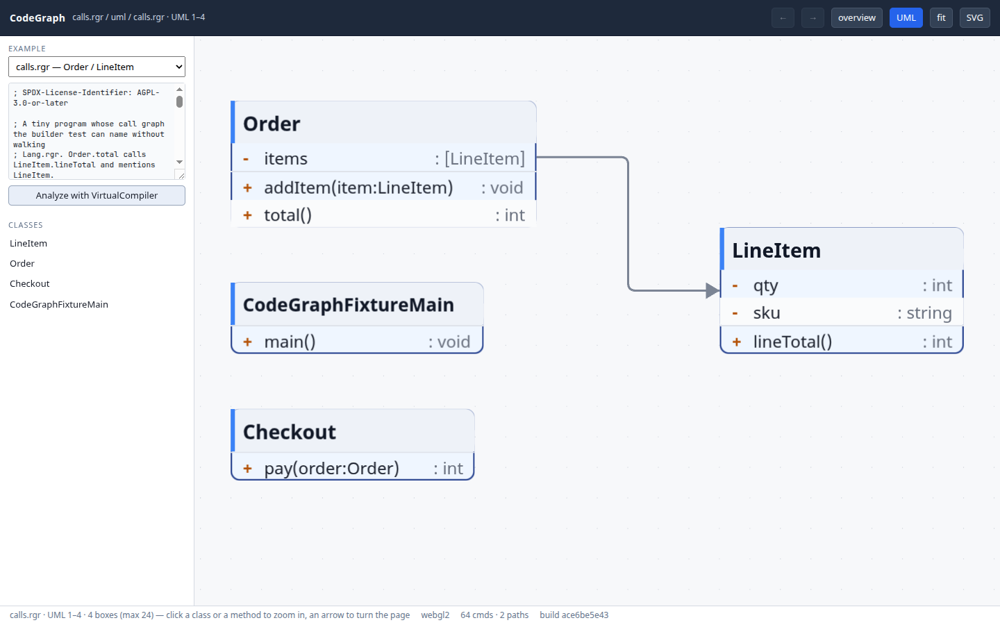
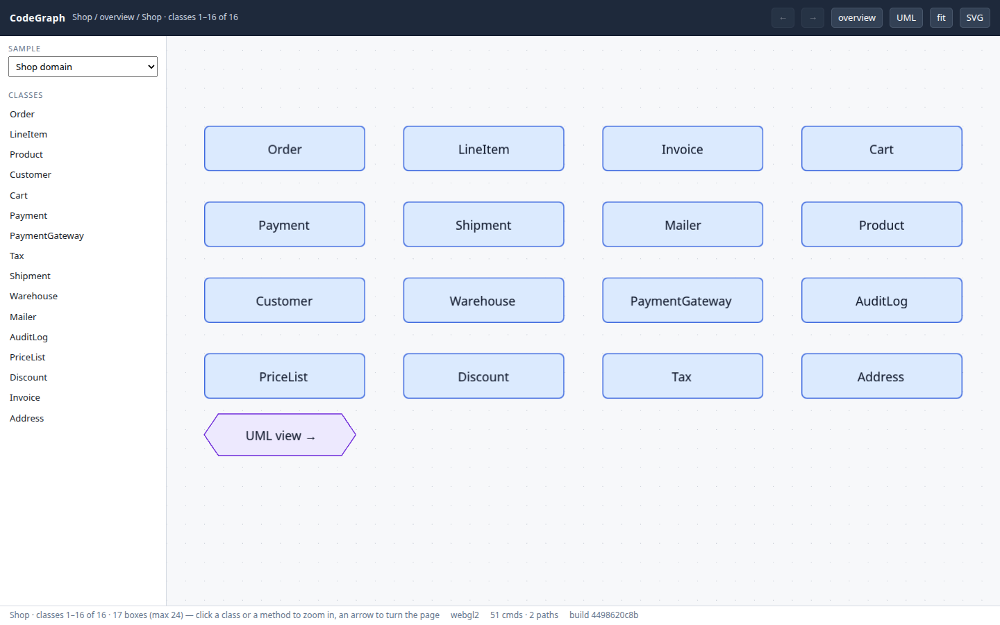

# CodeGraph — Ranger source as a paged call graph

A **gallery app** of its own, not a RangerFlow demo. RangerFlow draws one
window of the graph on the EVG WebGL canvas; the chrome around it is this
application: a class list, a breadcrumb, history back/forward, an example
picker and an UML toggle.

Live example files (`fixtures/calls.rgr`, `fixtures/animals.rgr`) are
compiled **in the tab** by VirtualCompiler — the same compiler the playground
uses — then walked into the IR. Shop / 40-class fixtures stay as a
no-compiler fallback.

A thousand-node dump does not fit on a chart and is slow to lay out. Twenty
to thirty boxes do. Click a class in the rail or on the canvas to drill in.

```text
  .rgr  ──VirtualCompiler──►  RangerFlowParser walk
                                    │  isCalling / isCalledBy / isUsingClasses
                                    ▼
                               CodeGraph (IR)
                                    │
                         CodeGraphPages (≤ 24 boxes)
                                    │
                          FlowGraph (RangerFlow, as a library)
                                    ▼
                         EVG display list → WebGL
```

**License: AGPL-3.0-or-later** — see [`../LICENSE`](../LICENSE).

The same page is published at
**[terotests.github.io/Ranger/codegraph/](https://terotests.github.io/Ranger/codegraph/)**
by the Pages workflow.



![animals.rgr: Farm.animals:[Animal] and Dog/Cat inherit Animal](artifacts/codegraph_animals.png)



## Run

```bash
npm run codegraph:test         # paging, clicks, history
npm run codegraph:builder      # VirtualCompiler walk of fixtures/calls.rgr
npm run codegraph              # SVG of the shop overview + Order zoom
npm run codegraph:analyze -- gallery/codegraph/fixtures/calls.rgr
npm run codegraph:analyze -- compiler/ng_RangerAppClassDesc.rgr --max=24
npm run codegraph:web          # build the page (compiler + examples)
npm run codegraph:web:serve    # …and serve it (port 8081)
npm run codegraph:web:test     # headless Chrome: click Order, go back, compile calls.rgr
```

Open `/codegraph/` and pick **calls.rgr**, **animals.rgr**, **css**, **evg**,
**zip**, or **Ranger compiler**.
The source is in the left rail; **Analyze with VirtualCompiler** rebuilds the
graph from it. The compiler sample walks `VirtualCompiler.rgr` and every file
it Imports — a large class graph, paged, and it takes a moment. `css` / `evg`
/ `zip` are the same walk over smaller gallery libraries, and they open on
CssSheet / EVGElement / ZipReader so the first drawing is a class page rather
than a catalogue of every compartment.

`?example=animals.rgr` opens the farm; `?example=compiler` walks the compiler;
`?example=css` / `evg` / `zip` walk those libraries;
`?sample=shop` skips the compiler and loads the fixture (UML with field links).

## What to click

| In the app | Goes to |
| --- | --- |
| a **class** in the left rail | that class: fields, methods, types it uses |
| a **class** box on the canvas | the same |
| a **method row** in a UML box | callers, callees, types that method uses |
| a **rose** box above a class | a class whose field points here; click walks back to it |
| a **← N more users** hexagon | the rest of those referrers, paged |
| a **hexagon arrow** on the edge | the next / previous window of the same view |
| **UML** | the overview as compartment UML boxes |
| **← / →** | history back / forward |

Every node carries `dataKind` / `dataRef`. The editor copies them onto a
`FlowHitEvent` after a click (press + release, no drag).

## Compiler fragments

`compiler/ng_RangerAppClassDesc.rgr` is not a program. It names
`RangerAppWriterContext`, `CodeNode`, `CodeWriter` and so on without
Importing the files that define them — those types are loaded by a parent
(`ng_RangerFlowParser.rgr`) when the compiler is compiled as a unit.

Pointing the CLI at a file under `compiler/` that is not
`ng_Compiler.rgr` / `VirtualCompiler.rgr` / `ng_RangerFlowParser.rgr` /
`ng_LiveCompiler.rgr` therefore compiles **`compiler/ng_RangerFlowParser.rgr`**
and keeps classes whose source path matches the file you named.

## Files

| File | Role | Pulls in the compiler? |
| --- | --- | --- |
| `src/CodeGraphModel.rgr` | classes, methods, calls, types | no |
| `src/CodeGraphPages.rgr` | windows of ≤ N nodes, pager arrows | no |
| `src/CodeGraphFlow.rgr` | page → FlowGraph, click session | no |
| `src/CodeGraphSample.rgr` | shop + 40-class fixtures | no |
| `src/CodeGraphBuilder.rgr` | `RangerAppWriterContext` → IR | **yes** |
| `web/codegraph_web.rgr` | the explorer facade | **yes** (in-tab analyse) |
| `fixtures/calls.rgr` | Order / LineItem / Checkout | compiled live |
| `fixtures/animals.rgr` | Farm.animals:[Animal], Dog / Cat | compiled live |
| `gallery/css`, `evg`, `zip` | CssCore / EVGElement / ZipReader | compiled live |

RangerFlow is imported as a **library** (`gallery/rangerflow/core`, layout,
export). This app does not live in RangerFlow's demo dropdown.
