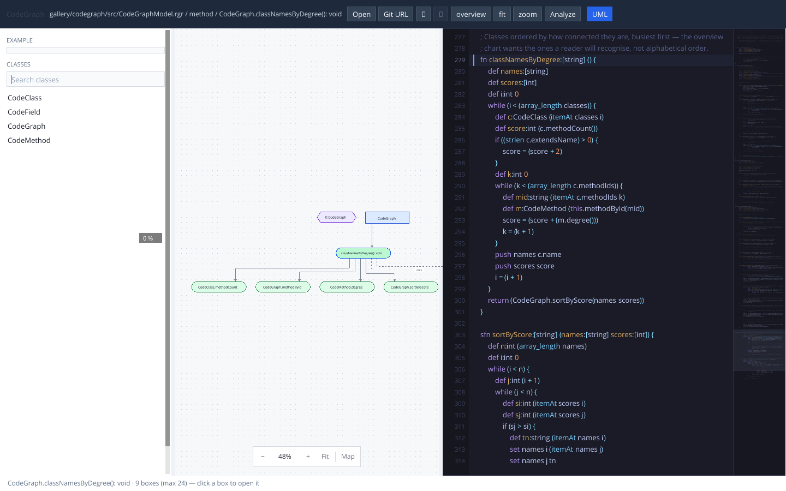
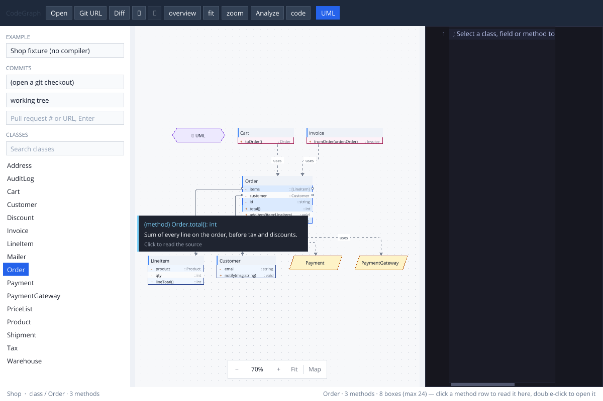
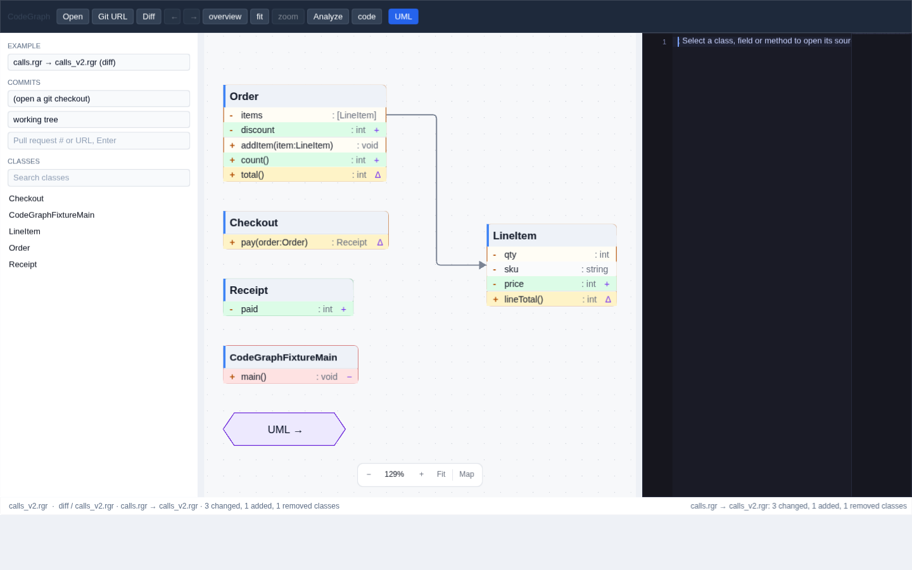
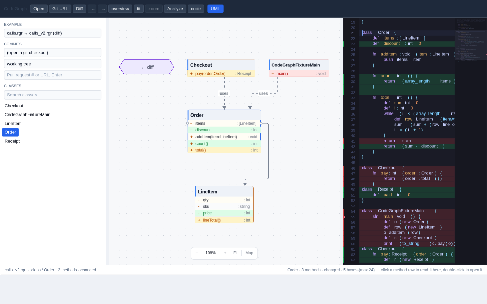

# CodeGraph — Ranger source as a paged call graph

A **gallery app** of its own, not a RangerFlow demo. RangerFlow draws one
window of the graph on the EVG WebGL canvas; The chrome around it is **Full EVG** (`gallery/ui` toolbar, example select, class tree) so the same `CodeGraphApp` paints in a tab and in an SDL2 desktop window. RangerFlow still draws the current window of the graph on the canvas region.

Live example files (`fixtures/calls.rgr`, `fixtures/animals.rgr`) are
compiled **in the tab** by VirtualCompiler — the same compiler the playground
uses — then walked into the IR through UAST. Shop / 40-class fixtures stay as a
no-compiler fallback. On the desktop, **Open** picks a `.rgr`, a directory with
`ranger.json`, or that manifest; `Import "pkg:…"` resolves the same way `rgrc`
does (path / vendor / cache). Desktop **Git URL** clones with `gallery/pkg`
then analyses Ranger or TypeScript. CLI:

```bash
npm run codegraph:analyze -- tests/fixtures/pkg/app
npm run codegraph:analyze -- https://github.com/org/repo.git
./tmp/codegraph-sdl/codegraph_sdl https://github.com/org/repo.git
```

A thousand-node dump does not fit on a chart and is slow to lay out. Twenty
to thirty boxes do. Click a class in the rail or on the canvas to drill in.

```text
  .rgr / ranger.json / pkg:  ──VirtualCompiler──►  UastRanger
                                    │
                          shared UAST pipeline
                                    ▼
                               CodeGraph (IR)
                                    │
                         CodeGraphPages (≤ 24 boxes)
                                    │
                          FlowGraph (RangerFlow, as a library)
                                    ▼
                         EVG display list → WebGL / SDL2
```

**License: AGPL-3.0-or-later** — see [`../LICENSE`](../LICENSE).

The same page is published at
**[terotests.github.io/Ranger/codegraph/](https://terotests.github.io/Ranger/codegraph/)**
by the Pages workflow.


![animals.rgr: Farm.animals:[Animal] and Dog/Cat inherit Animal](artifacts/codegraph_animals.png)






## Run

```bash
npm run codegraph:test         # paging, clicks, history
npm run codegraph:builder      # VirtualCompiler walk of fixtures/calls.rgr, fixture + git diff
npm run codegraph:diff         # line diff, class diff, merged graph, diff pages
npm run codegraph:app          # Full EVG chrome + shop navigation
npm run codegraph              # SVG of the shop overview + Order zoom
npm run codegraph:analyze -- gallery/codegraph/fixtures/calls.rgr
npm run codegraph:analyze -- compiler/RangerAppClassDesc.rgr --max=24
npm run codegraph:bench        # JS wall-clock stages (fixtures/calls.rgr)
npm run codegraph:bench:rt     # JS stages for gallery/realtrainer
npm run codegraph:bench:cpp    # same bench compiled to C++
npm run codegraph:bench:cpp:rt # C++ stages for gallery/realtrainer
npm run codegraph:web          # build the page (compiler + examples)
npm run codegraph:web:serve    # …and serve it (port 8081)
npm run codegraph:web:test     # headless Chrome: click Order, go back, compile calls.rgr
npm run codegraph:sdl          # native SDL2 window (macOS / Linux)
npm run codegraph:sdl:smoke    # headless dummy video driver
```

The SDL window is the same app as the tab, including UML hover cards. Rebuild
after pull (`npm run codegraph:sdl`) so the binary picks up host and graph changes.

Open `/codegraph/` and pick **calls.rgr**, **animals.rgr**, **css**, **evg**,
**zip**, **cpp**, or the **diff** of calls.rgr against calls_v2.rgr. A pick
the tab has not fetched yet (the gallery pack behind css / evg / zip, the
C++ fixture) is handed back to the page, which loads it and picks again.
The source is in the left rail; **Analyze with VirtualCompiler** rebuilds the
graph from it. `css` / `evg` / `zip` walk those gallery libraries and open on
CssSheet / EVGElement / ZipReader so the first drawing is a class page rather
than a catalogue of every compartment. **cpp** is the UAST C++ frontend on
`gallery/uast/fixtures/cpp/zip_writer.hpp` (desktop Open / Git URL use the
same `fromAny` path for a real `.hpp` tree).

The generated SDL C++ already contains VirtualCompiler because Open on a
`.rgr` file has to compile Ranger — about two fifths of `codegraph_sdl.cpp`
is that import (language writers included). Putting the compiler itself on
the EXAMPLE menu does not add those lines; it only asks the in-process
compiler to analyse `VirtualCompiler.rgr`, which is a huge paged graph.
Open `compiler/VirtualCompiler.rgr` (or `?example=compiler` on the web page)
if you actually want that dump.

`?example=animals.rgr` opens the farm;
`?example=css` / `evg` / `zip` walk those libraries;
`?sample=shop` skips the compiler and loads the fixture (UML with field links).

Opening a large app such as `gallery/realtrainer/src/RealTrainerDemo.rgr` is
VirtualCompiler on that file plus its Import closure, then UAST semantic,
then a 24-box UML page. `codegraph:bench` / `codegraph:bench:cpp` print a
`BENCH` line per stage (compile, parse, members, layout, …) on JavaScript
and C++ so the wait is not a black box. `codegraph:analyze` also recompiles
the CLI from Ranger on every run; the bench times analysis only.

On RealTrainerDemo the old Identifier walk rescanned the whole UAST per
name (`usedAsMember` / `enclosingMethod` / `importBinding`) — about eight
minutes in JavaScript, six of them `semantic.idents`. `indexLookups`
builds owner / member / import / name maps once. After that, opening is
mostly VirtualCompiler: ~12 s in JS, ~5 s in C++ (`codegraph:bench:cpp:rt`).


## What to click

| In the app | Goes to |
| --- | --- |
| a **class** in the left rail | that class: fields, methods, types it uses |
| a **class** box on the canvas | the same |
| a **method row** in a UML box | callers, callees, types that method uses |
| **hover** a UML class or member | a VS Code-style card: signature, documentation from the source, and a click hint. The row highlights and the pointer becomes a hand |
| a **rose** box above a class | a class whose field points here; click walks back to it |
| a **← N more users** hexagon | the rest of those referrers, paged |
| a **hexagon arrow** on the edge | the next / previous window of the same view |
| **UML** | the overview as compartment UML boxes |
| **COMMITS** in the rail | base / head from the opened repository's log; picking runs the diff (desktop) |
| **Pull request** in the rail | a PR number or URL, Enter: its merge base → head (desktop) |
| **Diff** | the same by typing `a..b`, `a`, or a PR (desktop) |
| **← / →** | history back / forward |

A **rose** box lists the rows that point at the class below it: fields typed
as it, and methods that mention it or call into it — `CodeGraphFixtureMain.main`
sits above `Checkout` because `main` creates one, even though no field does.

Every node carries `dataKind` / `dataRef`. The editor copies them onto a
`FlowHitEvent` after a click (press + release, no drag).

## Diff: what a commit did to the classes

```bash
npm run codegraph:analyze -- gallery/realtrainer --diff=HEAD~1..HEAD   # two commits
npm run codegraph:analyze -- app/ranger.json --diff=v1.2               # v1.2 vs the working tree
npm run codegraph:analyze -- app/ranger.json --pr=123                  # a pull request, merge base → head
npm run codegraph:analyze -- app --pr=https://github.com/o/r/pull/123
npm run codegraph:diff                                                  # the unit suite
```

On the desktop, open a file, a directory or a Git URL. The rail's
**COMMITS** section then lists the repository's last forty commits twice:
pick a **base** (the head stays the working tree unless you pick one) and
the diff runs. Type a pull request into the field below — `12`, `#12`, or
its URL — and press Enter: the PR's head is fetched from `origin`
(`refs/pull/N/head`, or `refs/merge-requests/N/head` on GitLab), the
target branch is asked from `gh` when it is installed and is the remote's
default branch otherwise, and the diff is from their merge base to the
head, the same two commits the PR page shows. **Diff** accepts all of it
typed (`a1b2c3d..HEAD`, `HEAD~1`, `v1..v2`, a PR). After a diff the two
selects point at the commits compared. The web page has no git; its
EXAMPLE menu has **calls.rgr → calls_v2.rgr (diff)** instead, both compiled
in the tab.

The result opens on a **diff page**: only the classes the change touched,
as UML boxes — changed amber, added green, removed red. Double-click one and
the class page keeps the colours on its rows: an added field or method is a
green row marked `+`, a removed one a red row marked `−` (it is still
drawn, from the old side), a changed one an amber row marked `Δ`. The text
keeps its ink; rest the pointer on a row and the tooltip says what happened
(`type int → double`, `signature … → …`, `body edited`). A box lists eight
fields and eight methods; the **+ N more** row below them is marked and
tinted when the members it folds away include a change, and its tooltip
counts them. Click it (or open `?members=Order` on the web page) and a
drawer slides in from the left with every member of the class, its mark
and reason; a click on one opens it in the source pane while the drawer
stays, and the chart keeps working beside it (`gallery/ui`'s
`DrawerCtl`). Rose boxes and related classes
are coloured too, so a removed caller still shows above the class it used
to call. **← diff** and **overview** go back to the summary.

The source pane shows a file the change touched **merged**: the new text
with the removed lines still in place — added lines on a green band,
removed on red, with a strip in the gutter for what is below the fold.
Clicking a removed method lands on its red rows.

How it is computed (`src/CodeGraphDiff.rgr`, `src/CodeGraphGit.rgr`):

1. `git diff --name-only base head` names the files the change touched.
2. Each revision that is not the working tree is checked out as a detached
   worktree under `.git/codegraph-diff/` and analysed by the same
   `CodeGraphBuilder.fromAny` path Open uses, then removed. The whole
   program is compiled per side — VirtualCompiler types a method against
   the classes it names, so a method cannot be typed on its own — but the
   comparison is scoped to the changed files.
3. Classes are matched by name, members by name: a field whose type changed,
   a method whose signature changed, and a method whose lines the file's
   line diff touched are `changed`; the rest is `added` / `removed` /
   untouched. No member is parsed a second time: the line diff of the file
   (`LineDiff`, common prefix and suffix stripped, LCS on the middle) says
   which member spans it hit.
4. `merged()` is the new graph plus what the old one lost, so every
   removed class and member has a row to be painted on. Calls and uses from
   both sides are kept, which is how a removed `main()` still reaches
   `Checkout`.

`CodeGraphDiff` needs neither git nor the compiler: any two `CodeGraph`s
can be compared, which is what the browser example and the unit suite do.





## Compiler fragments

`compiler/RangerAppClassDesc.rgr` is not a program. It names
`RangerAppWriterContext`, `CodeNode`, `CodeWriter` and so on without
Importing the files that define them — those types are loaded by a parent
(`RangerFlowParser.rgr`) when the compiler is compiled as a unit.

Pointing the CLI at a file under `compiler/` that is not
`Compiler.rgr` / `VirtualCompiler.rgr` / `RangerFlowParser.rgr` /
`LiveCompiler.rgr` therefore compiles **`compiler/RangerFlowParser.rgr`**
and keeps classes whose source path matches the file you named.

## Files

| File | Role | Pulls in the compiler? |
| --- | --- | --- |
| `src/CodeGraphModel.rgr` | classes, methods, calls, types | no |
| `src/CodeGraphPages.rgr` | windows of ≤ N nodes, pager arrows | no |
| `src/CodeGraphFlow.rgr` | page → FlowGraph, click session | no |
| `src/CodeGraphSample.rgr` | shop + 40-class fixtures | no |
| `src/CodeGraphDiff.rgr` | line diff, class / member statuses, merged graph | no |
| `src/CodeGraphGit.rgr` | two revisions via git worktrees → two graphs | **yes** (through the builder) |
| `src/CodeGraphBuilder.rgr` | compile → UAST → IR; `fromPath` opens ranger.json / `pkg:` | **yes** |
| `src/CodeGraphApp.rgr` | Full EVG explorer (chrome + analyse) | **yes** (VFS analyse) |
| `web/codegraph_web.rgr` | browser name for `CodeGraphApp` | **yes** |
| `platform/sdl/codegraph_sdl.rgr` | SDL2 window, native file picker | **yes** |
| `tools/codegraph_open.mjs` | CLI wrapper; clones a Git URL via gallery/pkg | no |
| `fixtures/calls.rgr` | Order / LineItem / Checkout | compiled live |
| `fixtures/animals.rgr` | Farm.animals:[Animal], Dog / Cat | compiled live |
| `fixtures/calls_v2.rgr` | calls.rgr one commit later, for the diff example | compiled live |
| `gallery/css`, `evg`, `zip` | CssCore / EVGElement / ZipReader | compiled live |

RangerFlow is imported as a **library** (`gallery/rangerflow/core`, layout,
export). This app does not live in RangerFlow's demo dropdown.

A language-analysis layer that *projects into* this IR — so TypeScript and
later Go can reuse the same class/method page — is [`gallery/uast`](../uast/README.md).
`CodeGraphBuilder` compiles Ranger (including `pkg:` imports) and asks UAST
to fill the graph. It does not walk `RangerAppClassDesc` itself.
