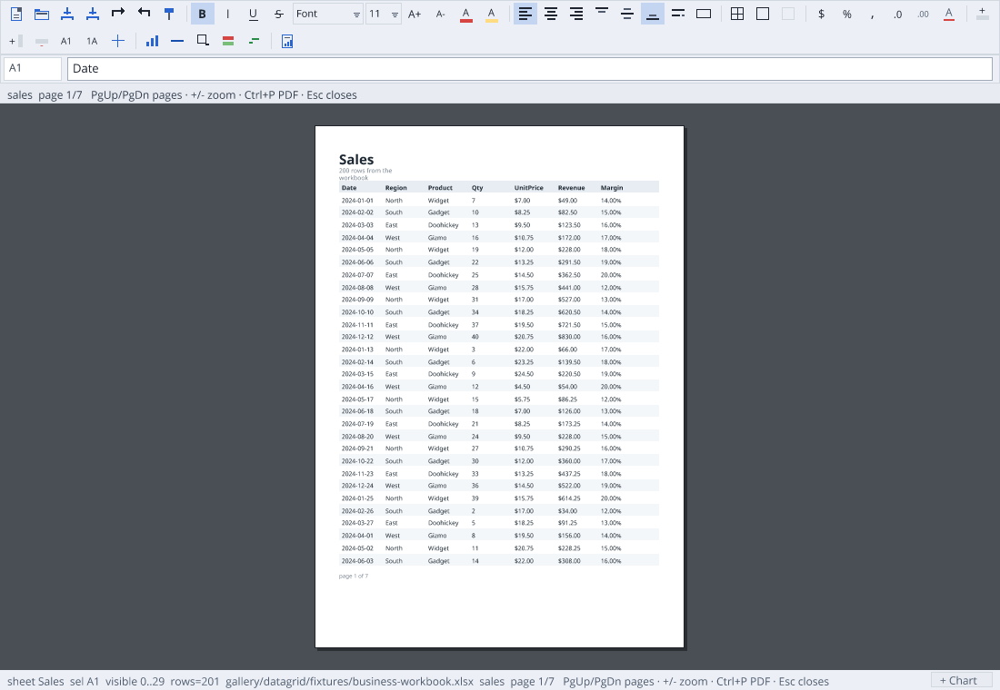
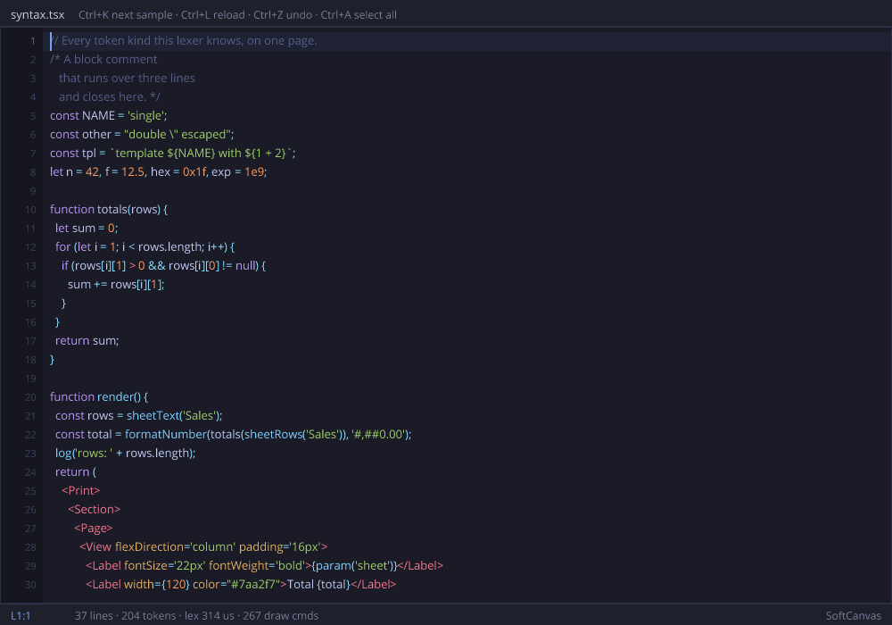

# EVG DataGrid / spreadsheet (Ranger workbook viewer)

A **100% Ranger** Excel-like workbook viewer: specialized `DataGrid` virtualization
→ batched **EVG** display list → SoftCanvas / WebGL. Feature roadmap is grounded in
**FortuneSheet**; render peer is **x-spreadsheet**. See [`docs/FEATURES.md`](docs/FEATURES.md).

```text
book.xlsx
   ↓
XlsxPackage (ZipReader)
   ↓
XlsxLoader → WorkbookModel + FormulaEngine
   ↓
SheetView (hidden / filter / sort)
   ↓
DataGrid (virtualized + freeze)
   ↓
EVGDisplayList → SoftCanvas / WebGL / SDL2+OpenGL
```

## Run

```bash
npm run datagrid:test
npm run datagrid:edit:test
npm run datagrid:xlsx:test
npm run datagrid:chart:test
npm run datagrid:export:test
npm run datagrid:workbook:test
npm run datagrid:formula:test
npm run datagrid:formula:array:test
npm run datagrid:date:test
npm run datagrid:formula:workbook:test
npm run datagrid:formula:bench
npm run datagrid:script:test
npm run datagrid:script:smoke
npm run datagrid:script:editor:test
npm run datagrid:editor:web:test
npm run datagrid:artifacts
npm run datagrid:xlsx:fixtures
npm run datagrid:bench -- 100000
npm run datagrid:oracle:dump
npm run datagrid:parity
npm run datagrid:oracles
npm run datagrid:window
npm run datagrid:sdl            # Ranger → C++ → SDL2 + OpenGL binary (macOS/Linux)
npm run datagrid:sdl:smoke      # headless dummy driver, open+save smoke
# older tiny fixture:
# npm run datagrid:module && node gallery/datagrid/web/serve.mjs --open --xlsx gallery/datagrid/fixtures/sales.xlsx
```

`datagrid:window` rebuilds the module and opens the WebGL host. **Default workbook is
`business-workbook.xlsx`** (not the old `sales.xlsx`).

### Native desktop (SDL2 + OpenGL, C++)

Same `GridApp`, disk `.xlsx` open/save, SoftCanvas paint uploaded as an OpenGL
texture each frame. Lives under [`platform/sdl/`](platform/sdl/README.md):

```bash
brew install sdl2                 # macOS
npm run datagrid:sdl
./tmp/datagrid-sdl/datagrid_sdl gallery/datagrid/fixtures/business-workbook.xlsx
```

### Running it with no host at all

```bash
npm run datagrid:web          # build gallery/datagrid/web/standalone/dist
npm run datagrid:web:serve    # …and serve it on :8000 with python's file server
npm run datagrid:web:test     # open it in headless Chrome and make it work
```

The Node host was never part of the architecture. The seam is the **display
list**: the app builds an `EVGDisplayList` and something draws it. HTTP was one
way to carry the list from the app to the drawer, and the only reason there was
a server — a browser fetching `scene.json` sixty times a second from a process
on the same machine, to draw a picture that machine had just computed.

Ranger compiles to JavaScript, so the app can simply *be* in the page:

```text
hosted                                   standalone
browser event → POST /input → GridApp    browser event → GridApp        (this tab)
GET /scene.json → EVGDisplayList → GL    GridApp.sceneJson() → GL       (this tab)
```

Same `GridApp`, same `UIInput`, same display list, same `evg-webgl.js`. What is
left of the host is a static file server, and `python3 -m http.server` is one of
those. The output is an HTML file, one compiled script, the renderer, four font
files and a workbook.

The only thing a browser cannot do is read files, and the app used the file
system for exactly two things — the fonts and the workbook. Both now have
byte-taking entry points beside the path-taking ones (`loadFontBytes`,
`loadXlsxBytes`, and `ZipReader.openBytes` under them), so the page fetches the
bytes and hands them over. A workbook you pick with the file input is read in
the tab and never uploaded anywhere.

> The build **checks** that the bundle is loadable by a browser rather than
> assuming it: it loads the compiled script with `require` undefined — which is
> what a browser looks like — and asks for its class. The EVG stack keeps its
> file-reading functions; they are simply never on the path this page takes, and
> a stray one at load time would compile fine and fail only when somebody opened
> the page.
>
> There is no browser-driver library here, so the page tests itself: `?selftest=1`
> types into a cell, copies, opens the chart picker and makes a chart, then
> writes the result into the DOM where headless Chrome's `--dump-dom` can be
> read back.

**Is it really WebGL?** "backend: webgl2" is a label the page writes about
itself, so the self test checks the facts under it: that the context really is a
`WebGL2RenderingContext`, that it has the stencil buffer a filled path needs,
that the scene left GL draw calls behind, and that no fill was skipped. It also
prints what is actually rasterizing:

```text
gl ANGLE (Google, Vulkan 1.3.0 (SwiftShader Device …)) :: draws 118 textRuns 49 paths 19 images 0
```

That line is from a container with no GPU, where Chrome falls back to
SwiftShader — a CPU implementation of the same API. On a machine with a GPU the
same page names the GPU. The pipeline is the same either way.

One honest qualification about text: every rect, border, path, stroke and image
is geometry the GPU draws, but **glyphs are rasterized by Canvas2D into a
texture atlas** once per changed scene and composited by GL as instanced
textured quads. That is the usual way to do text in WebGL — the shaping and
positioning are already settled by EVG, so the backend only needs a picture of
each run — but it does mean a CPU pass over the text whenever the scene
changes.

### The render seam, and why the browser asks so often

The host holds the document; the browser is a renderer. Every frame it asks
`GET /scene.json` for the app's **EVG display list** and draws it with WebGL —
that is the whole render path, and it is why the network panel shows a request
per animation frame.

It asks that often because it cannot know when the app changed: nothing pushes.
So the client sends the number of the scene it already holds
(`/scene.json?seen=N`) and a scene that has not changed answers **204** instead
of the list. The scene is still built on every poll — that is what makes the
caret blink and a drag follow the pointer — but an idle page now transfers
nothing and redraws nothing, instead of pulling tens of kilobytes sixty times a
second and re-uploading a picture it had already drawn.

- Multi-sheet workbook + tabs (hidden sheet metadata)
- styles.xml → fill / font / align / **XlsxNumberFormat** engine
- **Cell borders**: all OOXML line styles per edge (solid, dashed, dotted,
  double, hair→thick) with colours; empty-but-formatted cells keep their fill
- **Fonts**: bold / italic / underline / strikethrough / size / colour, painted
  with the real Open Sans faces
- **Text layout**: `wrapText` → multi-line paint with row auto-fit, vertical
  alignment, and Excel's overflow rule — text spills into empty neighbours and
  is clipped once one is occupied
- **Format painter**: `Ctrl+Shift+C` arms a brush, the next selection takes the
  formatting only
- Freeze panes, merges (hit-test → origin), hidden rows/cols
- Formula bar; FormulaEngine (coerce, abs/rel/cross-sheet refs, fill-translate,
  incremental recalc) + FormulaFunctions; cached `<v>` fallback
- SheetView drives paint order; header popup for sort/filter
- Conditional formatting: colorScale + cellIs paint overlay
- **Charts from a selection**: twenty Vega-Lite chart types, previewed live in the picker, through
  [Vela](../vela/README.md), floating in draggable, resizable windows
- **Find and replace** across values or formulas, one sheet or all
- **Disjoint selection** (Ctrl+click) and **drag-to-move** a range
- **Conditional formatting** read from the file *and* authored in a rule editor
- **Hyperlinks, notes and data validation**: read from the package, painted,
  enforced, and editable
- **.xlsx export**: `Ctrl+S`, round-tripped by our own loader and by openpyxl
- **~80 formula functions**, lookups over real rectangles, spilling array
  results, and dates as Excel stores them
- **Rich text**: several styles inside one cell, on one baseline
- **Images**: drawing anchors and media, painted on both backends
- **A named-command API** a host can enumerate, drive and extend — over HTTP too
- **Text rotation**: OOXML `textRotation`, turned in the display list
- Tracked screenshots in `artifacts/` (PNG + JPEG)
- Sort / filter via SheetView (programmatic + header popup)
- Fixtures: `sales`, `formats`, `merged`, `formulas`, `business-workbook`,
  `sparse100k`, `styles-showcase` (FortuneSheet-shaped border/font/format matrix)
- Oracles: openpyxl semantic; LibreOffice visual + formula CSV when available
- Bench: `datagrid:bench`, `datagrid:formula:bench`

## Editing

The grid is an editor, not just a viewer. Every mutation goes through
`SpreadsheetModel.applyEdit(row col value formula)`, which records **value and
formula together** in one undo op, and every batch runs inside
`beginTx` / `endTx` so it undoes as one Excel-style action.

| Action | Behaviour |
| --- | --- |
| Type / Enter / Esc | Inline edit + formula bar share one buffer |
| Caret | ← → Home End, Backspace and Delete edit at the caret, not just the tail |
| Ctrl+C / Ctrl+V | Copy carries formulas; paste re-bases relative refs (`=A1+B1` → `=A2+B2`), absolute refs stay |
| Ctrl+X | Cut + paste moves formulas **as written** (no ref translation) |
| Delete | Clears value *and* formula over the range, then recalculates dependents |
| Fill handle | Tiles the source rect, translating relative refs |
| Ctrl+click | Adds another rectangle to the selection; Delete and the format painter cover them all |
| Drag the selection's edge | Moves the block — a cut and a paste, so formulas move as written |
| Ctrl+Z / Ctrl+Y | One step per action — a 3×3 paste, a fill, or a range delete is a single undo |
| Row / column resize | Drag the header edge (9px grab zone), double-click it to auto-fit |

After any edit the app re-registers just the touched cells
(`FormulaEngine.syncCell`) and calls `recalcDirty()` **once**; it never
re-`attach`es the engine, which would drop the whole dependency graph.

### Column structure

| Action | Does |
| --- | --- |
| Header menu 8 / 9 | Insert a column left / right |
| Header menu 10 | Delete the column |
| Header menu 11 / 12 | Move the column left / right |
| `insertColumnLeftOfSelection` etc. | The same, driven from the selection |

Cells, formulas, style ids, widths, hidden flags and merges all move together —
anything left behind would surface as a value wearing someone else's
formatting. Formulas across the **whole workbook** are repaired, including
cross-sheet references naming the edited sheet: a reference at or past the
insert point shifts, and a reference *into* a deleted column becomes `#REF!`,
as Excel does.

Because a `#REF!` cannot be re-derived by shifting back, a structural op
snapshots every formula in the sheet, and undo restores that text wholesale. A
delete also keeps the removed column's values, formulas, style ids and width,
so one Ctrl+Z brings the column back intact.

### Row structure

The same machinery, transposed, and reached from the **row header**: click one
and its own menu opens.

| Row menu | Does |
| --- | --- |
| 1 | Select the row |
| 2 / 3 / 4 | Auto-fit height, taller (+10), shorter (−10) |
| 5 / 6 | Insert a row above / below |
| 7 | Delete the row |
| 8 / 9 | Move it up / down |

Everything the column ops guarantee holds for rows: heights and hidden flags
travel with the line, merges follow, formulas across the whole workbook are
repaired, a reference into a deleted row becomes `#REF!`, and one Ctrl+Z puts
the row back with its values, formulas, styles and height.

### Column and row sizing

| Gesture | Does |
| --- | --- |
| Drag a header edge | Resizes that column / row (grab zone is 9px wide) |
| Drag an edge inside a multi-column selection | Sizes **every** selected column to the same width, as Excel does |
| Double-click a column header or its edge | Auto-fits the width to the widest painted value |
| Header menu → 5 / 6 / 7 | Auto-fit, wider (+20), narrower (−20) — no pixel-precise dragging needed |

Auto-fit measures through `GridView.measureText`, the same renderer that paints
the cells, and scans the used range capped at 5000 rows so a 100k-row sheet
stays instant. Widths are clamped to 24–600px. A guide line follows the edge
while you drag.

## Keyboard

Excel key semantics, resolved in `GridApp.handleKey` from a portable `UIInput`
snapshot — no DOM or SDL below the app.

| Key | Not editing | Editing |
| --- | --- | --- |
| ← ↑ → ↓ | Move one cell | Move the caret (← →) |
| Ctrl + arrow | Jump to the edge of the data block | — |
| Shift + arrow | Extend the selection | — |
| Ctrl+Shift + arrow | Extend to the data-block edge | — |
| Enter / Shift+Enter | Step down / up | Commit, then step down / up |
| Tab / Shift+Tab | Step right / left | Commit, then step right / left |
| F2 | Open the cell for edit, caret at end | — |
| PageUp / PageDown | Move one viewport (Shift extends) | — |
| Home / Ctrl+Home | First column of the row / A1 | Caret to start |
| End / Ctrl+End | Last used column of the row / bottom-right of the used range | Caret to end |
| Ctrl+Space / Shift+Space | Select the column / the row | — |
| Ctrl+F / Ctrl+H | Find and replace | — |
| Ctrl+L | Conditional-formatting rule editor | — |
| Ctrl+K | Hyperlink on the active cell | — |
| Ctrl+E | Data-validation rule for the selection | — |
| Ctrl+N | New blank workbook | — |
| Ctrl+S | Save the workbook as .xlsx (Save As if none yet) | — |
| Ctrl+Shift+S | Save As… | — |
| Ctrl+O | Open a workbook… | — |
| Ctrl+click a link | Follows it — the host is told the target | — |
| Ctrl+M | Chart the selection (live preview in the picker) | — |
| Ctrl+C over a chart | Copies it as a picture — pastes into Excel and Word | — |
| Shift + wheel | Scrolls sideways (a trackpad's own sideways notches work too) | — |
| Ctrl+Shift+Space, Ctrl+A | Select the whole sheet | — |
| ↓ / → past the last row / column | Grows the sheet, as Excel's unbounded grid does | — |
| Delete | Clear the selection | Delete at the caret |
| Backspace | Clear the cell and start typing | Backspace at the caret |
| Esc | Collapse the selection | Cancel the edit |

A loaded sheet is only as big as its used range, so the caret grows it on
demand (`GridApp.ensureExtent` → `SpreadsheetModel.growTo`, bounded by Excel's
1048576×16384). `growTo` only ever grows and preserves row heights and column
widths — `resize` clears them, so it must never be used to extend a loaded
workbook. Paste grows the sheet the same way.

`Ctrl+End` is O(1): `SpreadsheetModel` tracks the used-range corner as cells are
written rather than rescanning a sheet that may declare 100k rows (see
`Ctrl+End + paint` in `npm run datagrid:bench -- 100000`).

### Clipboard

`Ctrl+C` / `Ctrl+X` build three views of the selection:

| | What it is | Who reads it |
| --- | --- | --- |
| `clipboardTsv` | tab/newline text | any app, and the TSV paste path |
| `clipboardHtml` | an HTML `<table>` with fill / bold / align per cell | Word, and the Ranger DOCX editor |
| `clipValues` + `clipFormulas` + `clipStyles` | the structured block | this grid, so paste can translate refs and keep formatting |

**Formatting travels by default.** Copy carries a resolved `CellStyle` per cell —
fill, borders, bold/italic/underline/strike, size, colour and number format — and
paste applies it, the way every spreadsheet behaves. Value, formula and format
land in one undo op (`SpreadsheetModel.applyEditStyled`), so a single Ctrl+Z puts
the previous formatting back. Styles are matched into the target sheet's style
table by value (`styleIdFor`), so a paste survives a hop between sheets.

`Ctrl+Shift+V` opens **Paste Special** to choose something other than the
default:

| Mode | Lands |
| --- | --- |
| All | values, formulas and formatting (the default) |
| Values only | values, no formulas, target formatting kept |
| Formats only | formatting only, the target's value stays |
| Values and formulas, no formats | both, target formatting kept |

In the WebGL host the first two reach the **OS clipboard** as `text/plain` and
`text/html` — the same two flavours Excel offers. `/input` answers a copy or cut
with `{"clipboard": …, "clipboardHtml": …}` and `web/client.mjs` writes both via
`ClipboardItem`, degrading to `writeText` and then to a hidden textarea +
`execCommand` on non-secure origins. Pasting goes the other way through the
browser's native `paste` event, so no clipboard-read permission is needed. The
host remembers the text it exported: paste it back and the formula-aware block
paste still runs; paste anything else and it lands as plain TSV values.

Because the HTML flavour is a real table, a range copied here pastes into Word —
or into this gallery's own [DOCX editor](../docx_viewer/README.md#paste) — as a
table, not as tab-separated text.

Known gaps: cut does not rewrite formulas elsewhere that referenced the moved
cells; paste does not tile into a larger target range; no cell-style clipboard.

## Dialogs

Paste Special is built on **[`EVGWindow`](../evg/EVGWindow.rgr)**, a small
window layer that paints into an `EVGDisplayList` rather than onto a canvas —
so the same dialogs work on SoftCanvas, WebGL and anything added later, and the
DOCX and PPTX hosts can use them as they are. It provides a draggable titled
panel, labels, buttons, radio groups, checkboxes and separators, with modal
input capture: while a modal window is up it swallows clicks meant for the
document behind it. Geometry is all integers, so behaviour is unit-testable
without rendering.

The same class is also the **sticky panel** the charts float in — a non-modal
window with a close box, a resize grip and one *content region* the owner
paints itself. Non-modal is the whole difference: a floating chart owns only
the pixels it covers, so clicking the sheet beside it still selects a cell.

The host stays in charge: it passes the `UITextRenderer` it already has,
forwards the pointer and keys it already receives, and appends the window's
commands to its own display list.

**A button row is fitted to the panel, not assumed to fit it.** Buttons prefer
92 pixels, shrink towards a legible minimum when there are more of them than
there is room for, and wrap onto another row rather than overflow — four
buttons in a 340-wide dialog used to lay the first one out at `x = -66`,
hanging off the panel and over the sheet behind it. `GridEditTest` now asserts
the invariant that broke: every control of every dialog is inside its own
panel.

## Find and replace

`Ctrl+F` (or `Ctrl+H`) opens it. The dialog has real text fields — the window
layer grew a one-line input control for this, with a caret, Tab between fields
and the keyboard captured while it is up.

| Option | Means |
| --- | --- |
| Match case | `Alpha` no longer matches `alpha` |
| Entire cell | The cell must be exactly the search text, not merely contain it |
| Search formulas | Look at `=A1+B1` rather than at the `5` it shows |
| All sheets | Carry on into the next sheet, and switch to it on a hit |

*Find next* walks row-major from the active cell and wraps. *Replace* changes
the cell it is on and moves to the next; *Replace all* runs the whole scan
inside one transaction, so the batch is a single Ctrl+Z. A hit inside a formula
is written back to the formula and recalculates.

## Conditional formatting

Rules read from a workbook are painted — colour scales and `cellIs` — and
`Ctrl+L` writes them too: greater / at least / less / at most / equal / between,
or a colour scale over the range, plus a fill. **± colours** adds the usual
pair in one click: `≥ 0` green (`#C6EFCE`), `< 0` red (`#FFC7CE`). *Clear*
drops the rules that start inside the selection.

Rules are sheet metadata rather than cell contents, so they are deliberately
**not** on the undo stack: undoing a paste must not silently drop a rule the
paste never touched.

## Formulas while editing

Typing `=SUM(` (or any formula) and then clicking or dragging on the sheet
inserts `A1` / `A1:A3` at the caret without leaving edit mode — the same
point-and-click Excel uses. Selecting a formula cell (or editing one) also
draws a selection-like border over each same-sheet range, with grips on all four
edges and corners. Every edge is draggable to resize; dragging the tinted
interior left or right moves the whole reference without changing its size.
The span and formula update immediately, and a drag started from a selected
formula commits on release. Matching tokens in the formula bar (and in-cell editor) pick up the
same colours. The formula bar is a grey strip with a white name box and white
formula field: click in the field to place the caret, which stays solid while
editing a formula. Formula edits use that one caret in the top bar even when
editing began from the cell, avoiding a second offset caret over cell text.
Copy/paste of formulas still re-bases relative refs
(`=A1*3` pasted one row down becomes `=A2*3`).

## Images

A picture in a spreadsheet is not *in* a cell; it floats over one, anchored by a
cell plus an offset, and either stretched to a second cell or pinned at its own
size. That is why the geometry is stored as `(cell, offset)` rather than as
pixels — widen a column the picture spans and the picture widens with it.

Finding one takes three hops, each of which can be missing: the sheet points at
a **drawing** part, the drawing names a **relationship**, the relationship names
the **media** file. The bytes are taken while the package is open, because it is
closed before the first paint.

| Backend | How it draws them |
| --- | --- |
| SoftCanvas | decoded once per part (PNG or JPEG) and blitted, scaled nearest-neighbour, alpha respected |
| WebGL | an `IMAGE` command names the part; the host serves it at `/media/<part>` and the renderer textures it |

Nearest neighbour is deliberate: a spreadsheet's pictures are logos and diagrams
shown near their own size, and a blur would be worse than a stairstep. A picture
that cannot be decoded is drawn as its own outline with the reason in it, rather
than as nothing at all.

## Rich text

A cell's style says how the cell is drawn; **rich text** says how parts of it
are — `Total:` in bold red, the number plain, the unit smaller and italic.
OOXML calls the pieces *runs*, and they are read, painted and written back.

The runs live beside the cell's value, not inside it, for the same reason notes
and links do: the value is what formulas read and what a paste carries, so it
stays a plain string that everything already understands. Runs of different
sizes sit on **one baseline**, which is what makes a smaller suffix look
attached to the word before it rather than floating above it.

Retyping a cell drops its runs — a spreadsheet does the same, because there is
no answer to which run the new text belongs to.

## Links, notes and validation

Three things a cell can carry that are not its value. All three come out of the
package — a hyperlink's target from the sheet's *relationships*, a note from the
*comments* part the relationships point at, a rule from `dataValidation` — and
all three are editable here.

| | Read from | Shown as | Edited with |
| --- | --- | --- | --- |
| Hyperlink | `<hyperlinks>` + `_rels` | link colour, underlined | `Ctrl+K` |
| Note | `xl/comments1.xml` | corner mark; opened for the active cell | — |
| Validation | `<dataValidation>` | list arrow on the active cell | `Ctrl+E` |

**A rule is asked before the value is written**, not after: a refusal has to
leave the cell as it was, and writing then rolling back would let a dependent
formula see the bad value first. List rules also know their choices, so the
cell offers a picker rather than making you remember them.

All three are **metadata, not cell content**, so they are deliberately off the
undo stack — undoing a paste must not drop the note that was pinned to the cell
before it.

## Formulas

~80 functions, an AST with a dependency graph, and incremental recalculation.
Beyond the arithmetic, string and logic families, the notable ones are:

| Family | Functions |
| --- | --- |
| Lookup | `VLOOKUP` `HLOOKUP` `XLOOKUP` `LOOKUP` `INDEX` `MATCH` `CHOOSE` `TRANSPOSE` `SUMPRODUCT` |
| Conditional | `COUNTIF` `SUMIF` `AVERAGEIF` `COUNTIFS` `SUMIFS` `AVERAGEIFS` `COUNTBLANK` |
| Dynamic arrays | `FILTER` `UNIQUE` `SORT` |
| Dates | `DATE` `YEAR` `MONTH` `DAY` `WEEKDAY` `EDATE` `EOMONTH` `DAYS` `DATEVALUE` `TODAY` `NOW` |
| Statistics | `MEDIAN` `LARGE` `SMALL` `ROUNDUP` `ROUNDDOWN` `TRUNC` |
| Text | `SUBSTITUTE` `FIND` `SEARCH` `REPT` `PROPER` `EXACT` `CHAR` `CODE` `TEXT` `TEXTJOIN` `REPLACE` |
| Logic | `IF` `IFS` `SWITCH` `AND` `OR` `XOR` `NOT` `IFERROR` `IFNA` `NA` |

### A range keeps its shape

A range used to be flattened into a list of arguments the moment it reached a
function, which is why the lookups could not exist: `VLOOKUP` reads *down* a
column and *across* a row, and a list has neither. A range now evaluates to a
**rectangle** — a `FormulaValue` that knows its own rows and columns — and three
things follow:

1. **Lookups work**, because they can ask where they are.
2. **Arithmetic spreads over it**: `=B1:B3*C1:C3` is three products, and a
   single operand broadcasts (`=B1:B3*2`).
3. **An array answer spills.** The top-left lands in the cell holding the
   formula and the rest fills the block below and to the right, as a modern
   spreadsheet does. The block is remembered, so a formula that shrinks takes
   its old tail back; a spill that would land on someone's data refuses with
   `#SPILL!` instead of eating it.

Functions that only ever wanted values keep working: the helpers that walk
arguments open a rectangle out on the way past.

### Dates

A spreadsheet has no date type — it has **numbers with a format**, and every
date feature is arithmetic on a day count. Type `2024-03-15`, `15.3.2024` or
`3/15/2024` and the cell stores `45366` wearing the format that draws it back
the way you typed it.

The epoch is Excel's, including the 29th of February 1900 — a date that never
happened, which Lotus 1-2-3 got wrong and Excel copied for compatibility.
`DateTest` checks day 1, day 59 and day 61 against Excel's own answers, because
getting that backwards shifts every date before March 1900 by one and nothing
else.

`TODAY()` and `NOW()` are not pure functions: they read a clock this layer does
not have. The **host sets one** (`GridApp.setToday`), which is also what makes
them testable — a test says what today is instead of hoping the suite does not
run over midnight. Unset, they answer `#N/A` rather than inventing a date.

## Saving

`Ctrl+N` starts a blank workbook (`Sheet1`, no path). `Ctrl+S` then asks the
host where to put it (Save As); once a path exists, Save overwrites that file.
`Ctrl+Shift+S` always asks. On the web host, Save As becomes a `.xlsx`
download. `GridApp.saveXlsx(dir name)` and `saveXlsxBytes()` write to disk or
memory.

The writer and the loader share one model, so a round trip is a test rather
than a hope — and `npm run datagrid:export:test` runs both halves of it:

1. **Ours**: build a workbook, write it, load it back with the ordinary loader,
   compare everything (48 checks).
2. **Theirs**: `tools/check_export.py` reads the same file with **openpyxl**,
   a library that has never seen our model (29 checks). Two halves of one
   codebase can share a misunderstanding; an outside reader cannot join in.

| Survives the trip | Not written yet |
| --- | --- |
| values, formulas (with cached results), styles — font, fill, borders, alignment, wrap, rotation, number formats | cell comments |
| column widths, row heights, hidden rows and columns | conditional-formatting rules |
| merges, freeze panes, sheet names and hidden sheets | charts and images |
| hyperlinks (external via relationships, internal by location), data validation rules | |

Two decisions worth knowing: strings go out **inline** rather than through a
shared-string table (a shared table is a size optimisation whose only failure
mode is an index pointing at the wrong string), and entries are **stored**
rather than deflated, which the OPC specification allows and every reader
accepts.

Fixing this turned up a bug in the shared zip writer: `CRC32` masked its
running value to 24 bits and let JavaScript's signed bitwise operators keep the
result negative, so **every archive the repository has ever written had wrong
CRCs**. Our own reader ignores CRCs and never noticed; Python's `zipfile`
refuses the file outright. The same bug lived in a second copy of `CRC32.rgr`
under `game_engine`, and both are fixed.

## Reports: a script inside the workbook

The workbook can carry a **script**, and the script can print. Press the last
toolbar button (or run `script.new` from the palette) and the editor writes a
starter report into the workbook, runs it, and shows the page:



That is not a screenshot of a PDF viewer. The script is TSX, evaluated by
`ComponentEngine` — the TypeScript interpreter from
[`gallery/pdf_writer`](../pdf_writer) — and what it returns is an **EVG**
document. The preview is that document's own display list, copied into the
grid's with a scale and an offset, and `Ctrl+P` hands the same tree to
`EVGPDFRenderer`. Preview and print are one run measured with one set of fonts.

```tsx
function render() {
  const rows = sheetText("Sales");          // as the grid displays them
  const total = cell("Sales!B5");           // formulas give computed values
  const live  = query("select * from orders where total > 100");   // if bound
  return (
    <Print><Section><Page>
      <View flexDirection="column">
        <Label fontSize="22px" fontWeight="bold">{param("sheet")}</Label>
        {rows.map(…)}
      </View>
    </Page></Section></Print>
  );
}
```

The script travels **in the .xlsx**. An OPC package may carry parts its reader
does not understand, so the source sits at `ranger/summary.tsx` inside the ZIP,
next to `xl/`, with its content type declared. The loader reads it, the writer
puts it back, and Excel opens the same file as an ordinary spreadsheet and
ignores it — this is not a macro, and it is not `.xlsm`. (Excel will drop the
part if Excel saves the file.)

A **database sheet is a sheet**: the database layer loads query results into
the same model, so a report over a live table is the same report, unchanged.
`query()` is the other direction — a report running its own SQL — and it is a
seam a host fills, answering "no database is bound" until one does.

Full API, layout rules and limits: [`docs/SCRIPTING.md`](docs/SCRIPTING.md).

```bash
npm run datagrid:script:test       # engine, data API, .xlsx round trip
npm run datagrid:script:smoke      # the app's own commands, headless
npm run datagrid:script:artifacts  # the picture above, and the PDF
```

### The script editor

The scripts have an editor, and it is the same picture on every backend:



A JavaScript / JSX lexer, a gutter with line numbers, a current-line band,
selection, undo — painted into an **EVG display list**, which means it runs on
WebGL 2 in a browser, on OpenGL in a native SDL2 binary, and on the CPU with no
window at all, from one source.

```bash
npm run datagrid:editor:web:serve  # the page, on :8001, no host process
npm run datagrid:editor:sdl        # Ranger → C++ → SDL2 + OpenGL binary
npm run datagrid:editor:web:test   # headless Chrome types into it: 12 checks
npm run datagrid:editor:sdl:smoke  # 20 frames through OpenGL, headless
```

The text model is [`gallery/text_editor`](../text_editor)'s — buffer, selection
and layout — rather than a third one written for this. Details, keys and what
is deliberately missing: [`docs/CODE_EDITOR.md`](docs/CODE_EDITOR.md).

## Charts

Select cells, press **Ctrl+M** (or click **+ Chart** on the status bar), and the
picker opens on that range. Pick a type and a style, and the chart appears on
the sheet — a picture with a hairline round it, which you drag by taking hold
of the picture.

### A chart is not a dialog

It used to be one: a dark caption bar with the range written across it, a close
box, a sunken recess around the drawing, and a row of **Copy** and **Edit…**
buttons underneath. Sixty pixels of furniture around a picture, permanently,
whether or not anyone was doing anything to it — and on a spreadsheet a chart
is a thing sitting on the page, not a dialog floating over it.

So the frame went. `EVGWindow` grew a **bare** mode: a hairline and a hint of
shadow instead of a caption bar, the whole body as the drag handle (there is no
bar to grab, and grabbing a chart by the chart is the obvious gesture), and no
recess around the content — a sunken border around a picture that already has
one is a second frame nobody asked for. The same window class, three fields
different; a dialog is unchanged.

Copy, Edit and Close became three small icons over the top-right corner, drawn
only while that chart is the one being worked with. Click the picture and they
appear, along with the resize grip and an accent edge; click anywhere else and
the chart goes back to being a picture. The strip is painted **after** the
content — a window paints its frame, the owner paints the picture, and then
`paintOverlay` puts the tools on top, because that is the only order in which a
strip over a picture is over it.

Selecting takes one click and pressing a tool takes the next, and the ordering
is deliberate rather than incidental: the strip opens in the window's own drag
handler and the manager only ever *closes* it. Open it from the manager instead
and the strip would already be up by the time that same press reached the
window, so the first click on a chart would fire whichever invisible tool it
happened to land on.

The icons are drawn as rectangles — the close box always was — because a glyph
would need a face the host may not have loaded and a path would need a stencil
buffer the GL backend only keeps for fills. Six rectangles each, and every
backend already draws rectangles.

Nothing was lost with the caption: `wnd.title` is still what the chart is
called, the editor still opens on the range, and a chart that used to spend
sixty pixels on chrome now spends them on the drawing.

Clicking a column header selects from its header through its last populated
cell. Ctrl+click keeps additional columns; **+ Chart** uses exactly those
columns even when they are not adjacent, without including columns in between.
The small arrow beside each column letter opens its sort/filter menu (Shift+
click remains a keyboard-friendly shortcut). Clicking outside closes the menu.
Sorting keeps a detected table header first, leaves empty tail rows last, and
reorders complete rows across every column — not just values in the sort column.

Nothing about the drawing is stored. A chart *is* its source: `GridChart` holds
the rectangle (or ordered selected columns), the kind, style, header flags and window box, and
the picture is recomputed from the cells. Edit a number the chart reads and the
chart follows on the next frame.

| Step | Where |
| --- | --- |
| cells → Vega-Lite JSON | `GridChart.rgr` (`ChartData.specJson`) |
| Vega-Lite → Vega → scene → draw commands | [Vela](../vela/README.md), unchanged |
| draw commands → `EVGDrawCmd` | [`VlEvgList.rgr`](../vela/src/VlEvgList.rgr) |
| the frame, the drag, the resize, the tool strip | [`EVGWindow`](../evg/EVGWindow.rgr) |

Only the first arrow is new. Everything below it is Vela's, which is checked
against the official Vega implementation by its own corpus, so a bar here is
the bar the reference draws.

### What the picker offers

**Twenty types**, grouped by what they are made of, and **six styles**:

| Group | Types |
| --- | --- |
| Bars | Column, Bar, Stacked, 100% stacked, Histogram |
| Lines | Line, Line + points, Step, Smooth |
| Areas | Area, Stacked area, Stream |
| Points | Scatter, Bubble, Strip |
| Parts of a whole | Pie, Donut, Radial |
| Matrices | Heatmap, Box plot |

Styles — Vela light, Slate dark, Mono, Bold, Ocean, Sunset — are `config`
blocks: the same marks, painted differently. What makes them look like charts
rather than diagrams is mostly what they leave out: no border around the plot, a
grid light enough to read past, ticks that do not compete with the data.

> The config block only reaches Vega through `VlCompile.compileSpec`; `compile`
> alone drops it. Compiled the short way every chart came out in Vega's
> defaults — `#ddd` gridlines, a tableau palette — whatever the style said, and
> the styles looked identical for exactly as long as nobody compared two of
> them. `ChartTest` now renders the same chart in two styles and requires the
> pictures to differ.

Categories keep the order the **sheet** put them in (`"sort": null`). Vega-Lite
sorts a nominal domain alphabetically, which turns Jan…Jun into
Apr, Feb, Jan, Jun, Mar, May — right for a chart of names, wrong for every
table a spreadsheet draws.

**A type that would not work is greyed out rather than hidden**, because
"a pie is possible, but not of two series" is worth more than a shorter list:

| Type | Needs |
| --- | --- |
| Stacked, 100% stacked, stacked area, stream | two or more series |
| Line, area, step, smooth | two or more categories |
| Scatter, strip | two numeric value columns |
| Bubble | three — x, y and the size |
| Pie, donut, radial | exactly one series, two or more categories |
| Box plot | several values per series |

### The live preview

The picker draws **the chart it is describing**, beside the options, and
redraws it as they change — click a type, switch a style, type a title, and the
picture follows on the next frame. Nothing is created and nothing has to be
undone to try the next one.

It is the same renderer, the same cache and the same specification as a chart on
the sheet, drawn into a content region the window reserves
(`EVGWindow.addContentAt`) rather than a preview mode of its own — so what you
see is what you get, by construction rather than by care.

The options are bounded to the left column (`EVGWindow.flowW`); laid out across
the full panel they were placed *underneath* the picture, and a third of the
types could not be clicked.

The picker opens on the type the data suggests, with the headers already
guessed: a top row of words over a column of numbers is a header row, not data.
A single selected cell charts the **block around it**, as Excel assumes too —
nobody charts one number.

Numbers are read strictly: `2024-01-01` and `14.00%` are *not* numbers, which
matters because the platform's own `to_double` reads them as `2024` and `14`.
A column of dates charted as six equal values of 2024 is how that was found.

### The window

| Gesture | Does |
| --- | --- |
| Drag the title bar | Moves the chart; the chart remembers where it was left |
| Drag the bottom-right grip | Resizes it, and the chart redraws to fit |
| **Copy** | Puts the chart on the clipboard — see below |
| **Edit…** | Reopens the picker on that chart — change type, style or headers |
| The box in the title bar | Removes the chart |

Charts belong to a sheet: switch sheets and the ones reading another sheet hide
rather than draw over the wrong numbers.

### Copying a chart into Excel and Word

**Copy** on a chart window — or Ctrl+C while one is on top, or the `chart.copy`
command — puts the chart on the system clipboard. Not in one format: the
clipboard carries several representations of the same thing at once and the
receiving program picks the richest one it understands, so the question is not
which format to use but which set to offer.

| Flavour | What Excel does with it | What Word does with it |
| --- | --- | --- |
| `text/html` | pastes the picture | pastes the picture — and this is the one it reaches for first |
| `image/png` | pastes the picture, floating over the cells | pastes the picture, in the text flow |
| `image/svg+xml` | Office 2016+ pastes vector that stays sharp when resized | same |
| `text/plain` | the chart's own numbers, as TSV, straight into cells | a tab-separated block |

The HTML flavour is a single `` whose source is the PNG as a **data URI**:
nothing external to fetch, nothing to go missing when the document is mailed on.
A host that puts CF_HTML on a Windows clipboard wraps that fragment in the
CF_HTML header; a browser hands `text/html` to `navigator.clipboard` and the
wrapping is the browser's problem.

### The chart as a document

A picture is what a program can *paste*; it is not something it can **edit**.
So the same `` carries the chart itself, as JSON, in an attribute:

```html

```

```jsonc
{
  "ranger": "vela-chart", "v": 1,
  "title": "Units by month", "kind": 1, "style": 1, "legend": true,
  "headerRow": true, "headerCol": true, "w": 380, "h": 270,
  "source": "A1:C7",
  "cells": [["Month","Widgets","Gadgets"], ["Jan","120","80"], …],
  "spec":  { "mark": "bar", "encoding": { … }, "data": { "values": [ … ] }, … }
}
```

Both halves are there on purpose:

| Member | For | Why |
| --- | --- | --- |
| `spec` | a **renderer** | hand it to Vela unchanged and a chart comes out; no spreadsheet involved |
| `cells` + the settings | an **editor** | ask for a different kind and get a different chart, not a differently-labelled one |

`spec` is never edited by hand. Every change regenerates it from `cells`
through `ChartData.specJson` — the *same* generator the spreadsheet uses — which
is what stops the two halves from drifting. The carried table is a tiny
`SpreadsheetModel`, the same class the grid holds its cells in, so "the same
generator" is literal rather than approximate.

A program that does not know the attribute pastes the picture and loses nothing
it ever had. A program that does — [the DOCX editor](../docx_viewer/README.md#charts-from-the-spreadsheet)
— pastes a chart it can go on editing, in the document, with the same Vela
renderer drawing it. `GridApp.clipboardChartJson` holds it, `GET /clipboard`
returns it as `chart`, and [`ChartDoc.rgr`](src/ChartDoc.rgr) is both ends of
the codec.

> The three files that make up the chart component — `GridChart.rgr` (the model
> and the spec generator), `GridChartView.rgr` (compile, fit, cache, draw) and
> `ChartDoc.rgr` (the interchange format) — are used by the DOCX editor as they
> stand. They live here because this is where charts are authored, not because
> they are the spreadsheet's private business.

All of them are built from **one render** ([`GridClip.rgr`](src/GridClip.rgr)) —
the same display list the sheet draws, painted onto an off-screen surface by the
same [`SoftPainter`](src/SoftPainter.rgr). The picture in the document is the
picture that was on screen rather than a second drawing that agrees by
inspection. The bitmap is drawn at twice the on-screen box, because a
380-pixel chart dropped into a Word page is a thumbnail; the HTML states the
on-screen size, so it arrives the size it looked and carries twice the detail
for print.

For a host: `GridApp.clipboardKind` says `"cells"` or `"chart"`, the flavours
are `clipboardTsv` / `clipboardHtml` / `clipboardPng` (base64) / `clipboardSvg`,
and `clipboardSeq` counts copies — poll it rather than guessing which events
copy, because a chart is copied by a *button* as well as by a key. Over HTTP,
`POST /input` and `POST /command` return the payload in their reply and
`GET /clipboard` reads it back without consuming it. `npm run
datagrid:clipboard:smoke` drives that whole path — start, click Create, click
Copy, inflate the PNG that comes back — with no browser involved.

> Two things came out of writing it. **Every PNG this repository has ever
> written was uncompressed**: the encoder emitted deflate *stored* blocks, so a
> 900x560 screenshot was 1.5 MB and a copied chart carried a megabyte of base64
> into whatever document it was pasted into. [`Deflate.rgr`](../pdf_writer/src/raster/Deflate.rgr)
> is the fix — LZ77 against a three-byte hash, fixed Huffman — and the
> artifacts here went from 1.5 MB each to 30-130 KB.
> `tools/check_png.py` hands every one of them to Python's `zlib`, because our
> own decoder agreeing with our own encoder proves nothing.
>
> And the round trip through that decoder came back **two levels off** on every
> antialiased pixel. The blitter's alpha mix divided by 256 rather than 255, so
> compositing a glyph onto an *opaque* canvas left alpha at 254 — invisible on
> screen, where nothing composites again, and plainly wrong the moment those
> pixels were flattened into an RGB file. Fixed in all three copies of
> `rgba_fast_blit.rgr`.

### Fitting

A Vega view is bigger than its plot — the axes and legend grow it by whatever
they turn out to need, which is not known until the labels exist. So the spec is
run once to measure that, run again with the plot shrunk by exactly that much,
and only scaled if it still does not fit. The usual result is 1:1, so the text
is crisp rather than resampled. Compiling is cached by specification text and
box size, which is why dragging a chart costs nothing and editing a cell it
reads costs one recompute.

## The toolbar

The grid could read and paint every style a workbook carries and could not set
a single one of them: no bold, no alignment, no fill, no border, no merge, no
number format. Everything the app *could* do was a keyboard shortcut or a
command string — fine for a host driving it over a socket, useless for a person
looking at it.

So there is a toolbar now, and there are commands behind it:

| Group | Buttons |
| --- | --- |
| File and history | Save, Undo, Redo, Format painter |
| Text | Bold, Italic, Underline, Strikethrough, Bigger, Smaller, Text colour, Fill |
| Layout | Align left / centre / right, Top / Middle / Bottom, Wrap, Merge |
| Borders | All, Outline, None |
| Numbers | Currency, Percent, Thousands, More / fewer decimals, Clear formatting |
| Structure | Insert row, Insert column, Delete rows, Sort ▲▼, Freeze panes |
| Insert | Chart, Link, Find, Conditional formatting, Data validation |

It is drawn by the **app**, not by the page: it is part of the display list, so
every host gets it — the browser, the PNG dumps, anything an SDL window would
present — and a screenshot of the app is a screenshot of the app people use.
The strip wraps to as many rows as the window needs rather than dropping the
last six buttons, which are exactly the ones a newcomer looks for.

Each button names a **command**, the same string the keyboard and a remote host
use, so a button cannot do something the command surface cannot; a test walks
the toolbar and fails if any button names a command the table does not have.
Toggles read the cell the caret is on — select a mixed range with the caret on a
plain cell and one click makes it all bold, as every spreadsheet does.

[`GridFormat.rgr`](src/GridFormat.rgr) is the single place that knows how a
style changes: one operation per name, applied over every selected range inside
one transaction, so a formatting change is one Ctrl+Z. Ctrl+B / Ctrl+I / Ctrl+U
run the same commands.

## Metrics: the grid is the size the file says

A column width in a `.xlsx` is measured in **characters** of the default font,
and the conversion Excel documents is `round(w × MDW) + 5`, where MDW is the
width of the widest digit — 7 pixels at 11 point. This used 8, so every column
with a stated width came out about a seventh wider than the file asked for; and
a sheet with no widths at all used 100-pixel columns against Excel's 64, with
22-pixel rows against 20.

Nothing was ever wrong with the text — an 11-point cell is painted at
11 × 96/72 = 14.67 px, which is exactly what the format says. There was simply
half a column too much grid around it, which reads as everything being zoomed
in. The defaults are Excel's now, and `XlsxWriter.pxToColWidth` is the true
inverse so a width that came from a file goes back out as itself.

> Some of that impression is the face: this repository draws with Open Sans,
> whose x-height is larger than Calibri's at the same point size, so the same
> number is a slightly bigger picture. That is a font we do not ship, not a bug
> we can fix — but the taller line box that comes with it *was* a bug, and it
> is the subject of "Bottom alignment means the baseline" below.

## What other programs leave out

Our own writer produces a tidy file: every formula written out, every font
present, every row and column sized. Real files are not like that, and a reader
that only understands the tidy version reads most of a real sheet wrong without
ever failing.

**Shared formulas.** A run of cells with the same formula is written once — the
text on the first cell, and a bare `<f t="shared" si="0"/>` on every other one:

```xml
<c r="O10"><f t="shared" ref="O10:O17" si="3">SUM(C10:N10)</f><v>1296</v></c>
<c r="O11"><f t="shared" si="3"/><v>976</v></c>
```

Taking only the tags that carry text left those cells holding the number the
file happened to cache and no formula at all. Nothing looked broken — the
numbers were right, because they were the right numbers when the file was
saved — but a change to an input moved nothing downstream of it, which is what
"the sums stop delegating" is from the outside. In one real workbook this was
110 of 163 formulas. A member of a run is now its anchor's formula translated
by its offset, through the same `FormulaParser.translateFormula` that fill and
paste use.

**An empty `<font/>`.** Legal, common, and it means "the workbook default". It
was skipped, and skipping it did not lose one font: it shifted every font after
it down an index, so cells wore their neighbour's weight, size and colour. In
the same workbook that was 916 of 1012 styled cells — nearly all of them a
weight heavier than the document says. `tools/check_styles.py` walks the
cell → xf → font indirection in Python, independently of the loader, and
reports every cell where the two disagree.

**`<sheetFormatPr>`.** Most columns in a real sheet have no `<col>` element and
most rows no height; the defaults are stated once, here, and were ignored. A
sheet designed at 12.75pt rows and 12.63-character columns was being drawn at
20px and 64px — a fifth taller and a third narrower than it was meant to be.
`XlsxWriter` states them on the way out too, so a round trip keeps the shape.

**Rows that size themselves.** A file states a row's height only when it is
*not* the automatic one, so a row it says nothing about is as tall as its
tallest text needs. 12-point type in a sheet whose rows default to 12.75 points
was clipped and overlapping; it now gets Excel's own answer, the point size
times 1.275 taken up to the next whole pixel — which is exactly how 10-point
type yields the familiar 12.75pt row.

## Bottom alignment means the baseline, not the box

Excel aligns cell text to the bottom by default, and "bottom" means the
**baseline** sits just above the cell's floor. Aligning the line *box* is not
the same thing and, with this repository's face, not even close: Open Sans
declares a box 1.36 times the type size where Arial's is 1.15, and nearly all
of that surplus is empty space above the capitals. A row is sized for the type,
not for the face — so box alignment pushed the letters through the floor of an
ordinary row and the cell clip then cut them off. `GridView.textTopFor` places
the baseline and lets the empty space fall outside the cell, where there is
nothing to see.

### …and both backends have to mean the same thing by it

A `TEXT` command carries the top of its line box. The software canvas has
always drawn it that way; the WebGL backend was drawing the run's **ink** at
that y instead, which lifted every run by the empty space above its own
capitals — a couple of pixels for a caption, most of a line for a heading. On a
page it read as slightly-off leading. In a spreadsheet, where the row is only
as tall as the type, it read as text climbing out of its row, and it is why the
same workbook looked right in the PNG and wrong in the browser.

The two ascents are easy to confuse and the difference between them is the
whole of it: `actualBoundingBoxAscent` is the ink of *these particular
letters* — "moon" has neither ascender nor descender, "Ãg" has both — and is
what the atlas slot must be big enough to hold; `fontBoundingBoxAscent` is the
**face's** ascent, the same number for every string in the font, and is what
the baseline is measured from. `gallery/evg/gl/evg-webgl.js` now places the
baseline one face-ascent below the command's y, which is what
`UITextRenderer.drawText` does on the software side. The two paths draw the
same picture again.

### A row makes room when the type grows

Sheets and Excel both grow a row when the type in it gets bigger, and so does
this: `format.size.up`, any formatting change, and committing an edit all ask
the affected rows to fit what is now in them. It only ever adds height — by
then a row's height may be one you dragged out yourself, and there is no way to
tell that apart from one a font size produced, so making the type smaller
again leaves the room where it is. `CellStyle.rowHeightForPt` is the single
rule, asked by the loader and by the app alike, so a row is the same height
whether it arrived in a file or was typed here.

## A string is not the same thing on every target

Ranger's `string` means UTF-16 code units when this compiles to JavaScript and
BYTES when it compiles to C++. So `"ä"` is one unit in the browser and two in
the native window, and `charAt` hands back 228 in the first and 195 in the
second.

That makes one shape a trap:

```
out = (out + (strfromcode (charAt s i)))     ; NOT a copy
```

It reads as "the character at i", it *is* the identity in JavaScript, and in C++
it hands a BYTE to a function whose job is to turn a code POINT into text —
which dutifully encodes 195 as two more bytes. Every accented letter comes out
encoded twice, and a spreadsheet full of Finnish place names loads as
"Hämeenlinna". Nothing complains, in either target.

Copying a character is `(substring s i (i + 1))`, which is exact in both. Every
loop that walks a string and passes most of it through unchanged now does that,
and `strfromcode` is left for what it is actually for — a code point, as in
`&#228;`. The one place that has to KNOW which model it is standing in asks the
language rather than the build:

```
sfn stringIsBytes:boolean () {
    return ((strlen "ä") > 1)
}
```

The same split runs one level down, in what counts as *one character*.
`EVGCodepoint` is where every measurement, wrap, kerning pass and rasterization
asks where one character ends and the next begins, and it knew only the UTF-16
answer: pair a surrogate, otherwise one unit is one character. Under the C++
model that made "ä" two characters, so a workbook that had been loaded
perfectly still **drew** as "Hämeenlinna". It walks UTF-8 as well now, chosen
by the same question, so the layer above it sees real characters on both.

```bash
npm run datagrid:text:test        # one test, compiled to JS and to C++
npm run datagrid:render:parity    # one spreadsheet, drawn by both, compared
```

The first compiles one test **twice** and runs both: no amount of testing in one
target can see a bug of this kind. It checks the entity
decoder, UPPER / LOWER, a number format's literal text, character counting, and
a whole workbook written out and read back, and it asserts the trap itself —
that rebuilding a letter from `charAt` changes it where a string is bytes.

The second draws `fixtures/accented-text.xlsx` — deliberately not ASCII: one-,
two-, three- and four-byte characters, so every branch of a UTF-8 walk is
exercised by simply drawing it — with **both** builds and requires the two PNGs
to be identical byte for byte. That is the only check that would have caught the
rendering half, because the text was already correct in memory by then.

Both C++ halves need only a C++17 compiler and say so out loud when there is
none.

### The other thing that is true in only one target: `a = a + b`

A 500,000-row workbook loaded in five seconds and then never finished saving.
Nothing in the writer looked quadratic; it built the sheet XML the way every
string in this codebase is built:

```
out = (out + "<row r=\"" + (to_string (r + 1)) + "\">")
```

On the JavaScript target that is a rope, and appending is free. On the C++
target `out + x` constructs a **new** `std::string` holding a copy of
everything accumulated so far, and then assigns it back — so writing a
138 MB sheet a row at a time copies about nine petabytes. Measured on the same
machine, the same compiler, the same test: 5,000 rows in 0.7 s, 10,000 in
2.8 s, 20,000 in 13.6 s, 40,000 in 104 s. Four times the work for twice the
rows, all the way up.

`Lang.rgr` already had the operator that fixes it — `str_append s suffix`
lowers to `s += suffix` on C++, `push_str` on Rust and `s = s + x` on targets
whose strings are immutable anyway — so the fix was to spell the append as an
append. The sheet writer, the XML escaper, the clipboard's TSV and HTML
builders and the ZIP's byte buffer all do that now, and `esc` copies the
stretches between escapes in **runs** rather than a character at a time,
handing back the string unchanged when there was nothing to escape. Same
bytes out: `roundtrip.xlsx` and `annotations-out.xlsx` are byte-identical
before and after.

| 500,000 rows × 5 columns, C++ `-O2` | before | after |
| --- | --- | --- |
| sheet XML | ~4.5 hours (extrapolated) | 1.9 s |
| `XlsxWriter.write` to disk | never finished | **5.2 s** |

```bash
npm run datagrid:save:test        # one test, compiled to JS and to C++
npm run datagrid:save:bench -- 500000
```

The test is about TIME, because the output was always *correct* — it just took
hours — and it is compiled twice for the same reason the text tests are: run
only the JavaScript half and 20,000 rows serialize in 250 ms and everything
looks fine. The C++ half of the same run took 22.6 s before the fix and 86 ms
after, against a deliberately loose 20 s budget that no slow machine will trip
and no quadratic writer can pass.

## Things that make it feel like a program

**The pointer says what it is over.** A pointer that never changes shape makes
an interface feel like a picture of one. `GridApp.cursorAt(x, y)` answers with a
`GridCursor` KIND — cell, column resize, text, grab, fill, pointing — asking the
same questions the press handler asks, in the same order, so what the pointer
promises and what a click does cannot drift apart. The app names no cursor: an
SDL window turns the kind into `SDL_CreateSystemCursor`, a browser tab into a
CSS name, and neither vocabulary leaks into the grid.

**A wheel notch is a shove, not a step.** Scrolling used to move a fixed number
of rows per notch, which is why going a long way down was slow. It sets a
SPEED now, notches that arrive together add up, and the speed decays about 12%
a frame — roughly a fifth of a second to half speed, long enough that the sheet
has weight and short enough that it stops where it was thrown. A hand on the
sheet stops it dead, the way a finger stops a flick. The browser page keeps
drawing while it coasts; the window already draws every frame.

**The keyboard belongs to somebody.** While an edit is open that somebody is
the text field — the formula bar or the cell — and `Ctrl+A` means "all of this
text". While no edit is open the grid has it and `Ctrl+A` means the sheet. That
one question is the whole of the focus problem here, and answering it is what
let the fields have their own shortcuts: shift with any caret move extends a
selection, typing and Backspace replace it whole, and `Ctrl+C` / `Ctrl+X` /
`Ctrl+V` move text rather than cells. The selection is a span between an anchor
and the caret, drawn as a band behind the letters, and the app hands the view
the span rather than the view working it out.

**A column header is a handle.** Press and it selects the column; drag and it
picks the column up, with a line showing where it will land. Which one a press
means is decided by whether the pointer travels, so there is no third gesture
to learn, and the drop is one undoable step.

## Recalculation: dependencies first, not sweeps

`FormulaEngine.recalcDirty` used to sweep: walk every formula, evaluate the ones
whose dependencies were already clean, repeat — **up to 64 times**, and call
whatever was left a cycle. A sweep settles one link per pass whenever the chain
runs against the order the sheet is walked in, so a column of 400 subtotals each
reading the one below it got 64 rows deep and then reported `#CYCLE!` for the
other 336. From the outside that looks exactly like sums that stop being
delegated part way down a sheet.

It is a depth-first walk now: to evaluate a cell, evaluate what it depends on
first. Depth costs nothing, the work is proportional to the dependency graph
rather than to formulas × passes, and a cycle is a cell reached again while it
is still being computed — which is what a cycle is, rather than what is left
over when patience runs out.

```bash
python3 gallery/datagrid/tools/check_calc.py yourfile.xlsx     # do the numbers agree?
python3 gallery/datagrid/tools/check_styles.py yourfile.xlsx   # does the formatting?
```

Every `.xlsx` stores, beside each formula, the value the program that wrote it
last computed. That is a free oracle — no LibreOffice, no second implementation
to install, the answers are already in the file — and `check_calc.py` loads a
workbook through the engine, recalculates it from the formulas alone, and
reports every cell where our answer differs, **grouped by the functions the
formula uses**, because a whole column going wrong is nearly always one
unimplemented function at the top of it. Point it at a file that looks wrong and
it will name the culprit.

`check_styles.py` is the same idea for how a cell looks: it walks the
cell → `xf` → `font` indirection in Python and reports every cell whose weight,
size or colour we resolve differently from the file. Both take any workbook, so
the first thing to do with a file that renders wrong is to point them at it.

`fixtures/calc-chain.xlsx` is that oracle turned into a test: 950 formulas —
400-long chains in both directions, ladders of SUMs, subtotals of subtotals and
a cross-sheet hop — with the correct values written in by
`tools/make_calcchain_fixture.py`. It reported 356 disagreements before the
change and reports none now.

## The command surface

"`GridApp` is the API" was true and not much use: a host had to know the method
names, their arguments, and which were meant to be called from outside.
`GridCommands` is the answer — a table of **named commands** a host can
enumerate, describe, and invoke by string.

```bash
curl localhost:8766/commands                                    # what it can do
curl -X POST localhost:8766/command -d '{"id":"nav.goto","arg":"C5"}'
```

Ids are dotted and stable (`edit.copy`, `insert.row.above`, `file.save`); each
carries a label, a group, the key that already runs it, and whether it takes an
argument. The HTTP routes dispatch through the same table the keyboard does, so
driving the grid from outside runs exactly the paths a user does.

**Custom tools.** A host registers one with `addCustomCommand(id label group)`.
It joins the table and appears on the status bar — and running it does *nothing
here*: it leaves the id in a mailbox the host collects with
`takeCustomCommand()`. Ranger has no closures to hand a host, so a callback was
never on the table; a mailbox is the honest shape, and it is also the only one
that survives the app being driven over a socket, where a callback could not
have gone anyway.

## Parity score

`npm run datagrid:parity` scores [`docs/PARITY.md`](docs/PARITY.md) — one row per
capability **FortuneSheet documents for itself** (its README Features section
and the completed items on its roadmap), so the number measures the benchmark
rather than our own wish list. `done` counts 1, `partial` 0.5, `todo` 0.

```
TOTAL   39.0 / 41   95.1%     done 39   partial 0   todo 2
```

`-- --todo` lists what is missing; `-- --check 90` fails below a threshold, so
the score can gate CI. Six of the seven sections are at 100%.

What is left is deliberately left: **cooperative editing** and **mobile
adaptation**. Both are I/O shapes rather than spreadsheet behaviour — one needs
a transport and a conflict policy, the other a touch event source — and neither
can be tested the way everything above is, by driving the model and reading the
answer back. The abstractions are writable; the proof is not, so they are not
claimed.

## Architecture invariant

`sheet size ≠ rendered cell count` — only the viewport (+ overscan) becomes EVG cmds.
