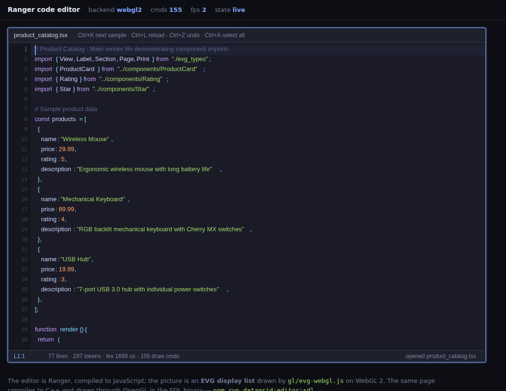

# The code editor, on three backends

A code editor written in Ranger, painted through the **EVG display list** — so
the same page runs in a browser on WebGL 2, as a native SDL2 + OpenGL binary,
and on the CPU with no window at all.

```text
                    CodeEditorPage.buildDisplayList()
                                  │
                          EVGDisplayList
                 ┌────────────────┼────────────────┐
                 ▼                ▼                ▼
          evg-webgl.js      EvgGlPainter      SoftPainter
          (WebGL 2)         (SDL2 + GL)       (CPU, PNG, CI)
```

```bash
npm run datagrid:editor:open       # build, serve on :8001, open your browser
npm run datagrid:editor:open -- --file path/to/thing.tsx    # …with that file in it
npm run datagrid:editor:web        # just build the static page
npm run datagrid:editor:web:serve  # …and serve it without opening a browser
npm run datagrid:editor:web:test   # open it in headless Chrome and type into it
npm run datagrid:editor:sdl        # Ranger → C++ → SDL2 + OpenGL binary
npm run datagrid:editor:sdl:smoke  # 20 frames through OpenGL, headless
npm run datagrid:editor:artifacts  # the CPU render, as PNGs
npm run datagrid:script:editor:test  # the lexer and the editing model, 30 checks
```


## What is in it

| Piece | File | What it does |
| --- | --- | --- |
| Lexer | [`src/script/JsTokens.rgr`](../src/script/JsTokens.rgr) | JavaScript / JSX → coloured spans, one line at a time |
| Editor panel | [`src/script/ScriptEditor.rgr`](../src/script/ScriptEditor.rgr) | gutter, current line, selection, caret, typing, undo |
| Page | [`src/script/CodeEditorPage.rgr`](../src/script/CodeEditorPage.rgr) | header, panel, status bar, input loop |
| Browser host | [`web/code_editor_web.rgr`](../web/code_editor_web.rgr) + [`web/editor/`](../web/editor) | events → UIInput, scene → `evg-webgl.js` |
| Native host | [`platform/sdl/code_editor_sdl.rgr`](../platform/sdl/code_editor_sdl.rgr) | SDL events → UIInput, list → `EvgGlPainter` |
| CPU render | [`src/script/dump_code_editor.rgr`](../src/script/dump_code_editor.rgr) | the same list → `SoftPainter` → PNG |

The text model is **not** new: `EditorBuffer`, `EditorSelection` and
`EditorLayout` come from [`gallery/text_editor`](../../text_editor) — a buffer
with undo, a codepoint-aware selection, and a layout that measures with a real
TTF and hit-tests a click back to a column. What the code editor adds on top is
tokens with colours, a line-number gutter, a current-line band and an Enter
that keeps its indent.

## Keys

| | |
| --- | --- |
| click / drag | place the caret, select |
| arrows, Home/End, PgUp/PgDn | move (Shift extends) |
| Enter | newline, keeping the indent — one level more after `{`, `(`, `[` |
| Tab | two spaces |
| Ctrl+A / Ctrl+Z / Ctrl+Y | select all, undo, redo |
| Ctrl+K / Ctrl+L | next sample document / reload it |
| Ctrl+S | (SDL host) write the buffer back to the file it was opened from |

The SDL binary takes a path: `code_editor_sdl gallery/datagrid/src/script/JsTokens.rgr`.

## Opening a file

```bash
npm run datagrid:editor:open -- --file gallery/pdf_writer/examples/product_catalog.tsx
```



The page is static — `build.sh` writes a directory any file server can serve.
`serve.mjs` adds the two things a file server cannot: it opens a browser, and
it hands **one** local file to the page over `/__file`, read on each request,
so editing that file on disk and reloading the tab shows the change. `--port`,
`--no-open` and `--no-build` are there; `--file` is resolved against the
directory you ran the command from.

The browser editor does not write back — it is a viewer you can type in. The
**SDL binary is the one with Ctrl+S**, because a native window has a file
system and a tab does not.

## Tested with a real keyboard, against a real reference

```bash
npm run datagrid:editor:keys:test        # 43 checks, Playwright, real key events
npm run datagrid:editor:compare:setup    # once
npm run datagrid:editor:compare          # the same keys, next to CodeMirror 6
```

The dump-DOM smoke calls the app's own methods. The **keyboard suite** presses
keys: Playwright sends them the way a keyboard does — through focus, `keydown`,
`beforeinput` and composition — so what it tests is the part of a canvas editor
that is impossible to unit test and easiest to get wrong: whether someone who
never touches the mouse can use it at all.

A canvas is a picture. It has no text for a screen reader to read and no caret
for one to follow, so the page keeps a hidden `<textarea>` holding **the
caret's line, with the caret in the right column** — the technique Monaco and
CodeMirror 5 both use. Focus lives there, the canvas is `aria-hidden`, and the
mirror is re-synced after every edit and every caret move. That one decision is
what buys IME composition, dead keys, a mobile keyboard, the paste event and a
screen reader that announces the line you are on, all at once.

Tab is the other half. In a code editor Tab indents; in a web page a Tab that
never returns is a **keyboard trap** (WCAG 2.1.2). So Escape arms an escape
hatch — CodeMirror's own rule — the live region says so out loud, and the next
Tab moves focus out. Shift+Tab always leaves. The test presses Escape, presses
Tab, and asserts focus is gone; the compare bench asserts the same thing and
fails the run if it is not.

What the suite covers: focus order into and out of the editor, the ARIA roles
and the accessible name, typing, Enter, Backspace, Home/End, Ctrl+Home/End,
Ctrl+arrow by word, Shift+arrow selection, PageUp/PageDown, the textarea mirror
tracking the caret, IME composition arriving as one string, paste with an
announcement, undo, and that WebGL is still drawing in colour after all of it.

**CodeMirror 6 is the behavioural reference.** `web/editor/compare` opens both
editors in one browser, gives them the same document and the same key presses,
and prints where each caret landed — currently **19 of 19 steps agree**. The
bench has already paid for itself: a plain arrow with a selection open used to
collapse it *and* move on a character, where every text field collapses to the
edge and stops. Three rows went red, the fix was six lines, and the unit test
holds it now.

## The lexer is not a parser

`JsTokens` knows keywords, identifiers, the workbook API's own names, numbers,
strings, template literals, line and block comments, and JSX. It carries two
states across lines — inside `/* … */` and inside a backtick string — and
nothing else. It builds no tree, resolves no name and reports no error, because
`ComponentEngine` does all three when the script actually runs and a second,
disagreeing opinion about what the source means is worse than no opinion at
all. **What the lexer gets wrong shows up as a colour, never as behaviour.**

JSX is two local rules rather than a mode:

- `<Name` and `</Name` are tag names,
- an identifier followed by a single `=` is an attribute.

Both are lies in the general case — `i < rows.length` is a comparison, `x == y`
is not an attribute — which is why both are in the test.

## Why the WebGL picture is looser than the native one

Every token is positioned by `layout.caretPixelX`, the same call the caret and
the selection use, measured from the **font file** through `FontManager`. The
SDL host then rasterizes those glyphs from that same file, so a token lands
exactly where the caret says it does.

A browser cannot be told to do that. `evg-webgl.js` builds its glyph atlas with
Canvas2D, whose advances for the same face differ from the file's by a fraction
of a pixel per glyph — so along a long line the drawn text drifts a couple of
pixels from where EVG measured it, which reads as slightly loose or tight
spacing around punctuation. It is the same divergence
[`gallery/text_editor`](../../text_editor/README.md) documents, and the reason
the picture in this document is the CPU render rather than a screenshot of the
tab.

## What it is not, yet

No word wrap, no folding, no multiple cursors, no search, no decoration layer
(the painter reads the token stream directly), no clipboard on the native host,
no IME.

Two of those are *decisions* rather than tasks, and both are cheaper now than
later:

- **Word wrap and folding are one decision.** Both need the split between a
  document line and a display line that `EditorLayout` does not have —
  `caretPixelY` is `(line - scrollLine) * lineHeight`, which assumes one is the
  other. That is Scintilla's oldest lesson, and it is a foundation, not a
  feature to bolt on afterwards.
- **Multiple cursors are the other.** CodeMirror's selection is a *set* of
  ranges from the first commit, because every command and every paint has to
  agree on "for each range". A one-element set costs nothing today; retrofitting
  one costs every command written before it.

Everything else is ordinary work, roughly in this order: clipboard (the way a
script actually gets into the editor), a decoration layer once a second thing
wants to mark a range (search, or errors from `ComponentEngine`), search,
error markers, then wrap/folding and multi-cursor if the decisions above went
that way.

Incremental parsing — Lezer's `TreeFragment` model — is the last item, not the
first: the lexer re-reads the whole document on every edit, the status bar
prints how long that took (about **300 µs** for the 37-line sampler), and there
is no point making it incremental before that number is a problem.
