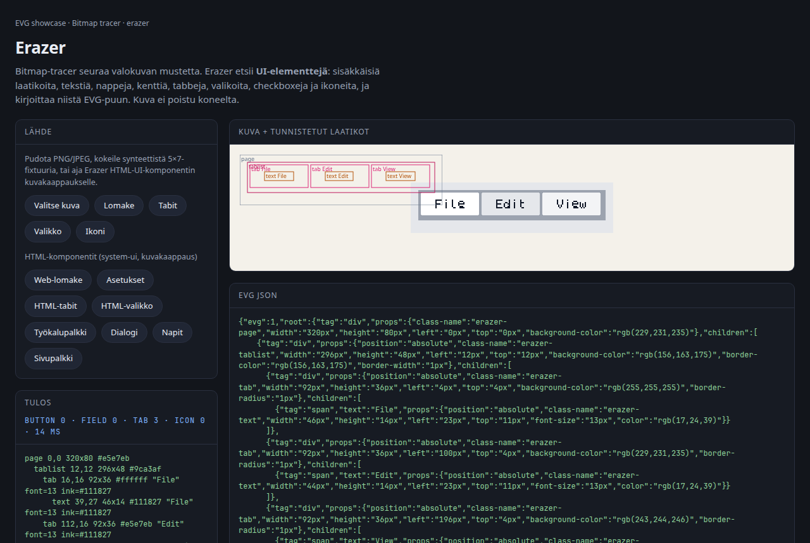
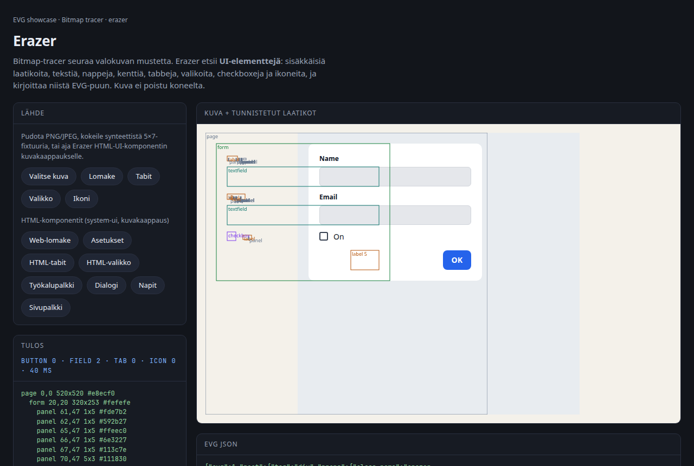
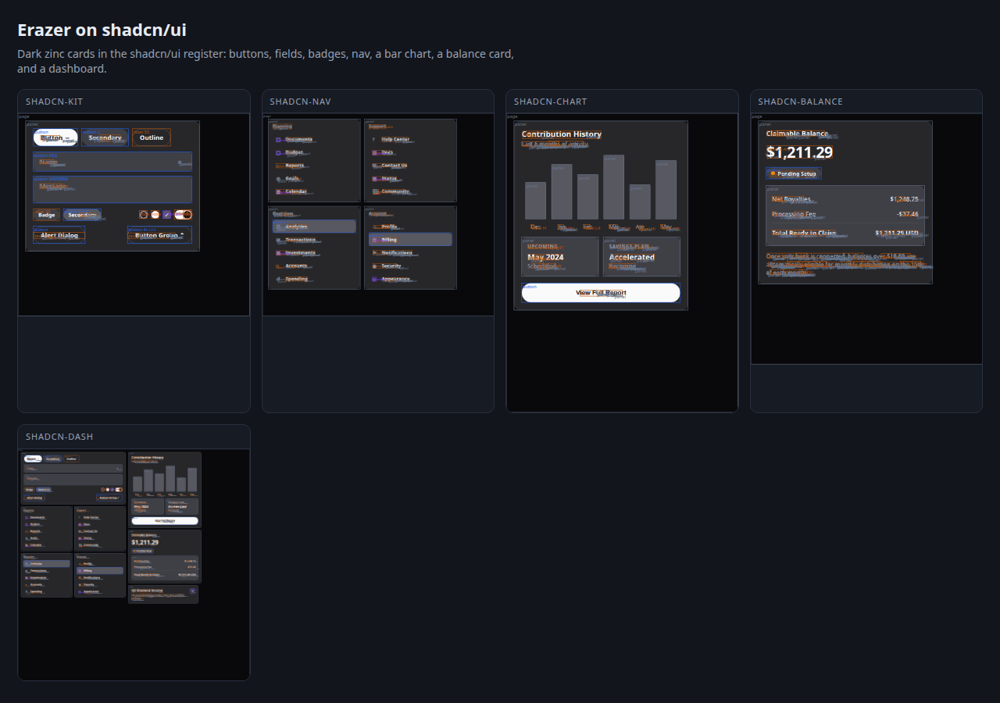
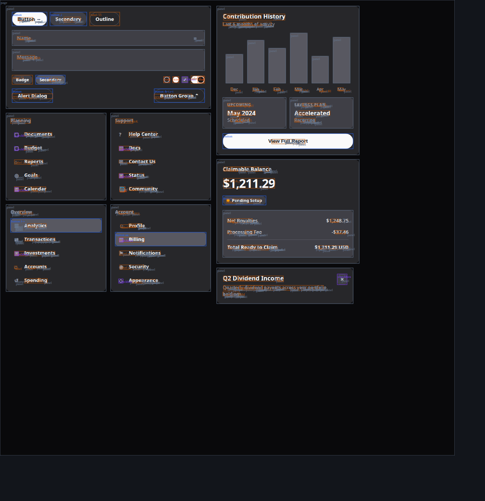
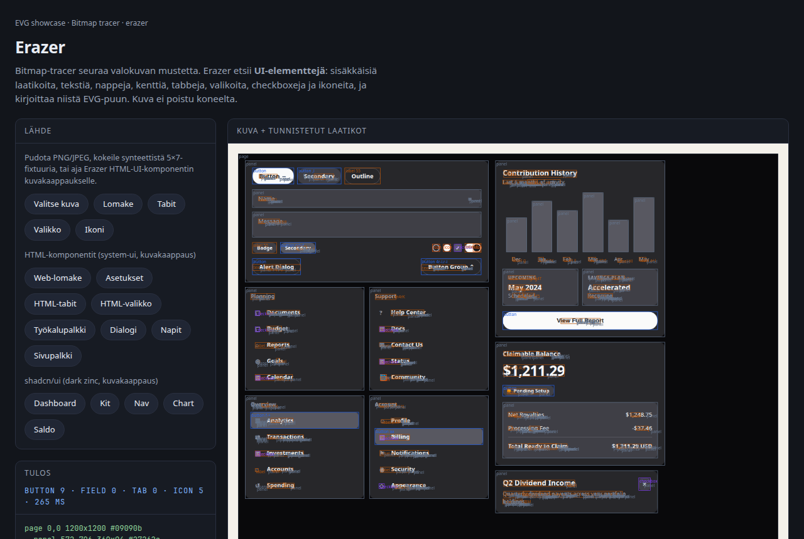

# Erazer

A **bitmap UI screenshot → EVG layout** tool. The gallery already has
[`EvgBitmapTracer`](../../lib/evg/EvgBitmapTracer.rgr) for photographs: it follows ink
and emits paths. Erazer looks at the same pixels and asks a different question —
which **widgets** are here, how they nest, and what EVG tree would reconstruct
the screen.

**License: AGPL-3.0-or-later** (Gallery).

## What it looks for

| Kind | How it is guessed |
| --- | --- |
| Nested panels | Connected components of similar colour, then bbox containment |
| Text | Small ink runs clustered onto a baseline; font size from glyph height, colour from the ink |
| Characters | A 5×7 atlas (the same face the tests paint with). On a real screenshot the run, size and colour still land even when the glyph is not in the atlas |
| Button | Compact rectangle, centred label, often an accent fill. Several same-row chips of the same height and fill with one-line labels are promoted together, even when one is too wide or OCR-split to classify alone |
| Text field | Wide light rectangle, left-aligned text or empty interior, optional border |
| Checkbox | Small square, solid or a hollow frame |
| Slider | Wide thin track (optionally two-tone), circular thumb on the bar |
| Tabs | Three or more sibling labelled bars on one row |
| Menu | Three or more stacked labelled rows |
| Form | A panel that holds two or more fields |
| Icon | A small non-text mark; vectorized with `EvgBitmapTracer` to SVG / EVG paths |

The EVG tree uses `position: absolute` so the reconstruction keeps the
screenshot's geometry. Each node carries `class-name` `erazer-button`,
`erazer-textfield`, `erazer-checkbox`, `erazer-tab`, `erazer-menu`, …
so a later pass can restyle it.

## Layout net (geometry, not pixels)

Erazer already has primitive boxes and a widget type. A second, tiny
network ranks **groups** of those boxes:

```
primitives → em / relative features → 2-layer MLP → list | form | toolbar | …
```

Grouping stays heuristic (same edge, regular gap, repeating child
pattern). The net only names a candidate and returns an abstract
structure: axis, item count, alignment, spacing in `em`, member
indices. A user selection plus a name is one training point; gap,
scale, font-size and leave-one-out jitter expand it to a dozen
samples, with axis-flips as hard negatives.

The live page: click boxes, pick `lista` / `toolbar` / a new concept,
**Opeta valinta**. Or **Rakenna HTML-testsetti**: it renders the known
widgets from `web/components.html`, records DOM boxes, rasterises HTML →
PNG, vectorises with Erazer, and stores labelled samples in IndexedDB.
When at least 8 samples exist, **Kouluta WebGPU:lla** trains the same
tiny 40→32→8 net (CPU fallback if the adapter is missing). **Tallenna
malli** / **Lataa malli** keep weights in IndexedDB, `localStorage`, or a
`.txt` file.

That scores the model on the same fixtures it just trained on. To test
**recognition** — does it name a group it was not taught from —

- **Kokeile valinta** runs `predict` on the boxes you clicked, without a
  gradient step. The purple dashed overlay is the same net's `scan` on
  the current screenshot.
- **Testaa tunnistusta** renders the shadcn widgets (`web/shadcn.html`),
  which `Rakenna HTML-testsetti` never captures, measures the annotated
  groups, and reports expected vs predicted on both the DOM boxes and
  the boxes Erazer actually extracted from the PNG.

`npm run erazer:web:lab` drives capture, train, and that holdout in a
real browser.

A fine-tune **continues from the weights the page is already predicting
with**, and the eight synthetic archetypes ride along in the corpus. The
HTML fixtures cover six of the eight classes and carry three toolbars
against one of everything else, so a run that starts from random weights
on those alone forgets the rest: a four-label column came back `nav` at
100% and the archetypes fell from 8/8 to 2/8 — saved to IndexedDB, so one
click degraded the page until site data was cleared.

The run is then **scored before it is adopted**, over the archetypes and
every recorded sample. A candidate that loses ground on either is
reported and thrown away; the weights on the page do not move. The lab
check then runs the holdout: capture, train, recognition.

## Commands

```sh
npm run erazer:test                 # synthetic UI fixtures (form, tabs, menu, icon)
npm run erazer -- in.png out.evg.json
npm run erazer -- in.png out.evg.json --overlay boxes.svg --outline
npm run erazer:web:serve            # live page at http://localhost:8008/
npm run erazer:web:smoke            # the bundle's exports, in Node
npm run erazer:web:lab              # the live page, in a browser: capture + train + holdout
npm run erazer:shots                # HTML widgets + live-page PNGs
```

`--ocr false` still reports where the text is and how tall and what colour;
it skips the atlas. `--vectorizeIcons false` leaves icons as labelled boxes.

The live page paints the same fixtures the tests use — a form, tabs, a menu,
a plus icon, a chip row, sliders — and accepts a PNG/JPEG/WebP from the file picker, the camera,
a paste (`Ctrl/⌘+V` or the **Liitä** button) or a drop. Nothing is uploaded.
On a phone **Valitse kuva** opens Kuvat; a screenshot can be pasted after a
long-press. Live on GitHub Pages:

<https://terotests.github.io/Ranger/evg/erazer/>

## What it looks like

Live page, synthetic 5×7 form (the same fixture the tests paint):


Three tabs, labelled File / Edit / View:



HTML/CSS widgets (login, settings, tabs, menu, toolbar, dialog, buttons, nav)
with Erazer's overlay on top:


A login form screenshot in the live page:



Dark **shadcn/ui**-shaped widgets (zinc cards, pill buttons, nav, bar chart, balance):



The full dashboard overlay:



The same dashboard in the live page (`?png=shadcn-dash.png`):



## Files

| File | |
| --- | --- |
| `Erazer.rgr` | region grow, nesting, heuristics, EVG emit |
| `ErazerTypes.rgr` | options, regions, the result tree |
| `ErazerLayout.rgr` | em-features, candidate groups, 2-layer MLP |
| `ErazerFont.rgr` | 5×7 face: paint and read |
| `ErazerPaint.rgr` | synthetic UI-library screenshots |
| `erazer_cli.rgr` | PNG/JPEG in, `.evg.json` out |
| `ErazerTest.rgr` | the fixtures, asserted |
| `web/layout-lab.js` | HTML fixtures → boxes → WebGPU/CPU fine-tune, with the adoption gate and a held-out shadcn recognition pass |
| `web/lab-check.mjs` | the lab driven in a real browser: capture, train, holdout |
| `web/` | the live page |
| `web/components.html` | HTML/CSS widgets for `erazer:shots` |
| `web/shadcn.html` | dark zinc shadcn/ui-shaped dashboard |
| `shots/` | captured PNGs the live page can load |

It is a heuristic. A photograph of a Mac settings panel will not come back as
production TSX. The claim the tests make is narrower and checkable: when the
input is a form, the tree has fields, a button, a checkbox and the labels
`Name` / `Email` / `OK`; when the input is three tabs, there are three tabs.
