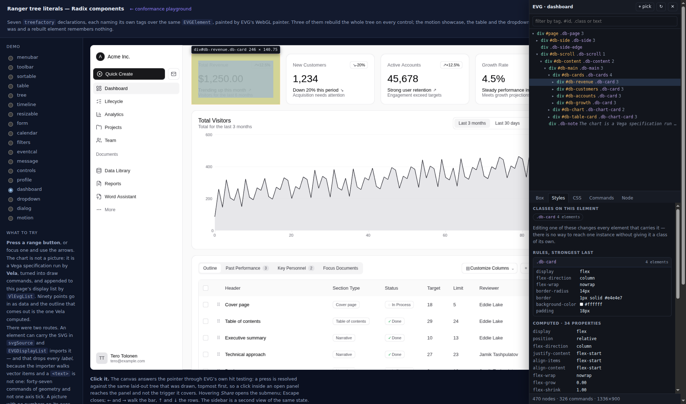
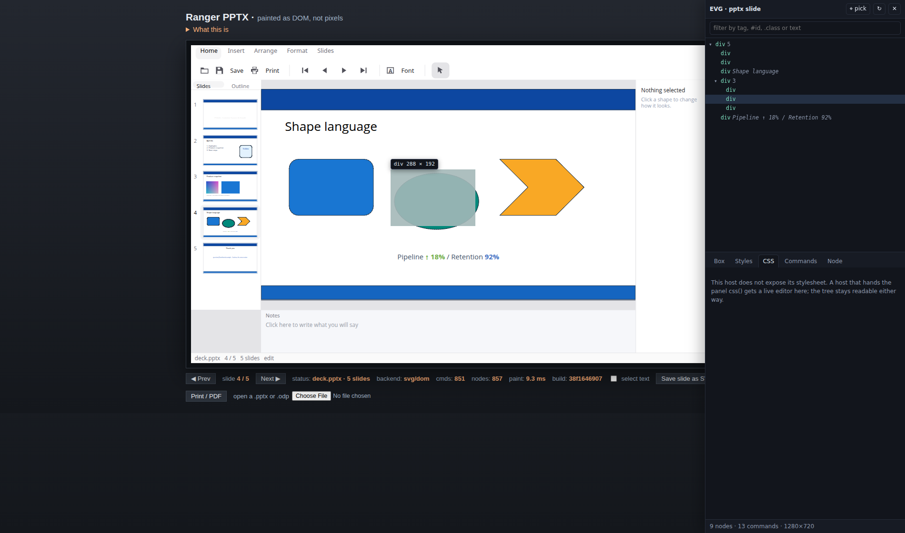
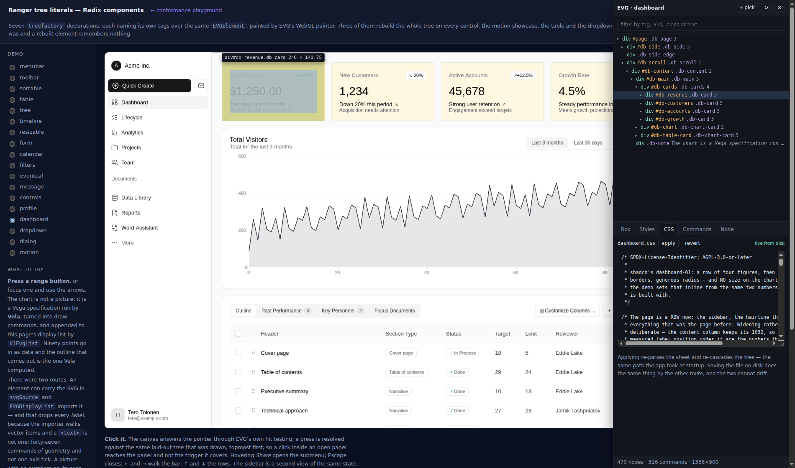

# The EVG inspector

Dev tools for a picture a browser cannot read.

```bash
npm run evg:inspect:demo     # the dashboard, WebGL, with the panel
npm run pptx:html:serve      # the slide editor, SVG — add ?inspect=1
npm run evg:inspect:test     # the gates, no browser
npm run evg:inspect:web      # the panel, in a real browser
npm run evg:inspect:live     # a rule on disk → the painter, end to end
npm run evg:inspect:shots    # remake the pictures below
```

An EVG app in a browser is one `<canvas>`. Open the browser's dev tools on it
and you get exactly that: one element, no children, no styles, no box model.
The DOM painter is not much better — a flat pile of `<rect>` and `<path>` in
paint order, with no names and no nesting. You can see the picture. You cannot
ask it anything.

This is the panel that answers. Add `?inspect=1` to a host that has been wired
to it and you get the element hierarchy, the box model drawn over the real
pixels, the computed style, and the draw commands each element emitted.

Edit `gallery/ui/demo/*.css` while the demo page is open and the picture
follows on save. That is not a reload of the page and nothing is patched — see
[the stylesheet is an input](#the-stylesheet-is-an-input).



## The fourth channel

Three descriptions already come out of an EVG app, and `gallery/ui/demo/main.js`
names them in its own header:

```
  displayListJson()   what to draw
  hitId(x, y)         what is under the pointer
  a11yJson()          what it MEANS
```

They share the property this design is built on: **each is derived from the
same laid-out tree, on the same pass.** `EVGA11yFromTree` says why in its
header — an app that describes its tree a second time has two descriptions to
keep in step, and the one nobody can see is the one that rots.

`EVGInspect` is the fourth — **what it IS** — and obeys the same rule. Every
rectangle it reports is the one `EVGLayout` computed and `EVGDisplayList` drew,
read off `calculatedX` and its neighbours. Nothing here has a second opinion
about geometry, so the panel cannot disagree with the picture.

```
                    EVGElement tree (laid out)
                             │
        ┌────────────┬───────┴───────┬──────────────┐
        ▼            ▼               ▼              ▼
  EVGDisplayList  EVGHitTest   EVGA11yFromTree   EVGInspect
   what to draw   what is      what it means     WHAT IT IS
                  under here
```

That is also why it works on both painters and off the browser entirely: it is
attached to the tree, not to a canvas. The WebGL page and the SVG page are the
same panel with the same code, and the module compiles to every target
`EVGDisplayList` does.

## Wiring a host to it

The panel knows nothing about any app. It is handed an adapter of small
functions, and everything past `tree` degrades rather than fails — which is
what lets one panel serve a slide editor and a dashboard without either
knowing about the other.

```js
import { attach } from "…/gallery/evg/inspect/evg-inspect.js";

attach({
  surface,                    // the <canvas> or <svg> the app paints into
  app: {
    tree:  () => app.inspectJson(gen),        // REQUIRED
    node:  (path) => app.inspectNodeJson(path),
    hit:   (x, y) => app.inspectHitPath(x, y),
    frame: () => app.inspectFrameJson(),
    transform: () => app.inspectTransform(),  // {x, y, k}, when the tree is
    viewport: () => [w, h],                   // drawn inside a larger surface
  },
});
```

On the Ranger side that is four one-liners, because `EVGInspect` carries the
statics:

```ranger
fn inspectJson:string (gen:int) {
    this.displayListJson()
    def r:EVGElement (unwrap root)
    def w:double (this.widthPx())
    def h:double (this.heightPx())
    return (EVGInspect.treeOf(r "Dashboard demo" gen w h))
}
fn inspectNodeJson:string (path:string) { … EVGInspect.nodeOf(r path) }
fn inspectHitPath:string (px:double py:double) { … EVGInspect.hitOf(r px py) }
fn inspectFrameJson:string () { … EVGInspect.frameOf(r) }
```

`hitOf` and `nodeOf` should be given the layout that is already there
(`laidOut()`), not a fresh render. On the dashboard `hitId` costs 11 ms and
`hitIdCached` costs 0.007 ms, and the whole difference is a page rebuilt to
answer a question about geometry that had not moved.

## Identity is a path

`EVGElement.id` is not an identity: it is optional, it is the app's own test
id, and most elements have none. So a node is named by where it sits:

```
  "0"            the root
  "0/3"          its fourth child
  "0/3/k:share"  a child with `key` set uses the key instead of the index
```

The same trick `EVGComponentHost` plays with `enter`/`leave`: a name unique
among siblings composes into a name unique in the tree, with no registry.

It is **structural**, and the cost is honest — insert an unkeyed row above the
selected one and the path names a different element. Keyed children are immune,
which is the set a list rebuild actually reorders. When a path stops resolving
the panel drops the selection and says so in its footer; re-pointing it at
whatever is now at that index would be a lie.

## Which commands did this element draw



`EVGDrawCmd` carries the element that emitted it, as an index into the inspect
walk, and writes it into the JSON as `"n"` — **only while attribution is on**.
Off, the list is byte-identical to the one built before the field existed, and
that is a gate rather than a hope (`inspect-check.mjs`, gate 5).

It is stamped in one place. `EVGDisplayList.walk` sets `curNode` for the
element it is walking and puts back what was there on the way out; `addCmd` is
the only thing that reads it, and every one of the twenty append sites in that
file goes through `addCmd`. A child cannot leave its slot behind for the
commands its parent emits afterwards.

This is worth more than the highlight it was added for. "Which element drew
these three commands" is the question behind the class of bug
[`gl/README.md`](../gl/README.md) describes: five painters each deciding again
what a box means, and border-radius working in PDF and silently not in PNG
because one painter read `box.borderRadius` and another a stale
`el.borderRadius`. With attribution the command that is wrong names the element
that is wrong.

In the picture above, the ellipse on slide 4 is selected and the commands pane
says it became a `RECT` and a `BORDER` at 456,288, 288×192, radius 96 — which
is how a preset ellipse is drawn.

## Which classes reach this element

This cascade selects on **classes and nothing else** — an `EVGStyleRule` carries
a class, a state, a theme and a media block, and the subset of CSS it implements
has nothing else in a selector. That is a limitation with a useful side: the set
of rules that can ever touch a node is exactly the set written against one of
its classes, so the panel can list them completely rather than guessing, and
that list is the answer to *where do I go to change this*.

Two things are shown with it, and both matter before you edit anything:

* **how many elements each class reaches.** `.db-card` is four cards. There is
  no way to reach one of them without giving it a class of its own, so a panel
  that let you edit `.db-card` without saying that would be inviting a surprise.
* **an element with no class at all is unreachable.** `applyTo` returns
  immediately when `className` is empty, so no rule can ever style it, and
  whatever it looks like was set on it directly. The panel says so instead of
  showing an empty rule list that looks like a bug.

The rules themselves come out of the plan, in cascade order, winners and losers
together:

```
  RULES, STRONGEST LAST
  .db-card                                          4 elements
    display          flex
    border-radius    14px
    background-color ▪ #ffffff
```

Nothing is scored here and no selector is re-matched. `buildPlan` calls
`planGroup` in the four passes that **are** the precedence — plain, themed,
stateful, themed-and-stateful — and the last write wins, so "which declaration
won" is read off the end of the list. The panel cannot disagree with the engine
about who won because it is not deciding, it is reading. That is gate 6.

The record itself is one int per planned declaration in `EVGStyleSheet.planRules`,
pushed beside the name and value `planGroup` already pushes. It is **per plan,
not per element**: a 1600-row table has a handful of plans and a hundred
thousand applications of them, and the same record made at apply time would be
paid a hundred thousand times over.

A declaration that lost to an inline value is marked separately from one that
lost to another rule — see below.

## The stylesheet is an input



This is why the panel can edit at all, and why it needs no override layer.

**The element tree is an app's output.** Edit it and the next rebuild throws
the edit away — which is exactly why a DevTools style edit dies on a React
re-render, and why editing the tree would need a table of overrides re-applied
after every pass, an invalidation story, and a way to detect the app writing
over you.

**The stylesheet is an app's input.** `init(css)` is how every demo here starts.
Hand back a changed one and the app re-parses and re-cascades exactly as it did
at startup; the layout, the display list and the hit test follow because they
always did. Nothing is intercepted, no value is held over the app's head, and
**the text in the editor is the text that goes in the file** — there is no
"copy as CSS" step because there is nothing to translate.

Two routes into the same operation, and they cannot drift:

```
  the panel's CSS pane ─┐
                        ├─► app.inspectSetCss(text) ─► EVGStyleSheet.reload
  a save on disk ───────┘        ▲
     │                           │
     └─ serve.mjs watch ─► SSE ─┘   (npm run evg:inspect:demo)
```

`npm run evg:inspect:live` gates the whole path and checks the **colour of a
rectangle in the display list**, not the element and not the panel: a value
that reached the element and stopped there would be a frame still showing the
old colour, and that is the failure worth catching.

### `reload`, and the trap it exists for

`EVGStyleSheet.reload(css)` is not `new EVGStyleSheet()` at the call site, and
both reasons are silent when got wrong.

`parse` **appends**. It drops the plans and adds rules; it does not remove what
is already there. Parsing twice into one sheet leaves every rule in it twice,
which mostly looks like it worked because the duplicates agree — until one of
them is edited.

And `generation` starts at 1, so a fresh sheet is at 2 after its first parse —
exactly where the sheet it replaced was. `applyTo` skips an element whose
`styleGen` already equals the generation, so **every retained element would be
skipped and the new CSS would land on nothing.** Worse, it fails asymmetrically:
a page that rebuilds its tree hands the cascade fresh elements with `styleGen`
0 and works fine. It would pass in the tree-literal demos and fail in an app
that keeps its tree — which the dashboard does, so gate 7 is run against it
deliberately.

### What CSS editing cannot reach, and why that is worth showing

* **A value the app set on the element itself.** `inlineProps` is the cascade's
  own record of what the authoring layer wrote directly, and an inline value
  outranks every rule. The panel strikes those declarations through and marks
  them as beaten by inline rather than by another rule — so "why did my edit do
  nothing" is answered on the spot instead of being a mystery.
* **`position` in a rule.** `EVGElement.setAttribute` has no branch for it, so
  the cascade never writes the field; an element is out of flow because it has
  offsets, an overlay flag, or a `<Layer>` tag. The panel therefore reports the
  position the **layout used**, not the field, and gate 6 is what would catch a
  rule that says `position: absolute` with no offsets — the engine ignores it
  silently today.
* **Geometry that came from data.** A PPTX slide's shapes are placed by the
  file, not by a sheet. CSS editing serves that app's chrome; the slide is a
  different question and the panel does not pretend otherwise.

## A tree drawn inside a larger surface

The dashboard's tree *is* the page: the boxes are in the surface's own
coordinates and the transform is the identity. A slide is not — the editor
draws it fitted and centred inside a window with a toolbar, a thumbnail strip
and a properties panel around it.

So the adapter can hand the panel a `transform` (`{x, y, k}`, where the tree's
coordinates land on the surface and how big they are drawn) and a `viewport`
(how big the surface is in its own units). The panel applies both to the
overlay and inverts both for the picker, so an adapter never has to know where
on the page its picture ended up. `PptxWeb.inspectTransform` derives `k` from
the two widths rather than assembling it from `ptScale` and the converter's
scale factor: one number instead of two that have to agree.

## The overlay is DOM, not draw commands

The four rings are absolutely positioned `<div>`s over the surface, in the four
colours a browser uses. They are **not** pushed into the display list, and that
is deliberate twice over: a screenshot taken while the panel is open is still a
screenshot of the app, and one implementation then serves both painters,
because the WebGL canvas and the SVG one are the same rectangle on the page.

## What is gated

`npm run evg:inspect:test` runs five differences against a real app in Node —
a second description of something is only worth having if it is differenced
against the first, which is the habit the painters already keep:

| | |
| --- | --- |
| the tree is a tree | one root, every parent present, no path twice |
| the box model closes | content + padding + borders is the border box, on all 470 nodes |
| attribution lands inside | a command is inside the box of the element that emitted it — with two exceptions that are real and asserted as such: a text run may overhang by the font's side bearings, a shadow by its blur |
| the hit test agrees | when it answers, the answer contains the point |
| off costs nothing | a list built without attribution carries none |
| the cascade agrees | the winning rule's value is the value on the element, over 2000 properties |
| a reload lands | a rule added to the sheet reaches a **retained** tree, and the frame |
| a reload does not double | applying the same text twice leaves the plan the same size |
| the class counts are the tree's | what the panel says `.db-card` reaches is what the tree has |

The hit-test gate is deliberately one-sided, and the first version of it was
wrong in a way worth recording: it expected every node to be reachable. The
dashboard's table is 552px tall inside a 414px scroll box, so half its rows sit
at coordinates the page does not show, and `EVGHitTest` drops a clipping box's
whole subtree when the point is outside it — its header says why, and it is
right: a row scrolled out of view that is still clickable is the worst of both.
"Nothing is there" is the correct answer, so the gate asserts the other half —
nothing may be named under a pointer that is not over it — plus that most of
the page does answer, so it cannot pass by never being asked.

`npm run evg:inspect:web` gates the part that only exists in a page: that
`?inspect=1` attaches, that the tree it read has rows, and that the panes
filled. It runs against the SVG editor because that needs no GPU.

`npm run evg:inspect:live` gates the part that only exists across processes:
the real dev server, a real save, the real page and the real WebGL painter. It
also checks that the watch fires **once** per save — `fs.watch` reports the
truncate and the write separately, and a sheet reloaded three times per
keystroke would relayout three times.

## What is not built yet

[`../PLAN_INSPECTOR.md`](../PLAN_INSPECTOR.md) is the whole design. Built:
the walk and the panel, attribution, the cascade view, and CSS as a live input.
Not here yet, in the order they are worth doing:

* **an async adapter.** Every remaining direction is the same shape — the
  answer does not come back synchronously: a DevTools extension talks over
  `inspectedWindow.eval`, a native target over a socket, a paused page out of a
  snapshot. The panel calls `app.tree()` and parses the result on the spot, and
  that is the one refactor that is cheap now and expensive later.
* **forcing a state.** `EVGPseudo.holds` reads four plain fields —
  `isHovered`, `isFocused`, `isPressed`, `a11yDisabled` — so Chrome's `:hov`
  toggles are directly available, and editing a `:hover` rule without being
  able to hold the hover is working blind.
* **editing a rule in place** rather than appending to the sheet. The
  provenance names the rule; what is missing is writing back into its block.
* **saving to disk from the panel**, closing the loop the other way. The dev
  server already watches; a PUT is the other half.
* **component debug notes** — a component saying *why*, which no channel
  carries today.
* **the offline bundle** — one frame in a file, openable with no app running,
  and attachable to a failing CI gate.
