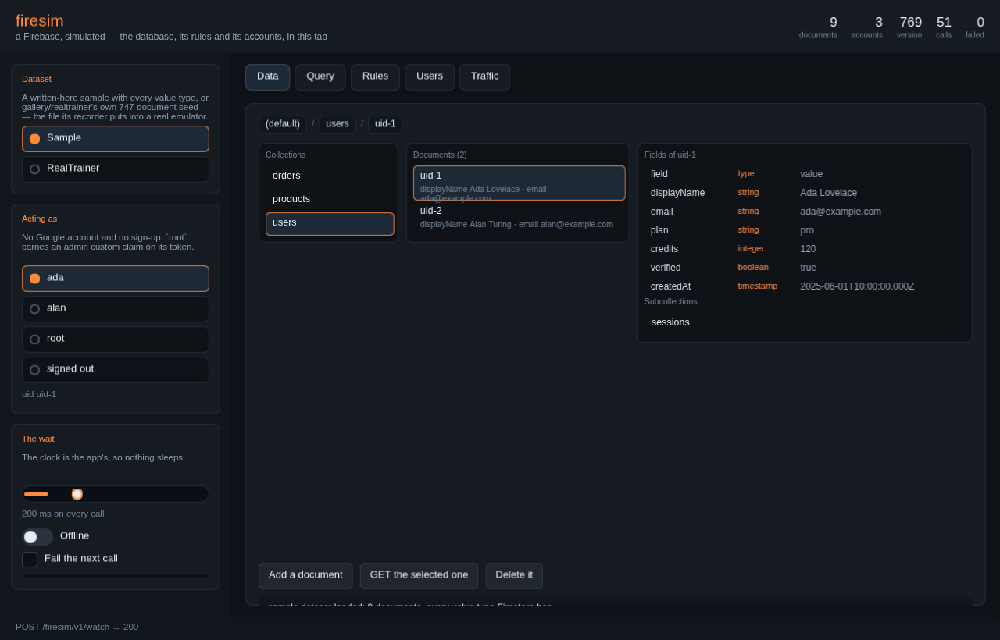
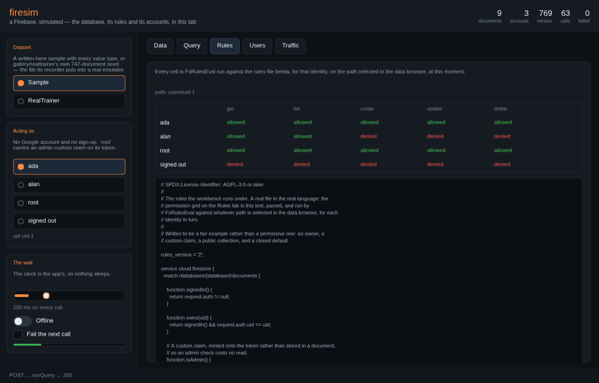
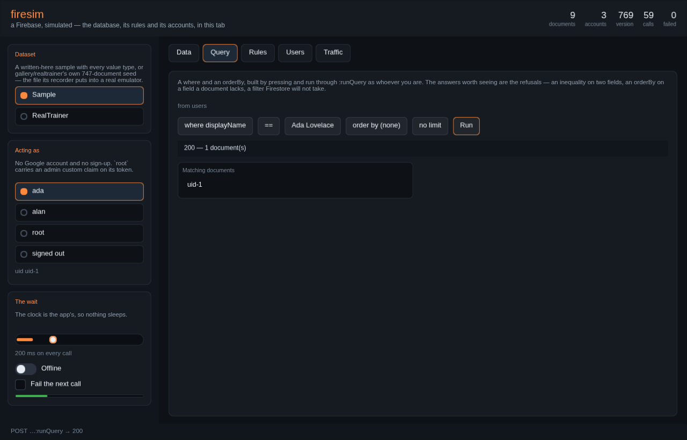

# gallery/firesim — a Firebase, simulated, in Ranger

`gallery/realtrainer` is a whole application with no backend. It reads its
week out of a JSON file, saves through `RtBackendSim` — a state machine with a
countdown in it and nothing behind it — and its coach screen streams a reply
from a mock that exists so the screen can be drawn at all.

This is the backend it did not have: a Firestore, an Identity Toolkit, a
security-rules engine and a model that streams, written in Ranger, running in
the same process as the app or behind a socket, with **no Google account, no
emulator, no Java and no network**.

```bash
npm run firesim:test          # the gate: store, queries, rules, accounts, latency, listeners
npm run firesim:realtrainer   # a real app drawing from the simulator                  (CI)
npm run firesim:targets       # does it compile for the twelve targets an app runs on
npm run firesim:size          # what the client build costs, per target

npm run firesim:demo          # the workbench, driven with no browser                  (CI)
npm run firesim:demo:web      # the workbench page, served — build, URL, open it
npm run firesim:demo:frame    # the same page in Chromium, at the pixels
npm run firesim:demo:shots    # regenerate the screenshots below from it

npm run firesim:serve -- --seed gallery/realtrainer/fixtures/reference/seed.json \
                         --rules gallery/firesim/fixtures/realtrainer.rules \
                         --user test@example.com:testpassword123
```

Live, from these sources: **[the workbench](https://terotests.github.io/Ranger/firesim/)** —
a database browser, a query builder, a rules tester and an accounts table over
a Firestore running in your tab with nothing installed.

## The workbench: a database you can look at



`npm run firesim:demo:web`, or
[the page on github.io](https://terotests.github.io/Ranger/firesim/). There is
no server behind it. The store, the query engine, the rules parser and the
accounts are the same code the checks drive, compiled to JavaScript and
executing in the page; the screen is EVG on WebGL, and the controls are
`gallery/ui`'s own — the ones its conformance harness measures against Radix.

It is deliberately **not an application demo**. There is no product in it.
What it shows is a database.

**Data** is the browser: the collections here, the documents in the one you
picked, and that document's fields with their **Firestore types** — string,
integer, double, boolean, timestamp, array, map, reference, geopoint, null.
A subcollection is listed apart from the fields and is pressable, because a
subcollection is not a field and does not go away with its parent. The
breadcrumb walks back up.

The document list is not a query re-run on a timer. It is an `FsWatch`, polled
on the app's own tick, so a row appears because a **listener** said it did —
and switching identity re-registers it, so the rows that arrive are the rows
those rules allow.



**Rules** is the tester. Every cell is `FsRulesEval.check` run against the
rules file printed underneath it, for that identity, **on whatever path is
selected in the browser**, at that moment. Pick a different document and the
grid is a different answer. The identities are an owner, another owner, an
admin by custom claim, and nobody at all.



**Query** builds a `where` and an `orderBy` by pressing — the fields and the
values are read out of the data, so it can only ask questions the data can
answer — and runs it through `:runQuery` as whoever you are. The interesting
answers are the refusals: an inequality on two fields, an `orderBy` on a field
a document lacks, an inequality that is not the first `orderBy`. It prints the
composite index the query would need, too.

**Users** is the accounts table: uid, e-mail, provider and custom claims, with
buttons to make another account or an anonymous session. **Traffic** is every
request the simulator answered, newest first, with runs of the listener's
polls collapsed under a count — otherwise they would be the whole log, which
is itself worth knowing.

The rail is the simulator's own knobs: latency on every call, an offline
switch, a fail-the-next-call box, and a progress bar showing what is actually
in flight.

### Two datasets, and neither is built in

A **sample** written in Ranger — nine documents, one of every value type
Firestore has, with a subcollection and a reference — and
**[`gallery/realtrainer`](../realtrainer/README.md)'s own seed**: 747
documents, the file its reference recorder puts into a *real* Firebase
emulator, fetched by the page and loaded through `FsSeed` unconverted. Each
brings its own rules file, because rules are part of a dataset and not part of
a tool.

The RealTrainer one is there as **example data**, to show the browser against
something the size of a real database rather than something arranged to look
good. Nothing in the workbench knows what a calendar or a workout is.

### The two gates

`npm run firesim:demo` drives the same app with a made-up clock and presses
its controls at the rectangles the accessibility tree reports — 87 assertions,
no browser. `npm run firesim:demo:frame` loads the page in Chromium and reads
the framebuffer, because a script that 404s, a module that will not parse and
a WebGL context that is never created all look like a working app to a check
that never opens one.

## The one decision everything else follows from

**The seam is the wire protocol, not an interface invented here.**

A mock backend is usually a class with the methods the app happens to call.
That mock passes, the app ships, and the first thing production teaches is
everything the mock's author did not know: that `update` on a missing document
is a 404 and not a create, that an `orderBy` on a field a document lacks drops
that document out of the result, that an inequality on two fields is refused
outright, that a `list` is denied whole rather than filtered.

So this simulator answers the REST surface Google publishes, byte shapes and
all:

```
GET    /v1/projects/{p}/databases/{d}/documents/{document}
GET    /v1/projects/{p}/databases/{d}/documents/{collection}
POST   /v1/projects/{p}/databases/{d}/documents/{collection}?documentId=
PATCH  /v1/projects/{p}/databases/{d}/documents/{document}?updateMask.fieldPaths=
DELETE /v1/projects/{p}/databases/{d}/documents/{document}
POST   …/documents:runQuery   …/documents:commit   …/documents:batchGet
POST   /identitytoolkit.googleapis.com/v1/accounts:signUp
POST   …:signInWithPassword   …:lookup   …:update   …:delete
POST   /securetoken.googleapis.com/v1/token
DELETE /emulator/v1/projects/{p}/accounts
DELETE /emulator/v1/projects/{p}/databases/{d}/documents
POST   /ai/v1/chat:stream
POST   /v1beta/models/{model}:streamGenerateContent
```

Which means **switching to the real thing is a base URL**. The request bodies
do not change, the response readers do not change, and there is no
`#if SIMULATOR` anywhere in an app.

```
        the app  (Ranger — one source, twelve targets)
            │
        FsClient                requests built, answers read
            │
        FsTransport             a queue. Nothing else. It does not know
            │                   whether a simulator or Google is behind it
     ┌──────┴───────┐
FsSimBridge      the host       URLSession / OkHttp / fetch / libcurl
     │                                        │
   FsSim         the clock, the wait, failure │
     │                                        ▼
  FsServer       routing                firestore.googleapis.com
     │
  ┌──┴────┬──────────┬─────────┐
FsStore FsQuery  FsRulesEval FsAuth      FsAi
```

`FsTransport` deliberately does not know the simulator exists. A transport
holding an `FsSim` would drag the rules parser, the routing table and the
model into every client build — including a watch's. So it is a mailbox, and
`FsSimBridge` is the one file that knows about both ends.

## What it simulates, and what it refuses

The interesting half is not running the query. It is **refusing the queries
the real thing refuses**, because a query that works against a naive mock and
fails in production has had its failure moved to the one place nobody can
debug it.

| | |
| --- | --- |
| `update` on a document that is not there | **404**, not a create |
| an `orderBy` field a document does not carry | that document is **not in the result** |
| an inequality on two different fields | **400**, as Firestore refuses it |
| an inequality whose field is not the first `orderBy` | **400**, with the message that says which field |
| two `in` / `not-in` / `array-contains-any` filters | **400** |
| a filter on a field a document lacks | matches **nothing** — not even `!=` |
| a `list` where one row is unreadable | **the whole query is denied**, as the emulator does |
| a collection with no documents left | the collection is **gone**; there is no record of it |
| a subcollection under a deleted document | **still there** — `exists` and "has children" are two questions |
| a commit where one write is bad | **nothing is written**; the batch is checked before any of it lands |
| documents listed from a collection | in **`__name__` order**, never insertion order |
| mixed types under one `orderBy` | Firestore's canonical order: null < bool < number < timestamp < string < bytes < reference < geopoint < array < map |

Server-side field transforms are the server's: `serverTimestamp`, `increment`,
`maximum`, `minimum`, `arrayUnion` and `arrayRemove` are applied after the
write, where they belong, not faked by the client.

`indexHint()` prints the composite index a query would need. Whether one
EXISTS is not simulated, and that is deliberate — a guess would be wrong in
both directions.

## The rules are the real language

The half of a backend an app cannot test without one is its access rules. A
mock that returns what it is asked for will happily hand one user another
user's calendar, and the first place that is noticed is production.

So `FsRules` **parses `firestore.rules`** — the file the project deploys, not
a JSON description of it invented here:

```
rules_version = '2';
service cloud.firestore {
  match /databases/{database}/documents {
    function signedIn() { return request.auth != null; }
    function owns(uid)  { return signedIn() && request.auth.uid == uid; }

    match /calendars/{calendarId} {
      allow read:   if owns(resource.data.userId) || resource.data.visibility == 'shared';
      allow create: if owns(request.resource.data.userId);
      allow update: if owns(resource.data.userId)
                    && request.resource.data.keys().hasAll(['userId', 'name']);
      allow delete: if owns(resource.data.userId);

      match /entries/{entryId} {
        allow read, write:
          if owns(get(/databases/$(database)/documents/calendars/$(calendarId)).data.userId);
      }
    }
    match /{document=**} { allow read, write: if false; }
  }
}
```

Everything in that file runs here: nested `match` blocks, `{var}` and
`{var=**}` captures, user functions with parameters, `&&` `||` `!` and the
comparisons, `in`, `is`, the ternary, list literals, path literals with
`$(interpolation)`, `request.auth`, `request.auth.token.*` for custom claims,
`request.resource.data`, `resource.data`, `request.method`, `request.time`,
`exists()`, `get()`, and the methods `.keys()` `.values()` `.size()`
`.get(k, d)` `.hasAll()` `.hasAny()` `.hasOnly()` `.toMillis()` `.lower()`
`.upper()` `.split()`.

**A subset — and the boundary is a parse error, never a quiet allow.**
`getAfter()`, `existsAfter()`, `.diff()`, regular expressions in `.matches()`
and `math.*` are not in it, and a file that uses one fails to load with a line
number. A rules engine that silently ignored a clause it did not understand
would be the most dangerous thing in this directory.

Two behaviours are worth knowing because people get them wrong and the
simulator keeps them:

- **A block's `allow` reaches its own path and no deeper.**
  `match /calendars/{id}` does not cover `calendars/{id}/entries/{eid}`.
- **Reading a field that is not there is an ERROR, not a null** — which is why
  every real rules file guards with `.keys().hasAll([…])` first. An error
  denies.

## A query that answers again

`onSnapshot` is the one Firestore feature an app leans on that a REST
simulator cannot inherit: the real thing carries it over a gRPC `Listen`
channel, which is not something a plain HTTP surface can pretend to be. So
this is **the simulator's own**, under the `firesim/` prefix in the URL space
and named for what it is, because claiming Google's shape for something Google
does not do that way is the one thing this module has avoided throughout.

A watch is a registered query plus what it last answered. A poll re-runs it
and diffs:

```
in the new answer, not the old      → added
in both, at a newer version         → modified
in the old answer, not the new      → removed
```

The diff is against the **result set**, not the store's change log, and that
is the whole design decision. A change log tells you which documents were
written. It does not tell you that a document nobody touched left the result
because someone else's write pushed it past the `limit`, or that an edit to an
unrelated field made a document start matching a `where`, or that a rule
stopped allowing a row that is still there. Those are exactly the transitions
an app renders wrongly when its listener is built on a write log, and they are
free here.

The rules run again on every poll, as a `list`. So a listener cannot see what
a query could not, and revoking access makes rows **leave** a live view rather
than sit in it forever.

```js
const w = sim.watch({ from: [{ collectionId: "entries" }],
                      orderBy: [{ field: { fieldPath: "minutes" } }], limit: 2 });
w.initial;      // the whole result — the snapshot a view draws
w.poll();       // { changes: [...], quiet: false, version: 12 }
w.poll().quiet; // true: the store has not moved, so the query was not even run
```

## Accounts, without Google

`accounts:signUp`, `accounts:signInWithPassword`, `accounts:lookup`,
`accounts:update`, `accounts:delete`, the refresh-token endpoint, and the
emulator's own wipe. Sign up as anybody; sign in as six people at once and
switch between them in a test.

The token is the same shape the Firebase Auth emulator mints — a JWT with
`alg: none` and an empty signature — which matters more than it sounds. A
client that decodes its own token to read `uid` or a custom claim (every app
does) works unchanged, and a token from here is refused by production, which
is exactly the property a test credential should have.

`tokenLifetimeMs` is on the simulated clock, so **an expired credential is a
case you can actually run**: tick past it and watch what the app does. Nobody
tests that by hand.

Passwords are stored as written. This is a simulator whose entire database is
a JSON document you can print; hashing them would suggest a secrecy that is
not there. Never point it at real user data.

## The wait is the point

A backend that answers instantly is not a backend. Every screen with a
spinner, a disabled button, a stale list or a retry was written for the WAIT,
and none of them can be looked at against a mock that returns before the
caller finished the line.

So a call is a HANDLE, issued at one moment of the simulated clock and
readable at another, and the app moves between them by ticking — the same tick
RealTrainer already drives its animation with, which is why the demo needed no
new loop to talk to this.

```js
const sim = createSim({ latency: { baseMs: 120, writeMs: 400 }, autoAdvance: false });
const write = sim.send("PATCH", `${base}/x/y`, { fields: { a: { stringValue: "b" } } });
const read  = sim.send("GET",   `${base}/x/y`);
sim.tick(150);        // the read is back; the write is still in flight, so
                      // the read did NOT see it — 404
sim.tick(300);        // now the write lands
sim.nowMs === 450     // and nothing slept
```

A request is answered when it becomes READY, not when it was issued, so two
writes issued in the same millisecond with different latencies land in the
order their latencies say. That is the interleaving a real network produces
and the one that finds the bug.

| | |
| --- | --- |
| `baseMs`, `readMs`, `writeMs`, `queryMs`, `authMs` | the wait, in general and per kind |
| `jitterMs`, `seed` | spread, from a seeded generator, so a run repeats exactly |
| `failNext` | the next call fails — a demo that cannot be made to fail is a demo whose error state nobody has looked at |
| `failRate` | a share of calls fail, for a soak run |
| `offline` | nothing reaches the backend, which is where an app's retry lives |

## A model that answers a word at a time

RealTrainer's coach screen draws a reply AS IT ARRIVES: a border while the
stream is open, the words appearing, then the actions the model proposes with
a verdict each. That screen cannot be looked at against a backend that answers
in one piece, and cannot be tested against a real model, whose reply is
different every time.

`FsAi` answers deterministically on the simulated clock: the same prompt gives
the same words in the same order at the same milliseconds, on Node, in a
browser and on a phone. A prompt ending in `?` proposes nothing, one with
`" ja "` in it proposes two actions, anything else proposes one — the three
branches the app's review step forks on, all reachable from text.

`failAfter` breaks the stream part-way, which is the state an app's error path
is written for and is otherwise unreachable.

Two wire shapes: the plain one (`/ai/v1/chat:stream`) and Gemini's
(`:streamGenerateContent`), both as Server-Sent Events.

## The demo, drawing from it

`npm run firesim:realtrainer` is the check that makes this a claim rather than
a hope. `fixtures/reference/seed.json` is the file `gallery/realtrainer`'s
reference recorder puts into the **real** Firebase emulator before driving the
React app. So:

1. that file goes into the simulator, **unconverted** — 747 documents;
2. it is asked back over `:runQuery`, as a signed-in user, through the rules;
3. what comes back is handed to `RealTrainerDemo` in place of the file;
4. and the app must draw the **same accessibility tree** — six scenarios, node
   for node, frame for frame.

A field lost on the wire, a collection mis-sorted, a nested example week
flattened, or a row the rules hid moves the tree and fails there. Changing one
calendar's name on the way back breaks five of the six scenarios.

The rules it runs under are in
[`fixtures/realtrainer.rules`](fixtures/realtrainer.rules) — a real rules file
for that schema, written in the real language, and nothing in it is written
for the simulator.

## Where it runs

| | |
| --- | --- |
| **Node** | `host/firesim.mjs` — a friendlier constructor, a `fetch` that advances the clock, an async iterator over a stream |
| **A socket** | `npm run firesim:serve` — a real HTTP server, so an Android emulator, an iOS simulator, a browser or `curl` reaches the same simulator; SSE arrives in real time, scaled by `--time-scale` |
| **A browser tab** | `demo/build.mjs` wraps the compiled module as an ES module with **no bundler** — the compiled `.cjs` has no `require` in it at all — and copies EVG's three browser helpers beside it. The workbench above is the result, and it is the whole backend running in the page |
| **iOS / Android / Linux SDL** | the module compiles to Swift, Kotlin and C++; in-process through `FsSimBridge`, or over the socket from a simulator or a device on the same network |

`npm run firesim:targets` compiles both builds for all twelve targets:
**24/24**.

## Is it light enough for a watch?

Second priority in the ask, and the honest answer is a number
(`npm run firesim:size`):

| build | Kotlin | Swift | JavaScript |
| --- | --- | --- | --- |
| **client** (`FsClient.rgr`) | 113 kB / 4 540 lines | 117 kB / 4 307 lines | 97 kB / 4 125 lines |
| **whole simulator** (`FsSimBridge.rgr`) | 236 kB / 8 923 lines | 249 kB / 8 623 lines | 204 kB / 8 226 lines |

The **client** build is what an app carries: values, paths, queries, the wire
shapes and the transport. No rules parser, no routing table, no accounts, no
model — those are behind the transport, so a watch app talking to a phone or
to a real project pays for none of them. It allocates no threads, opens no
sockets, and has no dependency beyond the Ranger runtime.

So: **yes for the client**, on both Wear OS (Kotlin) and watchOS (Swift), at
about four and a half thousand lines of generated source. Running the **whole simulator**
on the watch is possible — it compiles, and the largest thing in it is a
recursive-descent parser — but it is not the shape to reach for: point the
watch's transport at the simulator running on the phone or on a laptop and
seed once, rather than seeding two devices.

Not measured here: a compiled binary's size, or RAM under a real seed. Those
need the platform toolchains this repository's CI does not have, and a number
this file made up would be worth nothing.

## Files

```
src/FsValue.rgr      a Firestore value, its wire format, and how it sorts
src/FsStore.rgr      paths, documents, collections, writes, transforms, the change log
src/FsQuery.rgr      a structured query, and the ones the real API refuses
src/FsRules.rgr      firestore.rules, scanned and parsed
src/FsRulesEval.rgr  …and run against one request
src/FsAuth.rgr       accounts, and a JWT the emulator would recognise
src/FsHttp.rgr       the request, the response, and one that arrives in pieces
src/FsAi.rgr         a model that answers a word at a time, on the clock
src/FsServer.rgr     the endpoints
src/FsSim.rgr        the clock, the wait, failure injection, and the seed loader
src/FsWatch.rgr      a query that answers again when its answer changes
src/FsClient.rgr     what an app calls, and the transport that is only a queue
src/FsSimBridge.rgr  the one file that knows about both ends

demo/FiresimConsole.rgr  the workbench: a database browser over the simulator
demo/firesim-console.css the theme, as an EVG stylesheet
demo/main.js             the browser host — a clock, a pointer, one canvas
demo/build.mjs           the page, assembled: no bundler, no install
fixtures/console.rules       the workbench's own rules, in the real language
fixtures/realtrainer.rules   the rules that come with the RealTrainer dataset

host/firesim.mjs     the Node face: createSim, fetch, stream, listen
host/serve.mjs       the simulator on a socket
tests/               the gates
fixtures/realtrainer.rules   rules for the RealTrainer schema, in the real language
```

## What this is not

- **Not a Firestore.** No indexes, no transactions with retries, no offline
  persistence, no multi-region anything. The client SDKs' own realtime channel
  is not implemented either: listeners are here, but over this simulator's own
  polling endpoint rather than Google's gRPC `Listen`, and an app that uses
  them against a real project needs a host transport that turns them into real
  ones.
- **Not secure.** Passwords are plaintext, tokens are unsigned, and
  `Bearer owner` bypasses every rule. It is a simulator.
- **Not a promise about production.** It is faithful where it is checked, and
  the checks are in `tests/`. Where the real thing needs a composite index,
  this one answers anyway and only tells you which index you would have
  needed.

**License: AGPL-3.0-or-later** (Gallery).
