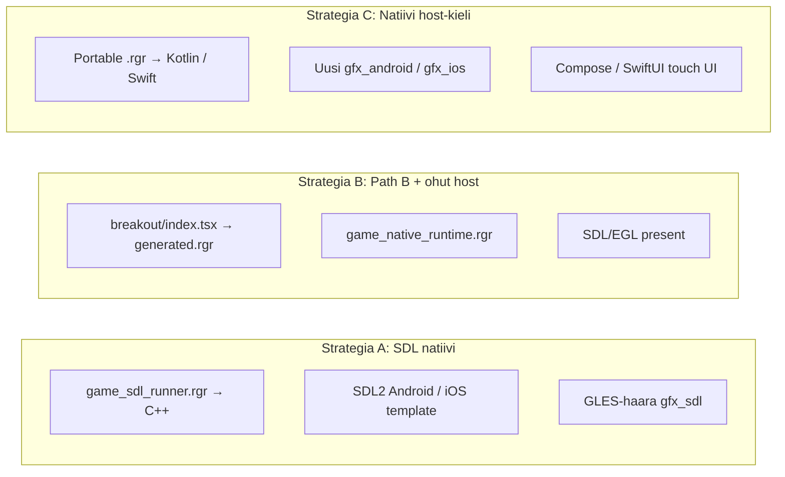

# Mobiiliporttaus: TSX-pelimoottori Androidille ja iOS:lle

> **Päivitetty:** heinäkuu 2026  
> **Tarkoitus:** teoreettinen arvio siitä, miten nykyinen TSX-pelimoottori voitaisiin julkaista mobiililaitteille (lasten peli -käyttötapaus).  
> **Liittyvät dokumentit:** [`README.md`](./README.md), [`ROADMAP.md`](./ROADMAP.md), [`RENDERING_EVG.md`](./RENDERING_EVG.md), [`gallery/ts_to_ranger/README.md`](../ts_to_ranger/README.md)

---

## Tiivistelmä

Ranger Game Engine on jo kerrostettu niin, että **pelilogiikka (TSX) on erotettu hostista**. Nykyinen tuotantohost on **SDL2 + OpenGL 2.1 / GLES2** (`gfx_sdl.rgr`, `game_sdl_runner.rgr`). Mobiiliporttaus tarkoittaa käytännössä **uuden tai laajennetun platform-hostin** tekemistä; pelikoodia (`games/*/index.tsx`) ei tarvitse kirjoittaa uudelleen.

**Tärkeä havainto grafiikasta:** OpenGL-shaderit eivät piirrä pelimaailmaa. Ne tekevät vain:
1. CPU-puskurin (`SoftCanvas`, RGBA8888) tekstuurina ruudulle (present-blitti)
2. GPU-partikkelikerroksen (additive blend)

Varsinainen rasterointi on edelleen CPU:lla 480×270-logiikkaresoluutiolla. Tämä keventää sekä Android- että iOS-porttia merkittävästi.

**Kotlin** (`-l=kotlin`) ja **Swift 6** (`-l=swift6`) ovat Ranger-kääntäjän yleisiä kohteita, mutta pelimoottorin tuotantopolku on tänään **C++ + SDL2**. Mobiilikoodia pelimoottorille ei ole — vain tutkimusprojekteja (`gallery/process_counter_android/`, `gallery/process_counter_ios/`).

---

## Nykyinen arkkitehtuuri

```
TSX-pelilogiikka (portable)
    ↓
GameRunner + ComponentEngine (runtime-tulkinta, Path A)
    TAI ts_to_ranger (staattinen käännös, Path B)
    ↓
SoftCanvas CPU-rasterointi (portable)
    ↓
gfx_sdl.rgr — SDL2 + OpenGL/GLES2 present + partikkelit
```

**Kova raja:** jos tiedosto kutsuu `write`, `poll_keypress` tai `gfx_present`, se on backend. Kaikki muu on portable.

### Demo-pelit ja julkaisukelpoisuus

| Peli | Entityjä | FPS (viite) | Lasten peli -sopivuus |
|------|----------|-------------|----------------------|
| **Pong** | 3 | ~250 | Erinomainen spike/PoC |
| **Breakout** | 52 | ~150+ | Hyvä ensimmäinen julkaistava peli |
| **Pac-Man** | monimutkainen | — | Mahdollinen, enemmän työtä |
| **Invaders** | ~487 | ~8 | Ei — stressitesti, ei tuotantomalli |
| **Pinball / AR / Ylos2** | vaihtelee | — | Myöhempi vaihe |

**Suositus ensimmäiseen julkaisuun:** Breakout — yksinpeli, selkeä kontrolli, JSX-HUD, multi-screen (`play` / `gameOver`), ei vaadi split screeniä.

---

## Mitä pitää portata — kerros kerrallaan

### 1. Pelilogiikka (TSX) — vähän tai ei lainkaan

`games/breakout/index.tsx` ja apumoduulit ovat alustariippumattomia.

| Polku | Kuvaus | Mobiili |
|-------|--------|---------|
| **A: Runtime-tulkinta** | `ComponentEngine` evaluoi TSX:n jokaisella framella | Toimii teoriassa, jos koko C++-stack käännetään natiiviksi |
| **B: Staattinen käännös** | `ts_to_ranger` emittoi `.tsx` → `.rgr` → natiivi | **Suositus julkaisuun** — ei tulkkia laitteella, parempi suorituskyky |

Path B on PoC-tasolla (Pong-pariteetti toimii), mutta se on järkevämpi julkaisupolku.

### 2. Piirtokerros — ei muutoksia

`framebuffer.rgr`, `game_sprite.rgr`, `game_hud.rgr` ovat portable.

### 3. Platform-host — suurin työ

Androidille ja iOS:lle tarvitaan host, joka hoitaa:

- Ikkuna / `Surface` / grafiikkakonteksti (EGL / EAGL / Metal)
- Pelisilmukka (`dt`, frame timing)
- Input (kosketus!)
- Ääni
- Lifecycle (pause/resume, tausta)
- Takaisin / home-indikaattorin käsittely, immersive / edge-to-edge

### 4. Input — uusi kerros pakollinen

`game_input.rgr` tukee näppäimistöä ja 8 gamepadia. Lasten pelille tarvitaan virtuaalinen vasen/oikea (Breakout), D-pad tai yksinkertainen swipe — touch → `props.input` / `props.left` / `props.right` -mappaus.

### 5. Ääni

`game_audio_sdl.rgr` käyttää `SDL_QueueAudio`. SDL2 tukee tätä molemmilla alustoilla, mutta lifecycle-pause vaatii äänen pysäytyksen.

---

## Grafiikka: OpenGL 2 → mobiili

Nykyiset shaderit `gfx_sdl.rgr`:ssä käyttävät **GLSL 1.20** -syntaksia (present + partikkelit). Pi:llä on jo **GLES2-haara** (`__arm__` / `__aarch64__` → `GLES2/gl2.h`).

### Alustakohtaiset GL-polut tänään

| Alusta | Header / API | Konteksti |
|--------|--------------|-----------|
| **macOS (desktop)** | `OpenGL/gl3.h` | GL 2.1 via SDL |
| **Linux desktop** | `GL/gl.h` + glext | Desktop GL 2.x |
| **Raspberry Pi** | `GLES2/gl2.h` | OpenGL ES 2.0 |
| **Android** | *puuttuu* | Tarvitaan `__ANDROID__` + GLES2 |
| **iOS** | *puuttuu* | Tarvitaan `TARGET_OS_IPHONE` + OpenGL ES 2 |

**Huomio iOS:stä:** nykyinen `#if defined(__APPLE__)` -haara olettaa **macOS desktop OpenGLia**, ei iOS OpenGL ES:ää. iOS vaatii erillisen preprocessor-haaran (`TargetConditionals.h`, `TARGET_OS_IPHONE`).

### GLES / OpenGL ES -muunnos (Android + iOS)

Muunnos on pieni näille kahdelle shaderille:

- `#version 120` → pois; fragmentissa `precision mediump float;`
- `varying` / `attribute` / `texture2D` — ES 2.0 tukee samoja
- `gl_FragColor` — ES 2.0:ssa ok

SDL hoitaa kontekstin luonnin molemmilla alustoilla (`SDL_GL_CreateContext`). Vaihtoehto on natiivi `GLSurfaceView` (Android) tai `CAEAGLLayer` / Metal (iOS) ilman SDL:ää — enemmän työtä.

---

## Kolme yhteistä strategiaa (Android + iOS)



| Strategia | Android | iOS | Spike | Julkaisu |
|-----------|---------|-----|-------|----------|
| **A: SDL natiivi** | SDL Android NDK | SDL iOS Xcode | Nopein | Mahdollinen |
| **B: Path B + SDL** | Suositeltu | Suositeltu | Keskitaso | Paras |
| **C: Kotlin / Swift host** | Pitkäjänteinen | Pitkäjänteinen | Hidas | Paras UX pitkällä aikavälillä |

---

# Android

## Nykytila

- Ei Android-porttia pelimoottorille
- Tutkimus: `gallery/process_counter_android/` — `@process`-demo Kotlinilla, ei buildattava APK
- Pi-GLES2-build (`topic/pi-gles2-build`) on lähin ennakkotyö mobiilille

## Strategia A — SDL + NDK (nopein spike)

**Työ:**

- Lisää `__ANDROID__` GLES-haara `gfx_sdl.rgr`:ään
- Luo `gallery/game_engine/android/` — SDL2 Android Gradle + NDK build
- Käännä `game_sdl_runner.rgr` → `libgame.so` + `SDL_main`
- Yksi peli kiinteästi pakettiin (ei launcheria aluksi)
- Touch-overlay tai virtuaalinen D-pad

**Plussat:** Suurin osa host-koodista uudelleenkäytettävissä, Pi-GLES-työ hyödyttää.  
**Miinukset:** APK-koko, lifecycle-kikkailu, 64-bit (`arm64-v8a` + `x86_64` emulaattorille).

## Strategia B — Staattinen TS→Ranger (suositus julkaisuun)

**Työ:**

- Laajenna `ts_to_ranger`-emitteriä Breakoutin TSX-ominaisuuksille
- Build: `.tsx` → `generated/breakout_generated.rgr` → C++ → `libgame.so`
- Host vain: silmukka, input, present, ääni
- Ei ComponentEnginea laitteella

**Plussat:** Pienempi binääri, parempi FPS, selkeämpi julkaisupolku.  
**Miinukset:** Ei hot reloadia laitteella; emitterin kattavuus pelikohtainen.

## Strategia C — Kotlin-host

Rangerin `-l=kotlin` ei korvaa SDL-hostia automaattisesti.

| Komponentti | Kotlin? | Huomio |
|-------------|---------|--------|
| `pong_core.rgr`, `framebuffer.rgr` | Kyllä | Helppo |
| `ComponentEngine` + TS-parseri | Teoriassa | Raskas JVM:llä, testaamaton |
| `gfx_sdl.rgr` C++ polyfill | Ei | Tarvitaan `gfx_android.rgr` + EGL |
| Touch UI | Ei | Jetpack Compose overlay |

Katso `gallery/process_counter_android/ISSUES.md` — callback-bridge, companion object -bugit.

## OpenGL Androidilla

- Emulaattori tukee GLES 2.0 hyvin
- Sama present-shader (tekstuuri fullscreen-quadi) validoidaan helposti ennen fyysistä laitetta
- `SDL_GL_SetAttribute(SDL_GL_CONTEXT_MAJOR_VERSION, 2)` toimii SDL Android -portissa

## Emulaattoritesti (Android)

1. **Desktop GLES2** — shaderit Linuxilla / Pi:llä (jo olemassa)
2. **SDL Android hello** — musta ikkuna emulaattorissa, `arm64-v8a` + `x86_64`
3. **Yksi frame SoftCanvas → GL** — 480×270 RGBA, letterbox
4. **Pong ilman TSX:ää** — `pong_sdl.rgr`, ei ComponentEnginea
5. **Yksi TSX-peli** — Path A tai B
6. **Touch + ääni + lifecycle** — pause taustalle

## Android-spesifiset riskit

| Riski | Kuvaus |
|-------|--------|
| ComponentEngine APK:ssa | Paljon C++-koodia, hidas käynnistys |
| Path B kattavuus | importit, JSX `hud()`, multi-screen |
| Lifecycle | `onPause` / `onResume` SDL-sovelluksissa |
| Lasten pelin UX | Touch pakollinen tuotantoon |
| Play Store | 64-bit, AAB, alle 16 KB page size (uudemmat laitteet) |

---

# iOS

## Nykytila

- macOS SDL-build toimii jo (`build-game-sdl.sh` → `-framework OpenGL`)
- Ei iOS-porttia pelimoottorille
- Tutkimus: `gallery/process_counter_ios/` — `@process`-demo Swift 6:lla, ei Xcode-projektia repossa
- Ranger tukee `-l=swift6` yleisesti; pelimoottori ei käytä sitä

## iOS vs Android — keskeiset erot

| Aihe | Android | iOS |
|------|---------|-----|
| **Build** | Gradle + NDK | Xcode + Apple toolchain |
| **GL API** | GLES 2.0/3.0 (aktiivinen) | OpenGL ES 2.0 (**deprecated**, yhä käytettävissä SDL:n kautta) |
| **Pitkän aikavälin GPU** | GLES riittää | **Metal** suositeltu uusille appeille |
| **Jakelu** | Play Store / AAB | App Store / TestFlight / IPA |
| **Emulaattori** | Android Emulator (x86_64/arm64) | iOS Simulator (arm64 Macilla) |
| **Natiivi host-kieli** | Kotlin + Compose | Swift 6 + SwiftUI |
| **SDL-tuki** | Virallinen NDK-template | Virallinen Xcode-template |
| **Gamepad** | Laaja | MFi / Game Controller framework |
| **Turvallinen alue** | Display cutout, gesture nav | Safe area, notch, Dynamic Island |
| **Taustaus** | `onPause` aggressiivisempi | `applicationWillResignActive` — ääni ja silmukka pysähtyvät |

## OpenGL iOS:lla — tärkein tekninen ero

Apple on **merkinnyt OpenGL ES:n deprekoituksi** iOS:ssä. SDL2-pelit käyttävät sitä edelleen monissa projekteissa, mutta:

- **Lyhyellä aikavälillä (spike/julkaisu):** OpenGL ES 2.0 SDL:n kautta on realistinen — sama GLES-shaderhaara kuin Android/Pi
- **Pitkällä aikavälillä:** App Store -review ei välttämättä hylkää GLES-appia vielä, mutta **Metal-present** on turvallisempi investointi

### Tarvittava muutos `gfx_sdl.rgr`:ään

Erottele macOS desktop ja iOS:

```cpp
#if defined(__APPLE__)
  #include <TargetConditionals.h>
  #if TARGET_OS_IPHONE
    #include <OpenGLES/ES2/gl.h>
    // GLES 2.0 shader sources (sama kuin Android/Pi)
  #else
    #include <OpenGL/gl3.h>
    // Nykyinen desktop GL 2.1 -polku
  #endif
#endif
```

**Metal-vaihtoehto (vaihe 2+):** korvaa vain present + partikkelipassi Metalillä; SoftCanvas pysyy CPU:lla. Suurempi työ kuin GLES, mutta iOS-spesifinen ja tulevaisuusvarmempi.

## Strategia A — SDL iOS (nopein spike)

**Työ:**

- SDL2 iOS Xcode -projekti (SDL tarjoaa `Xcode-iOS/` -templateja)
- `game_sdl_runner.rgr` → C++ → staattinen kirjasto iOS-targetiin
- `SDL_main` + `UIApplication` integraatio SDL:n kautta
- GLES ES 2.0 -shaderhaara iOS:lle
- Yksi peli (Pong) kiinteästi targetiin

**Plussat:** Sama C++-host kuin Android-spikessä; macOS-kehitysympäristö lähellä.  
**Miinukset:** Xcode-projektin ylläpito; OpenGL ES deprecation; Retina/safe area -huomiot.

### iOS-spesifiset SDL-huomiot

- **Retina:** logiikka 480×270, ikkuna skaalautuu — sama kuin desktop fullscreen
- **Safe area:** immersive-peli voi piirtää koko näytön; virtuaalinäppäimet kannattaa sijoittaa safe arean sisään
- **Orientation:** lasten peli — lukitse landscape tai portrait `Info.plist`:ssä
- **Status bar:** piilota (`UIStatusBarHidden`) pelin aikana
- **Game Controller:** SDL_GameController toimii iOS:llä; lapsille touch on silti ensisijainen

## Strategia B — Path B + SDL iOS (suositus julkaisuun)

Sama pipeline kuin Android:

```
breakout/index.tsx → generated.rgr → C++ → iOS static lib → SDL host
```

**Plussat:** Jaettu build-logiikka Androidin kanssa (sama generated.rgr, sama C++ present).  
**Miinukset:** Emitterin Breakout-kattavuus; ei hot reloadia laitteella.

## Strategia C — Swift 6 -host

Rangerin `-l=swift6` kääntää portable `.rgr`-moduulit Swift-luokiksi.

| Komponentti | Swift 6? | Huomio |
|-------------|----------|--------|
| `framebuffer.rgr`, `game_sprite.rgr` | Kyllä | Portable |
| `ComponentEngine` | Teoriassa | Raskas, testaamaton pelisilmukassa |
| `gfx_sdl.rgr` | Ei | Tarvitaan `gfx_ios.rgr` — Metal tai GLES wrapper |
| Touch UI | Ei | SwiftUI overlay (`SpriteKit`/`UIKit` vaihtoehto) |

Tutkimusprojekti `gallery/process_counter_ios/` osoittaa samat callback-ongelmat kuin Kotlin-puolella (`ProcessUiHost.notifyPath` tyhjä stub). Katso `ISSUES.md`.

**SwiftUI-integraatio lasten peliin:**

- `SpriteKit` + `SKSpriteNode` texture upload SoftCanvas-bufferista — vaihtoehto Metalille ilman SDL:ää
- Tai `MTKView` + yksinkertainen Metal-present shader
- Virtuaaliset kontrollit: `SwiftUI` overlay `ZStack`:ssa pelin päällä

## Ääni iOS:lla

- **SDL audio:** toimii SDL iOS -buildissa
- **Vaihtoehto:** `AVAudioEngine` natiivissa hostissa — parempi taustakäsittely, mutta erillinen integraatio
- **Keskeytys:** puhelu / Control Center / taustalle siirtyminen → pause + `SDL_PauseAudio` tai vastaava

## Jakelu ja lasten sovellus (App Store)

- **Kids Category** vaatii tietosuojakäytännön ja COPPA-yhteensopivuuden jos kerätään dataa
- Nykyinen moottori: ei verkkoa, ei analytiikkaa oletuksena → yksinkertainen privacy story
- **TestFlight** sisäiseen testaukseen ennen App Store -lähetystä
- **Simulator vs laite:** Simulator riittää present- ja silmukkatestiin; ääni, gamepad ja suorituskyky validoidaan laitteella

## Emulaattoritesti (iOS Simulator)

1. **macOS SDL-build** — varmista että desktop-polku ei rikkoudu iOS-haaran lisäyksessä
2. **iOS Simulator + SDL hello** — musta ikkuna, GLES-konteksti
3. **Yksi frame present** — 480×270 tekstuuri, skaalaus
4. **Pong ilman TSX:ää** — `pong_sdl` tai `pong_core` + render
5. **Path B Breakout** — staattinen käännös
6. **Touch + lifecycle** — taustalle siirtyminen, äänen pysäytys

Simulator ei täysin vastaa fyysistä laitetta (GPU, input latency), mutta present-pipeline ja silmukka ovat validoitavissa ennen TestFlightia.

## iOS-spesifiset riskit

| Riski | Kuvaus |
|-------|--------|
| OpenGL ES deprecation | Pitkällä aikavälillä Metal-present tarpeen |
| `__APPLE__` sekoitus | macOS desktop GL vs iOS ES — pakollinen erottelu |
| Xcode-only build | CI vaatii macOS-runnerin (ei Linux-CI:ssa suoraan) |
| App Review | Lasten kategoria, ikäluokitus, privacy manifest (iOS 17+) |
| ComponentEngine koko paketissa | Sama kuin Android — Path B välttää |
| Swift 6 strictness | Generoidussa koodissa varoituksia; ei validoitu pelisilmukassa |

---

## Yhteinen työmäärämatriisi

| Komponentti | Android | iOS | Riski |
|-------------|---------|-----|-------|
| GLES/OpenGL ES -haara `gfx_sdl.rgr` | `__ANDROID__` | `TARGET_OS_IPHONE` | Matala |
| SDL natiivi template | Gradle/NDK | Xcode | Keskitaso |
| Path B emitter Breakoutille | Jaettu | Jaettu | Keskitaso |
| Touch input | Compose overlay / SDL | SwiftUI overlay / SDL | Keskitaso |
| Ääni + lifecycle | `onPause`/`onResume` | `willResignActive` | Keskitaso |
| Metal-present (vain iOS pitkä aikaväli) | — | Uusi työ | Korkea |
| Kotlin/Swift host | Vaihe 2+ | Vaihe 2+ | Keskitaso–korkea |
| Play Store / App Store paketointi | AAB | IPA + signing | Matala |

---

## Suositeltu eteneminen (molemmat alustat)

```
1. GLES2-haarat gfx_sdl.rgr:ään (__ANDROID__ + TARGET_OS_IPHONE)
2. Jaettu Path B: Breakout .tsx → generated.rgr (yksi lähde, kaksi hostia)
3. SDL spike: Android emulaattori + iOS Simulator (Pong ilman TSX:ää)
4. Path B Breakout molemmille
5. Touch-kontrollit (jaettu suunnittelu, alustakohtainen UI)
6. Julkaisu: yksi peli per sovellus (ei launcheria ensimmäisessä versiossa)
7. iOS: Metal-present harkinta ennen pitkäaikaista ylläpitoa
```

**Kotlin vs Swift:** molemmat ovat vaihe 6+ -investointeja idiomaattiseen hostiin. SDL-spike on ensimmäinen askel molemmilla, koska host on jo olemassa ja Pi-GLES-precedentti on olemassa.

---

## Päätökset ennen työn aloitusta

1. **Yksi peli vai launcher?** → yksi peli (Breakout) ensimmäiseen julkaisuun
2. **Path A vai B?** → spike: A (Pong); julkaisu: B
3. **SDL vai natiivi host?** → spike: SDL; pitkäjänteinen: Kotlin (Android) / Swift (iOS)
4. **OpenGL riittääkö?** → kyllä present + partikkeleihin; iOS:lla Metal myöhemmin
5. **Jaettu vs erillinen CI?** → generated.rgr ja C++ present jaettu; platform-build erillinen (NDK vs Xcode)
6. **Tallennus?** → `saveGameData` tarvitsee alustakohtaisen toteutuksen (`SharedPreferences` / `UserDefaults`)

---

## Liittyvät tiedostot

| Tiedosto | Rooli |
|----------|-------|
| `scripting/game_sdl_runner.rgr` | Nykyinen SDL-host |
| `gfx_sdl.rgr` | Present, GL-shaderit, ääni, input |
| `scripting/game_runtime.rgr` | Path A: ComponentEngine |
| `scripting/game_native_runtime.rgr` | Path B: staattinen peli |
| `gallery/ts_to_ranger/` | TS→Ranger emitter |
| `gallery/process_counter_android/` | Kotlin-host tutkimus |
| `gallery/process_counter_ios/` | Swift-host tutkimus |
| `scripts/build-game-sdl.sh` | Nykyinen desktop/Pi build |
