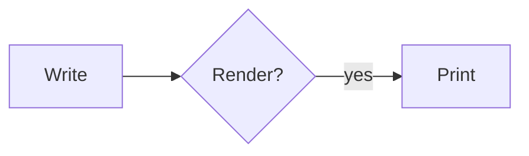

# Markdown — a parser, a viewer, and a page that prints

A CommonMark + GFM parser written in Ranger, and a viewer that draws the
result on the **GPU** and writes it to **PDF** — the same document, the same
line breaks, from one layout. Mermaid inside a fence is not a picture pasted
in: it is read by the reader RangerFlow already has, laid out by its own
layout, and placed on the page as geometry that prints.

The page it produces is a GitHub Pages URL with no server behind it: text on
the left, the document on the right on a WebGL 2 canvas, and a **Download
PDF** button that builds the file in the tab.

```
                    ┌──────────────── the page, on github.io ────────────────┐
                    │  source pane          │  WebGL 2 canvas   │  ⬇ PDF     │
                    └───────────────────────┴───────────────────┴────────────┘
                                            ▲                   ▲
    text ─► MdBlockParser ─► MdInlineParser ─► MdDocument ──────┴────────┐
                                                   │                     │
              ┌────────────────────────────────────┼─────────────┐       │
              ▼                                    ▼             ▼       ▼
          MdToHtml                            MdToRich       MdToMd   MdOutline
       (the parity oracle's                 (RichDocument)  (round    (TOC,
        only reason to exist)                     │          trip)     anchors)
                                            MdLayout → Page[]
                                                   │
                        ┌──────────────────────────┼──────────────────────┐
                        ▼                          ▼                      ▼
                  EVGDisplayList             EVGElement                 SVG
                   → WebGL / SDL          → EVGPDFRenderer  → PDF     → PNG
```

Status: **phases 1–3 built**, and the numbers below are measured rather than
hoped for. What exists today is in [`README.md`](README.md); this file stays
the design, including the parts that are not written.

| | | |
| --- | --- | --- |
| **1** | blocks, inlines, `MdToHtml`, the spec harness | **done** — 651/652, ratcheted |
| **2** | GFM, front matter | **done** — tables, task lists, strikethrough, YAML |
| **3** | `MdLayout`, `MdToEvg`, PDF | **done** — `npm run markdown:demo` prints this repository's README as 38 pages |
| **0** | the three seams (§5) | **three of three**: `breakRuns` exists (in `MdLayout`, not EVG — see below), `MermaidRender` is extracted, and `EVGPDFRenderer` runs with `require` undefined — the build script asks on every build |
| **`mermaid`** | the fence, drawn (§7) | **done** — `MermaidRender` extracted, all 26 dialects, geometry not raster |
| **4** | the page: canvas, panes, sync | **done** — `/markdown/`, 14 checks in headless Chrome |
| **5** | PDF in the tab | **done** — same layout, faces embedded, right page count |
| **6** | highlighting, TOC, page furniture | **done** — 14 languages, a two-pass contents, running heads and folios |
| **6b** | incremental reparse | **measured, not done** — `markdown:bench` says 382 ms at 63 KB against a one-frame budget, and says why |

Two things the building changed about the design, both recorded here rather
than quietly:

- **`breakRuns` landed in `MdLayout`, not in `EVGTextEngine`.** §5.1 argued it
  belongs in EVG so `docx_viewer` gains from it too, and that is still right.
  It was written here first because the markdown layout needed it working
  before it could need it shared; moving it is a refactor with a test suite
  already behind it.
- **`MermaidRender` is extracted, and the web facade has not moved onto it
  yet.** §5.2 asked for one door so the page and the markdown module cannot
  drift; the door exists and the markdown module uses it, but
  `rangerflow_web.rgr` still has its own thirty branches. Collapsing them
  needs each loader's per-kind status line ("3 entities, 2 relationships")
  moved into `MermaidDrawing` first — mechanical, ~700 lines, and worth its
  own change with `rangerflow:web:test` as the gate. Until then a new dialect
  has to be added in two places to be drawn in both, which is the drift this
  was meant to end. `rangerflow:test` (1222 assertions) is green either way.
- **Raw HTML is passed through by `MdToHtml` and refused by the viewer.**
  §14 said it would be refused everywhere. That would have cost 44 spec
  examples for nothing: the exporter exists only to be scored, so it prints
  the markup, and the canvas — which has nothing to hand a `<div>` to — draws
  it as a dimmed code block. Two answers to one question, on purpose.

---

## Contents

1. [Why a parser of our own](#1-why-a-parser-of-our-own)
2. [Feature parity, and who decides it](#2-feature-parity-and-who-decides-it)
3. [The parser](#3-the-parser)
4. [The document model](#4-the-document-model)
5. [The three seams that have to be cut first](#5-the-three-seams-that-have-to-be-cut-first)
6. [Layout and pagination](#6-layout-and-pagination)
7. [Mermaid in a fence](#7-mermaid-in-a-fence)
8. [Code blocks](#8-code-blocks)
9. [The page](#9-the-page)
10. [PDF in the tab](#10-pdf-in-the-tab)
11. [The files](#11-the-files)
12. [Testing](#12-testing)
13. [Phases](#13-phases)
14. [Left out on purpose](#14-left-out-on-purpose)
15. [Risks](#15-risks)

---

## 1. Why a parser of our own

There are good markdown parsers. `markdown-it` is one, and the page could load
it in eleven kilobytes. The reason not to is the same reason RangerFlow reads
Mermaid itself:

| | `markdown-it` in the page | a Ranger parser |
| --- | --- | --- |
| output | HTML, for a DOM | an AST, for whatever wants it |
| print | the browser's print dialog, which cannot paginate a canvas | `EVGPDFRenderer`, real fonts embedded, page breaks decided by us |
| where it runs | a browser | JavaScript, Go, Python, Kotlin, C#, Rust, Swift, Dart — the compiler's targets |
| what it knows | tokens | tokens **plus** source offsets, so a click on page 4 finds the character that made it |

The viewer draws on a canvas. A canvas has no DOM to hand to a print dialog,
so a paginated document is something the program has to produce. Once it is
producing pages, HTML stops being the output and becomes what it should have
been all along — one exporter among four, kept because it is the only thing
that can be **scored against a specification**.

And the repository already owns every part downstream of the AST: `EVG` lays
boxes out and breaks lines, `pdf_writer` embeds fonts and writes PDF,
`docx_viewer` has a paginated rich-document model with an edit caret in it,
`rangerflow` reads twenty-six Mermaid dialects, and `evg-webgl.js` paints a
display list at 60 fps. What is missing is the front of the pipe.

---

## 2. Feature parity, and who decides it

Not us. The claim "CommonMark support" is checkable to the example, and
anything else is marketing.

### The oracle

**CommonMark's own `spec.json`.** The specification ships its examples as
data — `{markdown, html, example, start_line, end_line, section}` — and the
reference implementations are tested by rendering each `markdown` and
comparing the output to `html` as an exact string. That is the test, it is
public, and it is not an opinion:

```
gallery/markdown/harness/spec/commonmark-0.31.2.json   pinned, checked in
gallery/markdown/harness/spec/gfm-0.29.json            the GFM extensions
```

Pinned files rather than a download at test time, so the score cannot move
because a website did. The version is in the filename; raising it is a commit
with a diff.

Two more oracles, for what the spec cannot answer:

| Oracle | Answers | How |
| --- | --- | --- |
| `commonmark` (the JS reference) | "is our AST shaped like theirs?" | XML dump vs `MdDocument.toXml()` — same node names, same nesting |
| `markdown-it` | the extension dialect nobody specified — footnotes, alerts, front matter | token stream vs ours, on our own fixtures |

Installed on demand into `harness/`, exactly as `rangerflow/harness` installs
Mermaid, and **absent is not failure**: the score for a missing oracle is
reported as "not run", never as zero.

### The score

`tools/markdown-parity.mjs`, modelled line for line on
`rangerflow/tools/mermaid-parity.mjs`: two JSON files in, a table out, written
to `docs/COMMONMARK_PARITY.md` so the number is in the repository and moves
visibly.

```
npm run markdown:spec                # score, per section
npm run markdown:spec -- --diff      # every failing example, in full
```

Reported per specification section, because a bare "612 / 652" hides which
612:

```
Tabs                       11/11   ####################
ATX headings               18/18   ####################
Emphasis and strong        132/132 ####################
Link reference definitions 27/27   ####################
Links                      87/90   ###################.
HTML blocks                 0/44   ....................   (see §14)
─────────────────────────────────────────────────────────
CommonMark 0.31.2          608/652  93.3%
GFM tables/strike/tasks     41/41   100%
```

**A ratchet, not a target.** `harness/floor.json` holds the count each section
passed the last time the number went up, and `markdown:spec` fails the build
if a section drops below it. Going up is a diff in that file; going down is a
red build. This is the mechanism that keeps a parser honest after the week
somebody was excited about it.

### What "parity" is claimed to mean

- **CommonMark 0.31.2** — the whole thing except raw HTML (§14), which is a
  deliberate refusal rather than a gap.
- **GFM** — tables, task lists, strikethrough, autolinks, disallowed raw HTML.
- **Beyond both** — YAML front matter, footnotes, GitHub alerts
  (`> [!NOTE]`), heading anchors, and `mermaid` fences, each with its own
  fixtures because no specification covers them.

---

## 3. The parser

CommonMark's algorithm, because it is the one the specification is written
against and any other one loses examples for reasons that are hard to explain.
Two phases, and the second one is where the difficulty is.

### Phase 1 — blocks (`MdBlockParser.rgr`)

One pass, line by line, over a stack of open blocks. For each line: walk the
stack matching continuation markers, close what no longer matches, open what
the remainder starts, and give the rest to the deepest open leaf. Lazy
continuation makes a paragraph line inside a block quote work without the
`>`. Link reference definitions are harvested here, because a link on line 3
may resolve against a definition on line 900.

The list of things this phase gets wrong if written casually, each of which is
a spec section with examples attached:

| | |
| --- | --- |
| **tabs** | a tab advances to the next 4-column stop; it is not four spaces, and partial consumption inside a list item is examples 1–11 |
| **list tightness** | a blank line between items makes the whole list loose, and loose means every item's contents get wrapped in a paragraph |
| **item continuation indent** | measured from the first non-space of the item's content, not from the marker |
| **setext vs ATX** | `---` under a paragraph is a heading; under nothing it is a thematic break; under a list it may be neither |
| **fence matching** | a closing fence needs at least as many characters, the same character, and no info string |
| **HTML blocks** | seven start conditions with seven different end conditions (see §14) |

### Phase 2 — inlines (`MdInlineParser.rgr`)

Run per leaf block, over the accumulated text.

- **Code spans first.** A backtick string of length *n* closes on the next
  backtick string of exactly *n*. This binds tighter than everything else, and
  doing it out of order is how a parser ends up emphasising the inside of a
  code span.
- **The delimiter stack** for `*`, `_`, `~~`. Left-flanking and
  right-flanking are computed from the characters on both sides (Unicode
  whitespace and punctuation classes, not ASCII), `_` has the extra intraword
  rule, and the "rule of three" resolves `***a***`. This is the single hardest
  thing in the specification and it is worth ~130 examples on its own.
- **Brackets** for links and images: an opener stack, `look for link or
  image` walking back, and the inactive-opener rule that stops links nesting.
  Destinations may be `<>`-wrapped or bare with balanced parentheses; titles
  come in three quotings.
- **Then** autolinks, raw HTML (recognised, see §14), entity and numeric
  character references, backslash escapes, and hard line breaks (two spaces,
  or a backslash).

### Source positions

Every node carries `srcStart` / `srcEnd`, byte offsets into the original
text. This is not decoration:

- the editor scrolls the view to the block under the caret and back;
- a click on the canvas puts the caret in the source;
- the incremental reparse (§9) needs to know what to throw away;
- and a round-trip formatter (`MdToMd`) can leave untouched regions byte-identical.

### Portability

The parser touches no I/O and no host. It compiles to Go and Python in CI
alongside JavaScript — `markdown:test:go`, `markdown:test:python` — the way
`book:test:go` already does. This costs one npm script and proves the claim in
§1 rather than asserting it.

---

## 4. The document model

Two models, on purpose.

### `MdDocument` — the AST

CommonMark's node set, unchanged, because the parity XML dump has to line up
with the reference implementation's: `document`, `block_quote`, `list`,
`item`, `code_block`, `html_block`, `paragraph`, `heading`,
`thematic_break`, `text`, `softbreak`, `linebreak`, `code`, `html_inline`,
`emph`, `strong`, `link`, `image` — plus `table` / `table_row` / `table_cell`,
`strikethrough`, `task_item`, `footnote_ref`, `footnote_def`, and `embed`.

### `RichDocument` — the layout IR

`gallery/docx_viewer/src/RichDocument.rgr`, reused rather than reinvented. It
already carries what a laid-out document needs and nothing markdown-specific:
paragraphs with **format spans**, tables with cells and borders, images,
sections with page size and margins, and the caret model
`paragraphId + textOffset` that an editor wants. `MdToRich.rgr` is the
translation, and it is the only file that knows both vocabularies.

Reusing it means markdown gets pagination, hit testing, an edit controller and
a DOCX-shaped export for free — and it means a fix to line breaking helps both
viewers. It also means four small additions to `RichDocument`, each of which
is a generic document feature rather than a markdown quirk:

| Addition | Why | Who else gains |
| --- | --- | --- |
| `TextSpan.code` , `TextSpan.strike` | inline code, `~~struck~~` | DOCX has both and cannot currently carry them |
| `DocBlockKind.code` | preformatted: no wrap, monospace, a background box, an optional gutter | — |
| `DocBlockKind.rule` | `---` | DOCX horizontal rules |
| `DocBlockKind.embed` | an atomic block that hands back a display list and a size (§7) | the chart block is the same shape and can move onto it |

Block quotes need no new kind: a left indent plus a border on the paragraph,
which `Paragraph` can already express, with a `quoteDepth` for the nested case.

The one honest cost of the reuse: `RichDocument` is measured in twips and
speaks `styleId "Normal"`, because Word made it. `MdToRich` converts once at
the boundary and nothing downstream sees a markdown concept. If that friction
ever exceeds the value, the model moves to `gallery/evg/` and both viewers
import it from there — but not before it does.

---

## 5. The three seams that have to be cut first

None of these is markdown work. All three block it, all three are small, and
all three make something that already exists better. They are phase 0.

### 5.1 Line breaking across styled runs

`EVGTextEngine.breakLines(text, family, size, maxWidth)` breaks **one** run of
**one** style. A markdown paragraph is `some **bold** and `code` and *italic*`
— one line, four styles, and the break has to be found across all of them.

```ranger
; new, beside breakLines
class EVGRunSegment { def text:string  def style:EVGRunStyle  def width:double }
class EVGRunLine    { def segments:[EVGRunSegment]  def width:double
                      def ascent:double  def descent:double }

fn breakRuns:[EVGRunLine] (runs:[EVGRunSegment] maxWidth:double)
```

Same algorithm — measure the candidate line, back off at the last break
opportunity — with the accumulator carrying a style change instead of only a
width, and the line's ascent/descent being the maximum over its segments so a
14 pt `code` span in 11 pt body text does not sit on the wrong baseline.

`docx_viewer`'s README lists *"per-span font size still paints at the visual
line's size"* as a known limitation. This is that limitation's fix, and it is
the reason to put the function in EVG rather than in the markdown module.

### 5.2 One door to Mermaid

`MermaidReader.parse` gives a `MermaidDiagram` with a `diagramKind`, and
twenty-six readers turn the various kinds into something drawable. The
dispatch that picks between them lives in
`gallery/rangerflow/web/rangerflow_web.rgr` — thirty branches, interleaved
with editor state, theme switching and status strings. It cannot be called
from anywhere else.

Extract it: `domains/mermaid/MermaidRender.rgr`, one static function, no
editor, no status line.

```ranger
sfn render:FlowScene (text:string style:FlowStyle maxWidth:double)
sfn kindOf:string (text:string)          ; "" when it is not Mermaid at all
```

`rangerflow_web.rgr` then calls it too, so the page and the markdown module
cannot drift into supporting different diagram sets — which is the actual
risk, given that the set grew from one to twenty-six in a few months.

### 5.3 `EVGPDFRenderer` with no filesystem

`FontManager.loadFontBuffer(name, data:buffer)` already exists, and
`EVGPDFRenderer` imports nothing that reads a file. So the PDF writer is
believed to run in a browser and has never been asked to. Phase 0 asks it: a
node check that builds a PDF with `require` undefined and font bytes handed
in, the same shape as the "is this bundle loadable" check every standalone
build script already runs.

If something does reach for a path, it is better to find out in a twelve-line
script than in the browser console (§10 depends on the answer).

---

## 6. Layout and pagination

Two modes, one layout. This is the design decision the whole viewer rests on.

```
RichDocument ──► MdLayout ──► MdPage[]  ──► EVGDisplayList  (WebGL, SDL)
                    │                    └► EVGElement      (PDF, HTML, SVG)
                    │
             continuous mode: one page, height unbounded  → the screen
             paged mode:      A4/Letter, breaks decided   → print, and preview
```

The screen is not a special case with its own code path; it is a page whose
height is the document's. `?view=paged` in the URL turns page breaks on and the
canvas shows sheets with a gap between them — which is also what the PDF will
contain, because it is the same call.

### Break rules

Borrowed from `BookFlow`, which already implements them for the book engine:
orphans, widows, keep-with-next, and a hard break. Markdown's mapping:

| Rule | Applied to |
| --- | --- |
| keep-with-next | headings — a heading is meaningless as the last line of a page |
| orphans / widows, 2 | body paragraphs |
| atomic | code blocks under ~15 lines, table rows, and every embed (§7) |
| page-break-before | `<!-- pagebreak -->`, and optionally every `#` when front matter says `breakOnH1: true` |

A code block or table too tall to be atomic splits, and the continuation gets
a repeated header row (tables) or a gutter mark (code). An embed too tall to
be atomic scales down to fit and the preflight says so.

### Page furniture

From YAML front matter, which is where a markdown document already puts its
metadata:

```yaml
---
title: Design notes
page: A4                 # A4 | Letter | 148x210mm
margin: 20mm             # or "20mm 18mm"
columns: 1
runningHead: title       # title | h1 | none
pageNumbers: bottom-center
toc: true
theme: print             # the EVG stylesheet the document is drawn with
---
```

Everything here has a default, and a file with no front matter renders.

### Style

Not constructor arguments — a stylesheet, for the same reason RangerFlow's
Mermaid look is one. EVG's CSS subset (class selectors, `@vars`, `@media`,
themes) already drives the diagram styling, so a markdown document's
appearance is `md-default.css` / `md-print.css` / `md-dark.css` shipped
beside the module, `?style=` on the page, and `--style=house.css` on the
command line. `.h1`, `.h2`, `.body`, `.code`, `.quote`, `.table`, `.th`,
`.rule`, `.embed` — nine classes and the `@vars` block above them.

---

## 7. Mermaid in a fence

````markdown

````

The fence's info string is `mermaid`, so the block becomes an `embed` rather
than a `code_block`, and `MdMermaid.rgr` resolves it:

```
fence text ──► MermaidRender.render(text, style, contentWidth) ──► FlowScene
                                                                      │
                        ┌─────────────────────────────────────────────┤
                        ▼                                             ▼
              scene.toDisplayList()                          scene.toEvgTree()
              offsetBy(blockX, blockY)                       an EVGElement subtree
                        │                                             │
                        ▼                                             ▼
                      WebGL                                    PDF / HTML / SVG
```

Both of those methods exist today. Nothing about the diagram is rasterised on
either path: in the PDF it is vector geometry with embedded fonts, and on the
canvas it is the same commands the RangerFlow editor draws.

### The sizing contract

An embed is a block that can be asked its size at a width and then asked to
draw itself:

```ranger
fn measure:MdEmbedSize (contentWidth:double)     ; → width, height, baseline
fn paint:EVGDisplayList (x:double y:double)
fn toElement:EVGElement ()
```

For Mermaid, `measure` renders the scene once and reports `worldW`/`worldH`
scaled to fit `contentWidth` (never scaled **up** — a three-node flowchart
should not become a poster). The scene is cached on
`(source, contentWidth, styleName)`, so typing a sentence three paragraphs
below a diagram does not re-run a graph layout.

For print, `contentWidth` is the page's, so the diagram is laid out again at
the printed width rather than scaled from the screen's — which is the whole
reason to keep it as geometry.

### The rest of the fences

`MdEmbed` is a registry, not a Mermaid special case: an info string maps to a
handler, and the ones that follow reuse work already in the repository.

| Info string | Handler | Where it comes from |
| --- | --- | --- |
| `mermaid` | `MdMermaid` | `rangerflow/domains/mermaid` — phase 3 |
| `vega` / `vega-lite` | `MdVega` | `gallery/vela` already compiles specs to a drawing — phase 4 |
| `sql` | `MdSchema` | `rangerflow/domains/erd` draws an ER diagram from DDL — phase 4 |
| anything else | code block | §8 |

An unknown info string is not an error. It is a code block, which is what
every other markdown renderer does with it.

---

## 8. Code blocks

Monospace, no wrapping (horizontal overflow clips with a gutter mark rather
than reflowing — a wrapped code line is a lie about the code), a background
box, and an optional line-number gutter.

Highlighting is **phase 4** and deliberately unambitious. There is no
highlighter in the repository — `text_editor`'s `EditorStyle` carries bold and
a font face per run, nothing lexical — so `MdCodeHighlight.rgr` is one small
lexer with a per-language table: line comments, block comments, string
delimiters, number literals, and a keyword set. Six colours. That covers
JavaScript, TypeScript, Go, Python, Rust, Swift, Kotlin, C#, SQL, JSON, shell
and Ranger to the standard a printed page wants, in a few hundred lines, and
it is a `TextSpan` list handed to the layout — the same mechanism bold uses.

Where the repository has a real parser it can be used instead:
`gallery/ts_parser` and `gallery/js_parser` produce token streams already.
That is an upgrade for two languages, not a prerequisite for twelve.

---

## 9. The page

`https://terotests.github.io/Ranger/markdown/`, built by the existing Pages
workflow, no server.

```
┌────────────────────────────────────────────────────────────────────┐
│ open  save  ⬇ PDF  ⬇ HTML   [ continuous ▾ ] [ light ▾ ]  build a1b2 │
├──────────────────────────────┬─────────────────────────────────────┤
│ # Design notes               │  ┌───────────────────────────────┐  │
│                              │  │ Design notes                  │  │
│ Some **bold** text and a     │  │                               │  │
│ diagram:                     │  │ Some bold text and a diagram: │  │
│                              │  │                               │  │
│ ```mermaid                   │  │   ┌─────┐   yes   ┌───────┐   │  │
│ flowchart LR                 │  │   │Write├─────────►│ Print │   │  │
│   A[Write] --> B[Print]      │  │   └─────┘          └───────┘   │  │
│ ```                          │  └───────────────────────────────┘  │
│                              │                                     │
│  source (textarea → EVG)     │       WebGL 2 canvas                │
└──────────────────────────────┴─────────────────────────────────────┘
```

Built with the recipe the other four standalone pages use, unchanged — it is
`gallery/book/web/standalone/build.sh` with the names swapped, including the
two checks that have already caught real breakage: *does the bundle define its
class with `require` undefined* (a stray `read_file` on the load path compiles
fine and fails only when somebody opens the page), and *is there a build stamp
in the URL of every asset* (a rebuilt page a browser will not fetch is
indistinguishable from one that was never fixed).

### The two panes

**v1**: the source pane is a `<textarea>` and the view pane is the canvas.
Unglamorous, correct, and it makes the interesting half — parse, layout,
paint, print — the only thing that can be wrong.

**v2**: the source pane becomes `gallery/text_editor`'s editor drawn by EVG on
the same canvas, so the page is one engine and one font stack, and the syntax
highlighting of §8 applies to the source too.

### Keeping the two in step

The AST's source offsets do all of it:

| Gesture | Mechanism |
| --- | --- |
| scroll the source | find the block whose `srcStart` brackets the top visible line, scroll the view to its box |
| scroll the view | the inverse |
| click in the view | hit-test to a `paragraphId + textOffset`, map back through `srcStart`, put the caret there |
| type | reparse, relayout, repaint |

### Reparsing on every keystroke

v1 reparses the whole document. The budget is **one frame at 200 KB** —
parse, `MdToRich`, layout, display list — measured by `markdown:bench` and
reported, not assumed. The repository's own `README.md` is 63 KB and
`ISSUES.md` is 138 KB, so the corpus for that measurement is at hand.

If the budget is missed, the fix is scoped rather than clever: markdown block
boundaries are line-based, so a dirty range from the blank line before the
edit to the blank line after it — widened to the enclosing container block,
which is what makes this harder than it sounds — reparses a few paragraphs
instead of a document. Embed scenes are already cached by source, so a
diagram-heavy document is not the worst case; a 5 000-line table is.

---

## 10. PDF in the tab

No page in this repository builds a PDF in the browser today; the PDF tools
are Node scripts. Everything needed is nevertheless already compiled Ranger,
so this is wiring rather than invention:

1. `fetch()` the four TTFs the document's styles name → `ArrayBuffer` →
   `FontManager.loadFontBuffer(name, bytes)`. Same faces the canvas measured
   with, so the lines break in the same places.
2. `MdToRich` → `MdLayout` at the page size from the front matter → an
   `EVGElement` tree in `<Print> / <Page>` form, which `EVGPDFRenderer`
   already understands as a multi-page document.
3. `EVGPDFRenderer.render()` → `buffer` → `Blob` → an object URL → a download.

The document never leaves the tab. The check on it is not "did a file
appear": the smoke test reads the first bytes for `%PDF-`, counts `/Type
/Page` objects against the page count the layout reported, and confirms the
fonts are embedded rather than referenced — because a PDF with no embedded
face looks right on the machine that made it and wrong everywhere else, which
is exactly the failure `EVGTextEngine` warns about elsewhere.

**Not** the browser's print dialog. A canvas has one page as far as
`window.print()` is concerned, so that route produces one clipped sheet.

---

## 11. The files

```
gallery/markdown/
  src/
    MdNode.rgr            the AST: node kinds, children, source offsets
    MdBlockParser.rgr     phase 1 — the open-block stack, line by line
    MdInlineParser.rgr    phase 2 — code spans, delimiters, brackets
    MdEntities.rgr        the HTML5 named character references
    MdGfm.rgr             tables, task lists, strikethrough, autolinks, alerts
    MdFrontMatter.rgr     the YAML subset a front-matter block actually uses
    MdToHtml.rgr          the exporter that exists to be scored (§2)
    MdToMd.rgr            round trip: format, and prove nothing was lost
    MdToRich.rgr          AST → RichDocument. The only bilingual file
    MdOutline.rgr         headings → TOC, slugs, anchors, cross-references
    MdLayout.rgr          RichDocument → MdPage[]; continuous and paged
    MdEmbed.rgr           the embed contract and its registry (§7)
    MdMermaid.rgr         the `mermaid` handler
    MdCodeHighlight.rgr   the small lexer (§8)
    MdStyle.rgr           the stylesheet, and the defaults behind it
    MdApi.rgr             all of the above wired, with one invalidation rule
    md_demo.rgr           README.md → PDF, HTML, SVG, PNG
    md_pdf.rgr            the command-line renderer
  web/
    markdown_web.rgr      the host seam: the only file that knows about pixels
    standalone/           build.sh, index.html, standalone.mjs, smoke.mjs
  styles/                 md-default.css, md-print.css, md-dark.css
  fixtures/               our own corpus (§12), and the documents the demo prints
  harness/
    spec/                 the pinned CommonMark and GFM example files
    oracles/              commonmark_oracle.mjs, markdownit_oracle.mjs
    floor.json            the ratchet
  tools/
    markdown-parity.mjs   the score, and docs/COMMONMARK_PARITY.md
  tests/                  MarkdownTest.rgr, MdSpecDump.rgr, MdLayoutTest.rgr
  docs/
    COMMONMARK_PARITY.md  generated
    FEATURES.md           what is read, what is drawn, what is printed
```

Licence: `gallery/` is AGPL-3.0-or-later, so every file opens with
`; SPDX-License-Identifier: AGPL-3.0-or-later`. The pinned spec files are
third-party and keep their own (CommonMark's spec is CC-BY-SA; GitHub's GFM
spec likewise) — recorded in `harness/spec/README.md` rather than assumed
from the path.

### npm scripts

```
markdown:test          the Ranger assertions
markdown:test:go       …the same, compiled to Go
markdown:test:python   …and to Python
markdown:spec          the parity score (§2), ratcheted
markdown:demo          README.md → PDF, HTML, SVG, PNG
markdown:pdf           md_pdf.rgr on a file you name
markdown:bench         parse + layout + display list, at 63 KB and 138 KB
markdown:web           build the page
markdown:web:serve     …and serve it on :8008
markdown:web:test      …and drive it in headless Chrome
```

### Site

One route in `.github/workflows/deploy-pages.yml`: `/markdown/`,
`gallery/markdown/**` added to the `paths:` filter, a build step, and the same
"does the page have an engine" assertions the RangerFlow step makes — plus one
more, that `MermaidRender` is in the bundle, because without it the fences in
the sample document render as code and nobody would notice from a screenshot.

---

## 12. Testing

| Layer | Command | Hard-fails |
| --- | --- | --- |
| **Spec** | `markdown:spec` | yes, on the ratchet (§2) |
| **Unit** | `markdown:test` | yes — parser edge cases, `MdToRich`, break rules, the embed contract |
| **Portability** | `markdown:test:go`, `:python` | yes — the same assertions on two more targets |
| **Round trip** | inside `markdown:test` | yes — `parse → MdToMd → parse` gives an identical AST for every fixture and every spec example |
| **Page** | `markdown:web:test` | yes — headless Chrome |
| **Visual** | `markdown:demo` + a stored baseline | advisory — PNG diff, thresholded |

The browser test drives the page the way `docx_viewer`'s does: check the
context really is WebGL 2, check the document arrived as **text runs rather
than one big picture**, type into the source and confirm the view changed,
confirm a `mermaid` fence produced path and text commands rather than a code
box, download a PDF and check its bytes (§10).

### The corpus

This repository. Eighty-odd `PLAN_*.md` files, a 63 KB `README.md`, a 373 KB
`CHANGELOG.md`, and `gallery/rangerflow/fixtures/mermaid/` — forty-six
diagrams that are already known to parse. A renderer that prints this
repository's own documentation is a renderer that has met nested lists inside
block quotes, tables with inline code in them, four-level headings, and
fenced blocks containing fenced blocks.

`markdown:demo` renders `README.md` on every CI run. It is the first test that
will fail, and it is the one worth having.

---

## 13. Phases

Each one ends with something runnable, and none of them ends with "and then
it will work".

| | | Ends when |
| --- | --- | --- |
| **0** | the three seams (§5) | `breakRuns` breaks a mixed-style line and `docx_viewer` uses it; `MermaidRender.render` is called from `rangerflow_web`; a PDF is built with `require` undefined |
| **1** | blocks, inlines, `MdToHtml`, the spec harness | `markdown:spec` prints a number, and `floor.json` exists |
| **2** | GFM, front matter, footnotes, alerts, `MdToMd` | the GFM score is ≥ 95%, and the round trip is clean on the whole corpus |
| **3** | `MdToRich`, `MdLayout`, PDF | `markdown:demo` turns this repository's `README.md` into a PDF you would send someone |
| **4** | the page: canvas, panes, sync, `mermaid` fences | `/markdown/` is live and `markdown:web:test` is green |
| **5** | PDF in the tab (§10) | the button produces a file with embedded fonts and the right page count |
| **6** | highlighting, TOC, incremental reparse, vega/sql embeds | `markdown:bench` meets the frame budget on `ISSUES.md` |

Phases 1 and 2 are the bulk of the work and the only ones with real
uncertainty in them. Emphasis resolution alone is a day that feels like an
hour until the fifth failing example.

---

## 14. Left out on purpose

| | Why |
| --- | --- |
| **Raw HTML** | Implementing an HTML subset is implementing a second document model. HTML blocks are **parsed** — they must be, or the block structure around them is wrong — and `MdToHtml` prints them verbatim, which is what the specification scores and what makes those 44 examples pass. The VIEWER refuses them: a canvas has nothing to hand a `<div>` to, so it draws the markup as a dimmed code block. (This is a change from the first draft of this document, which refused them in both places and would have thrown away the score for it.) |
| **MDX / JSX** | a different language with a JavaScript runtime under it |
| **Math** | `$$…$$` is an `MdEmbed` slot with no handler behind it. TeX layout is a project, not a phase — and once there is a handler, the mechanism in §7 is already the right one |
| **Wiki links, Obsidian, Zettel** | no specification, no oracle, no way to be right |
| **Editing the rendered side** | `RichDocumentEdit` would make it possible, and a WYSIWYG markdown editor is a second product with its own round-tripping problem. The source pane is the editor |
| **Collaboration** | `gallery/office/COLLABORATION.md` exists; this is not the module to prove it in |

---

## 15. Risks

| Risk | Reading | What reduces it |
| --- | --- | --- |
| Emphasis and link resolution take longer than planned | likely | it is phase 1, with the score visible from the first day, so slippage shows as a number rather than as a surprise |
| `RichDocument` resists markdown and the four additions become fourteen | possible | phase 3 is where this is discovered. The fallback is a markdown-owned layout model, which costs the DOCX-export bonus and nothing else |
| The reparse budget is missed on a large document | **it is** | `markdown:bench` measures it: 382 ms at 63 KB against a one-frame budget. The parse is not the problem (18 ms of it); over half is `EVGLayout` re-deriving positions this module already computed. Two fixes, in order: pre-size the elements this module owns so that pass can be skipped, then the scoped reparse in §9 |
| `EVGPDFRenderer` turns out to touch a path in the browser | low | phase 0 asks, in twelve lines, before anything depends on the answer |
| Mermaid's dialect moves and the extracted door falls behind | ongoing | the same risk `rangerflow:mermaid:parity` already tracks; sharing one door means one thing to keep current, not two |
| The paged view and the PDF disagree | low | they are the same call with a different backend. The visual test diffs them |

---

## Related

- [`gallery/rangerflow/README.md`](../rangerflow/README.md) — the Mermaid readers, and the parity harness this design copies
- [`gallery/docx_viewer/README.md`](../docx_viewer/README.md) — `RichDocument`, pagination, and the WebGL page recipe
- [`gallery/book/README.md`](../book/README.md) — the flow engine the break rules come from
- [`gallery/evg/README.md`](../evg/README.md) — the layout engine, the text engine, and the display list
- [`gallery/pdf_writer/README.md`](../pdf_writer/README.md) — `<Print>` / `<Page>`, font embedding, and `evg_pdf_tool`
