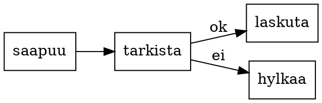

# Q3 Strategy

Yksi markdown-tiedosto, kaksi yritystä. Vaihda template ylhäältä: tässä
dokumentissa ei muutu sanaakaan.
{.lead}

## Mistä liikevaihto tuli

- Verkkokauppa kasvoi 18 %
- Jälleenmyynti pysyi ennallaan
- Lisenssit laskivat 4 %
{.c3}

> Kasvu tuli kanavasta johon emme ole vielä investoineet.

## Tilausten kulku

## Luvut

| Kanava | Q2 | Q3 |
| --- | ---: | ---: |
| Verkkokauppa | 4.1 | 4.8 |
| Jälleenmyynti | 2.2 | 2.2 |
| Lisenssit | 1.3 | 1.25 |
{#totals}

## Mitä seuraavaksi

1. Kanavakohtainen kate kuukausittain
2. Hinnoittelun tarkistus lisensseihin
3. Verkkokaupan varastointi omaksi
