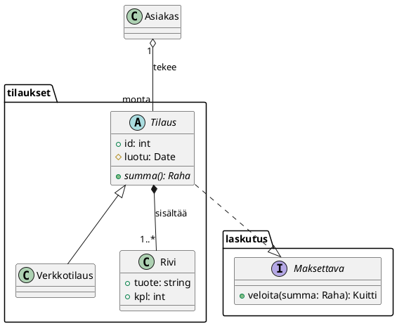
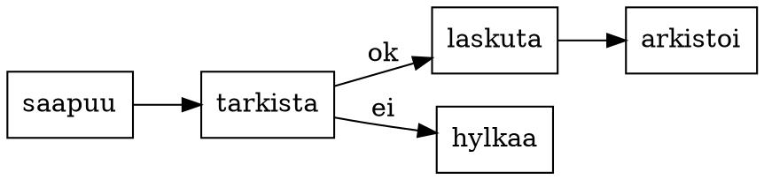
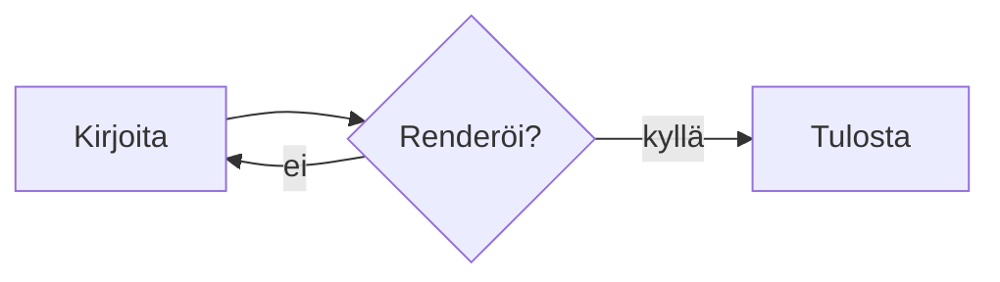

# Four notations, one document

A markdown document should not care which notation a diagram was written in.
These four fences are read by RangerFlow's own readers and land on the page
as geometry — the same vector paths and text runs the prose is made of.

## PlantUML



## Graphviz



## Mermaid



## D2

```d2
direction: right
varasto: Varasto {
  hylly
  keraily
}
lahetys: Lähetys
varasto.keraily -> lahetys: paketti
lahetys -> asiakas: toimitus
```

The same document, four readers, one page.
