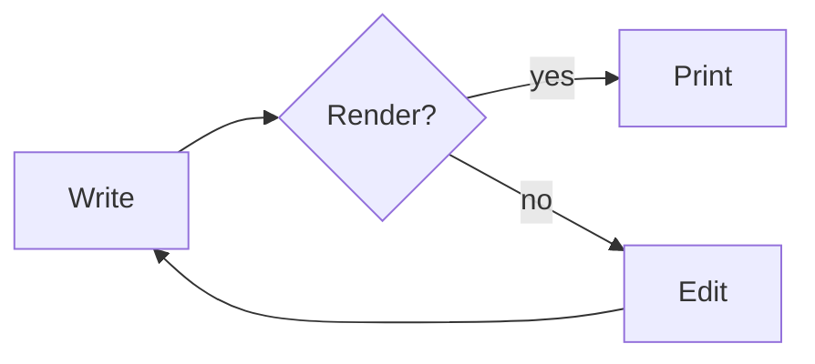
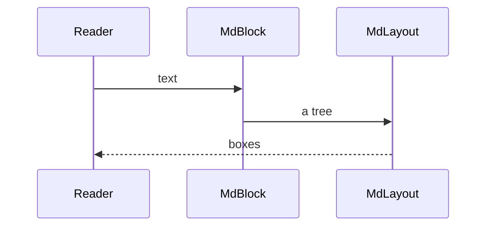
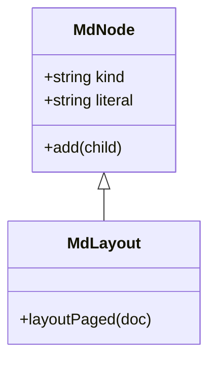

# A document with diagrams in it

Mermaid is how a diagram travels through a README. Here it is drawn on the
page rather than described.



The same reader handles other dialects. A sequence diagram:



And a class diagram, drawn in UML notation:



A fence that is not a diagram stays code:

```js
const x = 1;
```

That is the whole of it.
