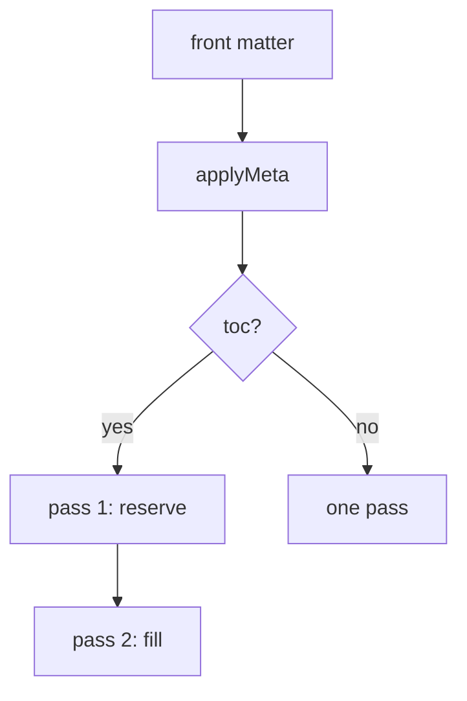

# A printed document

This one says what it is. The front matter above sets the sheet, the margins,
the running head, the folio and the table of contents — and `breakOnH1` makes
every top-level heading start its own sheet.

## What the two passes are for

The page numbers in the contents depend on where the blocks fall, and where
the blocks fall depends on how tall the contents are. So the first pass
leaves a gap of exactly the right height and learns the pages; the second
fills the gap in. Nothing moves between them, so the numbers are right rather
than nearly right.

## A diagram, at the printed width



# The second chapter

Because `breakOnH1` is on, this heading opened a new sheet. The running head
above it changed with it.

## Code keeps its colours in print

```go
func breakRuns(runs []Run, maxWidth float64) []Line {
    var lines []Line          // the greedy fill
    used := 0.0
    for _, r := range runs {
        used += measure(r.Text)
    }
    return lines
}
```

## And a table

| Pass | Reserves | Knows |
| --- | --- | ---: |
| one | the gap | nothing |
| two | nothing | the pages |
