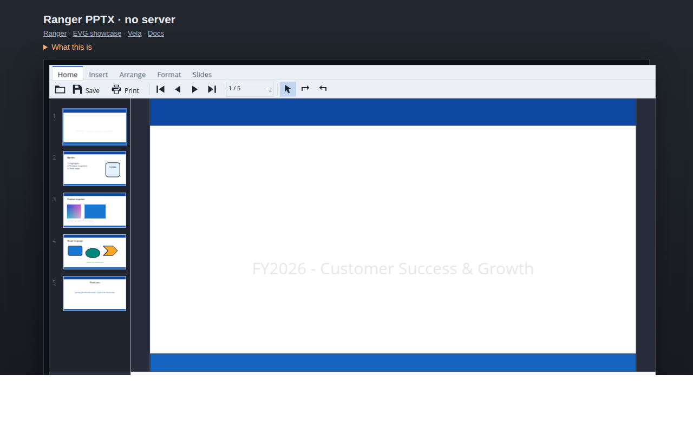

# gallery/odp — the OpenDocument presentation reader

A `.odp` opens in the deck viewer, beside the `.pptx`, drawn by the same
backend in the same window.

```bash
npm run odp:test          # 65 assertions, JavaScript and C++
npm run odf:package:test  # the container underneath it
npm run pptx:web:serve    # the viewer — press "Open the .odp sample"
npm run pptx:web:test     # …and 113 assertions in a real browser, 15 of them here
```


The same document as a `.pptx`, in the same window, for comparison — the
thumbnails, the master's bands, the page box and the text are the two readers
agreeing:



## Why a presentation, and why first

[`PLAN_FORMATS.md`](../../PLAN_FORMATS.md) is the plan for the formats after
DOCX/XLSX/PPTX, and its Phase 1 is ODF — **ODP first**, even though ODT is the
more wanted format. The reason is that ODP is the ODF format with the *least*
in common with its OOXML twin, so it is the sharpest available test of the one
architectural claim everything else rests on:

> Two formats converge at the resolved, paintable layer. They do not converge
> at the document model.

Here is the difference the claim is made against. Every row is a mechanism a
shared model would have had to pick one side of:

| | PPTX | ODP |
| --- | --- | --- |
| package | OPC: `[Content_Types].xml`, a `_rels` **relationship graph**, ids | OCF: a stored `mimetype` first in the archive, `META-INF/manifest.xml`, **no relationship graph** |
| reference | `r:embed="rId3"` → part rels → part path | `xlink:href="Pictures/x.png"` — the path itself |
| a slide | one `p:sld` **part** each | one `draw:page` element; all of them in one `content.xml` |
| masters | `p:sldMaster` → `p:sldLayout` → slide | `style:master-page` + `style:presentation-page-layout` |
| placeholder | `p:ph type="title"` | `presentation:class="title"` |
| shape | `p:sp` + `a:prstGeom prst="star5"` | `draw:custom-shape` + `draw:enhanced-geometry draw:type="star5"` |
| units | EMU: integers, 914400 to the inch | length **strings**: `"2.54cm"`, `"0.5in"`, `"12pt"` |
| transform | `a:xfrm` with `off`/`ext`/`rot` | `svg:x/y/width/height` + `draw:transform="rotate(…) translate(…)"` |
| text | `a:p` → `a:r` → `a:rPr` | `text:p` → `text:span` → a named `style:style` |
| colour | theme scheme + `tint`/`shade` chain | literal `#rrggbb` |
| notes | a separate `notesSlide` part | `presentation:notes` inside the `draw:page` |

Read in order, the table says its own answer: **the two formats differ most
exactly where a shared model would have to choose, and agree exactly where a
scene lives** — a positioned, filled, stroked, text-bearing box on a page.

So there are two models, `PptxModel` and `OdpModel`, and neither imports the
other. What they share is everything underneath:

```text
   .pptx bytes                          .odp bytes
        │                                    │
   OpcPackage                           OdfPackage        ← gallery/ooxml, gallery/odf
        │                                    │
        └──────────── XmlCore ───────────────┘            ← gallery/xml
        │                                    │
   PptxParser                           OdpParser
   PptxModel                            OdpModel
   PptxResolver                         OdpStyles         ← both through OfficeStyle
        │                                    │
   PptxToEvg                            OdpToEvg
        │                                    │
        └────────── EVGDisplayList ──────────┘            ← gallery/evg
                          │
        ┌─────────────────┼──────────────────┐
      WebGL           SoftCanvas          PDF / PNG / HTML
```

Four of those shared boxes were made shared *by this work*, and each took its
second caller in the same change rather than in a promised later one:

| | was | is | second caller |
| --- | --- | --- | --- |
| `XmlCore` | `pptx/src/PptxXml.rgr` | `gallery/xml/XmlCore.rgr` | `PptxParser`, retired onto it first |
| `OfficeTextMeasure` | `pptx/src/PptxTextMeasure.rgr` | `gallery/office/text/` | it never imported `PptxModel` — it was misfiled, not moved |
| `EVGDisplayList.addImage` | `PptxToEvg.pushImage` | `gallery/evg` | `PptxToEvg.pushImage` delegates |
| `PptxView.fitScaleFor` | `fitScale(slide)` | takes a size | fitting a page into a window is a question about a size |

## What `XmlCore` had to learn

Two policies, both of which OOXML could get away with not having:

```text
keepPrefixes = false   `p:sp` → `sp`        OOXML: local names are unique enough
keepPrefixes = true    `text:p` → `text:p`  ODF: `text:p` and `draw:p` are
                                            different elements, and `style:name`,
                                            `draw:name` and `text:style-name`
                                            are three different attributes
```

and which element's whitespace-only text is *content* rather than layout. That
was hard-coded as `t` — correct for DrawingML's `<a:t>`, wrong for
`<text:span>`, where the space between two spans is the space between two
words.

## What is drawn, and what is honestly not

| drawn | not drawn |
| --- | --- |
| solid fills, outlines | gradients, bitmap and hatch fills |
| the 187 preset geometries | `draw:enhanced-path` that is not a named preset |
| pictures, from the package | shadows, dash patterns |
| per-run family, size, weight, slant, colour | text rotation inside a rotated shape |
| word wrapping, paragraph and vertical alignment | hyphenation, East Asian line breaking |
| bullets and nested lists | list style numbering from `text:list-style` |
| the master page's background objects | animations, transitions |
| speaker notes | editing and saving — see below |

A shape whose geometry this cannot draw comes out as **its box** — visibly a
rectangle where a rectangle is wrong — rather than as nothing. A slide with a
missing shape looks finished and is not, and `PptxToEvg.drawnAsBox` makes the
same choice for the same reason.

**`.odp` is read-only here.** `PptxApp.canEdit()` answers false for one and the
edit toggle refuses; `PptxWeb.saveBytes` answers with an empty buffer and the
page's Save button goes grey. That is `DocumentFormatAdapter.capabilities` in
embryo: the question a shell should ask is *can this be edited*, never *is the
extension `.pptx`*. A Save button that produced a `.pptx` from a `.odp` would
be a data-loss bug wearing a helpful label.

## Two findings worth keeping

**LibreOffice carries the DrawingML preset name through a conversion.**

```xml
<a:prstGeom prst="roundRect"/>   →   draw:type="ooxml-roundRect"
```

So a converted deck can be drawn with the 187 geometries this repository
already evaluates, by stripping one prefix. A deck *authored* in Impress says
`round-rectangle` instead — an older vocabulary for the same shapes — and
`OdpParser.presetNameOf` maps the common ones. That is the answer to the
measurement PLAN_FORMATS.md asked for: **the geometry evaluator generalises;
the vocabulary does not.**

**`OfficeColor` does not carry ODP at all, and saying so is the point.** Its
value is the DrawingML theme palette and the `tint`/`shade` modifier chain, and
classic ODF has neither — every colour is a literal `#rrggbb`. `OdpToEvg` does
not import it. A shared module that does not fit is worse than no shared
module, because the next reader inherits the bad fit.

## What the tests actually check

`npm run odp:test` ends with a section that is the whole phase in assertions:
the same document, opened as a `.odp` and as the `.pptx` it was converted from,
by two readers that share nothing above the XML layer.

```text
PASS the same number of pages
PASS the same page width (got 720 want 720)
PASS the same first sentence (got 'Hello from PowerPoint' …)
PASS the same left edge (got 72 want 72)
PASS the same width (got 575.9716535433071 want 576)
```

A parity test between two formats is the only kind that can fail when a reader
is confidently wrong. A golden file pins what changed; it cannot tell you that
what you drew was never right.

Every fixture in `fixtures/` is LibreOffice's own conversion of a `.pptx`
fixture already in this repository, which is why that section is possible at
all — and why a difference is a difference about one document rather than about
two unrelated files.

### And one the assertions did not catch

The slide panel built its thumbnails with `itemAt presentation.slides i`. With
a `.odp` open that array is empty — and it did **not** crash, because the
`.odp` fixture has exactly as many pages as the `.pptx` it was converted from,
so every index was still in range and the panel quietly drew the *previous*
document's thumbnails beside the new one's slide.

113 passing assertions did not see it. A screenshot did. `thumbnailAt` is the
fix, and the range check in it is not decoration.

## What is next

`PLAN_FORMATS.md` Phase 1b: `OfficeScene`, a resolved paintable layer above
`EVGDisplayList`, so hit testing, thumbnails, print, selection overlays and the
accessibility tree are shared rather than three walks. It is deliberately not
in this change — see the plan for why the deck painter's 1600 lines make it a
refactor with its own gate rather than something to bundle with the reader that
gives it a second producer.

Also open, in rough order: an accessibility tree for `.odp` (`presentation:class`
already carries what `PptxA11y` reads from `p:ph`), `draw:enhanced-path`
geometry, gradients, ODT and ODS.
