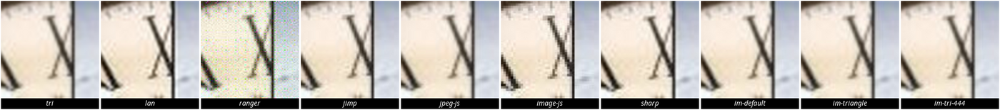
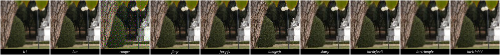
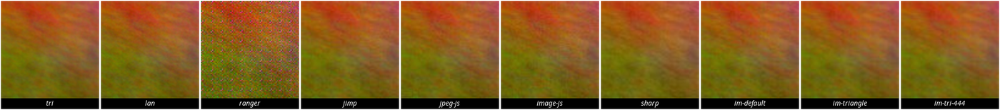

# jpeg_scaler — C++ / Rust / Node vs native tools and npm packages

Timed decode → scale → encode of `gallery/pdf_writer/src/tools/jpeg_scaler.rgr` compiled to C++, Rust, Go, and Node.js, against ImageMagick, GraphicsMagick, libvips, ffmpeg, and Node packages (`jimp`, `jpeg-js`, `image-js`, `sharp`).

Re-run:

```bash
./gallery/pdf_writer/bench/jpeg_scaler_bench.sh
```

The npm wrappers live in `gallery/pdf_writer/bench/js_scalers/` (isolated `package.json`, not a Ranger runtime dependency).

Ranger C++ / Rust / Go / Node wrote **byte-identical** JPEGs on the Example.jpg → 600px case (`180280` bytes, `md5 2d08fcfb09cdf3627ab41a8e44905762`). Native tools and npm packages write different (usually smaller) files; they are a wall-clock comparison, not a quality match. Quality (PSNR / crops) is in [Scaling and encode quality](#scaling-and-encode-quality): Ranger is bilinear like Jimp, not Lanczos like `sharp`, and its larger JPEGs score **worse**, not better.

## Machine (2026-08-14)

| | |
| --- | --- |
| CPU | 4× Intel Xeon (cloud VM, 1 thread/core) |
| OS | Linux 6.12 x86_64 |
| Ranger | v3.3.1 (`bin/output.js`) |
| C++ | `g++ 13.3.0 -std=c++17 -O3 -pthread` |
| Rust | `rustc 1.83.0 --edition 2021 -O` |
| Go | `go 1.22.2` (default `go build`) |
| Node | v22.14.0 |
| ImageMagick | 6.9.12-98 Q16 (`convert in.jpg -resize WIDTHx -quality 85 out.jpg`) |
| GraphicsMagick | 1.3.42 Q16 (same geometry / quality) |
| libvips | 8.15.1 (`vips thumbnail in.jpg out.jpg WIDTH`) |
| ffmpeg | 6.1.1 (`-vf scale=WIDTH:-1 -q:v 5`) |
| jimp | 0.22.12 (pure JS; bilinear resize; uses jpeg-js) |
| jpeg-js | 0.4.4 (pure JS decode/encode + a bilinear resize in the wrapper) |
| image-js | 0.35.6 (pure JS) |
| sharp | 0.33.5 (native libvips addon, not pure JS) |
| timer | hyperfine 1.18.0 |

`-O3` matters: the same C++ source on Example.jpg → 600px is **47.9 ms** at `-O3` and **353.5 ms** at `-O0` (7.4×). Docs that timed `g++ -std=c++17` without `-O3` are not comparable.

## Results (mean ± σ)

Times are milliseconds. Relative speed is versus the fastest tool in that row.

### Example.jpg 300×300 progressive → width 600 (20 runs)

The documented conformance case (byte-identical Ranger output).

| Command | Mean [ms] | Min | Max | Relative |
|:---|---:|---:|---:|---:|
| ranger-cpp | 47.9 ± 0.4 | 47.5 | 49.0 | 3.95× |
| ranger-rust | 43.1 ± 0.2 | 42.6 | 43.6 | 3.55× |
| ranger-go | 74.0 ± 0.6 | 73.1 | 75.6 | 6.09× |
| ranger-node | 210.6 ± 3.4 | 205.1 | 216.7 | 17.33× |
| **imagemagick** | **12.2 ± 0.3** | 11.8 | 12.7 | 1.00× |
| graphicsmagick | 13.1 ± 0.2 | 12.7 | 13.4 | 1.08× |
| libvips | 31.0 ± 0.7 | 29.4 | 32.4 | 2.55× |
| ffmpeg | 39.8 ± 0.4 | 39.1 | 40.9 | 3.27× |

### Example.jpg 300×300 → width 2400 (8 runs)

Encode-heavy upscale (2400×2400 output). Ranger cannot skip decode work; native encoders (libjpeg-turbo) dominate.

| Command | Mean [ms] | Min | Max | Relative |
|:---|---:|---:|---:|---:|
| ranger-cpp | 610.7 ± 1.4 | 608.9 | 613.2 | 9.17× |
| ranger-rust | 534.6 ± 7.8 | 529.0 | 552.5 | 8.03× |
| ranger-go | 857.0 ± 7.1 | 848.4 | 869.1 | 12.87× |
| ranger-node | 2253.9 ± 47.5 | 2181.6 | 2312.1 | 33.85× |
| imagemagick | 81.8 ± 1.3 | 79.9 | 83.7 | 1.23× |
| **graphicsmagick** | **66.6 ± 0.6** | 65.8 | 67.6 | 1.00× |
| libvips | 75.2 ± 1.2 | 73.3 | 76.7 | 1.13× |
| ffmpeg | 80.3 ± 1.3 | 79.1 | 82.5 | 1.21× |

### GPS_test.jpg 640×480 baseline → width 400 (15 runs)

Small camera JPEG, downscale.

| Command | Mean [ms] | Min | Max | Relative |
|:---|---:|---:|---:|---:|
| ranger-cpp | 33.6 ± 0.2 | 33.3 | 34.1 | 2.93× |
| ranger-rust | 31.3 ± 0.7 | 30.6 | 33.3 | 2.73× |
| ranger-go | 49.6 ± 0.8 | 48.3 | 51.5 | 4.32× |
| ranger-node | 157.9 ± 2.0 | 155.0 | 161.2 | 13.77× |
| **imagemagick** | **11.5 ± 0.6** | 11.0 | 13.2 | 1.00× |
| graphicsmagick | 12.7 ± 0.4 | 12.2 | 13.4 | 1.11× |
| libvips | 30.6 ± 0.6 | 29.9 | 32.2 | 2.67× |
| ffmpeg | 39.9 ± 0.6 | 38.7 | 40.9 | 3.48× |

### plasma 1920×1080 → width 800 (12 runs)

Synthetic HD baseline JPEG (~659 KB), downscale to 800×450.

| Command | Mean [ms] | Min | Max | Relative |
|:---|---:|---:|---:|---:|
| ranger-cpp | 153.8 ± 3.0 | 152.4 | 163.0 | 4.58× |
| ranger-rust | 154.1 ± 1.2 | 152.9 | 156.4 | 4.59× |
| ranger-go | 233.1 ± 0.6 | 232.2 | 234.0 | 6.94× |
| ranger-node | 717.0 ± 10.6 | 702.6 | 738.4 | 21.34× |
| imagemagick | 38.5 ± 2.8 | 37.1 | 47.3 | 1.15× |
| **graphicsmagick** | **33.6 ± 0.3** | 33.2 | 34.1 | 1.00× |
| libvips | 43.1 ± 0.7 | 42.1 | 44.5 | 1.28× |
| ffmpeg | 59.9 ± 0.8 | 59.0 | 62.1 | 1.78× |

### plasma 4000×3000 → width 800 (8 runs)

Synthetic 4K baseline JPEG (~3.2 MB), downscale to 800×600. libvips pulls ahead here because `vips thumbnail` can shrink-on-load (decode at reduced DCT resolution). Ranger always full-decodes, then resamples.

| Command | Mean [ms] | Min | Max | Relative |
|:---|---:|---:|---:|---:|
| ranger-cpp | 643.2 ± 4.3 | 637.8 | 649.5 | 8.16× |
| ranger-rust | 686.7 ± 5.3 | 678.7 | 692.1 | 8.71× |
| ranger-go | 975.3 ± 2.3 | 971.4 | 978.7 | 12.37× |
| ranger-node | 3130.0 ± 46.2 | 3039.7 | 3177.3 | 39.71× |
| imagemagick | 167.4 ± 2.4 | 165.5 | 172.1 | 2.12× |
| graphicsmagick | 135.7 ± 1.1 | 134.4 | 137.7 | 1.72× |
| **libvips** | **78.8 ± 1.5** | 76.5 | 81.2 | 1.00× |
| ffmpeg | 135.6 ± 1.8 | 132.3 | 138.8 | 1.72× |

## vs npm packages (same machine, same images)

CLI wrappers: `node gallery/pdf_writer/bench/js_scalers/scale-*.cjs <width> in.jpg out.jpg`, quality 85, width-proportional height.

`jimp`, `jpeg-js`, and `image-js` are **pure JavaScript**. `sharp` is the usual Node choice and is a **native addon over libvips** — closer to the `vips` CLI than to Ranger's Node target.

### Example.jpg 300×300 → width 600 (20 runs)

| Command | Mean [ms] | Min | Max |
|:---|---:|---:|---:|
| ranger-rust | 43.6 ± 0.5 | 42.9 | 44.8 |
| ranger-cpp | 48.5 ± 0.7 | 47.7 | 50.4 |
| npm-sharp | 52.6 ± 1.0 | 51.1 | 54.7 |
| npm-jpeg-js | 126.3 ± 4.3 | 119.5 | 136.8 |
| npm-image-js | 190.0 ± 3.9 | 186.0 | 204.5 |
| ranger-node | 220.6 ± 7.9 | 213.8 | 247.8 |
| npm-jimp | 230.9 ± 4.4 | 222.7 | 242.5 |
| imagemagick | 14.4 ± 0.4 | 13.1 | 15.0 |

Ranger Node and Jimp are the same job in the same language and land within ~5% of each other. Hand-written `jpeg-js` is about **1.7×** Ranger Node. Ranger C++/Rust beat every pure-JS package and match `sharp` on this small upscale.

### GPS_test.jpg 640×480 → width 400 (15 runs)

| Command | Mean [ms] | Min | Max |
|:---|---:|---:|---:|
| ranger-rust | 31.0 ± 0.2 | 30.6 | 31.5 |
| ranger-cpp | 33.5 ± 0.2 | 33.0 | 33.9 |
| npm-sharp | 43.5 ± 0.5 | 42.9 | 44.6 |
| npm-jpeg-js | 106.5 ± 1.5 | 104.6 | 110.7 |
| ranger-node | 156.7 ± 1.9 | 154.0 | 160.9 |
| npm-image-js | 170.3 ± 6.1 | 166.5 | 191.3 |
| npm-jimp | 203.9 ± 2.5 | 201.1 | 211.4 |
| imagemagick | 11.4 ± 0.8 | 10.9 | 14.1 |

Ranger Node is **faster than Jimp and image-js** on this small camera JPEG, slower than `jpeg-js`. C++/Rust are faster than `sharp` here (startup + tiny image; sharp still has to load the native addon).

### plasma 1920×1080 → width 800 (12 runs)

| Command | Mean [ms] | Min | Max |
|:---|---:|---:|---:|
| npm-sharp | 55.9 ± 0.6 | 54.7 | 57.3 |
| ranger-cpp | 153.3 ± 2.3 | 151.8 | 160.3 |
| ranger-rust | 154.7 ± 1.0 | 153.4 | 156.5 |
| npm-jpeg-js | 271.2 ± 5.2 | 264.3 | 281.4 |
| npm-image-js | 329.2 ± 4.1 | 323.4 | 336.2 |
| npm-jimp | 398.7 ± 3.4 | 394.3 | 405.3 |
| ranger-node | 709.1 ± 8.9 | 687.9 | 721.7 |
| imagemagick | 37.5 ± 0.5 | 36.7 | 38.2 |

C++/Rust are about **1.8×** `jpeg-js` and **4.6×** Ranger Node. Ranger Node is the slowest JS option once the bitmap is HD-sized.

### plasma 4000×3000 → width 800 (8 runs)

| Command | Mean [ms] | Min | Max |
|:---|---:|---:|---:|
| npm-sharp | 83.6 ± 0.8 | 82.3 | 85.0 |
| ranger-cpp | 651.2 ± 24.1 | 638.3 | 710.3 |
| ranger-rust | 691.7 ± 3.9 | 684.9 | 696.5 |
| npm-jpeg-js | 1058.9 ± 53.7 | 1006.8 | 1177.0 |
| npm-image-js | 1122.3 ± 47.5 | 1066.2 | 1207.0 |
| npm-jimp | 1166.9 ± 32.5 | 1130.2 | 1220.9 |
| ranger-node | 3098.1 ± 45.0 | 3037.7 | 3175.6 |
| imagemagick | 166.2 ± 3.7 | 164.0 | 175.0 |

Decode-heavy: C++ still beats every pure-JS codec (~1.6× `jpeg-js`, ~4.8× Ranger Node). `sharp` wins by a lot because libvips can shrink-on-load.

### Example.jpg 300×300 → width 2400 (8 runs)

Encode-heavy upscale (2400×2400 output). Decode is cheap; bilinear + JPEG encode dominate.

| Command | Mean [ms] | Min | Max |
|:---|---:|---:|---:|
| npm-sharp | 177.8 ± 1.3 | 176.0 | 180.5 |
| npm-image-js | 398.1 ± 2.7 | 394.3 | 403.3 |
| npm-jpeg-js | 404.3 ± 4.1 | 398.3 | 411.2 |
| ranger-rust | 540.5 ± 2.1 | 537.5 | 544.1 |
| ranger-cpp | 619.6 ± 3.9 | 615.6 | 628.4 |
| npm-jimp | 955.8 ± 54.3 | 924.9 | 1074.0 |
| ranger-node | 2228.5 ± 32.9 | 2192.7 | 2290.2 |
| imagemagick | 81.9 ± 0.4 | 81.3 | 82.8 |

This is the one workload where **hand-written `jpeg-js` / `image-js` beat Ranger C++ and Rust**. Ranger's generated encoder is a straightforward baseline JPEG writer; `jpeg-js` has had years of JS-specific encode work. Ranger Node is ~2.3× Jimp and ~5.5× `jpeg-js` here.

## Scaling and encode quality

The timing tables mix two different jobs. Ranger's scaler is **bilinear** (`ImageBuffer.scaleToSize`). Jimp / jpeg-js / image-js / ImageMagick `-filter triangle` are the same class of filter. `sharp` and ImageMagick's default `-resize` are **Lanczos** (sharper, more work). Ranger's encoder writes **4:4:4** at IJG quality 85 (no chroma subsample) using an integer FDCT. `sharp` writes **4:2:0**. Jimp / jpeg-js / image-js also write 4:4:4 on these files, so sampling does not explain Ranger vs those three.

Every JPEG below is decoded with the same ImageMagick `convert` and scored against lossless PNG references of the same size (`triangle` = bilinear, `Lanczos` = IM default). Re-run: `python3 gallery/pdf_writer/bench/jpeg_scaler_quality.py`.

Higher PSNR / SSIM = closer to that reference, not “prettier”. A Lanczos output should score worse against the bilinear PNG than a bilinear output does.

### Example.jpg 300×300 → 600 (upscale)

| tool | bytes | sampling | PSNR vs bilinear | PSNR vs Lanczos | SSIM vs bilinear | RMSE |
| --- | ---: | --- | ---: | ---: | ---: | ---: |
| ranger | 180280 | 4:4:4 | 20.74 | 20.27 | 0.7683 | 23.43 |
| jimp | 73879 | 4:4:4 | 24.42 | 23.40 | 0.9282 | 15.34 |
| jpeg-js | 69948 | 4:4:4 | 29.21 | 26.66 | 0.9776 | 8.83 |
| image-js | 82224 | 4:4:4 | 23.91 | 24.55 | 0.9144 | 16.25 |
| sharp | 64964 | 4:2:0 | 24.08 | 23.67 | 0.9339 | 15.95 |
| im-default | 64948 | 4:4:4 | 39.78 | 32.14 | 0.9945 | 2.62 |
| im-triangle | 63552 | 4:4:4 | **43.42** | 30.01 | **0.9956** | **1.72** |

Pairwise PSNR of Ranger vs jpeg-js: **20.1 dB**. The extra 110 KB in the Ranger file is not extra fidelity.



Ranger's crop is grainy around the clock hands. The bilinear group (jimp, jpeg-js, image-js, IM triangle) is soft but clean. Lanczos / sharp / IM default are the sharp set.

### GPS_test.jpg 640×480 → 400 (photo downscale)

| tool | bytes | sampling | PSNR vs bilinear | PSNR vs Lanczos | SSIM vs bilinear | RMSE |
| --- | ---: | --- | ---: | ---: | ---: | ---: |
| ranger | 127871 | 4:4:4 | 18.42 | 18.54 | 0.6799 | 30.60 |
| jimp | 56517 | 4:4:4 | 27.48 | 27.18 | 0.8659 | 10.78 |
| jpeg-js | 56231 | 4:4:4 | 28.72 | 28.56 | 0.8951 | 9.34 |
| image-js | 63525 | 4:4:4 | 24.01 | 24.08 | 0.7651 | 16.06 |
| sharp | 43893 | 4:2:0 | 30.85 | **31.75** | 0.9445 | 7.31 |
| im-default | 62099 | 4:2:2 | 31.20 | **32.34** | 0.9438 | 7.02 |
| im-triangle | 55736 | 4:2:2 | 33.74 | 30.55 | 0.9643 | 5.25 |
| im-tri-444 | 61394 | 4:4:4 | **34.45** | 30.95 | **0.9643** | **4.83** |



On a real photo Ranger *looks* crunchier (tree bark, leaves) than Jimp. That is not a better scaler: PSNR vs both references is ~18 dB, and the extra “detail” is mostly encoder grain plus 4:4:4 chroma. `sharp` / IM default are the actually sharp set (Lanczos) without the speckle.

### plasma 1920×1080 → 800 (smooth gradients)

| tool | bytes | sampling | PSNR vs bilinear | PSNR vs Lanczos | SSIM vs bilinear | RMSE |
| --- | ---: | --- | ---: | ---: | ---: | ---: |
| ranger | 347441 | 4:4:4 | 19.31 | 19.38 | 0.3923 | 27.60 |
| jimp | 93184 | 4:4:4 | 37.28 | 35.92 | 0.9523 | 3.49 |
| jpeg-js | 93149 | 4:4:4 | 37.61 | 36.17 | 0.9586 | 3.36 |
| image-js | 97034 | 4:4:4 | 36.94 | 35.73 | 0.9437 | 3.63 |
| sharp | 57152 | 4:2:0 | 35.98 | 34.71 | 0.9708 | 4.05 |
| im-triangle | 81444 | 4:4:4 | **38.46** | 36.63 | **0.9729** | **3.05** |



This is the clearest encoder tell. A smooth plasma should JPEG-compress well at q85. Everyone else is ~36–38 dB vs the bilinear PNG (SSIM ≥ 0.94) in an 80–97 KB file. Ranger writes **347 KB** of 4:4:4 and scores **19 dB / SSIM 0.39** — dither-like speckle. Jimp, jpeg-js, and image-js agree with each other to ~38 dB; Ranger disagrees with all of them at ~19 dB.

### What this does to the speed numbers

- Ranger is **not** slower because it does Lanczos or a higher-quality JPEG. The scaler is bilinear; the encode is a large, noisy 4:4:4 stream from an integer FDCT.
- `jpeg-js` is both **faster than Ranger Node** and **much closer** to a clean bilinear+JPEG result (and still faster than Ranger C++ on the 2400px upscale, where encode dominates).
- `sharp` / ImageMagick are faster *and* sharper because they are a different algorithm (Lanczos) plus libjpeg-turbo. That is not a like-for-like scaler comparison.
- File size is not a quality proxy here: Ranger's 2–4× larger JPEGs are the worst PSNR in every case.

The integer FDCT / baseline Huffman writer is the likely quality bottleneck (large files that do not reconstruct well). Fixing encode would change both the quality tables and the encode-heavy timings.

## What this says about Ranger

Among the generated targets, on this machine:

| | Typical order |
| --- | --- |
| Fastest Ranger | **Rust**, then **C++** (within ~10% except 4K, where C++ is slightly ahead) |
| Next | **Go**, about 1.5× the C++/Rust time |
| Slowest Ranger | **Node.js**, about 4–5× C++/Rust (7–8× on the 4K downscale) |

Against a native JPEG stack (libjpeg-turbo + SIMD):

- Small jobs (Example → 600, GPS → 400): C++/Rust are **~3–4×** ImageMagick. Rust even beats ffmpeg on the 600px upscale (43 ms vs 40 ms is close; ffmpeg wins by a little).
- HD downscale (1080p → 800): C++/Rust are **~4.5×** GraphicsMagick / **~4×** ImageMagick.
- 4K downscale: C++ is **~4×** ImageMagick and **~8×** libvips (shrink-on-load).
- Large upscale (300 → 2400): encode-bound; C++/Rust are **~8–9×** GraphicsMagick.

Against **npm packages**:

- Ranger Node sits next to **Jimp** (the usual pure-JS image library): slightly faster on small photos, slower on HD/4K.
- **`jpeg-js`** (the codec Jimp uses) is the fastest pure-JS stack, about **1.5–3×** Ranger Node depending on the job.
- Ranger **C++ / Rust beat every pure-JS package** on decode-heavy work (HD and 4K). They are in the same tens of milliseconds as **`sharp`** on tiny images, then `sharp` pulls away as libvips uses SIMD and shrink-on-load.
- The generated encoder is the weak spot: on a 300→2400 upscale, `jpeg-js` (~404 ms) is faster than Ranger Rust (~541 ms) and C++ (~620 ms). It is also **cleaner**: Ranger's q85 4:4:4 files are 2–4× larger with ~19–21 dB PSNR against a bilinear reference, vs ~29–38 dB for jpeg-js. See [Scaling and encode quality](#scaling-and-encode-quality).

That is a portable software codec generated from one `.rgr` file, not a libjpeg binding. ImageMagick / vips / ffmpeg / `sharp` call SIMD IDCT, Huffman, and (when shrinking) reduced-resolution decode. Ranger does none of those. The interesting number is that **optimized C++ and Rust land in the same tens-to-hundreds of milliseconds as ffmpeg on small images**, stay within a small integer factor of ImageMagick on HD, and **outrun the pure-JS npm codecs** except when the job is almost entirely JPEG encode of a huge bitmap.

Node.js is the odd one out among Ranger targets: same algorithm, but ~4–5× the native Ranger binaries, with much higher user+system time (GC / JS typed-array traffic in the pixel loops). That generated JS is in Jimp's league, not `jpeg-js`'s.

## Output size (not timed, but visible)

On the HD plasma → 800 run Ranger wrote **347 KB** (PSNR 19 dB vs bilinear PNG). jpeg-js wrote **93 KB** (PSNR 38 dB). ImageMagick `-quality 85` wrote **81–88 KB**. The extra Ranger bytes are encoder noise, not extra detail. Timing compares “CLI job finished”, not bits per pixel.

## LLVM

The `-l=llvm` binary is still **not** in this comparison. Scan decode hangs and can grow past 1 GB; see [JPEG_SCALER_LLVM.md](./JPEG_SCALER_LLVM.md). Use `-l=cpp` / `-l=rust` / `-l=go` / `-l=es6` for a working native or Node CLI.
