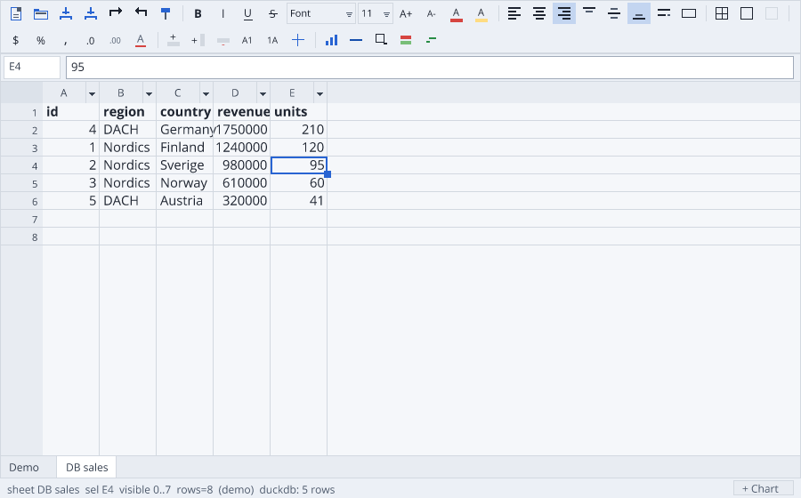

# RangerDB — a database API in Ranger, and a small engine behind it

A spreadsheet that can show and edit a database has to name a database
somewhere. This project puts an engine-neutral layer in that place instead, and
then puts three engines behind it — one of them written in Ranger.

```text
                    Ranger application
                  (DataGrid, Vela, a CLI)
                            │
                        DBSession           capability fallbacks, write-back
                            │
                        DBBackend           one small contract
              ┌─────────────┼──────────────┐
              │             │              │
          RangerDB       SQLite         DuckDB
          (Ranger)     (node:sqlite)   (worker bridge)
```

Run it:

```bash
npm run rangerdb:test        # RangerDB against the shared contract + engine internals
npm run rangerdb:host:test   # the same contract over SQLite and DuckDB
npm run datagrid:db:test     # the spreadsheet editing a database, on all three
npm run datagrid:db:demo     # a headless session editing a table through the grid
npm run rangerdb:bench       # the same queries, timed on each engine
```



DuckDB is optional (`npm i @duckdb/node-api`); SQLite is Node's own built-in.
An engine that is not installed is reported as skipped, never as failed.

## What it scores

The suite is written once, against `DBSession`, and every engine runs it:

| Engine | Contract | Notes |
| --- | --- | --- |
| `rangerdb` | **53/53** + 19 engine internals | pure Ranger, no host |
| `sqlite` | **53/53** | `node:sqlite`, built in |
| `duckdb` | **53/53** | `@duckdb/node-api`, optional |
| grid over all three | **81/81** | `datagrid:db:test` |

RangerDB's own 72 tests pass on **JavaScript, Python and native C++** from the
same source, and the library compiles for **12/12** Ranger targets.

## The decisions worth arguing about

### The interface is a QuerySpec, not SQL text

The obvious API is `query(sql:string)`. Then RangerDB has to own a SQL parser
before it can answer anything at all, and the DataGrid builds strings to say
"sort by column 3".

So the primary interface is structured — `QuerySpec { table, columns, filter,
sorts, groupBy, aggregates, offset, limit }` — and SQL is one rendering of it
(`SqlText.rgr`) for the engines that speak SQL. Raw SQL stays available as an
escape hatch, because a common API should not try to model all of SQL:

```ranger
def spec (QuerySpec.forTable("sales"))
spec.whereIs("country" 0 (DBValue.fromString("Finland")))
spec.orderBy("revenue" false)
spec.page(0 60)
def rows (session.query(spec))
```

Values never enter the text. Every one becomes a `?` and travels beside the
statement, because the alternative is quoting rules per engine and an injection
bug per quoting rule.

### Results are chunks of columns, not rows

```text
bad                            better
DB → row → row → row           DB → DataChunk(1024 rows) → DataChunk → …
```

A row-at-a-time API makes every layer allocate one object per row, and makes a
columnar engine take its columns apart so the next layer can put them back
together. A `DataChunk` is what DuckDB's execution format already is, what a
virtualised grid page wants, and what a chart series is.

### Backends say what they can do

`DBCapabilities` is explicit: `filterPushdown`, `sortPushdown`,
`aggregatePushdown`, `pagination`, `projection`, `writes`, `transactions`,
`rowCounts`, `streaming`, `sqlText`. `DBSession` pushes down exactly what a
backend claims and runs the rest itself over the chunks that came back
(`DBOps.rgr`), and reports what it had to do in `lastFallback`.

That is what makes "any engine" mean something: a backend that can only scan is
still usable, and is never asked to pretend. It is also what lets RangerDB grow
— it implements more of the same contract over time, and the scoreboard shows
where it is.

### Everything is synchronous, and DuckDB is asynchronous

A spreadsheet repaints in a loop and needs the rows it is about to paint.
Ranger has no generics to build a `Task<T>` on, and `async` is honoured by
exactly one of its class writers. So every call in the API is synchronous, and
an engine that is asynchronous in its host language is made synchronous **in
the host**: `duckdb_worker.mjs` runs DuckDB's promises on a worker thread, and
the main thread blocks on `Atomics.wait` and collects the reply with
`receiveMessageOnPort`, which works while the event loop is parked.

That is the same rule `@process` states for I/O — Ranger describes the work,
the host performs it — applied to a database.

## RangerDB, the engine

Not a DuckDB clone. DuckDB is a parser, a binder, a logical and a physical
planner, an optimizer, vectorized execution, storage, transactions, spilling
and indexes. What is worth having in Ranger is the *shape* of it at the scale a
spreadsheet needs:

```text
Table "sales"
 ├── RowGroup 0     id[]  region[]  country[]  revenue[]  units[]
 ├── RowGroup 1     id[]  region[]  country[]  revenue[]  units[]
 └── …              (1024 rows each)
```

- **Columnar, chunked storage.** `SELECT SUM(revenue) WHERE region = 'Nordics'`
  reads the region vector and the revenue vector and never touches the other
  three — the scan is told which columns the spec needs (`neededColumns`), and
  a test asserts that a two-column query scans two columns.
- **Zero-copy scan.** A row group with no deleted rows hands out the *stored*
  vectors; only Filter materialises. A group that has taken a delete compacts
  itself, so the cost of a tombstone is paid by that group and not by the table.
- **Streaming aggregation.** `AggState` consumes chunk after chunk, so SUM over
  ten million rows costs ten million adds and one output row rather than ten
  million row objects.
- **Early stop.** A `LIMIT` with no `ORDER BY` stops the scan when the page is
  full: asking for the first 60 rows of a 2500-row table reads one row group.
- **Tombstone deletes.** A delete moves no other row, because a loaded sheet
  holds row identities.
- **A text snapshot** (`DbWire.rgr`) so a table survives a restart: whole-table,
  write-and-rename, honest about being a snapshot rather than a page cache.

### What it does not have, in the order it will matter

| Missing | Consequence today | Milestone |
| --- | --- | --- |
| Indexes | every lookup is a scan (1.1 ms over 20k rows) | 3 |
| Joins | one table per query | 4 |
| SQL front end | `QuerySpec` is the interface; `capabilities.sqlText` is false | 3 |
| Transactions | `capabilities.transactions` is false, so `DBSession` does not promise them | 5 |
| Page cache / WAL | persistence is a whole-table snapshot | 5 |
| A real binary format | the snapshot is escaped text | 2 |
| Bulk insert path | one mutation per row (see the benchmark) | 2 |

Milestones 1 (in-memory typed columnar table, scan/filter/project/aggregate,
grid data source) and most of 2 (reopen, append) are what is here.

## RangerDB vs DuckDB vs SQLite

Same API, same queries, 20 000 rows, all times in ms (Node 22, this machine):

| engine | load | scan | filter+SUM | GROUP BY | sorted page | head page | point | update |
| --- | --- | --- | --- | --- | --- | --- | --- | --- |
| `rangerdb` | **72** | 24 | 13 | 22 | 48 | **0.5** | 1.1 | 3.6 |
| `sqlite` | 521 | 94 | **2.1** | **6.5** | 22 | **0.5** | **0.1** | **0.1** |
| `duckdb` | 32824 | 151 | 6.8 | 7.7 | **7.0** | 4.6 | 3.2 | 2.3 |

Read it carefully — most of it is about the API, not the engines:

- **`load` is the API's row-at-a-time write path**, not any engine's bulk
  loader. DuckDB's 32.8 s is 1.64 ms per row; measured directly in Node with no
  Ranger and no bridge in the way, DuckDB's own single-row `INSERT` is 1.28 ms,
  so the worker bridge is ~0.35 ms of it and the rest is an OLAP engine being
  asked to do OLTP. An appender / batch path is the fix, and it belongs in the
  API rather than in a special case for one engine.
- **RangerDB wins the load** because there is nothing between the values and
  the vectors — no SQL text, no parameter binding, no process boundary.
- **RangerDB loses the aggregates** by 3–6× to engines with a decade of
  vectorized execution in them, which is the expected order of magnitude for
  "the same algorithm, no low-level tricks".
- **`point` shows the missing index**: SQLite finds one row by primary key in
  0.1 ms; RangerDB scans for it.
- **`sorted page` is where DuckDB's execution shows** — top-60-of-20000 by a
  sort key in 7 ms.
- Every engine answers all of these **identically**, which is what the contract
  suite is for.

## Files

| File | What is in it |
| --- | --- |
| `src/DBValue.rgr` | the normalised value and column: one tagged scalar every engine maps onto |
| `src/DataChunk.rgr` | `ValueVector` and `DataChunk` — the columnar unit everything speaks |
| `src/DBQuery.rgr` | `QuerySpec`, predicates, sorts, aggregates, `DBMutation` |
| `src/DBOps.rgr` | Filter / Project / Sort / Limit / Aggregate over chunks |
| `src/DBBackend.rgr` | `DBCapabilities`, the backend contract, and `DBSession` |
| `src/RangerDB.rgr` | row groups, the scan, the pipeline, the engine's backend face |
| `src/SqlText.rgr` | `QuerySpec` → SQL + parameters |
| `src/HostSql.rgr` | the four-operator host seam and the SQL backend over it |
| `src/DbWire.rgr` | the text rectangle used for host results and for snapshots |
| `host/` | the JavaScript host: driver registry, SQLite, DuckDB + worker bridge |
| `tests/DbContract.rgr` | the suite every engine runs |
| `bench/db_bench.rgr` | the table above |

The DataGrid side lives in
[`../datagrid/src/db/GridDbSource.rgr`](../datagrid/src/db/GridDbSource.rgr):
a sheet whose rows are a query and whose edits are `UPDATE`s.

## Porting the host seam

`HostSql.rgr` declares four operators (`rdb_host_available`, `rdb_host_open`,
`rdb_host_exec`, `rdb_host_close`) with `es6` templates. A target with its own
database libraries implements those four and inherits everything else —
statement building, type mapping, capability fallbacks, the contract suite. A
target with no host database has RangerDB, which is why the portable half of
the library does not import this file.
