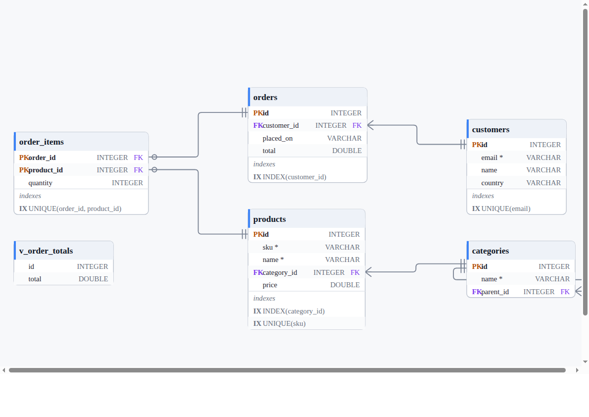

# RangerDBViewer — a database workbench

Open a database, read its real schema, draw it, browse it, export it.

LibreOffice Base is the shape — a rail of object kinds down the left, a list
beside it, the work in the middle — and the shape to disagree with in one
respect. Base is a front end for *authoring* a database. This is a front end
for **understanding** one: the first databases it opens will be someone else's.



```bash
npm run rangerdbviewer:test        # 89 assertions, on every engine this host has
npm run rangerdbviewer:demo        # open an in-memory SQLite database and draw it
npm run rangerdbviewer:demo:all    # …the same on RangerDB, SQLite and DuckDB
npm run rangerdb:introspect:test   # 73 assertions: the introspection contract
```

## What is here now

This is Phases 0–3 of [`PLAN_RANGERDBVIEWER.md`](../../PLAN_RANGERDBVIEWER.md):
open a database, describe it, list it, page it, draw it, export it.

| | |
| --- | --- |
| **Engines** | SQLite (`node:sqlite`, built in), DuckDB (optional), RangerDB (pure Ranger) |
| **Introspection** | tables, views, columns, types, nullability, defaults, primary keys with their order, foreign keys, indexes, unique and check constraints |
| **Objects** | a flat, collapsible tree — schemas → tables / views / indexes |
| **Data** | rows through `GridDbSource`, the paging the spreadsheet already uses |
| **Diagram** | RangerFlow's ERD editor, crow's foot, field-level ports |
| **Export** | SVG, PDF, HTML, scene JSON |
| **Subject areas** | a table and its neighbours, or tables without views |

Migrations, metrics and the network engines are Phases 4–7 and are not built.

## The parts it is made of

Almost none of this is new. Four libraries that already existed had never been
introduced to each other, and the viewer is mostly that introduction:

```text
              RangerDBViewer
        app/ — sections, object tree, selection
                      │
   ┌──────────────────┼───────────────────┐
   │                  │                   │
RangerDB          DataGrid            RangerFlow
engines + the     rows in a grid      the ERD, on WebGL /
introspectors                         SVG / PDF / SDL
   │                                      │
   └────────── DatabaseSchema ────────────┘
```

The one genuinely missing piece was **introspection**: `DBBackend` could list
table names and result-column types, and could not report a primary key, a
foreign key, an index or a view. `DBIntrospector` is that layer, and it lives
in `rangerdb` rather than here, because what a database *is* should not depend
on a viewer.

## The decisions worth arguing about

### An engine says what it could not describe

`dbstat` is a compile-time option in SQLite. DuckDB does not list the index
behind a `PRIMARY KEY`. RangerDB has no indexes at all. An introspector that
reports "0 indexes" in those cases is lying, and a metrics rule that then says
"this table has no index on its foreign key" is lying twice.

So a gap is recorded, and it is **keyed** rather than prose:

```ranger
this.noteGap("constraint_indexes" "indexes backing PRIMARY KEY / UNIQUE (DuckDB does not list them)")
```

Callers branch on `hasGap("indexes")`. Matching on the sentence would have let
DuckDB's gap — which contains the word "indexes" — silently disable every index
check on DuckDB, which is the exact false negative the layer exists to prevent.

### The logical schema, not the engine's quirk

SQLite reports `notnull = 0` for an `INTEGER PRIMARY KEY`, because such a
column is an alias for the rowid and the engine really will accept a NULL and
substitute one. Reported verbatim, every primary key would describe itself as
nullable on SQLite and `NOT NULL` everywhere else — so the same DDL
introspected twice would differ, and the schema differ would propose an `ALTER`
on every key it ever compared. A primary key column is not nullable.

That is the one place the model overrides an engine, and it is asserted in the
contract so it cannot quietly change.

### The engine is decided by bytes, not by a file extension

```text
SQLite   "SQLite format 3\0"  at offset 0
DuckDB   "DUCK"               at offset 8
```

`.db` is claimed by both and by four other products. The extension is the
fallback for a file that does not exist yet, never the test.

### A subject area, not a wall

A nine-table fixture is a diagram; four hundred tables is a wall. So a diagram
is built from a subset — a table and its neighbours to depth N, or tables
without views — and a subset keeps only the foreign keys with **both** ends
inside it, because an edge to a table that is not on the page is worse than no
edge.

Following a key is undirected here even though a key points one way: treating
the graph as directed would hide the parent of the table you asked about.

### One code path, three hosts

Every button in every host is one method on `DbViewerApp`. The test opens a
database, walks the tree, collapses a node, selects a table, pages its rows and
lays out its diagram through exactly the methods a browser or an SDL window
would call, which is what makes a headless run worth anything.

There is no I/O in the app. Reading a file and drawing a pixel are the host's
job — the same rule `@process` states, applied to a database.

## Files

```text
app/
  DbViewerApp.rgr     sections, selection, refresh — the whole workbench state
  DbSource.rgr        engine + DSN, magic-byte detection, one open connection
  ObjectTree.rgr      the left list as flat rows with a depth, for any host
  SchemaDiagram.rgr   schema → laid-out FlowView, and the subject areas
  DemoData.rgr        five tables the viewer can always open, on any engine
demo/dbviewer_demo.rgr
tests/DbViewerTest.rgr

../rangerdb/src/schema/          ← the introspection layer lives with the DB
  DatabaseSchema.rgr             what a database is; imports nothing
  DBIntrospector.rgr             the contract, keyed gaps, SQL helpers
  SqliteIntrospector.rgr         sqlite_master + PRAGMA
  DuckdbIntrospector.rgr         duckdb_* catalog + information_schema
  GenericIntrospector.rgr        the backend contract alone — RangerDB, and the
                                 fallback for any engine with no adapter yet
  Introspect.rgr                 pick one for an open session
```

## What RangerDB cannot do yet

RangerDB has no DDL — that is Phase 4, where RangerSQL learns `CREATE TABLE` —
so the demo declares its tables through the backend contract instead, and gets
no foreign keys, no indexes and no view. Its introspector says so, and the
viewer prints it:

```text
rangerdb · 5 tables, 0 foreign keys · not described: foreign keys (not exposed
by the backend contract), indexes (…), views (…), check constraints (…)
```

That line is the feature, not an apology for one. The alternative is a diagram
that shows five unrelated boxes and lets a reader conclude the database has no
relationships.
