# RangerFlow — an interactive graph editor, and a schema designer on top of it

A React Flow-shaped node-graph core written entirely in Ranger, drawn through
**EVG** rather than the DOM, and rendered on the **GPU**. Its first real domain
is a database ER diagram / UML class editor, because that is the use case that
exercises every hard part of a graph editor at once — field-level ports, edge
routing, auto-layout, large graphs — and produces something worth having.

```text
                     RangerFlow core
                            │
      ┌─────────────────────┼─────────────────────┐
      │                     │                     │
  ERD editor           UML editor          (workflow, call graphs, …)
      │                     │                     │
      └─────────────────────┼─────────────────────┘
                            ↓
                        FlowScene
                            ↓
                           EVG
              ┌─────────────┼──────────────┐
          WebGL 2         PDF            SVG / HTML
```


## Run it

```bash
npm run rangerflow:test        # 1493 assertions: model, forces, router, editor, SQL, Mermaid, CSS, export
npm run rangerflow:demo        # the e-commerce schema → SVG, PDF, HTML, JSON, scene
npm run rangerflow:uml         # the same pipeline for a UML class diagram
npm run rangerflow:flowchart   # an ATK flowchart in ISO 5807 shapes
npm run rangerflow:mermaid     # a Mermaid flowchart, read from fixtures/order_flow.mmd
npm run rangerflow:plantuml    # a PlantUML sequence diagram, from fixtures/order_flow.puml
npm run rangerflow:mermaid -- --style=print   # …the same diagram in another look
npm run rangerflow:org         # an organisation chart
npm run rangerflow:process     # a swimlane process
npm run rangerflow:force       # React Flow's force-layout example, in Ranger
npm run rangerflow:bench       # layout / scene / drag timings at 500 nodes
npm run rangerflow:drag        # drop every node everywhere, count the lines left crossing
npm run rangerflow:quality     # every fixture measured: lines through nodes, on each other, square, beside, corners
npm run rangerflow:demo:web    # build the page, serve it, open a browser
npm run rangerflow:web:serve   # …the same without opening anything
npm run rangerflow:web:test    # …or run all eleven demos in headless Chrome
npm run rangerflow:mermaid:parity  # score the reader against Mermaid's own parser
npm run rangerflow:plantuml:parity # …and the PlantUML reader against plantuml.jar
npm run rangerflow:parity      # score it against React Flow — see below
npm run rangerflow:rivals      # …and against JointJS and Syncfusion
npm run rangerflow:sdl:run     # the same editor in a native SDL2 + OpenGL window
```

## The demos, in a browser

The same page is published at
**[terotests.github.io/Ranger/rangerflow/](https://terotests.github.io/Ranger/rangerflow/)**
by the Pages workflow on every push to `master` that touches `gallery/rangerflow/`.

`npm run rangerflow:demo:web` builds the static page, serves it, and prints
the URLs. They are the same editor with different graphs in it — the `demo`
dropdown in the page switches between them, and `?scenario=` picks one on load:

| | |
| --- | --- |
| [`?scenario=erd`](http://localhost:8080/?scenario=erd) | a 9-table database schema, parsed from `fixtures/ecommerce.sql`, crow's foot notation, field-level ports |
| [`?scenario=uml`](http://localhost:8080/?scenario=uml) | a UML class diagram — the same compartment node with different words in it |
| [`?scenario=force`](http://localhost:8080/?scenario=force) | React Flow's force-layout example: d3-force running live, and a node you drag pins while you hold it |
| [`?scenario=flow`](http://localhost:8080/?scenario=flow) | a plain flowchart — the core with no domain on top of it |
| [`?scenario=atk`](http://localhost:8080/?scenario=atk) | an ATK chart in the ISO 5807 shapes: diamond, drum, parallelogram, wavy-footed page |
| [`?scenario=mermaid`](http://localhost:8080/?scenario=mermaid) | **paste Mermaid, press render** — the text box is the diagram, and what comes out is draggable, editable and exportable. Eight examples in the dropdown beside it |
| [`?scenario=plantuml`](http://localhost:8080/?scenario=plantuml) | **the same box, reading PlantUML** — class, sequence, activity, component, use case, deployment and object, seven examples to start from |
| [`?scenario=org`](http://localhost:8080/?scenario=org) | an organisation chart, units coloured, the matrix report dashed |
| [`?scenario=process`](http://localhost:8080/?scenario=process) | a swimlane process — drag a lane and its steps come with it |
| [`?scenario=mindmap`](http://localhost:8080/?scenario=mindmap) | a mind map, branches balanced either side of the root |
| [`?scenario=radial`](http://localhost:8080/?scenario=radial) | the same graph as a radial tree, a generation per ring |
| [`?scenario=activity`](http://localhost:8080/?scenario=activity) | a UML **activity** diagram — actions, a fork and a join, signals sent and received, a wait |

For those two the page splits: **the source on the left, the drawing on the
right**, so the text you are editing and the diagram it makes are both full
height. `example` is a gallery — picking one replaces the text and draws it —
and **`live` redraws as you type**, which is the whole point of having the two
side by side. `render` and `Ctrl`/`⌘`+`Enter` draw what you have typed now, and
`?example=class` opens on one of them.

Live redrawing is debounced, so a burst of keystrokes costs one parse rather
than twenty; it does **not** re-fit, so the page does not jump out from under
somebody who has zoomed into one corner; and a source that parses to nothing
changes nothing — every reader refuses an empty diagram rather than adopting
one, so the last good drawing stays up with the reason in the status line. A
canvas that blanks between two keystrokes is worse than one a second out of
date. Everything that comes out is a RangerFlow graph like any
other: draggable, editable, exportable.

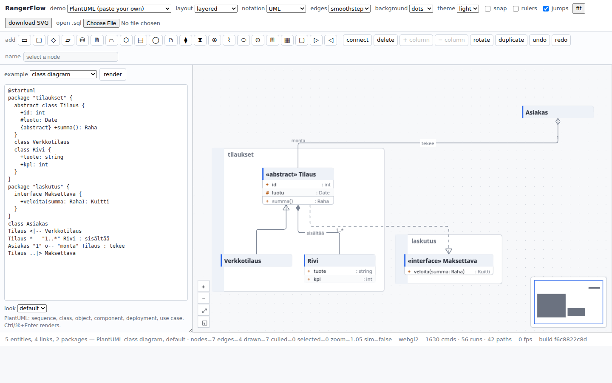

Drag to pan, wheel to zoom, **two fingers to scroll around** and pinch to zoom,
shift-drag to box select, drag *or click* a handle to connect, **right-click
for a menu**, `Delete`, `Ctrl+Z`, `f` to fit. **Download SVG** exports whatever is on screen, and
**open .sql** reads a schema in the tab without uploading it anywhere.

The second row is a **toolbar**, and it is not a demo of a toolbar: every
button calls one method on the app, which calls one method on `FlowEditor`, so
the same authoring runs in the SDL window and in a headless test.

| | |
| --- | --- |
| the shape buttons | add a node of that shape at the middle of the view, selected and ready to be named — the ISO 5807 set, and the UML activity one |
| **connect** | React Flow's `connectOnClick`: click the source, click the target. Clicking the pane cancels |
| **+ column** / **− column** | on a schema table: add a column, or drop one. Greyed out on anything that is not a table |
| **rotate** / **duplicate** | a quarter turn, and a copy offset far enough to be visibly a copy |
| **delete** / **undo** / **redo** | the same three the keyboard does, for a reader who is holding a mouse |
| the **name** field | renames the selected node as you type — or double-click the label itself and type where it is |

Every scenario is checked on every `npm run rangerflow:web:test`: the page
drives itself through select → drag → undo → select-all → **add two nodes,
join them, rename one, undo it all** inside real headless Chrome, and reports
what the GL context actually did. A scenario cannot rot unnoticed behind the
default one, and neither can a toolbar button.

## Mermaid in, a drawing out

Mermaid is how a diagram travels through a README, a ticket and a review:
eleven lines of text everyone can already write. What it is not is something
you can print, hit-test, drag a node in, or produce without a browser.
`domains/mermaid/MermaidReader.rgr` is the door — text in, a `FlowGraph` out —
and after that it is the same layered layout, the same lane router and the same
four backends the ERD uses.

```bash
npm run rangerflow:mermaid                            # fixtures/order_flow.mmd
npm run rangerflow:demo -- --mermaid path/to/diagram.mmd
```

```ranger
def d:MermaidDiagram (MermaidReader.parse(text))
def g:FlowGraph (MermaidFlow.build(d))      ; parsed, laid out, routed, framed
```

For anything that just wants a drawing — a printed page, a markdown document,
another gallery — [`MermaidRender`](domains/mermaid/MermaidRender.rgr) is the
door: text in, a `FlowScene` out, no editor, and every dialect below behind
one call. It never scales a diagram UP, so a three-node flowchart in a column
of prose stays a three-node flowchart.

```ranger
def sc:FlowScene (MermaidRender.sceneOf(text "default" columnWidth 10.0))
def root:EVGElement (sc.toEvgTree())        ; → PDF, HTML; or toDisplayList() → GPU
```

`gallery/markdown` draws its ```mermaid fences through it. The web facade's
own loaders still carry a copy of the dispatch, because they also report what
each dialect counts; moving those summaries here is what collapses the two.

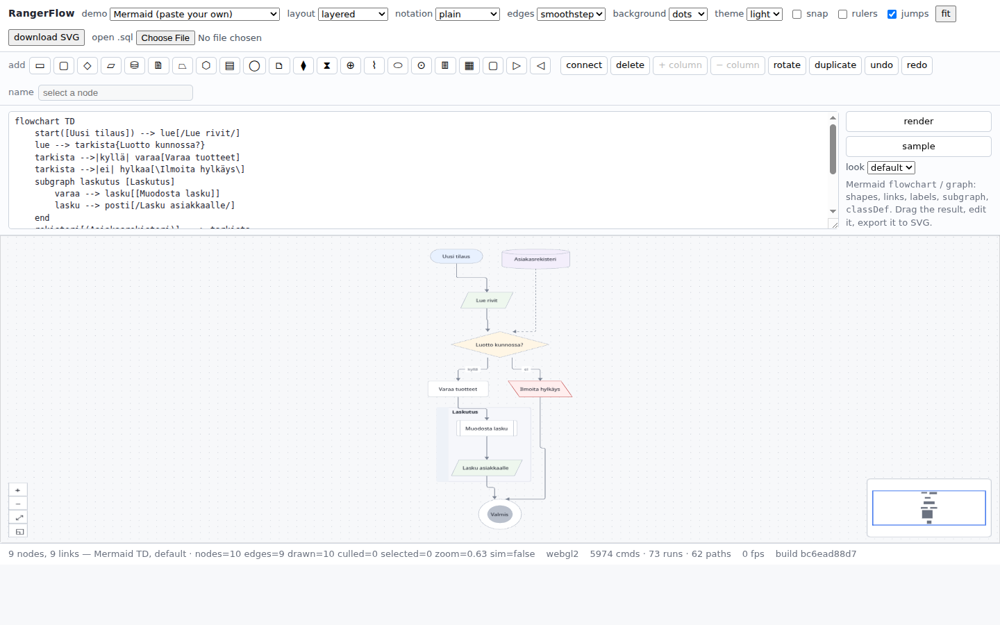

What it reads, which is the flowchart dialect people actually write:

| | |
| --- | --- |
| header | `flowchart` / `graph` with `TD`, `TB`, `BT`, `LR`, `RL` |
| shapes | `[]` `()` `([])` `[[]]` `[()]` `(())` `((()))` `>]` `{}` `{{}}` `[//]` `[\\]` `[/\]` `[\/]` |
| links | `-->` `---` `-.->` `-.-` `==>` `===` `--o` `--x`, the `<-->` family, and both label forms — `A -->|yes| B` and `A -- yes --> B` |
| statements | chains `A --> B --> C`, fan-outs `A & B --> C & D`, `;` separators |
| grouping | `subgraph … end`, nested, drawn as the frames a sub-flow already has |
| styling | `classDef`, `class`, `:::name`, `style` — fill, stroke and text colour |
| the rest | `%%` comments, `---` front matter with a title, quoted labels, `<br/>`, HTML entities |

### The same diagram in another look

The diagram says what it says; how it looks is somebody else's decision, and
usually somebody else's file. EVG already carries a small print-safe CSS engine
— class selectors, `@vars`, `@media`, themes — so the look is a **stylesheet**
rather than a set of constructor arguments:

```bash
npm run rangerflow:mermaid -- --style=forest      # default | forest | dark | neutral | print
npm run rangerflow:mermaid -- --style=house.css   # …or one of your own
npm run rangerflow:mermaid -- --style=print --restyle   # …and let it win over the diagram
```

```css
@vars       { --fill: #ffffff; --line: #b9c0cc; }
@vars dark  { --fill: #1b202a; --line: #39414f; }
.node       { fill: var(--fill); stroke: var(--line); border-width: 1px; }
.decision   { fill: #fff6e5; }
.warn       { fill: #fee; stroke: #c66; }     /* a Mermaid classDef name */
.frame      { fill: #f6f7fb; }                /* a subgraph box */
.edge       { stroke: #7b8494; stroke-width: 1.4px; }
.canvas     { background: #f7f8fa; edge-color: #7b8494; background-variant: dots; }
```

Every node answers to what it already is — `.node`, its type, `.shape-diamond`,
`.id-<id>` — plus whatever vocabulary the domain wrote: a Mermaid node wears its
kind (`.decision`), the shape it was written as (`.rhombus`) and every
`classDef` name it was given (`.warn`), and edges wear `.link` with
`.solid` / `.dotted` / `.thick`. So a sheet written for one diagram works on the
next one.

| in a rule | means |
| --- | --- |
| on a node | `fill`, `stroke`, `color`, `accent-color`, `border-radius`, `border-width`, `shape`, `visibility` |
| on an edge | `stroke`, `stroke-width`, `stroke-dasharray`, `marker-start`, `marker-end`, `edge-type`, `animated` |
| on `.canvas` | the paper, the grid, the node and header defaults, the edge colour and width, the selection, the panels and the minimap, the fonts |

By default the **diagram wins**: a Mermaid `classDef` still beats the sheet,
because someone wrote that colour on purpose — and a `classDef` fill with no
text colour gets a readable one computed from it, so a pale box in the dark look
is not pale text on pale paper. `--restyle` (or `style.strong = true`) turns
that around for when the house style is the point.

`%%{init: {'theme':'forest'}}%%` in the source picks a look by name, which is
the same word Mermaid uses for it. In the browser page the Mermaid panel has a
**look** dropdown, and `?scenario=mermaid&look=dark` picks one on load. The
same sheets style the PlantUML side, because what they style is the graph.

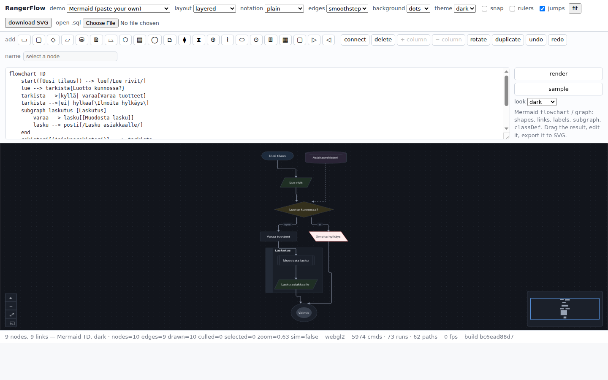

It also reads what Mermaid 11 added: `A@{ shape: rounded, label: "…" }` for the
shapes with no bracket spelling, named edges (`A e1@--> B`, `e1@{ animate: true }`),
markdown strings, and ids with a `-` or a `.` in them.

An arrow may name a **subgraph**: `C --> O` where `subgraph O` exists means
the group, and one arrow is drawn to its frame. Mermaid keeps `O` as a vertex
all the same — the clustering is a drawing decision, not a parsing one — so the
model here says what Mermaid's says and only the drawing differs.

What it drops on purpose: `click` (there is no browser to navigate),
`linkStyle` by index, and `direction` inside a subgraph — RangerFlow lays the
whole chart out one way. They are ignored rather than treated as errors, so a
diagram that renders in Mermaid renders here too. The other diagrams Mermaid
draws are recognised by their header and handed to the reader that knows them —
never to this one, because a git graph read as a flowchart would be a page of
invented boxes.

Where it differs: text is measured with a font table rather than in a browser,
so a line can break one word apart from Mermaid's, and a double circle is drawn
as the UML final node, which is the same two rings.

### …and class diagrams

Mermaid answers to thirty-eight header keywords and this reads all of them. The second one was already here before the reading started: a `classDiagram` is the UML
model RangerFlow has had all along, so it is drawn with the same compartment
node the schema editor uses — the hollow triangle at the supertype, the filled diamond at the
whole, the dashed line for a realization.

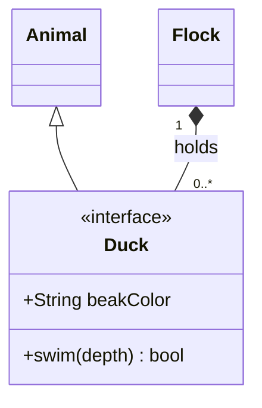
```mermaid
classDiagram
    Animal <|-- Duck
    class Duck {
        <<interface>>
        +String beakColor
        +swim(depth) bool
    }
    Flock "1" *-- "0..*" Duck : holds
```

Members are read as Mermaid writes them: `+ - # ~` visibility, `type name` for
an attribute and `name(params) returnType` for an operation, `$` for static and
`*` for abstract, `<<interface>>` for the stereotype. Relations carry their
cardinalities and their label, and the ornament goes on the end the syntax
names — the class written FIRST is the one being pointed at.

`note "text"` stands on its own and `note for Duck "text"` is pinned to a class
with the dashed leader UML has always drawn. Notes are placed *after* the
layout rather than laid out with it: a note is prose about the program rather
than part of it, and a layout that ranked one like a class would push the
classes apart to make room for a sentence.

Everything else Mermaid draws — git graphs, architecture diagrams, the `-beta`
charts — has a reader of its own further down this page. **All thirty-eight of
Mermaid's header keywords are drawn.** The table is in
[`docs/MERMAID_PARITY.md`](docs/MERMAID_PARITY.md), and the list of keywords
comes from **Mermaid's own detector registry** rather than being typed by hand,
so a diagram type added upstream shows up as one nobody has taught this reader
about — and a header this reader did not know would fall through to the
flowchart parser and produce a page of invented boxes, which is the one failure
a reader of somebody else's file must not have.

That list used to be discovered by reading the names off Mermaid's chunk
filenames, and five chunks are called `diagram-<hash>.mjs` and carry no name at
all — so five types were invisible to the very matrix that exists to catch a
type with no reader. The count said thirty when it was thirty-eight.

### …and ER diagrams

The third, and the one this library was built for. An `erDiagram` is a schema:
entities are tables, attributes are columns with their `PK` / `FK` / `UK` and
their comment, and a relationship is the crow's foot `EdgeDecoration` has drawn
since the first commit.

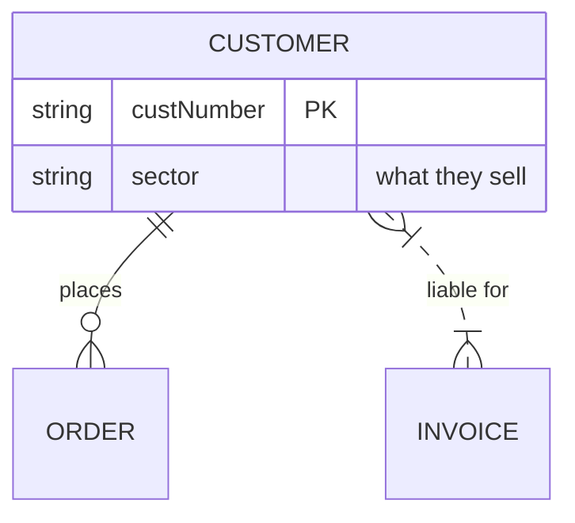
```mermaid
erDiagram
    CUSTOMER ||--o{ ORDER : places
    CUSTOMER }|..|{ INVOICE : "liable for"
    CUSTOMER {
        string custNumber PK
        string sector "what they sell"
    }
```

Every cardinality pair Mermaid has — `|o` `||` `}o` `}|` and their mirrors —
with the identifying `--` and the non-identifying `..` line, entity aliases and
`direction`. Where it differs: Mermaid's relationship names no columns, so the
line joins the two boxes rather than two rows of them. The port-level
attachment the SQL reader produces needs a foreign key to know which column it
starts at, and an ER diagram written by hand does not have one.

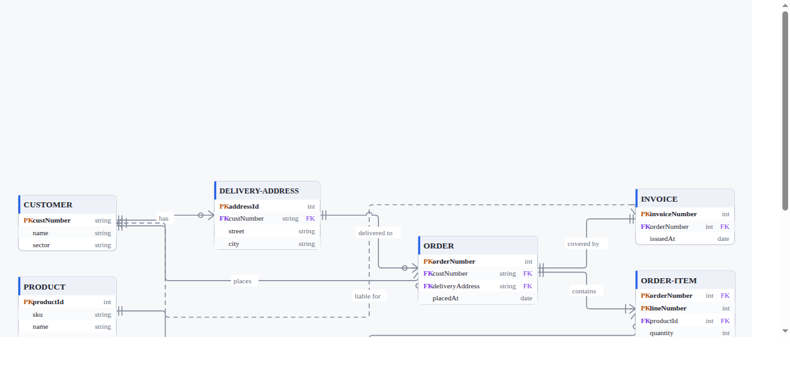

### …and state diagrams

A state machine and a UML activity diagram are the same picture with two
vocabularies over it, so `stateDiagram` needed a reader and nothing else: the
filled circle, the ring, the fork bar and the choice diamond have been in
`domains/uml/UMLActivity` since the activity demo.

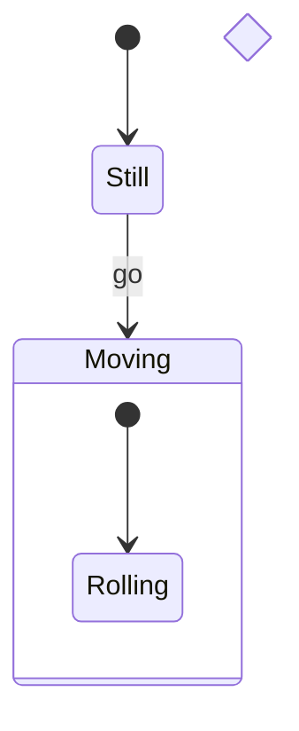
```mermaid
stateDiagram-v2
    [*] --> Still
    Still --> Moving : go
    state Moving {
        [*] --> Rolling
    }
    state pick <<choice>>
```

`[*]` is a start where it is written first and an end where it is written
second, once per scope; `state X { … }` composite states are the frames a
sub-flow already has, nested, and a transition into one enters it at the state
it starts at; `state "A long name" as s`, `s : a description` (which becomes
the second line of the box), `<<fork>>`, `<<join>>`, `<<choice>>` and
`direction`. Notes and the `--` concurrency divider are dropped.

### …and mind maps

The one with no arrows in it. Indentation is the syntax, and `MindMapLayout`
has balanced a mind map's branches either side of its root since the tree
layouts were written — so this reader turns an outline into a tree and hands it
over.

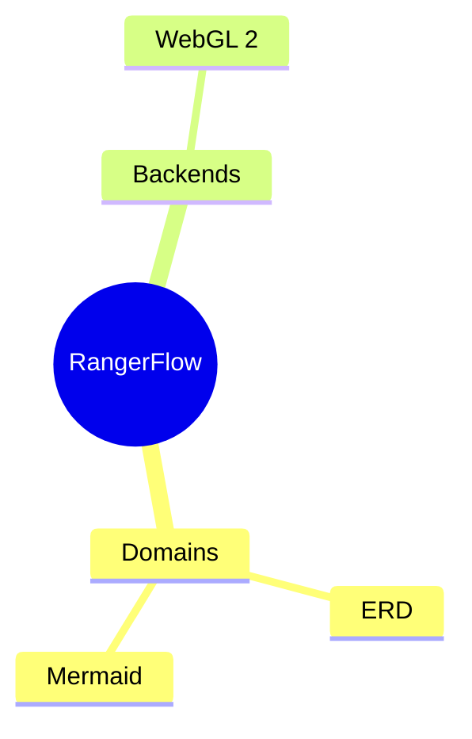
```mermaid
mindmap
  root((RangerFlow))
    Domains
      ERD
      Mermaid
    Backends
      WebGL 2
```

Every shape Mermaid has — `[]` `()` `(())` `))((` `)(` `{{}}` — with `::icon()`
read and dropped (there is no icon font here) and `:::class` kept, because a
stylesheet can match it.

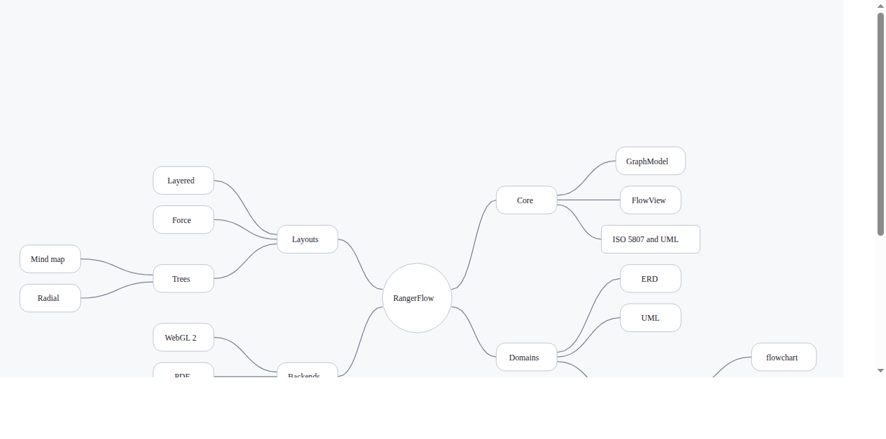

### …and requirement diagrams

A SysML requirement diagram is a class diagram whose boxes are requirements, so
it goes into the same UML model: the keyword is the stereotype, the fields
inside the braces are the rows, and a relationship is a dashed line with its
own name on it in guillemets — `«satisfies»`, `«traces»` — which is what tells
one from another when there are five on a page.

```mermaid
requirementDiagram
    requirement top { id: 1  text: the system shall work  risk: high }
    element impl { type: simulation }
    impl - satisfies -> top
```

All six requirement types and `element`, every relationship Mermaid has, and
both directions of writing one: `A - satisfies -> B` and `B <- satisfies - A`.

### …and C4

C4 is a naming convention over a very ordinary picture: labelled boxes with a
type and a sentence in them, boundaries around groups of them, and arrows that
say what talks to what over which protocol. Every element Mermaid's C4 support
has — `Person`, `System`, `Container`, `Component`, `Node` with their `_Ext`,
`Db` and `Queue` variants — every boundary, nested, and `Rel`, `BiRel` and the
directional variants. `UpdateElementStyle` and friends are dropped: the look
here is a stylesheet's business.

### …and the two that are placed rather than laid out

A **timeline** runs along its axis in the order it was written, and a **user
journey**'s height is the score against each task. Handing either to a layered
layout would throw away the one quantity the diagram has, so both are placed by
their reader: periods along the axis with their events under them, tasks along
the axis at the height they scored, and sections as frames over the columns
that belong to them.

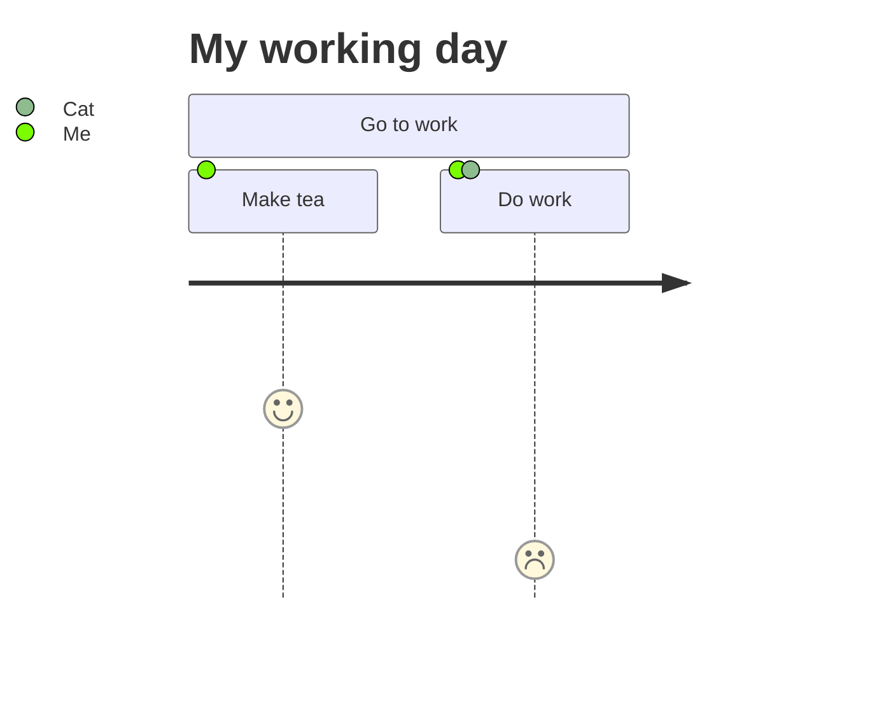
```mermaid
journey
    title My working day
    section Go to work
      Make tea: 5: Me
      Do work: 1: Me, Cat
```

### …and Gantt charts

The axis is the diagram: a chart that spaced its bars evenly instead of by date
would be a list with rounded corners. So the reader does the arithmetic — every
date becomes a day number by the civil-calendar formula, `after <id>` picks up
where that task finished, a bare duration follows the one before it — and the
bars are placed on a real time axis, scaled to the page so a two-year plan and
a two-week one are both readable.

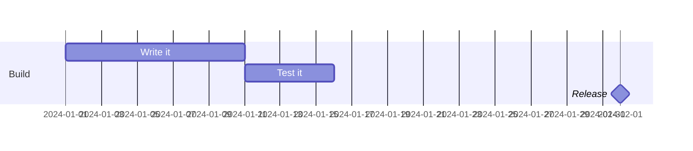
```mermaid
gantt
    section Build
        Write it :a1, 2024-01-01, 10d
        Test it  :after a1, 5d
        Release  :milestone, m1, 2024-02-01, 0d
```

A Gantt is three things in one picture and the bars are only one of them.
Without the **date axis** a reader cannot say when anything happens, so the
axis carries real dates — turned back out of the day numbers by the inverse of
the formula that made them, rather than by a second calendar — with a rule down
the chart at every tick, counted from the first day so the left edge is never
the one without a label. Without the **section bands** a reader cannot say
whose work it is, so each section is a strip with its name in the gutter. The
bands are cut from the task order rather than fitted around each section's
bounding box: two sections whose dates overlap have overlapping boxes, and a
band per box draws one on top of another and loses the label underneath.

Bars are filled rather than outlined, and exactly as long as the task is — a
minimum width would be a lie about a short task, so a bar too narrow for its
name gets the name beside it instead. `done`, `active` and `crit` each get a
fill as well as a class a stylesheet can match, and a milestone is drawn as the
diamond it is. There is not one edge in the output: `after <id>` is arithmetic
on the start date, and an arrow drawn between the two bars would be a claim
about the plan that the plan does not make. Dates are read as `YYYY-MM-DD`,
which is `dateFormat`'s default; a chart in another format keeps its order and
its durations.

### …and sequence diagrams

The one Mermaid type where both axes are content: who, across the page, and
when, down it. So nothing here asks the layout engine anything — the columns
are the participants in the order they were declared, the rows are the
statements in the order they were written, and every arrow is pinned to its own
row so that no later pass can decide it would read better somewhere else.

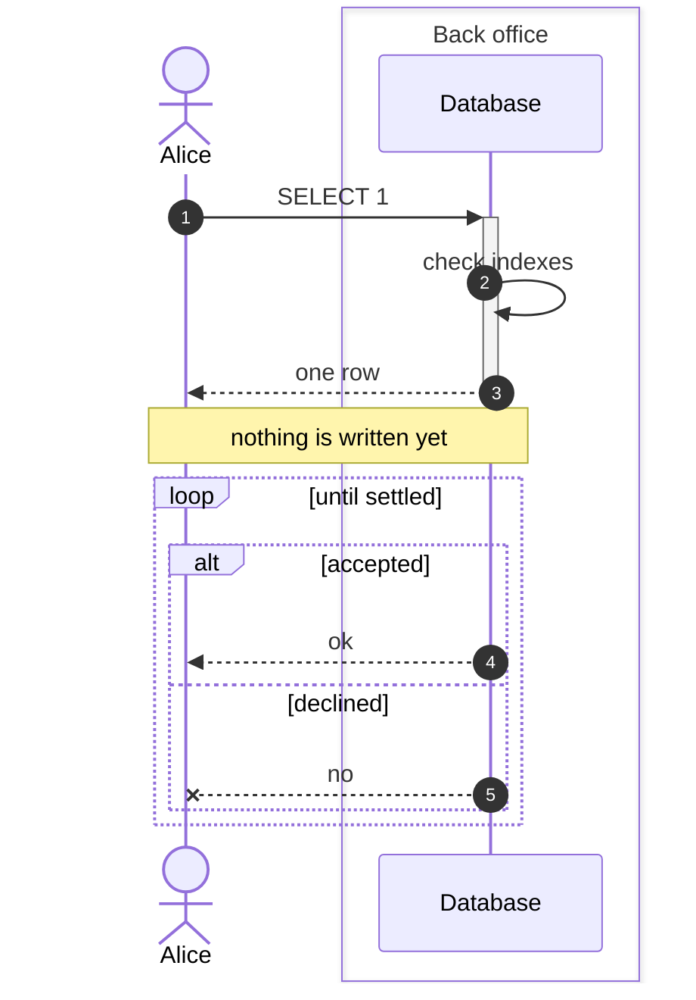
```mermaid
sequenceDiagram
    autonumber
    actor Alice
    box Back office
        participant DB as Database
    end
    Alice->>+DB: SELECT 1
    DB->>DB: check indexes
    DB-->>-Alice: one row
    Note over Alice,DB: nothing is written yet
    loop until settled
        alt accepted
            DB-->>Alice: ok
        else declined
            DB--xAlice: no
        end
    end
```

All ten arrows are drawn as what they say: `->>` a filled head, `-->>` the same
head on a dotted line, `-)` an open one for a message nobody waited for, `-x`
the cross for one that never arrived, `<<->>` both ends at once. Activation is
a bar on the lifeline — from `activate`/`deactivate` or from the `+`/`-`
shorthand on the arrow, and nested one inside the other where a participant
calls itself. `loop`, `alt`/`else`, `opt`, `par`/`and`, `critical`/`option`,
`break` and `rect` become boxes around exactly the participants they touch;
`box` groups the ones declared inside it; `create` draws a participant where it
is created and `destroy` ends its lifeline with the cross.

### …and git graphs

The one diagram whose syntax already contains its layout. Commits go along the
axis in the order they were written and each branch gets a row, so there is
nothing for a layout engine to work out: the order *is* the history, and a pass
that shortened an edge by moving a commit would be claiming it happened at a
different time.

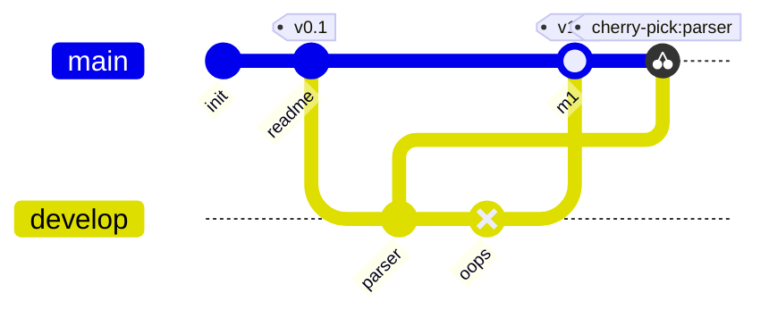
```mermaid
gitGraph
    commit id: "init"
    commit id: "readme" tag: "v0.1"
    branch develop order: 2
    checkout develop
    commit id: "parser"
    commit id: "oops" type: REVERSE
    checkout main
    merge develop id: "m1" tag: "v1.0"
    cherry-pick id: "parser"
```

A merge draws both its parents, because that is what a merge is; a cherry-pick
draws a dashed line back to what it picked. The four commit types are the four
Mermaid draws — NORMAL a disc, MERGE two rings, HIGHLIGHT a box, REVERSE a disc
struck through — and `order:` moves a branch's row where it is given.

### …and kanban boards

Two nouns and no verbs. A board has columns and it has cards, and the only
relation in it is which card is in which column — so the columns are the frames
a sub-flow already has, the cards stack inside them in the order they were
written, and the graph comes out with no edges at all.

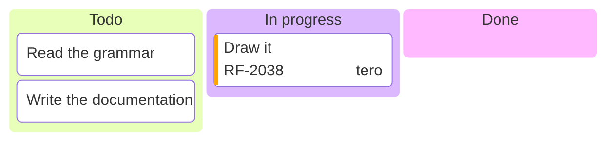
```mermaid
kanban
  Todo
    [Read the grammar]
    docs[Write the documentation]
  doing[In progress]
    render[Draw it]@{ ticket: RF-2038, assigned: 'tero', priority: 'High' }
  done[Done]
```

Indentation is the hierarchy, `id[Label]` names either a column or a card, and
the `@{ … }` block is written under the card's own words rather than dropped: a
board with no ticket, owner or priority on it is a list. The priority also
becomes a class, so a stylesheet can colour the board by urgency without the
reader having an opinion about which colour urgent is.

### …and quadrant charts

A scatter plot that has been told what its corners mean. The numbers do the
placing — `[0.3, 0.6]` is three tenths along and six tenths up, and nothing may
move it — and the four labels turn a cloud of dots into an argument about what
to do next.

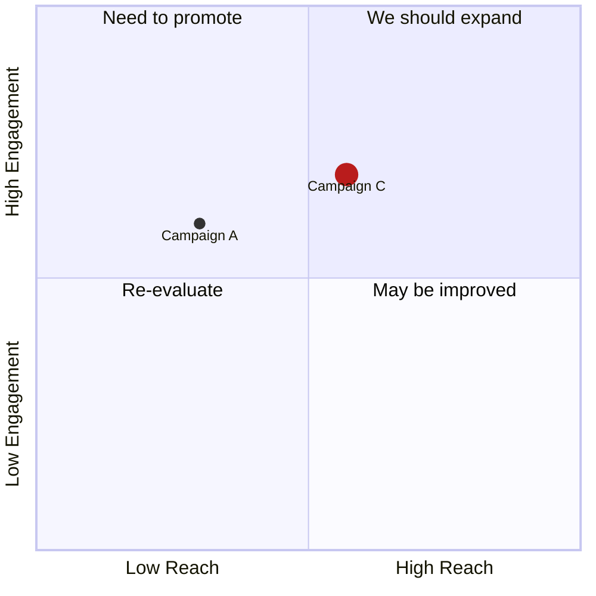
```mermaid
quadrantChart
    x-axis Low Reach --> High Reach
    y-axis Low Engagement --> High Engagement
    quadrant-1 We should expand
    quadrant-2 Need to promote
    quadrant-3 Re-evaluate
    quadrant-4 May be improved
    Campaign A: [0.3, 0.6]
    Campaign C: [0.57, 0.69] radius: 10, color: #b91c1c
```

Quadrant 1 is the top right and they go anticlockwise, the way mathematics
numbers them. `radius:`, `color:` and `stroke-color:` are read off the point's
own line, `:::name` and `classDef` colour a group of them, and a colour written
on the point itself wins over the stylesheet — that is the author saying *this
one is different*, and a sheet that painted over it would be answering a
question nobody asked.

### …and pie charts

The one diagram that is arithmetic all the way down. No nodes, no edges: a list
of numbers, and each one gets the share of a circle that it is of their total.

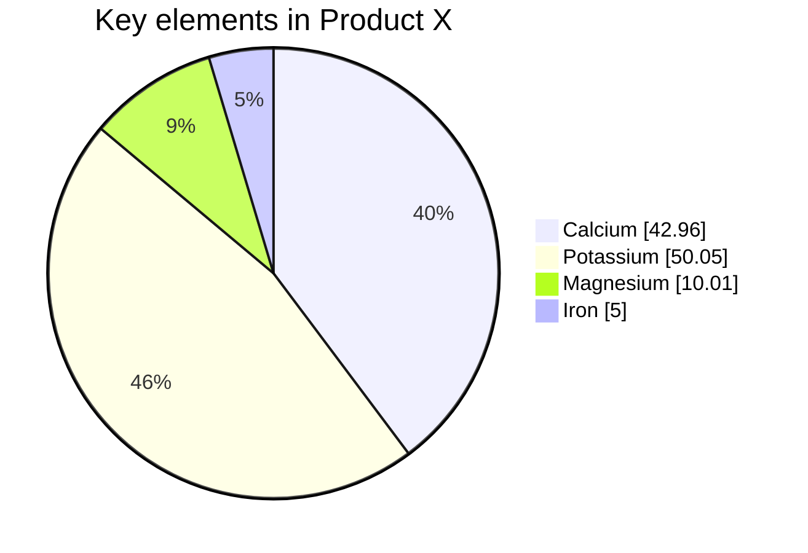
```mermaid
pie showData
    title Key elements in Product X
    "Calcium" : 42.96
    "Potassium" : 50.05
    "Magnesium" : 10.01
    "Iron" : 5
```

The shape library has no wedge, so the wedges are given as polygons — a fan of
points along the arc, the centre, and back — which means a pie is drawn by the
same renderer as everything else rather than by a special case. The names go in
a legend beside the circle rather than inside it: a chart with eleven slices has
no room for eleven words in the middle. Twelve palette colours come as classes
(`.slice-0` … `.slice-11`), so a stylesheet that disagrees can say so.

### …and xy charts

The first diagram here with a *scale* in it. Every other one places things by
counting — the third commit, the second lane — and this one places them by
measuring: a bar at 9500 has to be exactly as far up the page as 9500 is
between the bottom of the axis and the top, or the picture is a lie about the
numbers.

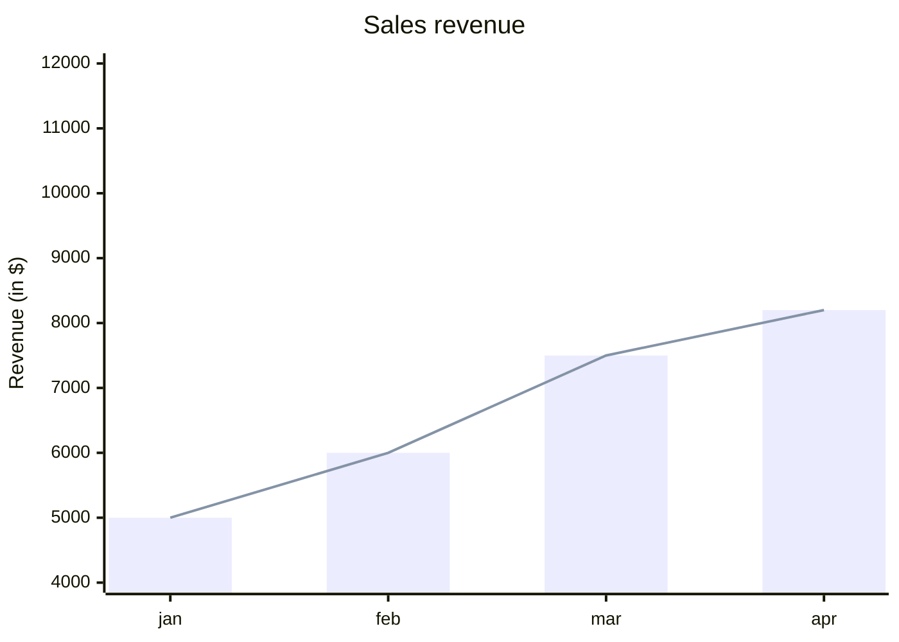
```mermaid
xychart-beta
    title "Sales revenue"
    x-axis [jan, feb, mar, apr]
    y-axis "Revenue (in $)" 4000 --> 12000
    bar [5000, 6000, 7500, 8200]
    line [5000, 6000, 7500, 8200]
```

Bar and line series can be mixed, several bar series share a band side by side,
and `xychart-beta horizontal` swaps the axes. Where the range is not given it is
taken from the data and the bottom is zero unless the data goes below it: an
axis that starts just under the smallest bar makes a 4% difference look like a
tenfold one, and Mermaid's own default is not to do that.

### …and Sankey diagrams

A graph whose edges have a *width*, and the width is the whole point: it is how
much went that way. Everything else follows — a node is as tall as the quantity
through it, a column as tall as the quantities in it — and nothing may be moved
to make a line shorter, because a line's thickness is a number somebody
measured.

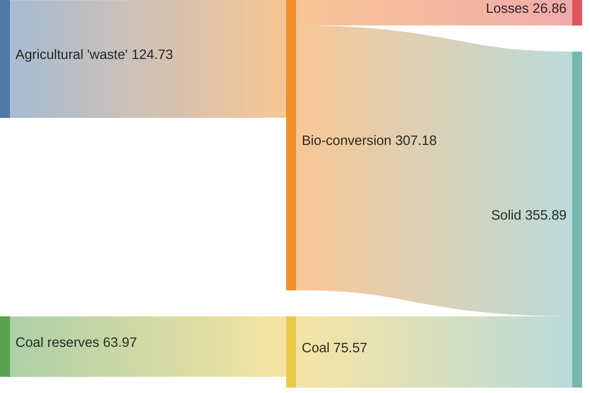
```mermaid
sankey-beta

Agricultural 'waste',Bio-conversion,124.729
Bio-conversion,Losses,26.862
Bio-conversion,Solid,280.322
Coal reserves,Coal,63.965
Coal,Solid,75.571
```

The whole language is three CSV columns, which makes this the shortest reader
here and the one that does the most arithmetic. The ribbons are polygons worked
out from the numbers — a band from where it leaves to where it arrives, sampled
along a smooth curve — so a Sankey is drawn by the same renderer as everything
else. A quote at the start of a field quotes it, comma and all; one in the
middle is an apostrophe.

### …and block diagrams

Every other box-and-line diagram asks a layout engine where the boxes go.
`block-beta` does not: it says `columns 3` and then lists the boxes, and where
they end up is arithmetic. That is the whole reason the type exists — somebody
wanted a picture that would come out the same every time — so the one thing
this reader must not do is improve on it.

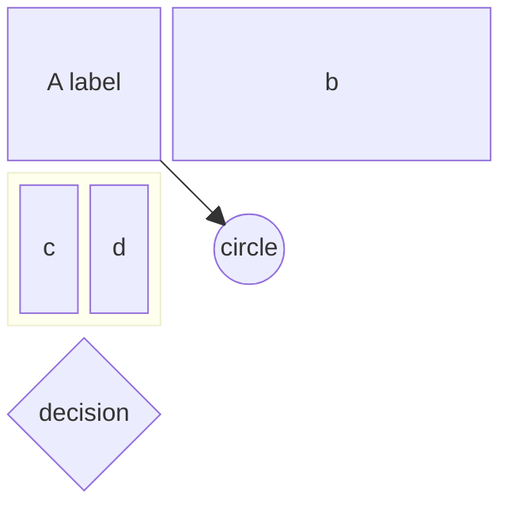
```mermaid
block-beta
  columns 3
  a["A label"] b:2
  block:group1
    columns 2
    c d
  end
  e(("circle")) space f{"decision"}
  a --> e
```

`id:n` spans columns, `space` and `space:n` leave holes, `block:id … end` nests
with columns of its own, and the shapes are the flowchart's, because
`block-beta` borrowed the vocabulary wholesale. Sizing is two passes: a nested
block is as wide as what is inside it and a row is as tall as the tallest thing
in it, so everything is measured and then placed.

### …and architecture diagrams

`architecture-beta` writes a side on each end of every connection —
`db:L -- R:server`, the database's left port joined to the server's right — and
that is not decoration. It says where the two things are relative to one
another, and it is the only placement information the diagram has. So it *is*
the layout: the first service goes down, and every other one lands on the side
its own connection asked for.

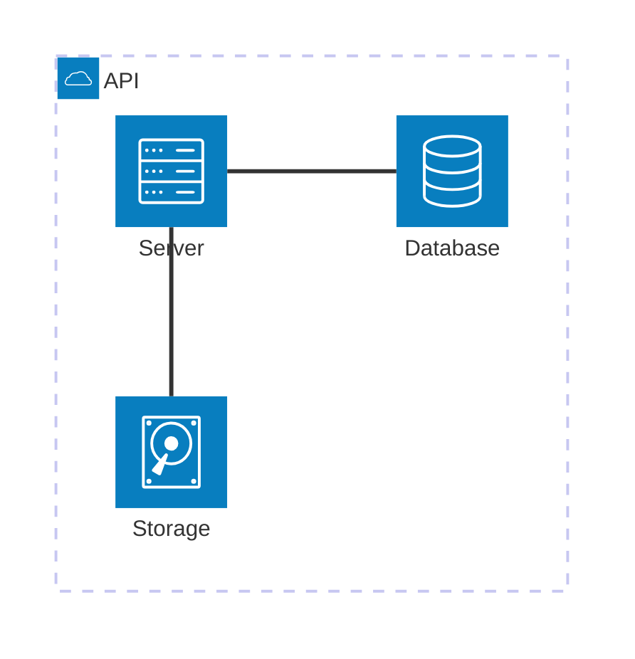
```mermaid
architecture-beta
    group api(cloud)[API]
    service db(database)[Database] in api
    service disk1(disk)[Storage] in api
    service server(server)[Server] in api
    db:L -- R:server
    disk1:T -- B:server
```

A layout engine asked to place these would produce a perfectly good picture of
a different arrangement, so there is no layout engine here. Mermaid draws an
icon from an icon pack; the shape library has outlines instead, and the icons
that carry a meaning get the outline that means it — a database is a cylinder,
a disk the same drum on its side.

### …and swimlane diagrams

`swimlane-beta` has no grammar of its own. Mermaid's own source says so: it
"reuses the flowchart parser, DB, and renderer wholesale and only swaps in a
different layout engine". So there is no parser here either — the source is read
with the flowchart reader, and the one thing that makes a swimlane diagram a
swimlane diagram is done to the layout: every step goes in the lane that owns
it, and a step nobody claimed gets a lane at the bottom.

```mermaid
swimlane-beta
    subgraph Customer
        order[Place order] --> pay[Pay]
    end
    subgraph Warehouse
        pick[Pick the goods] --> pack[Pack]
    end
    pay --> pick
```

The header is `swimlane-beta`, **singular**. The chunk Mermaid ships is called
`swimlanes`, and a reader that took the file name for the keyword would
recognise nothing and hand every swimlane diagram to the flowchart parser —
which would draw it, and draw it wrong. The parity harness was asking about the
wrong keyword too, so it could not have caught that.

### …and Cynefin frameworks

The Cynefin framework has exactly five domains and they are always in the same
places, because the places are the argument: `complex` is next to `complicated`
because the difference between them is the point, and `confusion` is in the
middle because that is where you are when you do not know which of the other
four you are in.

```mermaid
cynefin-beta
    title Where the work is
    complex
        "new market"
        "the rewrite"
    clear "payroll"
    complex --> complicated : "understood"
```

So there is nothing to lay out. The reader's whole job is to put each item in
the domain it was written under and to draw the arrows that say something moved
— and a move from a domain to itself is dropped, because it says nothing.

### …and fishbone diagrams

A cause-and-effect tree with one strong convention about how it is drawn: the
effect is the head of the fish, the spine runs back from it, and the causes
come off the spine at an angle, alternating above and below so that a long list
still fits on a page.

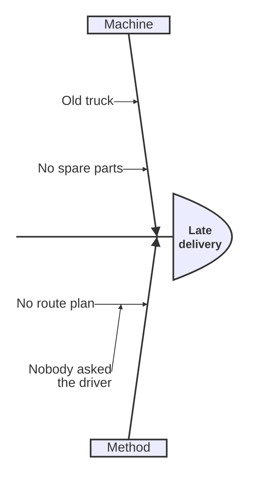
```mermaid
ishikawa-beta
  Late delivery
    Machine
      Old truck
      No spare parts
    Method
      No route plan
        Nobody asked the driver
```

Indentation is the whole of Mermaid's grammar for it, so it is the whole of the
reading: the first line is the effect, the lines under it are the categories,
and the lines under those are the causes — as deep as they go, because a cause
of a cause is the thing the diagram was invented for.

### …and Venn diagrams

Two facts and one picture: how big each set is, and how much of it is also in
another one. The circles are sized by their own numbers and by *area* rather
than by radius — a set twice as big is twice the ink, which is what a reader
compares — and they are placed to overlap, because a Venn diagram whose circles
miss each other has drawn the one thing it exists to deny.

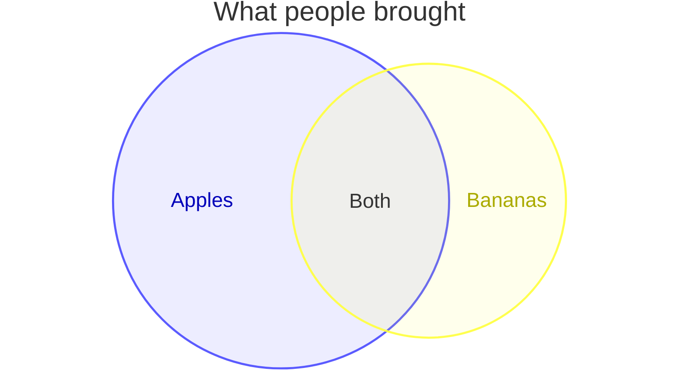
```mermaid
venn-beta
    title What people brought
    set A ["Apples"]: 30
    set B ["Bananas"]: 20
    union A,B ["Both"]: 10
```

Every label is written *on* the drawing rather than in a box over it: a label
with a fill of its own hides the very overlap the diagram is about.

### …and Wardley maps

A value chain drawn against evolution. Up the page is how *visible* a thing is
to the customer; across it is how *evolved* it is, from something nobody has
built before to something you buy by the metre. Both are numbers the author
wrote, and both mean something, so a layout engine has nothing whatever to
contribute.

```mermaid
wardley-beta
    title Tea shop
    anchor Business [0.95, 0.63]
    component Cup of Tea [0.79, 0.61]
    component Kettle [0.43, 0.35]
    Cup of Tea->Kettle
    evolve Kettle 0.62
```

`evolve` is drawn as the dashed move to the right that it is — the whole point
of the map being that things go that way. Visible is *up* and the page counts
down, which is the one conversion the map needs and the one that would turn it
into a map of the opposite argument.

### …and railroad diagrams, in all four notations

Mermaid ships **four** headers for one picture: `railroad-beta` and the three
grammar notations `railroad-ebnf-beta`, `railroad-abnf-beta` and
`railroad-peg-beta`. They disagree about how to spell a choice and agree about
everything else, so this is one syntax tree, four front ends and one renderer.

```mermaid
railroad-ebnf-beta
    letter = "a" | "b" ;
    word = letter , { letter } ;
```

| | joins | chooses | repeats | optional |
| --- | --- | --- | --- | --- |
| EBNF | `,` | `\|` | `{ x }` | `[ x ]` |
| ABNF | space | `/` | `1*x` | `[ x ]` |
| PEG | space | `/` | `x+` `x*` | `x?` |
| plain | `sequence(…)` | `choice(…)` | `oneOrMore(…)` | `optional(…)` |

There is not one edge in the output: a railroad's lines are square, exact, and
go where the grammar says, which is the one thing a router must not be asked to
improve on. So they are drawn as thin rules, like the spine of a fishbone.

### …and `info`

The smallest diagram Mermaid has: the whole source is the word `info`, and what
it renders is the version of the thing that rendered it. RangerFlow is not
Mermaid and does not know Mermaid's version, so it gives the same *kind* of
answer and not the same answer — it says what it is. A version number invented
on the spot would be printed in a box and believed.

### …and event models

Time across the page, kind down it. Each `tf` is a time frame and lands in the
lane its kind belongs to — Mermaid's own three, under the names its config
gives them: UI/Automation, Command/Read Model, Events.

```mermaid
eventmodeling
tf 1 ui OrderScreen
tf 2 cmd PlaceOrder ->> 1
tf 3 evt OrderPlaced ->> 2
tf 4 rmo OpenOrders ->> 3
```

The lane is not a choice: an event drawn in the command lane is a different
diagram. Mermaid gives five kinds nine spellings (`cmd`/`command`,
`rmo`/`readmodel`, …) and they collapse to five before anything is placed.
`->>` says which earlier frames a frame follows and is the only edge on the
page; `rf` marks where the story starts again; `[[Name]]` points at a declared
`data` block; and a `gwt` block is drawn below the lanes, because a test of the
model is not part of it.

There is no `title`. Mermaid's own grammar rejects one here, and a reader that
took a file Mermaid will not take would be claiming a parity it does not have.

### …and tree views

The same hierarchy a treemap draws by area, drawn instead as an outline: one
row per entry, indented under its parent, with the elbow rules that say which
row belongs to which.

```mermaid
treeView-beta
core
    FlowView.rgr ## the view and its text fitting
    GraphModel.rgr icon(fa:file)
domains ::: warm
```

Indentation is the hierarchy, ` ::: name` puts a class on a row, ` ## words` is
a description written beside it, and ` icon(name)` names an icon. The three are
cut off the end of a line in the one order that cannot go wrong — the
description first, because it runs to the end of the line and would otherwise
swallow the other two.

Mermaid resolves `icon(fa:folder)` against an icon pack and there is none here.
Inventing a picture for a name this library has never seen would be worse than
drawing none, so the marker on each row says only what this reader actually
knows — whether the row has anything under it — and the icon name is kept on
the row as its tooltip rather than thrown away.

### …and treemaps

A tree whose branches are drawn to scale: the nesting says what contains what,
and the **area** says how big each part is.

```mermaid
treemap-beta
"src"
    "core": 4600
    "domains": 13500
"docs": 2500
```

The indentation is the whole of the syntax — a line indented further is a child
of the one above it — a leaf carries `: value`, a branch is worth the sum of
what is under it, and `:::name` puts a class on a box.

The layout is not a slice down every level the same way: that makes slivers,
and a sliver a hundred times longer than it is wide has an area nobody can
judge. Each list of siblings is cut in two at the place nearest to halving its
weight, and its rectangle is cut across the **longer** side in the same
proportion — so every step halves the weight and turns the grain ninety
degrees, which keeps the boxes near square without the bookkeeping a squarified
layout needs.

### …and radar charts

A bar chart bent into a circle: one spoke per axis, one closed line per
subject, and the shape of that line is the comparison.

```mermaid
radar-beta
  axis m["Math"], s["Science"], e["English"]
  axis h["History"], g["Geography"], a["Art"]
  curve a["Alice"]{85, 90, 80, 70, 75, 90}
  curve b["Bob"]{70, 75, 85, 80, 90, 85}
  max 100
```

The readings are either a plain list in axis order or `name: value` pairs that
say which spoke each one belongs on — the only safe way to write a curve that
skips an axis. `max`, `min`, `ticks`, `graticule circle|polygon` and
`showLegend` are Mermaid's options and all of them are read.

Everything on it is a line rather than a shape: the graticule rings, the spokes
and the curves are thin quadrilaterals given as `shapePoints`, because the
display list fills whatever it draws and an unfilled ring would have to be
painted in the paper's own colour — which stops working the moment the paper
changes. That is also why the curves are outlines with a dot at each reading
rather than filled areas: there is no transparency in the display list, and
three filled curves are three opaque blobs with the last one drawn winning.

### …and packet diagrams

A ruler with names written on it. Every field is a range of bit numbers, the
ruler is 32 bits wide, and the whole of the layout is arithmetic on those
numbers:

```mermaid
packet
0-15: "Source Port"
16-31: "Destination Port"
32-63: "Sequence Number"
106: "URG"
192-255: "Data (variable length)"
```

The one thing that needs care is the **wrap**: `192-255` is 64 bits on a 32-bit
ruler, so it is two boxes on two rows with the name in both — a reader that
drew it as one box would be drawing a field twice as wide as the diagram, and a
second row labelled with nothing is a row you have to count back to identify.
All three ways of writing a range are read: `0-15:`, `32:` for a single bit,
and `+16:` for the next sixteen bits after whatever came before.

The bit numbers above the boxes are the diagram rather than decoration, so both
ends of every box carry one. And a TCP header's flags are single bits called
`URG` and `ACK`: a ruler scaled to the wide fields draws them as six boxes with
an ellipsis in each, which says nothing at all, so the ruler widens until the
narrowest label fits — up to half again, after which one word is not worth two
thousand pixels of row.

### …measured against Mermaid itself

A claim of parity with a format is worth what the person making it wanted it to
be worth, so this one is not a claim:

```bash
npm run rangerflow:mermaid:parity            # the score
npm run rangerflow:mermaid:parity -- --diff  # …and every difference in full
```

Every diagram in `fixtures/mermaid/` is handed to **Mermaid's own parser**, and
what comes back — vertices with their shapes, edges with their strokes and
arrowheads, subgraphs with their members — is compared with what this reader
made of the same text. Currently **234/234 checks over 52 examples**, including
three diagrams of other kinds that must be refused rather than read. The table
is [`docs/MERMAID_PARITY.md`](docs/MERMAID_PARITY.md), regenerated by the run;
the corpus is where a new example goes when Mermaid grows one.

## PlantUML in, the same drawing out

Mermaid is how a diagram travels through a README. **PlantUML is how it travels
through a design document**, and it has been doing so for longer. So it comes
in through the same door:

```bash
npm run rangerflow:plantuml                             # fixtures/order_flow.puml
npm run rangerflow:demo -- --plantuml path/to/file.puml
```

```ranger
def d:SeqDiagram (PlantUmlSequenceReader.parse(text))
def g:FlowGraph (SeqDiagramFlow.build(d style))    ; placed, drawn, exportable
```

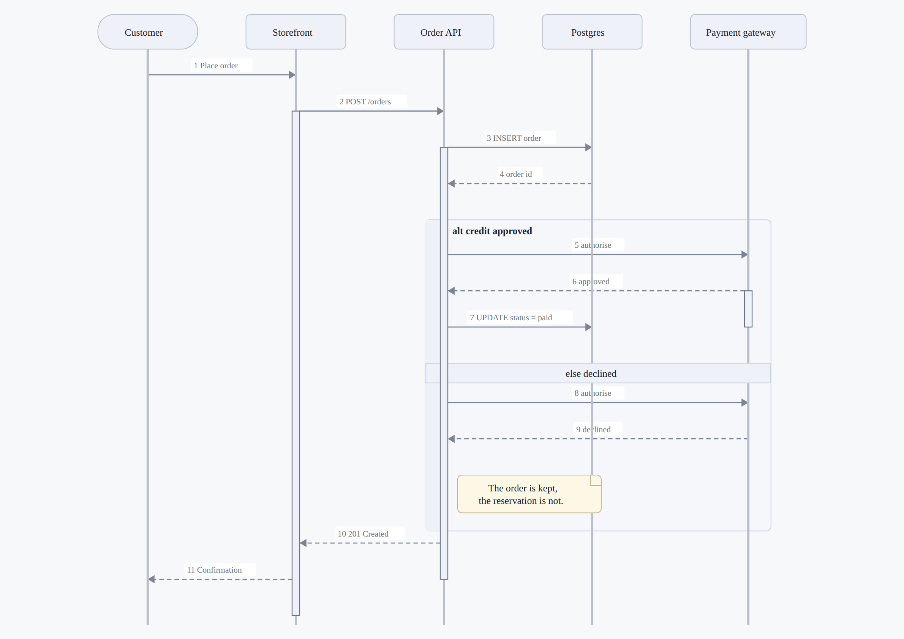

**The hard part is not the arrows — it is knowing what you are reading.**
`@startuml` opens a sequence diagram, a class diagram, a component diagram, a
state machine and an activity diagram, and only the lines underneath say which.
A class diagram read as a sequence diagram is four participants that never
existed and no classes at all. So the rules were not invented here: each one
was **asked of PlantUML 1.2025.4**, as a two-line file, and read off the
`data-diagram-type` its own renderer writes into the SVG.

| written | PlantUML calls it | because |
| --- | --- | --- |
| `A --> B` | sequence | a bare arrow is a message |
| `A -- B` | class | a line with no head is an association |
| `[Web] --> [API]` | description | the bracket is a component |
| `actor U` + `U --> (Buy)` | description | `actor` is a word both dialects have |
| `A -> B: x` + `class C` | class | one `class` line outweighs a message |
| anything else | sequence | it is the parser PlantUML tries first |

Those six rows are six assertions in the test suite.

What the sequence reader reads:

| | |
| --- | --- |
| participants | `participant` `actor` `boundary` `control` `entity` `database` `collections` `queue`, both orders of the `as` alias, `box … end box` |
| lifetime | `create`, `destroy`, `activate` / `deactivate`, the `++` `--` `**` `!!` shorthand on an arrow, and `return` |
| arrows | `->` `-->` `->>` `-->>` `->x` `->o` `<-` `<--` `<->`, the `\` and `/` half-heads, and `-[#red]>` colours |
| notes | `note left` `note right of A` `note over A, B`, inline and multi-line, `ref over` |
| blocks | `alt` / `else`, `opt`, `loop`, `par` / `and`, `critical`, `break`, `group`, `== dividers ==` |
| the rest | `title`, `autonumber`, `'` and `/' … '/` comments, several diagrams in one file |

**Read and dropped, on purpose:** `skinparam`, `hide footbox`, `header`,
`footer`, the `...` delay — style and whitespace. **Recognised and refused:**
`@startditaa`, `@startdot`, `@startmath`, and the diagram kinds this reader can
name but not yet draw. A header nobody recognises must not fall through to the
entity parser; that is the one failure a reader of somebody else's file may not
have.

### Six diagram types, one grammar

PlantUML's class, object, component, deployment, use-case and ArchiMate
diagrams are not six languages. They are an **entity**, a **link** and a
**cluster**, with a different word in front of the entity and a different shape
drawn for it — and PlantUML's own renderer says so without being asked: all six
emit the same `class="entity"`, `class="link"` and `class="cluster"` groups into
their SVG. So `PlantUmlEntityReader` is one reader, and the shape table is the
only place the six part company.

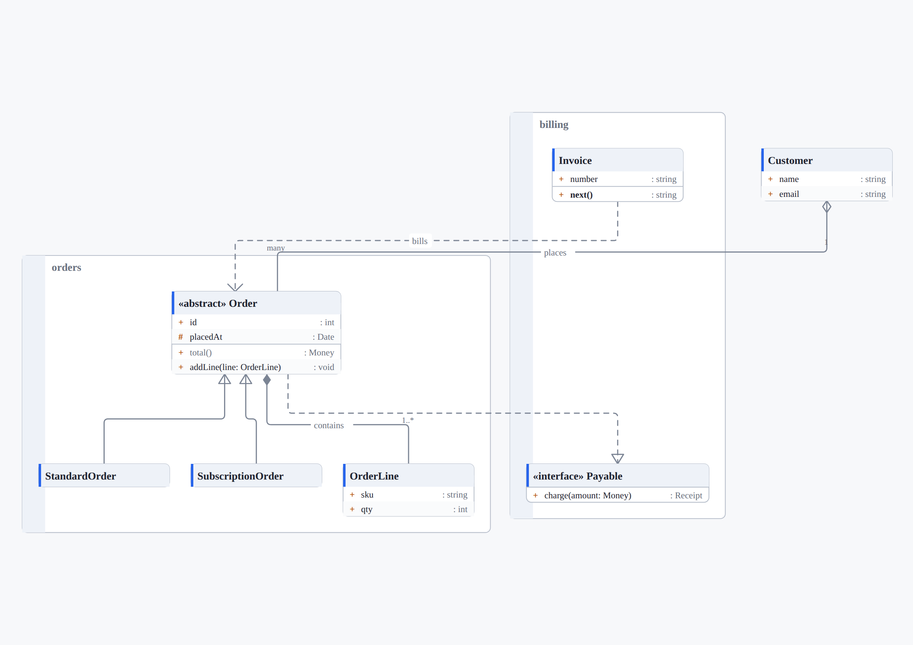

| | |
| --- | --- |
| declarations | all 43 keywords PlantUML lists — the list is read off `plantuml.jar -language`, not typed from a web page — with aliases in both directions, quoted names, stereotypes, and the `[Component]` and `(Use case)` bracket notations |
| members | `+` `-` `#` `~` visibility, `{static}`, `{abstract}`, `--` separators, and the one-line form `Order : +id: int` |
| links | `--` `..` `-->` `<--` `<\|--` `--\|>` `<\|..` `..\|>` `*--` `--*` `o--` `--o` `..>`, with lengths (`--->`), direction hints (`-up->`), `[hidden]` and `[#colour]`, cardinalities (`A "1" *-- "many" B`) and labels |
| clusters | `package`, `namespace`, `together`, and every container keyword that opens a `{ }` — `node`, `folder`, `frame`, `cloud`, `rectangle`, `card`, … |
| the page | `left to right direction`, and `title` |

### The activity diagram, which is nested

Every other PlantUML diagram is a list of things and a list of lines between
them, in any order. An activity diagram is not: it is **nested**, and what
connects to what is decided by where a statement sits inside `if` … `else` …
`endif` rather than by anything written on the line. So `PlantUmlActivityReader`
carries two pieces of state — the open ends the next statement has to be joined
to, and a stack of the structures still open — and that is the whole algorithm.

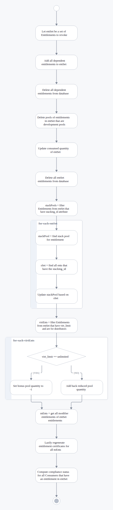

`start`, `stop`, `end`, `kill`/`detach`, actions (`:like this;`, over as many
lines as they like, with a `#colour:` in front if they want one),
`if`/`then`/`elseif`/`else`/`endif`, `while`/`endwhile`, `repeat`/`repeat
while`, `fork`/`fork again`/`end fork`, `split`, `partition … { }`,
`|swimlanes|`, the arrow label `-> like this;`, and notes. It is drawn with
`ActivityDiagram` from `domains/uml/` — the initial dot, the final rings, the
diamond, the fork bar and the action box RangerFlow has drawn since the ISO
5807 chart, so nothing new is drawn here either.

A swimlane is read and recorded but not yet drawn as a column.

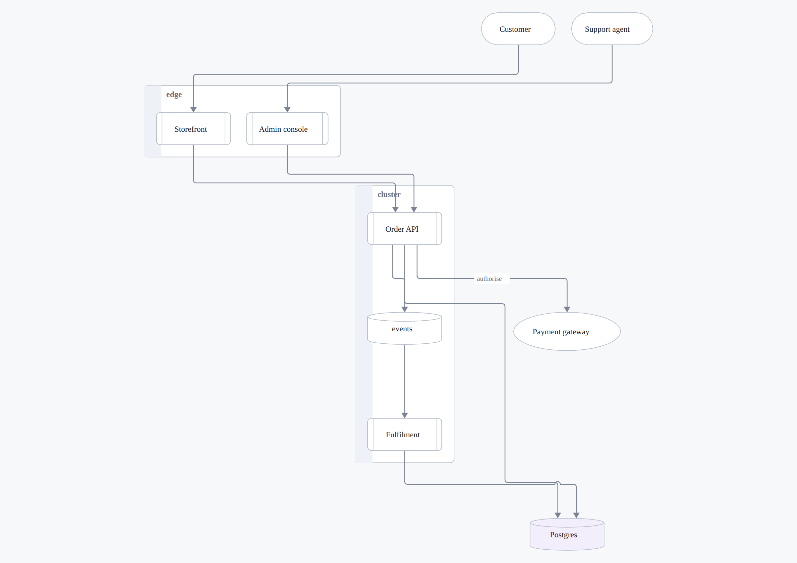

**A package is a band, not a bounding box.** A layered layout has no idea that
six of its nodes belong together, so it will happily put a class that belongs to
no package between two that do — and a frame drawn round the members afterwards
swallows the stranger. Ordering each layer separately does not fix it either: a
package whose members land in layers one and four still spans everything in
between. So each root package gets a **column of its own** and keeps it in every
layer. A frame then cannot reach outside its column, two frames cannot overlap,
and a package cannot claim a class it never declared. It is not what Graphviz
does — it ranks inside a cluster as well — and a diagram with many packages comes
out wide. A wide diagram is not a false one.

### …in the browser, too

PlantUML is a scenario of its own in the page —
[`?scenario=plantuml`](https://terotests.github.io/Ranger/rangerflow/?scenario=plantuml)
— sharing one source panel with Mermaid: the demo dropdown decides which reader
gets the text, and each format brings its own gallery of examples. It is driven
by `npm run rangerflow:web:test` like every other scenario, so it cannot rot
behind the default one.

### Scored against PlantUML itself

```bash
npm run rangerflow:plantuml:parity        # needs a JVM; fetches the jar once
```

PlantUML has no parse database to ask, the way Mermaid has. It has something
better: **it annotates its own SVG**. Rendered with `-Playout=smetana` — the
pure-Java layout engine, so nobody has to install Graphviz — every node, every
edge and every package comes back as a group carrying the ids PlantUML used:

```html
<g class="entity"  data-entity="API" data-source-line="1" data-uid="ent3">
<g class="link"    data-entity-1="Web" data-entity-2="API">
<g class="cluster" data-entity="core">
<g class="message" data-participant-1="User" data-participant-2="API">
```

Every file in `fixtures/plantuml/` is handed to PlantUML, and what it says is
compared with what this reader made of the same text: which diagram it is,
whether PlantUML accepts it at all, the entity ids, the packages, the link
endpoints, the participants and the message endpoints. Currently **65/65 checks
over 16 examples**, including a ditaa block that has to be *refused* rather than
read. The table is [`docs/PLANTUML_PARITY.md`](docs/PLANTUML_PARITY.md),
regenerated by the run.

Nothing about geometry: PlantUML lays a diagram out its own way and has no
opinion about RangerFlow's. And the jar is fetched on demand, run as a
subprocess and never linked — it is GPL, and no PlantUML source is copied into
this repository, not a grammar and not a keyword table. What the reader knows
about PlantUML it learned from PlantUML's behaviour and from its own
`-language` dump: the 43 declaration keywords, the 164 statement keywords and
the 26 preprocessor commands are all read off the tool.

Still open: the state reader, the preprocessor, and Creole's styled runs. The plan is [`docs/PLAN_PLANTUML.md`](docs/PLAN_PLANTUML.md).

## D2, measured before it is read

[D2](https://d2lang.com) is the third text-to-diagram format worth reading, and
the easiest of the three to be honest about: it is **MPL-2.0**, it installs
with `go install oss.terrastruct.com/d2@v0.7.1`, and `d2lib.Compile` hands back
a whole diagram as JSON — every shape with its position, size, type and level,
every connection with its arrowheads and its route, `sql_table` columns with
their constraints, `class` members with their visibility, and the boards that
`layers` / `scenarios` / `steps` created.

So the oracle came first, before any reader:

```
npm run rangerflow:d2:oracle
  d2 v0.7.1: 20/20 fixtures accepted, 139 shapes and 58 connections laid out by
  dagre and elk, 46 keywords, 25 shapes, 11 arrowheads
```

[`docs/D2_FEATURES.md`](docs/D2_FEATURES.md) scores D2's own tables against the
pipeline as it stands: 100 rows, **57 it already draws, 15 narrower, 28
missing** — boards, grid diagrams, nine outlines, an image primitive and rich
labels. The reading of that is in [`docs/PLAN_D2.md`](docs/PLAN_D2.md): a D2
reader is mostly a parser, because D2's model is the model RangerFlow already
has.

So the parser is what was built first:

```
npm run rangerflow:d2:parity
  d2 v0.7.1: 41/41 fixtures accepted …
  d2 parity: 256/256 checks agree (100%) → gallery/rangerflow/docs/D2_PARITY.md
```

`domains/d2/D2Parser.rgr` reads the language — keys and dotted paths, maps,
connections and chains, connection references, block strings with their tags,
globs and `&` filters, imports and spreads, both kinds of comment — and
`domains/d2/D2Model.rgr` says what it means: objects created by being
mentioned, `vars` and `classes`, `suspend`, the rows of a `sql_table` and the
members of a `class`, sequence-diagram scoping, and the boards `layers`,
`scenarios` and `steps` make. Imports read files, so they are confined to the
diagram's own directory: an absolute path, a `..` segment, a URL and a cyclic
chain are each refused with an error rather than followed.

The score is [`docs/D2_PARITY.md`](docs/D2_PARITY.md), computed by D2 over
nine dimensions: objects, labels, shapes, levels, connections, the styles a
file actually set, the extras a shape carries (tooltip, link, icon, size),
table rows and class members, and the board tree. **No geometry is compared**: D2's answer carries every position and
route, and scoring those against RangerFlow's own layered layout would measure
two layouts rather than one reader.

And then it is drawn. `domains/d2/D2Flow.rgr` turns a board into a `FlowGraph`
and from there it is the same layered layout, the same lane router and the same
four backends the ERD and Mermaid use:

```
npm run rangerflow:d2                                    # or any .d2 file
npm run rangerflow:d2 -- gallery/rangerflow/fixtures/d2/02_containers.d2
```

Two things had to be built for it. **A container is laid out as a diagram of
its own** and then placed in its parent as one box the size of what came out —
a flat layered layout has no idea that six of these boxes belong in one frame,
so it interleaves them with the next container's and the frames drawn
afterwards overlap. Nesting the layouts also gives `direction` its proper
meaning: a `direction: right` inside a container turns that container and
nothing else. And **the nine outlines D2 has that this library did not** —
`page`, `queue`, `package`, `step`, `callout`, `stored_data`, `person`,
`c4-person` and `cloud` — are in `core/FlowShapes.rgr` now, held to the same
two rules as every other outline: inside its own box, and enclosing its own
middle.

What is not drawn yet: a grid container lays out as an ordinary one, a
`sequence_diagram` is drawn as a container of participants rather than by
`SeqDiagram`, and only the root board is drawn. Each is a row in
[`docs/D2_FEATURES.md`](docs/D2_FEATURES.md) and a phase in
[`docs/PLAN_D2.md`](docs/PLAN_D2.md).

## …and in a window

`npm run rangerflow:sdl:run` compiles the whole thing to C++ and links it
against SDL2 and OpenGL. It is the same `FlowEditor`; only the layer that owns
the window differs, because the seam between them is the EVG display list.
See [`platform/sdl/README.md`](platform/sdl/README.md) — including what has and
has not been verified, and why the window is borrowed from the DataGrid.

## Why a graph core and a schema editor are the same program

The core knows about nodes, ports and edges, and nothing else. It has never
heard of a table. What makes an ER diagram out of it is one file —
`domains/erd/SchemaToGraph.rgr` — that maps a `DatabaseSchema` onto that
vocabulary, and one primitive the core does carry: the **compartment node**.

```text
┌─────────────────────────────┐        ┌─────────────────────────┐
│ customers                   │ header │ Customer                │
├─────────────────────────────┤        ├─────────────────────────┤
│ PK id          INTEGER      │ rows   │ -  id      : int        │
│    email       VARCHAR   ●  │        │ -  email   : string     │
│ FK country_id  INTEGER   ●  │        ├─────────────────────────┤
├─────────────────────────────┤        │ +  save()  : void       │
│ UNIQUE(email)               │        └─────────────────────────┘
└─────────────────────────────┘
```

A header, then sections of rows, with a **port opposite any row that asks for
one**. That last part is the difference between an ER diagram and a flowchart
with table-shaped boxes: a foreign key does not join two boxes, it joins two
*columns*.

```text
orders.customer_id ●────────────● customers.id
```

The UML class diagram is the same primitive with different words in it, which
is the argument for keeping the core free of tables: `domains/uml/UMLModel.rgr`
is 250 lines, and most of them are the model rather than the drawing.

## The shape is the sentence

A table and a class are both rectangles, so the model got away for a long time
with never saying what a node *looked* like. A flowchart cannot. A diamond is a
decision, a parallelogram is input or output, a drum is stored data, and a page
with a wavy foot is something printed — a reader who knows the convention has
read half the diagram before reading a word of it, and drawing all four as
rectangles does not make a plainer chart, it makes a wrong one.

`core/FlowShapes.rgr` is one function: a rectangle and a shape name in, a ring
of points out. The ring does three jobs, which is why there is only one of it:

- **drawing** — `FlowScene.polygon`, which every backend already handled, so a
  hexagon reaches the PDF, the SVG and the GPU by the road the rectangles took;
- **hit testing** — the editor asks whether the pointer is inside the ring, not
  inside the bounding box, so the corner beside a diamond is empty canvas the
  way it looks like it should be;
- **handles** — the anchor for a side is where that side's outline crosses the
  node's middle, so an arrow into a parallelogram ends on the slope rather than
  in the air beside it.

A table carries a port per row and needs no others. A shape has no rows at all,
so it gets the four side handles React Flow gives a node that declares none —
without them a box is drawn, selected, and impossible to connect to anything,
which is the first thing a reader tries. They are placed on the outline, so the
left handle of a diamond is its left-hand point and stays there when the node is
resized. The grab radius is eight screen pixels **or a quarter of the node's
shorter side, whichever is smaller**: zoomed far enough out, eight screen pixels
is the whole node, and a node that is all handle is a node you cannot select.

Curves are cut into segments rather than emitted as arcs, because the display
list has polygons and polylines and no beziers. A rounded end drawn as sixteen
segments is indistinguishable at any zoom a reader uses; a second code path
that only some backends implemented would be a rounded end in the browser and a
hexagon in the PDF.

The same rule caught a real one on the way in. `SceneItem.dash` was written
into the SVG as `stroke-dasharray` and dropped on the floor by the display
list, so an organisation chart's dotted matrix report came out dotted in the
PDF and **solid on the GPU**. The dashes are now cut in `FlowScene` — once, by
arc length — so both backends draw the same line by construction.

## Three more diagrams, and no more core

```text
  ╭────────╮   ┌ Asiakas ─────────────────────┐   ┌──────────────┐
  │  Alku  │   │ ╭──────╮      ┌──────────┐   │   │ Aino Virtanen│
  ╰───┬────╯   │ │ tilaa├──┐   │          │   │   ├──────────────┤
   ╱──┴──╱     └─╰──────╯──┼───┴──────────┴───┘   │ toimitusjohtaja│
      │        ┌ Myynti ───┼──────────────────┐   └───────┬──────┘
      ◇ ei ►   │       ┌───▼────┐    ◇        │       ┌───┴───┐
   kyllä       │       │ tarkista│ ► luotto?  │       ▼       ▼
```

- **ATK-kaavio** (`domains/flowchart/`) — the ISO 5807 shapes, `kyllä` / `ei`
  on the branches, and a `FlowKind` that says *what a step is* while
  `FlowKind.shapeFor` is the whole of the translation to *what it is drawn as*.
- **Organisaatiokaavio** (`domains/business/`) — a tree through the same
  layered layout, units coloured, and the matrix report drawn dashed because
  every organisation has one and no chart admits to it.
- **Uimaratakaavio** (`domains/business/`) — lanes as `nodeType = "group"`
  nodes, and the steps inside them carrying the lane's id in `parentId`. That
  is React Flow's sub-flow model, and it buys the behaviour that makes lanes
  worth having: **drag the lane and its steps come with it**, because
  `FlowEditor.beginDrag` takes a selected node's descendants as well as the
  node. It is not a coordinate space — a child's position stays absolute —
  which is the right simplification here: a swimlane is a region a step is
  *in*, not a canvas it is drawn on.

The lanes are placed by the domain rather than by a layout, and that is the
point rather than a shortcut: a swimlane's rows are *who does the work*, and a
layout free to move a box between rows is a layout free to reassign the work.
The columns still come from the links — longest path from the start — so a step
that waits for two others stands to the right of both.

A frame is also not an obstacle. `EdgeOverlap.blocks` skips group nodes, so a
line crossing a lane is not counted as a line drawn through a box: it is what a
lane is for, and counting it would drown the number that matters in noise.

## The text, which is most of the diagram

A diagram is mostly words — a table's name, its columns, a step's label, the
`kyllä` on a branch — and until now every one of them was cut off with an
ellipsis the moment it did not fit. That is the worst of the three possible
answers, and it was the only one implemented.

`core/FlowText.rgr` and `FlowView.layoutText` do them in the order a typesetter
would:

1. **Wrap.** Break at a space and take a second line. Free, and what the reader
   expects: "Merkitse jälkitoimitukseen" is two lines, not a shrunken one.
2. **Autofit.** Take the size down a step at a time until the block fits.
   Bounded at 68% of the base size — below that a label does not read as "this
   one is long", it reads as a bug.
3. **Cut.** Only when the first two have run out.

```text
   before                    wrap                     autofit
 ┌────────────┐        ┌────────────┐          ┌────────────┐
 │Tarkista as…│        │  Tarkista  │          │  Tarkista  │
 └────────────┘        │ asiakkaan  │          │ asiakkaan  │
                       └────────────┘          │luottotiedot│
                                               └────────────┘
```

The lines are cut out of the source **by position** rather than rebuilt from
copies of the words. That looks like a detail and it is the reason the caret
works: the layout can say which line a given character index landed on and how
far into it, so `"kaksi  väliä"` keeps both spaces and the caret does not drift
a character every time it passes one.

## Typing where the text is

A field in a toolbar edits one label at a time and you stop using it. So
**double-click puts the caret in whatever text is under the pointer** — a
table's name if you hit the header, a column if you hit a row, a step's label,
a branch's `kyllä`, a lane's name. `FlowEditor.textAt` resolves the point to a
tag (`node:<id>`, `row:<id>:<n>`, `row:<id>:<n>:type`, `edge:<id>`) and
everything downstream — drawing, undo — speaks the same vocabulary.

A column is two pieces of text, and they are edited for different reasons: the
name on the left, the type on the right. Which one you get is **which one you
pointed at**, worked out from where the renderer actually put the type rather
than from a guess — the alternative is a modifier key nobody discovers, or the
type not being editable at all, which is what it was.

The model is not touched until the edit is committed. That buys two things:
Escape is free, and one Ctrl+Z takes back the whole name rather than one
keystroke. Pressing on a different label commits the current one and starts
that one, so a reader can walk a diagram naming things without reaching for a
key in between.

While you type, the buffer is drawn **through the same wrap and the same
autofit** the committed text will get, in the same place, at the same size. An
editor that types into a plain box and reflows on commit is an editor that
surprises you at the last moment.

The browser needs one more piece. A canvas cannot receive a composed character,
a dead key, or anything a phone's keyboard produces, so a real `<input>` sits
offscreen, takes focus while a label is being edited, and has its value mirrored
into the editor on every input event — the input is a keyboard, not a source of
truth. A host without one (the SDL window, the test suite) types through
`typeText` / `backspace` / `moveCaret` and gets the same result.

### A schema you can change

Editable names are enough to fix a typo and no help at all when a table is
missing a column. So a table's columns can be **added and dropped**:

```
right-click a column  →  Lisää sarake tähän alle / Poista sarake / Muuta tyyppiä…
toolbar               →  + column  /  − column     (greyed out on anything that is not a table)
```

Three things have to happen together, and the seam is what makes them cheap:

- **The ports.** A column is a row *plus* a connection point on each side, so a
  foreign key can arrive from whichever side the other table is on. Those are
  not created by `addRow` — `layoutCompartments` already places a port opposite
  every row that names one, and it is the only code in the program that knows
  where row seven is. Inserting the row and asking for a relayout is the whole
  of it.
- **The width.** `layoutCompartments` sets the *height* from the rows; the
  width was decided once, by whoever built the node. A column added afterwards
  would run out of its own box, so `fitToRows` measures every row with the same
  arithmetic `paintRow` lays one out with.
- **The relations.** Dropping a column takes every edge that landed on it. An
  edge left pointing at a port that is gone is drawn from the middle of the
  table, which looks like a bug and is one.

One undo takes back the row, its ports *and* its edges — and because a
`FlowUndoEntry` holds the objects rather than a description of them, what comes
back is the same row, not a copy that looks like it.

The new column arrives with the caret already in its name. A placeholder called
`uusi_sarake` that you then have to find and double-click is a placeholder
nobody replaces.

## The layers

| Layer | Files | What it is |
| --- | --- | --- |
| Model | `core/GraphModel.rgr` | nodes, ports, edges, compartments, viewport, selection, hit tests |
| | `core/FlowShapes.rgr` | what a node is, as an outline: the twelve shapes, their handles, and point-in-shape |
| | `core/FlowText.rgr` | wrap, autofit, and the source positions that let a caret land on the right character |
| Routing | `core/EdgeRouter.rgr` | bezier / step / smoothstep paths, arrow and crow's-foot decoration |
| Interaction | `core/FlowEditor.rgr` | pan, zoom, drag, box select, connect, resize, snap, undo/redo, dragging an edge's corners by hand, typing into a label in place |
| Scene | `core/FlowView.rgr`, `core/FlowScene.rgr` | the picture, once, for four backends |
| Layout | `layout/ForceLayout.rgr`, `layout/LayeredLayout.rgr` | d3-force and a Sugiyama-style layered layout |
| Routing | `layout/EdgeLanes.rgr` | channel routing: a track per edge through each corridor, and a fan per shared port |
| | `layout/LayeredLayout.rgr` | dummy-vertex chains, so long edges are ordered, given room, and drawn round what is between their ends |
| | `layout/OrthoRouter.rgr` | an orthogonal visibility grid and a bend-charging Dijkstra, run as a repair pass for whatever the layout never saw |
| | `layout/ReadableRouter.rgr` | one router for every edge: halos, staggered departure lanes, and a search charged for crossings, shared corridors and labels against every route already drawn — see [`docs/PLAN_READABLE_ROUTING.md`](docs/PLAN_READABLE_ROUTING.md) |
| | `layout/TreeLayouts.rgr` | the radial tree and the mind map: measure a subtree, then hand it the share it earned |
| Parity | `harness/`, `tools/parity.mjs`, `tests/ParityDump.rgr` | React Flow and d3, asked the same questions and compared |
| Domains | `domains/erd/*`, `domains/uml/*` | schema and class models, and the two mappings |
| | `domains/flowchart/*` | the ATK chart: kinds, branch labels, and which shape each kind is |
| | `domains/business/*` | an organisation chart, and a swimlane process with real lanes |
| Export | `export/FlowExport.rgr` | PDF, HTML, SVG, scene JSON, graph JSON |

Everything above the scene is pure: no browser, no timers, no file system. That
is what lets `tests/RangerFlowTest.rgr` drive the editor exactly the way the
browser page does — `pointerDown`, `pointerMove`, `pointerUp` — and assert on
what came out.

## One scene, four backends

The EVG display-list note in [`../evg/gl/README.md`](../evg/gl/README.md) makes
the case: when five painters each walk the tree and decide again what a box
means, border-radius comes to work in PDF and silently not in PNG. A graph
editor is exactly the shape that goes wrong that way — the interactive renderer
wants flat quads sixty times a second, the exporter wants a laid-out document,
and nobody notices for a month that the printed diagram puts the crow's foot on
the other end.

So `FlowView` builds a `FlowScene` once, and the scene emits:

```text
FlowScene ──► EVGDisplayList ──► evg-webgl.js   (WebGL 2, SoftCanvas, SDL2)
          ──► EVGElement     ──► EVGPDFRenderer (PDF, with the fonts embedded)
                             ──► EVGHTMLRenderer(HTML)
          ──► toSvg()                           (SVG)
```

Every edge is built once as a path and consumed three ways — as an SVG `d`
string for the document backends, as a flattened polyline for the GPU and for
hit testing, and as a length and mid-point for placing a label. The PDF and the
editor cannot draw different lines because there is only one line.

**PDF is not a screenshot.** `export/FlowExport.rgr` hands the EVG tree to
`EVGPDFRenderer` with a `FontManager` loaded, so the text is real text in an
embedded TrueType face, measured by the same engine EVG lays out with:

```bash
npm run rangerflow:demo
# out/rangerflow-erd.pdf   — 1 page, A3 landscape, NotoSans embedded, selectable text
```

## The force layout is d3-force, on purpose

The benchmark this started from is React Flow's force-layout example, which is
`@xyflow/react` wired to `d3-force`. Matching it means matching the *model*, so
`layout/ForceLayout.rgr` reproduces d3's parameter names, defaults, alpha
schedule and velocity integration:

```text
alpha += (alphaTarget - alpha) * alphaDecay
forces apply, writing into node.vx / node.vy
x += (vx *= velocityDecay)          — unless the node is pinned
```

with `forceManyBody` on a Barnes–Hut quadtree (`w²/θ² < l²`), `forceLink` with
d3's degree-derived strength and bias, `forceX`/`forceY`, `forceCollide` and
`forceCenter`. Even d3's LCG is reproduced value for value, so the jiggle that
separates coincident nodes is reproducible across runs, machines and target
languages — a layout that moves when nothing changed cannot be regression
tested. `npm run rangerflow:force` settles in **300 ticks**, which is what d3's
default `alphaDecay` gives you.

The quadtree's `cover` is d3's too — the root cell starts as the unit square at
`floor(min)` and doubles until it strictly contains the far corner. That looks
like pedantry until you measure it: squaring the bounding box instead, which is
the obvious thing, puts the subdivision lines somewhere else and leaves the
layout **23 px per node** away from d3's after a single tick. With d3's cover it
is 0.010 px, and 0.06% of shape error after three hundred.

What is still not bit-for-bit d3: the jiggle. d3 gives each force its own
seeded generator and RangerFlow has one, so exactly-coincident points get a
different 1e-6 nudge. That is the residue in the table above.

Dragging pins the node through `fx`/`fy` exactly as the example does — the
simulation may not move what your hand is holding.

## Following one line out of nine

An orthogonal router turns each edge at the midpoint between its ends. That is
right for one edge and wrong for nine: nine edges crossing the same gap all
pick the same midpoint, and their long perpendicular runs land on top of each
other. The second half of the problem is worse and less obvious — several
foreign keys pointing at one primary key **share a port**, so they arrive at
literally the same point and their approach runs are the same line drawn three
times.

`layout/EdgeLanes.rgr` is the standard answer to the first, **channel
routing**, and the matching answer to the second, a **port fan**:

```text
before                          after
────┐                           ────┐
────┤  ← four edges, one line   ───┐│
────┤                           ──┐││
────┘                           ─┐│││
```

1. Each edge's *trunk* is its perpendicular run between the two gapped
   endpoints. Two trunks **conflict** when they would be drawn within
   `spacing` of each other and their spans overlap — only then can they be
   mistaken for one line.
2. Conflict is transitive in practice (a stack of four is one problem, not
   three), so the conflict graph's connected components are found with
   union-find, and each component is a corridor.
3. Within a corridor the edges are ordered by the middle of their span — the
   ordering that keeps the tracks from crossing each other — and spread
   symmetrically about the corridor's centre, clamped to the corridor's own
   width so a track is never pushed back through the node it came from.
4. Edges that share an arrival — a named port, or a node side when there is no
   port — are fanned across it, ordered by where they come from. The fan stays
   inside the row, because the point of a field-level port is that the edge
   visibly meets *that column*.

**Measured, because "looks tidier" is not a number.** `EdgeOverlap.pairs`
counts the pairs of edge segments that are parallel, within a tolerance of each
other, and overlapping along their shared axis — exactly the situation where
two edges read as one line. On the nine-table fixture:

| | before | after |
| --- | ---: | ---: |
| segments drawn on top of each other (2 px) | 16 | **1** |
| segments within 8 px | 27 | 12 |
| the UML diagram, both tolerances | 12 | **0** |

Most of the twelve that remain at 8 px are the fan itself: three arrivals
spread across a 19-pixel row are about six pixels apart, which is as much room
as the row has, and spreading them further would point them at the wrong field.
They separate immediately after leaving it. The one left at 2 px is a nine-pixel
sliver where two port stubs on unrelated tables pass within a pixel and a
quarter of each other — both are pinned to their own field's row, so no track
can move them.

### The order of the tracks in a corridor

Giving every edge its own track says nothing about **which** track. Ordering
them by the midpoint of their span is the obvious guess, and on the shape that
matters most it is exactly backwards. Three classes inheriting from one: each
edge goes down, across, and down again, and if the one that reaches furthest
turns *first*, its long run passes through a neighbour that is still on its way
down.

Two edges crossing the corridor **opposite ways** — `pause` down and
`resume` back up between the same two states — have their stubs on opposite
walls, and a cost that assumed every edge went the same way found both
orders equal and left them crossing twice. The walls are kept in travel
order, so the cost knows which of an edge's two stubs is on the near wall and
which on the far one; the one that reaches further across then turns later,
and the pair runs side by side.

```text
ordered by span                 ordered to cross least
┌───┐  ┌───┐  ┌───┐             ┌───┐  ┌───┐  ┌───┐
│ A │  │ B │  │ C │             │ A │  │ B │  │ C │
└─┬─┘  └─┬─┘  └─┬─┘             └─┬─┘  └─┬─┘  └─┬─┘
  └──────┼──┐   │                 │      │   ┌──┘
         └──┼───┼──┐              │      └───┼──┐
            │   │  │              └──────────┼──┼──┐
          ↓ ↓   ↓  ↓                       ↓ ↓  ↓  ↓
        A crosses B and C              nothing crosses
```

So after the span sort comes a **transpose pass**: walk the neighbouring pairs
and swap whenever swapping costs fewer crossings, which is the same heuristic a
layered layout already runs over the nodes in a row, applied to the tracks in a
corridor. The cost of putting `u` nearer than `v` is two questions — does `v`'s
incoming stub land inside `u`'s span, and does `u`'s outgoing stub land inside
`v`'s — because nothing else can cross.

`EdgeOverlap.edgeCrossings` counts lines drawn *through* each other, the way
`pairs` counts lines drawn *on* each other, ignoring the meetings near an edge's
own ends where several edges are supposed to converge on one table:

| | before the pass | after |
| --- | ---: | ---: |
| UML class diagram, laid out | 2 | **0** |
| e-commerce schema, laid out | 11 | 9 |
| UML, averaged over 748 drag positions | 1.88 | **0.24** |
| schema, averaged over 1261 drag positions | 8.02 | 6.63 |

The nine that remain on the schema are eight the layout itself produces before
any routing — a layered layout minimises crossings, it does not abolish them —
and one the dummy chain adds in exchange for the node it stops being drawn
through, which is the better trade.

### …and round what stands in the way

Channel routing gives an edge its own track. It does not help when something is
*standing* in the track, and the classic answer to that is the other half of
Sugiyama's method: an edge spanning more than one layer is replaced, for the
duration of the layout, by a chain of **dummy vertices** — one in each layer it
crosses.

```text
without dummies                 with dummies
┌───┐                           ┌───┐
│ a ├──────┬────────┐           │ a ├───┐   ┌───┐
└───┘   ┌──┴──┐     │           └───┘   └───┤ · │  ← a dummy holds the lane
        │  b  │     │                   ┌───┴───┘     open through b's layer
        └─────┘  ┌──┴──┐        ┌─────┐ │       ┌─────┐
         ↑ drawn │  c  │        │  b  │ └───────┤  c  │
           over  └─────┘        └─────┘         └─────┘
```

That buys two things at once, and the second is the one that surprised us:

- the dummies take part in the **crossing-reduction sweeps**, so a long edge is
  ordered against everything else instead of being ignored by the pass that is
  supposed to untangle it;
- they take **room** in their layer, so the real nodes move aside. The obstacle
  is largely gone before any routing happens — the placement does most of the
  work, and `LayeredLayout.useDummies` exists so the difference can be measured
  rather than asserted.

Afterwards the chain is thrown away and its positions become the edge's
**waypoints**: the corners it is drawn through, handed to the same `bendPath`
that rounds the stepped router's corners. Back edges — the ones the layering
reversed to break a cycle — are walked in the author's direction and leave the
node on the side they are actually travelling towards, which is the difference
between a route that goes round the outside and one that doubles across itself
on the way out.

`EdgeOverlap.nodeCrossings` counts the times an edge is drawn straight through
a node it has nothing to do with, which is what "routes around obstacles"
means. On the schema fixture it goes **1 → 0**; on a graph built to need it
(four layers, an edge from the first to the last) it is 2 → 0, and with
`useDummies = false` the same graph keeps its crossings.

Once a node has been **dragged by hand** the waypoints are dropped rather than
recomputed: a route around an obstacle that has since moved is worse than no
route at all, so the edge falls back to the corridor router.

### …and round what the layout never saw

The chains go round what the layered layout knows about, because the layout put
it there. A node the *reader* drags into the middle of a corridor is a different
problem, and it needs a router that works from geometry rather than from
layering. `layout/OrthoRouter.rgr` is that router: an **orthogonal visibility
grid** — every obstacle's edges, plus a line down the middle of every gap wide
enough to walk through — searched by Dijkstra over `(cell, arrival axis)`, so a
turn can be charged for and the result comes out with as few bends as the
detour allows.

It runs as a **repair pass**, not a replacement. `OrthoRouter.repairAll` only
touches edges that are actually drawn through something, and if the route it
finds still crosses something it puts the old one back — one bad line is better
than a different bad line plus the churn. Clearance is a preference rather than
a requirement: it tries a full margin first, then half, then three pixels, and
the stub that holds an edge straight as it leaves its port is given up the same
way, because a box dropped within a stub's length of a port walls the search in
before it has taken a step.

The number that says whether it works is not a screenshot. `npm run
rangerflow:drag` drops **every node at every point on a grid**, re-routes the
way the browser does on pointer-up, and counts the drops that leave a line drawn
through a table:

| | drops | still crossing |
| --- | ---: | ---: |
| e-commerce schema, 9 tables | 1261 | **2** (0.16%) |
| UML class diagram, 6 classes | 429 | **0** |

The two are the same table dropped into a gap barely wider than itself, where
the edges that have to cross the gap have nowhere else to be. The suite runs a
smaller version of the same sweep, so a change that breaks this fails a test
rather than a screenshot.

### …and what a drawn line is measured by

A picture is not a test, and every one of these was a picture first. Mermaid's
own first state example — `Still --> Moving`, `Moving --> Still` — came out
with the return drawn round the outside, two pixels from the line leaving for
the end state, and the arrow that should have pointed back up was easy to miss
altogether. Three things were wrong, and each is a rule now:

- **A return to a neighbour goes straight back.** `Moving --> Still` used to
  leave and arrive sideways so it would go round whatever it had come past,
  which for two boxes one above the other is a detour round nothing. When the
  corridor between the two is empty (`FlowGraph.corridorClear`) the return
  leaves by the top and arrives at the bottom, and the fan at each side gives
  the two directions slots of their own — the two lines Mermaid draws. It goes
  round only when something stands in that corridor. The state reader now
  faces its edges by the direction it was given, so `direction LR` gets the
  same treatment a quarter turn round instead of the top-to-bottom rules.
- **A routed edge arrives square on.** The long-edge chains turned their last
  corner at the level of the target's port, which put the final leg *along*
  the top of the box with the arrow pointing sideways at a handle facing up.
  The last corner is now turned at the port's stub point, twenty pixels out,
  the same place every stepped edge turns — and not at the corridor's centre,
  which is where the short edges keep their tracks.
- **A routed edge keeps its slot.** The fan moves an endpoint along its side;
  a route drawn before the fan ran still ended where the port used to be, so
  two chained edges into one side were drawn to one point with the fan
  insisting they were fifteen pixels apart. `EdgeLanes` now slides the ends
  of a route — the end and the straight run out of it — to where the port is.

Two more rules came from the same picture once those were fixed:

- **A line that can be straight is straight.** The fan used to spread a
  side's slots evenly about its centre, so `Still --> Moving` left at one
  offset and arrived at another and every such pair was a small Z. Each slot
  now *wishes* to sit exactly opposite where its edge is going; two that wish
  for the same place are pushed `fanGap` apart, the group is slid back as
  near its wishes as the side's room allows, and it runs twice so the far
  end's slot is the one the first pass chose. Two boxes in one column get two
  straight lines between them, and a label on each is slid along its own
  line when the two would print on each other (`EdgeLanes.staggerLabels`).
- **A strip closes its gaps.** A drawing fitted to a page is scaled by its
  longer side, so five states in a row across the page were read at half the
  size the same five would be down it. `LayeredLayout.squareUp` narrows the
  layer gap towards a picture no more than `squareRatio` times longer along
  the flow than across it — never below what the busiest corridor needs for
  its stubs and a track per edge (`corridorNeed`), nor, across the page,
  below what the longest label written along the flow needs. The Mermaid
  pipelines ask for it; the schema and UML layouts keep their gaps as set.

And the one that is not about lines at all. Mermaid's picture *read* bigger,
and not because of its routing: a drawing fitted to a page is scaled by its
boxes and gaps, not by its type, and Mermaid's box is the word in it with a
little room round it, set at a face larger than the theme's. The state reader
now asks `ActivityDiagram` for the same proportions — 15px type, 16px either
side of the word, a box 42 tall, no 120px minimum — and carries the ratio on
each node (`FlowNode.fontScale`), so a stylesheet's `font-size` still scales
the whole picture. With the gaps closed to what the corridors need, Mermaid's
first state example comes out a quarter shorter and its type half again as
large on the page. A chained edge past two layers of different widths no
longer jogs the few pixels their lanes differ by, either: a wobble under half
a lane's room is drawn down one lane.

`RouteQuality` in the test suite turns those into numbers on known diagrams,
so a change to one router cannot quietly undo another's: the length of a
line; how **square** it meets its box, as the cosine between its last leg and
the side's normal, held at 45° or better on every end; the closest two lines
of different edges run **side by side**, held at eight pixels; and that every
route ends where its port is; how many corners a line turns, held at none
for the lines that can be straight; and that a strip across the page came out
narrower than its gaps as asked. The bounds are the pictures that looked
wrong.

### …and the same numbers on every dialect

`npm run rangerflow:quality` runs `RouteQuality` over every fixture in
`fixtures/` and prints one line per diagram. Reading that table after the
state machine was fixed found four things that had been wrong all along, each
now a rule and a test:

- **A corridor's walls are the nearest obstacles, not the stubs.** Three
  subclasses of a 28px `Exception` beside a 400px `SearchEngine` had their
  midpoint level with the middle of the tall class; the tracks ran through
  it, the grid router drew each a route of its own, and two of those routes
  lay on one line. `EdgeLanes.clearWalls` pulls the corridor in past
  whatever stands in it, so the tracks run under the tall class, 14px apart.
- **One edge on a side is still a slot with a wish.** The fan only dealt
  with sides that had two or more, so a lone arrow always left a box's
  middle — and turned twice to reach a box a little to one side. It now
  slides along a flat side like any other slot, and `ContextError` under its
  parent gets one straight line.
- **Subgraphs get bands when their frames would collide.** Mermaid's own
  example — `three` holding the first and the last node with `one` and
  `two` in between — drew three frames over one another. When the frames as
  placed overlap, or a frame takes in a node that is not its own, the
  layers are laid out again in bands: a column per group across the flow,
  nested groups inside their parent's, and the nodes in no group in a column
  of their own (`MermaidDiagram.bandLayers`). A node the layout set down
  half inside a frame it does not belong to is moved clear
  (`pushOutOfFrames`), and an arrow to a frame that stands beside its
  source rather than below it leaves by the side that faces it.
- **A relationship that names no column has the whole side.** Mermaid's ER
  lines join boxes, not rows, and three out of one entity were fanned inside
  one row's height — three crow's feet drawn on each other. And a
  flowchart's `E --> E` is a loop off the side, not a line from the bottom
  of the box to the top of it.

### …and where the reader says, instead

A router is a suggestion. Grab **any run** of a stepped edge and drag it: a
vertical run slides left and right, a horizontal one up and down, and nothing
goes diagonal, because orthogonality is the property the whole router exists to
keep.

The first and last runs touch a port, so they cannot simply slide — that would
pull the end off the column it points at, which is the whole point of a
field-level port. They are still on offer, because on a route that leaves a node
downwards and turns once they are the *only* vertical runs, and refusing them
left such an edge movable up and down but never left and right. Grabbing one
splits it in two: a stub stays on the port, and the rest travels with the
pointer.

The last ten pixels at either end belong to the **end grip** instead — the round
handle a selected edge grows on each of its ends. Drag one onto another box and
the edge follows; drop it on nothing and the end goes back where it was. It
works on an edge whose ends are on named handles and on one that only knows
which box it points at, which is every edge on a plain flowchart.

A hand-placed route sets `FlowEdge.pinnedRoute`, and after that the lane pass,
the repair pass and the layout all leave it alone: overruling the reader is
worse than a crossing. Undo puts the routing back in the router's hands.

## The other two, measured differently

React Flow can be an oracle: it is MIT, it is on npm, and the harness asks
**its own functions** the questions RangerFlow is asked. Neither JointJS nor
Syncfusion works that way, and `npm run rangerflow:rivals` says so at the top of
its own output rather than quietly scoring them the same way:

| | Licence | Oracle | What is scored |
| --- | --- | --- | --- |
| React Flow | MIT | **yes** | pixels of difference, and behaviour |
| JointJS 4 | MPL-2.0 | possible, not built | its published feature list |
| Syncfusion EJ2 | commercial | **no** — not installed, not run | its published feature list |

Syncfusion's npm package says `SEE LICENSE IN license`. It is not installed
here and not used to compute anything; its rows are quoted from its own **Key
features** list and the enumerations in its public source, because the
denominator has to be their claim about themselves. For JointJS an oracle
*would* be possible — it is not built because the families worth comparing that
way are already measured against React Flow to two thousandths of a pixel.

|  | first pass | honest statuses | now |
| --- | ---: | ---: | ---: |
| JointJS 4 | 29/48 (60%) | 39.5/48 (82%) | **45/48 (94%)** |
| Syncfusion EJ2 | 38.5/62 (62%) | 53.5/63 (85%) | **59/63 (94%)** |

The middle column is not a jump in capability; it is a correction. The meter
used to **guess** a row's status from whether it had a note — a probe plus a
note scored half a feature, a probe alone scored a whole one — and that was
wrong in both directions. Half the notes say what our version is *called*
rather than what it *lacks* ("smoothstep", "layered (Sugiyama)"), and those
were being scored as half a feature; meanwhile a row carrying a real
limitation would have read as whole the moment somebody tidied the note away.
The status is a written-down field now, sitting next to the evidence for it,
and the meter fails loudly on a row that claims one without naming a probe —
or that still says `todo` beside a probe that passes.

Five layout rows were also leaning on the `fitView` probe, which proves the
viewport algebra and nothing whatever about the layout under it. Each has its
own probe now, asserting what its layout is *for*: parents above children,
linked nodes nearer than unlinked ones, a long edge carried through a chain of
corners, and no two boxes sharing a pixel.

The meter is what drove the work, and what it found was worth having:

- **Nine more shapes** — triangle, right triangle, plus, star, and the regular
  polygons from pentagon to decagon, plus an outline the caller supplies
  (`shapePoints`, unit coordinates across the box). The probe checks that
  **the point a label is drawn at is inside the shape**, which caught the right
  triangle: the centre of its box sits exactly on the hypotenuse, so its text
  was half outside itself.
- **The rest of ISO 5807** — paper tape, direct data, magnetic tape, sort,
  multi-document, collate, OR, internal storage. Several of these are an
  outline *plus a rule drawn on it* — the bar across a sort, the cross in an OR
  junction, the corners of the sheets behind the front page of a stack — which
  the shape system had no way to express. It does now, as points, so they reach
  the PDF and the GPU by the road the rectangles took. The same mechanism
  replaced the one hand-written special case that was already there, the
  cylinder's lid.
- **The UML activity vocabulary** — a different language from the class diagram
  next door. An action is a rounded box, a fork is a bar, a signal sent is a
  box with a point pushed out and one received is a box with a bite taken out,
  a wait is an hourglass, and the diagram starts and ends on filled circles.
  The hourglass has almost no room *in* it, so its wait is written underneath
  it as an annotation — which is what UML does and what the annotation
  mechanism below is for.
- **Three more router families** — a curve (a spline that passes **through**
  the link's vertices, with a tension, as against a bezier whose shape is fixed
  by the two port normals), a metro line (orthogonal with every corner cut to
  45°, chamfered by no more than half the shorter leg so a short run cannot be
  eaten), and a one-side route (out, along and back, all on one face).
- **Several annotations per object.** A node had a label — the name of the
  thing, in the middle — and that was the whole of the text it could carry. A
  real diagram wants a step number in one corner, a cost in the other, an SLA
  above the arrow. The offset is a **fraction** of the object rather than a
  distance, so an annotation pinned under a box stays under it when somebody
  makes the box taller.
- **Rotation**, done at the four functions on `FlowNode` that every piece of
  geometry already went through. The outline turns; the hit test turns the
  **question** back into the node's own frame instead, which is one point to
  rotate rather than thirty; the ports come along for free, and so does every
  shape and every custom polygon. The text stays upright — which is why that
  row is scored `partial` and not `done`.
- **A context menu and tooltips.** The menu is built from what is under the
  pointer rather than being one menu with most of it greyed out, and its
  geometry lives on the view so that the row you can *see* and the row you can
  *press* are computed by the same arithmetic. A tooltip says nothing when
  there is nothing to say: one that repeats the label teaches the reader to
  ignore tooltips.
- **Walking the graph** — neighbours, predecessors, successors, breadth first,
  depth first, connected component. The graph already knew how connected each
  node was; what it could not tell you was *what to*.
- **Pinch to zoom**, keeping the contract the wheel keeps: the flow point
  between the fingers stays between them — while they spread, and while they
  travel.
- **Element tools and highlighters** — a remove button and a connect button
  beside the selected node, and a halo, a mask or a fade on top of selection.
- **Line jumps** — where two lines cross, one hops over the other. JointJS
  calls it the `jumpover` connector, Syncfusion calls it connector bridging,
  and it is the only honest answer to a crossing you cannot route away: two
  lines meeting at a point are ambiguous about whether they join, and a hop
  says they do not. Done on the flattened polyline in the coordinates it is
  drawn in, so every backend gets it.
- **A radial tree and a mind map** — `layout/TreeLayouts.rgr`. Both are the
  same two passes: measure what each subtree needs, then hand each child the
  share it earned. The ring radii and the level gaps are *measured* from the
  boxes rather than picked, because thirteen boxes a hundred and sixty wide do
  not fit on a circle of radius a hundred and seventy however tidy the number.
- **A JSON reader** — a diagram you can save and not open is a diagram you have
  lost. Writing it exposed the defect the writer had all along: `toJson` never
  wrote an edge's **label**, so a saved flowchart came back with every `kyllä`
  gone, silently.
- **Data binding** — a flat array of records each naming its own parent, which
  is what `dataSourceSettings` means and what a REST call gives you.
- **Rulers** — a scale in flow units down two edges of the surface, ticked on
  the 1-2-5 progression a chart axis uses.

What is still missing is listed in [`docs/RIVALS.md`](docs/RIVALS.md) as `todo`
rather than left out: BPMN (a whole notation of its own), image elements,
PNG/JPEG encoders, a link whose endpoint is another link, and drag-and-drop out
of the palette. Three rows are `partial` and say what is narrower: rotation
leaves the text upright, the palette adds rather than being dragged from, and
page size reaches the export but is not drawn on the surface. A `todo` row
means we do not have it — there is no row there that means "probably fine".

## Parity is measured, not claimed

A scorecard we wrote from imagination would only measure our imagination. So
`npm run rangerflow:parity` installs `@xyflow/system` — the package React Flow
is built on — and asks **React Flow's own functions** the questions RangerFlow
is asked, then compares the numbers:

```text
Edge geometry        ████████████████████████ 320/320  worst 0.002 px   getBezierPath, getStraightPath, getSmoothStepPath
Viewport algebra     ████████████████████████  32/32   worst 0.000 px   pointToRendererPoint, rendererPointToPoint
fitView              ████████████████████████  36/36   worst 0.000 px   getViewportForBounds
Node bounds          ████████████████████████   2/2    worst 0.000 px   getNodesBounds
Selection overlap    ████████████████████████   5/5    worst 0.438 px   getRectsOverlappingArea

force layout vs d3-force
  tick   0  max   0.000 px   rms  0.000 px   shape error 0.00%
  tick 300  max   1.414 px   rms  0.480 px   shape error 0.06%

behaviour  ██████████████████████·· 46/51 capabilities, every one proved by a probe
overall 98.6%
```

Edge paths are compared by **resampling both curves by arc length**, not by
string equality — what matters is whether the line goes through the same
places. The force layout is compared to d3 tick by tick, and by a **shape
error** over every pairwise distance, because two layouts that differ by a
rotation are the same layout.

The behavioural half is not a checklist either: the capability list is
React Flow's documented feature set, and a row may only say `done` if a named
probe in [`tests/ParityDump.rgr`](tests/ParityDump.rgr) drove the real
`FlowEditor` through `pointerDown` / `pointerMove` / `pointerUp` and passed. No
probe means `todo` however finished it feels; a failing probe turns the row
red, which is worse than `todo` because it means the documentation lies.

The full report is [`docs/PARITY.md`](docs/PARITY.md), regenerated on every
run. [`docs/FEATURES.md`](docs/FEATURES.md) is the narrative version, and also
covers the ER-diagram side against `db-schema-viewer` (MIT).

**The meter earns its keep.** Its first run scored 63.8% and found three real
divergences that no amount of reading would have: the orthogonal router
disagreed with `getSmoothStepPath` by up to 311 px whenever the two handles did
not face each other; `fitView` read React Flow's `padding` as a fraction of the
viewport when it is really "how much bigger than the content the frame should
be", framing every diagram at the wrong zoom; and the Barnes–Hut quadtree
squared its bounding box where d3 doubles from the first point, which moved
every node 23 px after a single tick. All three are fixed, and the numbers
above are what the meter says now.

Still `todo`, and the meter says so: sub-flows (`parentId` is carried but not enforced), a node toolbar, pinch-zoom
gestures, helper lines, `panOnScroll`, `connectOnClick`, and a drag-handle
selector.

## Performance

`npm run rangerflow:bench -- 500`, Node 22 in this container:

| Step | 500 nodes / 570 edges |
| --- | --- |
| force layout, 300 ticks | 265 ms |
| layered layout | 7 ms |
| scene build, fit to screen | 13 ms (303 of 500 nodes drawn, 197 culled) |
| scene build, 1:1 zoom | 15 ms (25 drawn, 475 culled) |
| display-list JSON | 55 ms / 568 KB |
| node drag, 60 frames | 184 ms — **3.1 ms/frame** |

Culling is the number to watch: React Flow renders only what the viewport
contains, and with no DOM to do it for us `FlowView` drops off-screen nodes
while building and reports how many, so a benchmark can see the difference
rather than take it on faith.

## The browser page

`npm run rangerflow:web` produces a static directory: an HTML file, one
compiled script, the shared `evg-webgl.js`, three font files and a `.sql`.
There is no host process — Ranger compiles to JavaScript, so the editor simply
*is* in the page:

```text
hosted                                  standalone
browser event → POST → app              browser event → FlowEditor    (this tab)
GET /scene.json → list → GL             app.frame() → list → GL       (this tab)
```

A `.sql` you open with the file picker is read in the tab and never uploaded.

**Is it really WebGL?** "webgl2" is a label the page writes about itself, so
`npm run rangerflow:web:test` checks the facts under it: that the context is a
`WebGL2RenderingContext`, that it has the stencil buffer a filled path needs,
that the scene left GL draw calls behind, and that no fill was skipped. It also
drives a scripted session inside the page — select a table, drag it, undo,
select all — and writes the verdict where headless Chrome's `--dump-dom` reads
it back. There is no browser-driver library here, so the page tests itself.

## Importing a schema

```bash
# any CREATE TABLE dump; the reader takes the DDL subset that carries shape
node gallery/rangerflow/bin/rangerflow_demo.js
```

`domains/erd/SqlSchemaReader.rgr` reads tables, column types and nullability,
primary keys, unique constraints, checks, indexes, and foreign keys — inline
`REFERENCES`, table-level `FOREIGN KEY`, and the `ALTER TABLE … ADD CONSTRAINT`
form most dumps actually use. It tolerates backtick / bracket / double-quote
quoting, `IF NOT EXISTS` and schema-qualified names, and skips what it does not
understand rather than failing on it.

Cardinality is inferred rather than declared: a foreign key is many-to-one
unless the columns it starts from are unique, and optional when they are
nullable. That single rule is what turns

```sql
CREATE TABLE payments (order_id INTEGER NOT NULL UNIQUE REFERENCES orders(id));
```

into a one-to-one, and it is drawn as crow's foot, UML or a plain arrow without
the model changing a byte — the notation is a rendering choice, made in
`EdgeDecoration`.

The repository already has a full SQL parser in [`../rangersql`](../rangersql);
when the two meet, this reader becomes a thin adapter over that AST.

## Where it goes next

1. **A live schema inspector** behind one interface, so DuckDB, SQLite and
   RangerDB can all answer "what tables do you have" and the editor cannot tell
   which one did.
2. **ERD → SQL**: the model is already the right shape for a `CREATE TABLE`
   generator, which turns the viewer into a designer.
3. **SDL2 + OpenGL**, which the display-list seam already makes possible — the
   scene compiles to C++ with everything else.
