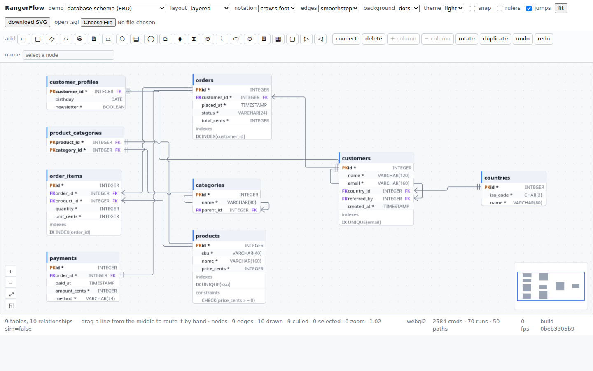

# RangerFlow — an interactive graph editor, and a schema designer on top of it

A React Flow-shaped node-graph core written entirely in Ranger, drawn through
**EVG** rather than the DOM, and rendered on the **GPU**. Its first real domain
is a database ER diagram / UML class editor, because that is the use case that
exercises every hard part of a graph editor at once — field-level ports, edge
routing, auto-layout, large graphs — and produces something worth having.

```text
                     RangerFlow core
                            │
      ┌─────────────────────┼─────────────────────┐
      │                     │                     │
  ERD editor           UML editor          (workflow, call graphs, …)
      │                     │                     │
      └─────────────────────┼─────────────────────┘
                            ↓
                        FlowScene
                            ↓
                           EVG
              ┌─────────────┼──────────────┐
          WebGL 2         PDF            SVG / HTML
```



## Run it

```bash
npm run rangerflow:test        # 399 assertions: model, forces, router, editor, SQL, export
npm run rangerflow:demo        # the e-commerce schema → SVG, PDF, HTML, JSON, scene
npm run rangerflow:uml         # the same pipeline for a UML class diagram
npm run rangerflow:flowchart   # an ATK flowchart in ISO 5807 shapes
npm run rangerflow:org         # an organisation chart
npm run rangerflow:process     # a swimlane process
npm run rangerflow:force       # React Flow's force-layout example, in Ranger
npm run rangerflow:bench       # layout / scene / drag timings at 500 nodes
npm run rangerflow:drag        # drop every node everywhere, count the lines left crossing
npm run rangerflow:demo:web    # build the page, serve it, open a browser
npm run rangerflow:web:serve   # …the same without opening anything
npm run rangerflow:web:test    # …or run all nine demos in headless Chrome
npm run rangerflow:parity      # score it against React Flow — see below
npm run rangerflow:rivals      # …and against JointJS and Syncfusion
npm run rangerflow:sdl:run     # the same editor in a native SDL2 + OpenGL window
```

## The demos, in a browser

`npm run rangerflow:demo:web` builds the static page, serves it, and prints
the URLs. They are the same editor with different graphs in it — the `demo`
dropdown in the page switches between them, and `?scenario=` picks one on load:

| | |
| --- | --- |
| [`?scenario=erd`](http://localhost:8080/?scenario=erd) | a 9-table database schema, parsed from `fixtures/ecommerce.sql`, crow's foot notation, field-level ports |
| [`?scenario=uml`](http://localhost:8080/?scenario=uml) | a UML class diagram — the same compartment node with different words in it |
| [`?scenario=force`](http://localhost:8080/?scenario=force) | React Flow's force-layout example: d3-force running live, and a node you drag pins while you hold it |
| [`?scenario=flow`](http://localhost:8080/?scenario=flow) | a plain flowchart — the core with no domain on top of it |
| [`?scenario=atk`](http://localhost:8080/?scenario=atk) | an ATK chart in the ISO 5807 shapes: diamond, drum, parallelogram, wavy-footed page |
| [`?scenario=org`](http://localhost:8080/?scenario=org) | an organisation chart, units coloured, the matrix report dashed |
| [`?scenario=process`](http://localhost:8080/?scenario=process) | a swimlane process — drag a lane and its steps come with it |
| [`?scenario=mindmap`](http://localhost:8080/?scenario=mindmap) | a mind map, branches balanced either side of the root |
| [`?scenario=radial`](http://localhost:8080/?scenario=radial) | the same graph as a radial tree, a generation per ring |
| [`?scenario=activity`](http://localhost:8080/?scenario=activity) | a UML **activity** diagram — actions, a fork and a join, signals sent and received, a wait |

Drag to pan, wheel to zoom, **two fingers to scroll around** and pinch to zoom,
shift-drag to box select, drag *or click* a handle to connect, **right-click
for a menu**, `Delete`, `Ctrl+Z`, `f` to fit. **Download SVG** exports whatever is on screen, and
**open .sql** reads a schema in the tab without uploading it anywhere.

The second row is a **toolbar**, and it is not a demo of a toolbar: every
button calls one method on the app, which calls one method on `FlowEditor`, so
the same authoring runs in the SDL window and in a headless test.

| | |
| --- | --- |
| the shape buttons | add a node of that shape at the middle of the view, selected and ready to be named — the ISO 5807 set, and the UML activity one |
| **connect** | React Flow's `connectOnClick`: click the source, click the target. Clicking the pane cancels |
| **+ column** / **− column** | on a schema table: add a column, or drop one. Greyed out on anything that is not a table |
| **rotate** / **duplicate** | a quarter turn, and a copy offset far enough to be visibly a copy |
| **delete** / **undo** / **redo** | the same three the keyboard does, for a reader who is holding a mouse |
| the **name** field | renames the selected node as you type — or double-click the label itself and type where it is |

Every scenario is checked on every `npm run rangerflow:web:test`: the page
drives itself through select → drag → undo → select-all → **add two nodes,
join them, rename one, undo it all** inside real headless Chrome, and reports
what the GL context actually did. A scenario cannot rot unnoticed behind the
default one, and neither can a toolbar button.

## …and in a window

`npm run rangerflow:sdl:run` compiles the whole thing to C++ and links it
against SDL2 and OpenGL. It is the same `FlowEditor`; only the layer that owns
the window differs, because the seam between them is the EVG display list.
See [`platform/sdl/README.md`](platform/sdl/README.md) — including what has and
has not been verified, and why the window is borrowed from the DataGrid.

## Why a graph core and a schema editor are the same program

The core knows about nodes, ports and edges, and nothing else. It has never
heard of a table. What makes an ER diagram out of it is one file —
`domains/erd/SchemaToGraph.rgr` — that maps a `DatabaseSchema` onto that
vocabulary, and one primitive the core does carry: the **compartment node**.

```text
┌─────────────────────────────┐        ┌─────────────────────────┐
│ customers                   │ header │ Customer                │
├─────────────────────────────┤        ├─────────────────────────┤
│ PK id          INTEGER      │ rows   │ -  id      : int        │
│    email       VARCHAR   ●  │        │ -  email   : string     │
│ FK country_id  INTEGER   ●  │        ├─────────────────────────┤
├─────────────────────────────┤        │ +  save()  : void       │
│ UNIQUE(email)               │        └─────────────────────────┘
└─────────────────────────────┘
```

A header, then sections of rows, with a **port opposite any row that asks for
one**. That last part is the difference between an ER diagram and a flowchart
with table-shaped boxes: a foreign key does not join two boxes, it joins two
*columns*.

```text
orders.customer_id ●────────────● customers.id
```

The UML class diagram is the same primitive with different words in it, which
is the argument for keeping the core free of tables: `domains/uml/UMLModel.rgr`
is 250 lines, and most of them are the model rather than the drawing.

## The shape is the sentence

A table and a class are both rectangles, so the model got away for a long time
with never saying what a node *looked* like. A flowchart cannot. A diamond is a
decision, a parallelogram is input or output, a drum is stored data, and a page
with a wavy foot is something printed — a reader who knows the convention has
read half the diagram before reading a word of it, and drawing all four as
rectangles does not make a plainer chart, it makes a wrong one.

`core/FlowShapes.rgr` is one function: a rectangle and a shape name in, a ring
of points out. The ring does three jobs, which is why there is only one of it:

- **drawing** — `FlowScene.polygon`, which every backend already handled, so a
  hexagon reaches the PDF, the SVG and the GPU by the road the rectangles took;
- **hit testing** — the editor asks whether the pointer is inside the ring, not
  inside the bounding box, so the corner beside a diamond is empty canvas the
  way it looks like it should be;
- **handles** — the anchor for a side is where that side's outline crosses the
  node's middle, so an arrow into a parallelogram ends on the slope rather than
  in the air beside it.

A table carries a port per row and needs no others. A shape has no rows at all,
so it gets the four side handles React Flow gives a node that declares none —
without them a box is drawn, selected, and impossible to connect to anything,
which is the first thing a reader tries. They are placed on the outline, so the
left handle of a diamond is its left-hand point and stays there when the node is
resized. The grab radius is eight screen pixels **or a quarter of the node's
shorter side, whichever is smaller**: zoomed far enough out, eight screen pixels
is the whole node, and a node that is all handle is a node you cannot select.

Curves are cut into segments rather than emitted as arcs, because the display
list has polygons and polylines and no beziers. A rounded end drawn as sixteen
segments is indistinguishable at any zoom a reader uses; a second code path
that only some backends implemented would be a rounded end in the browser and a
hexagon in the PDF.

The same rule caught a real one on the way in. `SceneItem.dash` was written
into the SVG as `stroke-dasharray` and dropped on the floor by the display
list, so an organisation chart's dotted matrix report came out dotted in the
PDF and **solid on the GPU**. The dashes are now cut in `FlowScene` — once, by
arc length — so both backends draw the same line by construction.

## Three more diagrams, and no more core

```text
  ╭────────╮   ┌ Asiakas ─────────────────────┐   ┌──────────────┐
  │  Alku  │   │ ╭──────╮      ┌──────────┐   │   │ Aino Virtanen│
  ╰───┬────╯   │ │ tilaa├──┐   │          │   │   ├──────────────┤
   ╱──┴──╱     └─╰──────╯──┼───┴──────────┴───┘   │ toimitusjohtaja│
      │        ┌ Myynti ───┼──────────────────┐   └───────┬──────┘
      ◇ ei ►   │       ┌───▼────┐    ◇        │       ┌───┴───┐
   kyllä       │       │ tarkista│ ► luotto?  │       ▼       ▼
```

- **ATK-kaavio** (`domains/flowchart/`) — the ISO 5807 shapes, `kyllä` / `ei`
  on the branches, and a `FlowKind` that says *what a step is* while
  `FlowKind.shapeFor` is the whole of the translation to *what it is drawn as*.
- **Organisaatiokaavio** (`domains/business/`) — a tree through the same
  layered layout, units coloured, and the matrix report drawn dashed because
  every organisation has one and no chart admits to it.
- **Uimaratakaavio** (`domains/business/`) — lanes as `nodeType = "group"`
  nodes, and the steps inside them carrying the lane's id in `parentId`. That
  is React Flow's sub-flow model, and it buys the behaviour that makes lanes
  worth having: **drag the lane and its steps come with it**, because
  `FlowEditor.beginDrag` takes a selected node's descendants as well as the
  node. It is not a coordinate space — a child's position stays absolute —
  which is the right simplification here: a swimlane is a region a step is
  *in*, not a canvas it is drawn on.

The lanes are placed by the domain rather than by a layout, and that is the
point rather than a shortcut: a swimlane's rows are *who does the work*, and a
layout free to move a box between rows is a layout free to reassign the work.
The columns still come from the links — longest path from the start — so a step
that waits for two others stands to the right of both.

A frame is also not an obstacle. `EdgeOverlap.blocks` skips group nodes, so a
line crossing a lane is not counted as a line drawn through a box: it is what a
lane is for, and counting it would drown the number that matters in noise.

## The text, which is most of the diagram

A diagram is mostly words — a table's name, its columns, a step's label, the
`kyllä` on a branch — and until now every one of them was cut off with an
ellipsis the moment it did not fit. That is the worst of the three possible
answers, and it was the only one implemented.

`core/FlowText.rgr` and `FlowView.layoutText` do them in the order a typesetter
would:

1. **Wrap.** Break at a space and take a second line. Free, and what the reader
   expects: "Merkitse jälkitoimitukseen" is two lines, not a shrunken one.
2. **Autofit.** Take the size down a step at a time until the block fits.
   Bounded at 68% of the base size — below that a label does not read as "this
   one is long", it reads as a bug.
3. **Cut.** Only when the first two have run out.

```text
   before                    wrap                     autofit
 ┌────────────┐        ┌────────────┐          ┌────────────┐
 │Tarkista as…│        │  Tarkista  │          │  Tarkista  │
 └────────────┘        │ asiakkaan  │          │ asiakkaan  │
                       └────────────┘          │luottotiedot│
                                               └────────────┘
```

The lines are cut out of the source **by position** rather than rebuilt from
copies of the words. That looks like a detail and it is the reason the caret
works: the layout can say which line a given character index landed on and how
far into it, so `"kaksi  väliä"` keeps both spaces and the caret does not drift
a character every time it passes one.

## Typing where the text is

A field in a toolbar edits one label at a time and you stop using it. So
**double-click puts the caret in whatever text is under the pointer** — a
table's name if you hit the header, a column if you hit a row, a step's label,
a branch's `kyllä`, a lane's name. `FlowEditor.textAt` resolves the point to a
tag (`node:<id>`, `row:<id>:<n>`, `row:<id>:<n>:type`, `edge:<id>`) and
everything downstream — drawing, undo — speaks the same vocabulary.

A column is two pieces of text, and they are edited for different reasons: the
name on the left, the type on the right. Which one you get is **which one you
pointed at**, worked out from where the renderer actually put the type rather
than from a guess — the alternative is a modifier key nobody discovers, or the
type not being editable at all, which is what it was.

The model is not touched until the edit is committed. That buys two things:
Escape is free, and one Ctrl+Z takes back the whole name rather than one
keystroke. Pressing on a different label commits the current one and starts
that one, so a reader can walk a diagram naming things without reaching for a
key in between.

While you type, the buffer is drawn **through the same wrap and the same
autofit** the committed text will get, in the same place, at the same size. An
editor that types into a plain box and reflows on commit is an editor that
surprises you at the last moment.

The browser needs one more piece. A canvas cannot receive a composed character,
a dead key, or anything a phone's keyboard produces, so a real `<input>` sits
offscreen, takes focus while a label is being edited, and has its value mirrored
into the editor on every input event — the input is a keyboard, not a source of
truth. A host without one (the SDL window, the test suite) types through
`typeText` / `backspace` / `moveCaret` and gets the same result.

### A schema you can change

Editable names are enough to fix a typo and no help at all when a table is
missing a column. So a table's columns can be **added and dropped**:

```
right-click a column  →  Lisää sarake tähän alle / Poista sarake / Muuta tyyppiä…
toolbar               →  + column  /  − column     (greyed out on anything that is not a table)
```

Three things have to happen together, and the seam is what makes them cheap:

- **The ports.** A column is a row *plus* a connection point on each side, so a
  foreign key can arrive from whichever side the other table is on. Those are
  not created by `addRow` — `layoutCompartments` already places a port opposite
  every row that names one, and it is the only code in the program that knows
  where row seven is. Inserting the row and asking for a relayout is the whole
  of it.
- **The width.** `layoutCompartments` sets the *height* from the rows; the
  width was decided once, by whoever built the node. A column added afterwards
  would run out of its own box, so `fitToRows` measures every row with the same
  arithmetic `paintRow` lays one out with.
- **The relations.** Dropping a column takes every edge that landed on it. An
  edge left pointing at a port that is gone is drawn from the middle of the
  table, which looks like a bug and is one.

One undo takes back the row, its ports *and* its edges — and because a
`FlowUndoEntry` holds the objects rather than a description of them, what comes
back is the same row, not a copy that looks like it.

The new column arrives with the caret already in its name. A placeholder called
`uusi_sarake` that you then have to find and double-click is a placeholder
nobody replaces.

## The layers

| Layer | Files | What it is |
| --- | --- | --- |
| Model | `core/GraphModel.rgr` | nodes, ports, edges, compartments, viewport, selection, hit tests |
| | `core/FlowShapes.rgr` | what a node is, as an outline: the twelve shapes, their handles, and point-in-shape |
| | `core/FlowText.rgr` | wrap, autofit, and the source positions that let a caret land on the right character |
| Routing | `core/EdgeRouter.rgr` | bezier / step / smoothstep paths, arrow and crow's-foot decoration |
| Interaction | `core/FlowEditor.rgr` | pan, zoom, drag, box select, connect, resize, snap, undo/redo, dragging an edge's corners by hand, typing into a label in place |
| Scene | `core/FlowView.rgr`, `core/FlowScene.rgr` | the picture, once, for four backends |
| Layout | `layout/ForceLayout.rgr`, `layout/LayeredLayout.rgr` | d3-force and a Sugiyama-style layered layout |
| Routing | `layout/EdgeLanes.rgr` | channel routing: a track per edge through each corridor, and a fan per shared port |
| | `layout/LayeredLayout.rgr` | dummy-vertex chains, so long edges are ordered, given room, and drawn round what is between their ends |
| | `layout/OrthoRouter.rgr` | an orthogonal visibility grid and a bend-charging Dijkstra, run as a repair pass for whatever the layout never saw |
| | `layout/TreeLayouts.rgr` | the radial tree and the mind map: measure a subtree, then hand it the share it earned |
| Parity | `harness/`, `tools/parity.mjs`, `tests/ParityDump.rgr` | React Flow and d3, asked the same questions and compared |
| Domains | `domains/erd/*`, `domains/uml/*` | schema and class models, and the two mappings |
| | `domains/flowchart/*` | the ATK chart: kinds, branch labels, and which shape each kind is |
| | `domains/business/*` | an organisation chart, and a swimlane process with real lanes |
| Export | `export/FlowExport.rgr` | PDF, HTML, SVG, scene JSON, graph JSON |

Everything above the scene is pure: no browser, no timers, no file system. That
is what lets `tests/RangerFlowTest.rgr` drive the editor exactly the way the
browser page does — `pointerDown`, `pointerMove`, `pointerUp` — and assert on
what came out.

## One scene, four backends

The EVG display-list note in [`../evg/gl/README.md`](../evg/gl/README.md) makes
the case: when five painters each walk the tree and decide again what a box
means, border-radius comes to work in PDF and silently not in PNG. A graph
editor is exactly the shape that goes wrong that way — the interactive renderer
wants flat quads sixty times a second, the exporter wants a laid-out document,
and nobody notices for a month that the printed diagram puts the crow's foot on
the other end.

So `FlowView` builds a `FlowScene` once, and the scene emits:

```text
FlowScene ──► EVGDisplayList ──► evg-webgl.js   (WebGL 2, SoftCanvas, SDL2)
          ──► EVGElement     ──► EVGPDFRenderer (PDF, with the fonts embedded)
                             ──► EVGHTMLRenderer(HTML)
          ──► toSvg()                           (SVG)
```

Every edge is built once as a path and consumed three ways — as an SVG `d`
string for the document backends, as a flattened polyline for the GPU and for
hit testing, and as a length and mid-point for placing a label. The PDF and the
editor cannot draw different lines because there is only one line.

**PDF is not a screenshot.** `export/FlowExport.rgr` hands the EVG tree to
`EVGPDFRenderer` with a `FontManager` loaded, so the text is real text in an
embedded TrueType face, measured by the same engine EVG lays out with:

```bash
npm run rangerflow:demo
# out/rangerflow-erd.pdf   — 1 page, A3 landscape, NotoSans embedded, selectable text
```

## The force layout is d3-force, on purpose

The benchmark this started from is React Flow's force-layout example, which is
`@xyflow/react` wired to `d3-force`. Matching it means matching the *model*, so
`layout/ForceLayout.rgr` reproduces d3's parameter names, defaults, alpha
schedule and velocity integration:

```text
alpha += (alphaTarget - alpha) * alphaDecay
forces apply, writing into node.vx / node.vy
x += (vx *= velocityDecay)          — unless the node is pinned
```

with `forceManyBody` on a Barnes–Hut quadtree (`w²/θ² < l²`), `forceLink` with
d3's degree-derived strength and bias, `forceX`/`forceY`, `forceCollide` and
`forceCenter`. Even d3's LCG is reproduced value for value, so the jiggle that
separates coincident nodes is reproducible across runs, machines and target
languages — a layout that moves when nothing changed cannot be regression
tested. `npm run rangerflow:force` settles in **300 ticks**, which is what d3's
default `alphaDecay` gives you.

The quadtree's `cover` is d3's too — the root cell starts as the unit square at
`floor(min)` and doubles until it strictly contains the far corner. That looks
like pedantry until you measure it: squaring the bounding box instead, which is
the obvious thing, puts the subdivision lines somewhere else and leaves the
layout **23 px per node** away from d3's after a single tick. With d3's cover it
is 0.010 px, and 0.06% of shape error after three hundred.

What is still not bit-for-bit d3: the jiggle. d3 gives each force its own
seeded generator and RangerFlow has one, so exactly-coincident points get a
different 1e-6 nudge. That is the residue in the table above.

Dragging pins the node through `fx`/`fy` exactly as the example does — the
simulation may not move what your hand is holding.

## Following one line out of nine

An orthogonal router turns each edge at the midpoint between its ends. That is
right for one edge and wrong for nine: nine edges crossing the same gap all
pick the same midpoint, and their long perpendicular runs land on top of each
other. The second half of the problem is worse and less obvious — several
foreign keys pointing at one primary key **share a port**, so they arrive at
literally the same point and their approach runs are the same line drawn three
times.

`layout/EdgeLanes.rgr` is the standard answer to the first, **channel
routing**, and the matching answer to the second, a **port fan**:

```text
before                          after
────┐                           ────┐
────┤  ← four edges, one line   ───┐│
────┤                           ──┐││
────┘                           ─┐│││
```

1. Each edge's *trunk* is its perpendicular run between the two gapped
   endpoints. Two trunks **conflict** when they would be drawn within
   `spacing` of each other and their spans overlap — only then can they be
   mistaken for one line.
2. Conflict is transitive in practice (a stack of four is one problem, not
   three), so the conflict graph's connected components are found with
   union-find, and each component is a corridor.
3. Within a corridor the edges are ordered by the middle of their span — the
   ordering that keeps the tracks from crossing each other — and spread
   symmetrically about the corridor's centre, clamped to the corridor's own
   width so a track is never pushed back through the node it came from.
4. Edges that share an arrival — a named port, or a node side when there is no
   port — are fanned across it, ordered by where they come from. The fan stays
   inside the row, because the point of a field-level port is that the edge
   visibly meets *that column*.

**Measured, because "looks tidier" is not a number.** `EdgeOverlap.pairs`
counts the pairs of edge segments that are parallel, within a tolerance of each
other, and overlapping along their shared axis — exactly the situation where
two edges read as one line. On the nine-table fixture:

| | before | after |
| --- | ---: | ---: |
| segments drawn on top of each other (2 px) | 16 | **1** |
| segments within 8 px | 27 | 12 |
| the UML diagram, both tolerances | 12 | **0** |

Most of the twelve that remain at 8 px are the fan itself: three arrivals
spread across a 19-pixel row are about six pixels apart, which is as much room
as the row has, and spreading them further would point them at the wrong field.
They separate immediately after leaving it. The one left at 2 px is a nine-pixel
sliver where two port stubs on unrelated tables pass within a pixel and a
quarter of each other — both are pinned to their own field's row, so no track
can move them.

### The order of the tracks in a corridor

Giving every edge its own track says nothing about **which** track. Ordering
them by the midpoint of their span is the obvious guess, and on the shape that
matters most it is exactly backwards. Three classes inheriting from one: each
edge goes down, across, and down again, and if the one that reaches furthest
turns *first*, its long run passes through a neighbour that is still on its way
down.

```text
ordered by span                 ordered to cross least
┌───┐  ┌───┐  ┌───┐             ┌───┐  ┌───┐  ┌───┐
│ A │  │ B │  │ C │             │ A │  │ B │  │ C │
└─┬─┘  └─┬─┘  └─┬─┘             └─┬─┘  └─┬─┘  └─┬─┘
  └──────┼──┐   │                 │      │   ┌──┘
         └──┼───┼──┐              │      └───┼──┐
            │   │  │              └──────────┼──┼──┐
          ↓ ↓   ↓  ↓                       ↓ ↓  ↓  ↓
        A crosses B and C              nothing crosses
```

So after the span sort comes a **transpose pass**: walk the neighbouring pairs
and swap whenever swapping costs fewer crossings, which is the same heuristic a
layered layout already runs over the nodes in a row, applied to the tracks in a
corridor. The cost of putting `u` nearer than `v` is two questions — does `v`'s
incoming stub land inside `u`'s span, and does `u`'s outgoing stub land inside
`v`'s — because nothing else can cross.

`EdgeOverlap.edgeCrossings` counts lines drawn *through* each other, the way
`pairs` counts lines drawn *on* each other, ignoring the meetings near an edge's
own ends where several edges are supposed to converge on one table:

| | before the pass | after |
| --- | ---: | ---: |
| UML class diagram, laid out | 2 | **0** |
| e-commerce schema, laid out | 11 | 9 |
| UML, averaged over 748 drag positions | 1.88 | **0.24** |
| schema, averaged over 1261 drag positions | 8.02 | 6.63 |

The nine that remain on the schema are eight the layout itself produces before
any routing — a layered layout minimises crossings, it does not abolish them —
and one the dummy chain adds in exchange for the node it stops being drawn
through, which is the better trade.

### …and round what stands in the way

Channel routing gives an edge its own track. It does not help when something is
*standing* in the track, and the classic answer to that is the other half of
Sugiyama's method: an edge spanning more than one layer is replaced, for the
duration of the layout, by a chain of **dummy vertices** — one in each layer it
crosses.

```text
without dummies                 with dummies
┌───┐                           ┌───┐
│ a ├──────┬────────┐           │ a ├───┐   ┌───┐
└───┘   ┌──┴──┐     │           └───┘   └───┤ · │  ← a dummy holds the lane
        │  b  │     │                   ┌───┴───┘     open through b's layer
        └─────┘  ┌──┴──┐        ┌─────┐ │       ┌─────┐
         ↑ drawn │  c  │        │  b  │ └───────┤  c  │
           over  └─────┘        └─────┘         └─────┘
```

That buys two things at once, and the second is the one that surprised us:

- the dummies take part in the **crossing-reduction sweeps**, so a long edge is
  ordered against everything else instead of being ignored by the pass that is
  supposed to untangle it;
- they take **room** in their layer, so the real nodes move aside. The obstacle
  is largely gone before any routing happens — the placement does most of the
  work, and `LayeredLayout.useDummies` exists so the difference can be measured
  rather than asserted.

Afterwards the chain is thrown away and its positions become the edge's
**waypoints**: the corners it is drawn through, handed to the same `bendPath`
that rounds the stepped router's corners. Back edges — the ones the layering
reversed to break a cycle — are walked in the author's direction and leave the
node on the side they are actually travelling towards, which is the difference
between a route that goes round the outside and one that doubles across itself
on the way out.

`EdgeOverlap.nodeCrossings` counts the times an edge is drawn straight through
a node it has nothing to do with, which is what "routes around obstacles"
means. On the schema fixture it goes **1 → 0**; on a graph built to need it
(four layers, an edge from the first to the last) it is 2 → 0, and with
`useDummies = false` the same graph keeps its crossings.

Once a node has been **dragged by hand** the waypoints are dropped rather than
recomputed: a route around an obstacle that has since moved is worse than no
route at all, so the edge falls back to the corridor router.

### …and round what the layout never saw

The chains go round what the layered layout knows about, because the layout put
it there. A node the *reader* drags into the middle of a corridor is a different
problem, and it needs a router that works from geometry rather than from
layering. `layout/OrthoRouter.rgr` is that router: an **orthogonal visibility
grid** — every obstacle's edges, plus a line down the middle of every gap wide
enough to walk through — searched by Dijkstra over `(cell, arrival axis)`, so a
turn can be charged for and the result comes out with as few bends as the
detour allows.

It runs as a **repair pass**, not a replacement. `OrthoRouter.repairAll` only
touches edges that are actually drawn through something, and if the route it
finds still crosses something it puts the old one back — one bad line is better
than a different bad line plus the churn. Clearance is a preference rather than
a requirement: it tries a full margin first, then half, then three pixels, and
the stub that holds an edge straight as it leaves its port is given up the same
way, because a box dropped within a stub's length of a port walls the search in
before it has taken a step.

The number that says whether it works is not a screenshot. `npm run
rangerflow:drag` drops **every node at every point on a grid**, re-routes the
way the browser does on pointer-up, and counts the drops that leave a line drawn
through a table:

| | drops | still crossing |
| --- | ---: | ---: |
| e-commerce schema, 9 tables | 1261 | **2** (0.16%) |
| UML class diagram, 6 classes | 429 | **0** |

The two are the same table dropped into a gap barely wider than itself, where
the edges that have to cross the gap have nowhere else to be. The suite runs a
smaller version of the same sweep, so a change that breaks this fails a test
rather than a screenshot.

### …and where the reader says, instead

A router is a suggestion. Grab any **interior segment** of a stepped edge and
drag it: a vertical run slides left and right, a horizontal one up and down, and
nothing goes diagonal, because orthogonality is the property the whole router
exists to keep. The first and last segments are not on offer — they touch a
port, and sliding one would detach the edge from the column it is supposed to
point at, which is the whole point of a field-level port.

A hand-placed route sets `FlowEdge.pinnedRoute`, and after that the lane pass,
the repair pass and the layout all leave it alone: overruling the reader is
worse than a crossing. Undo puts the routing back in the router's hands.

## The other two, measured differently

React Flow can be an oracle: it is MIT, it is on npm, and the harness asks
**its own functions** the questions RangerFlow is asked. Neither JointJS nor
Syncfusion works that way, and `npm run rangerflow:rivals` says so at the top of
its own output rather than quietly scoring them the same way:

| | Licence | Oracle | What is scored |
| --- | --- | --- | --- |
| React Flow | MIT | **yes** | pixels of difference, and behaviour |
| JointJS 4 | MPL-2.0 | possible, not built | its published feature list |
| Syncfusion EJ2 | commercial | **no** — not installed, not run | its published feature list |

Syncfusion's npm package says `SEE LICENSE IN license`. It is not installed
here and not used to compute anything; its rows are quoted from its own **Key
features** list and the enumerations in its public source, because the
denominator has to be their claim about themselves. For JointJS an oracle
*would* be possible — it is not built because the families worth comparing that
way are already measured against React Flow to two thousandths of a pixel.

|  | first pass | honest statuses | now |
| --- | ---: | ---: | ---: |
| JointJS 4 | 29/48 (60%) | 39.5/48 (82%) | **45/48 (94%)** |
| Syncfusion EJ2 | 38.5/62 (62%) | 53.5/63 (85%) | **59/63 (94%)** |

The middle column is not a jump in capability; it is a correction. The meter
used to **guess** a row's status from whether it had a note — a probe plus a
note scored half a feature, a probe alone scored a whole one — and that was
wrong in both directions. Half the notes say what our version is *called*
rather than what it *lacks* ("smoothstep", "layered (Sugiyama)"), and those
were being scored as half a feature; meanwhile a row carrying a real
limitation would have read as whole the moment somebody tidied the note away.
The status is a written-down field now, sitting next to the evidence for it,
and the meter fails loudly on a row that claims one without naming a probe —
or that still says `todo` beside a probe that passes.

Five layout rows were also leaning on the `fitView` probe, which proves the
viewport algebra and nothing whatever about the layout under it. Each has its
own probe now, asserting what its layout is *for*: parents above children,
linked nodes nearer than unlinked ones, a long edge carried through a chain of
corners, and no two boxes sharing a pixel.

The meter is what drove the work, and what it found was worth having:

- **Nine more shapes** — triangle, right triangle, plus, star, and the regular
  polygons from pentagon to decagon, plus an outline the caller supplies
  (`shapePoints`, unit coordinates across the box). The probe checks that
  **the point a label is drawn at is inside the shape**, which caught the right
  triangle: the centre of its box sits exactly on the hypotenuse, so its text
  was half outside itself.
- **The rest of ISO 5807** — paper tape, direct data, magnetic tape, sort,
  multi-document, collate, OR, internal storage. Several of these are an
  outline *plus a rule drawn on it* — the bar across a sort, the cross in an OR
  junction, the corners of the sheets behind the front page of a stack — which
  the shape system had no way to express. It does now, as points, so they reach
  the PDF and the GPU by the road the rectangles took. The same mechanism
  replaced the one hand-written special case that was already there, the
  cylinder's lid.
- **The UML activity vocabulary** — a different language from the class diagram
  next door. An action is a rounded box, a fork is a bar, a signal sent is a
  box with a point pushed out and one received is a box with a bite taken out,
  a wait is an hourglass, and the diagram starts and ends on filled circles.
  The hourglass has almost no room *in* it, so its wait is written underneath
  it as an annotation — which is what UML does and what the annotation
  mechanism below is for.
- **Three more router families** — a curve (a spline that passes **through**
  the link's vertices, with a tension, as against a bezier whose shape is fixed
  by the two port normals), a metro line (orthogonal with every corner cut to
  45°, chamfered by no more than half the shorter leg so a short run cannot be
  eaten), and a one-side route (out, along and back, all on one face).
- **Several annotations per object.** A node had a label — the name of the
  thing, in the middle — and that was the whole of the text it could carry. A
  real diagram wants a step number in one corner, a cost in the other, an SLA
  above the arrow. The offset is a **fraction** of the object rather than a
  distance, so an annotation pinned under a box stays under it when somebody
  makes the box taller.
- **Rotation**, done at the four functions on `FlowNode` that every piece of
  geometry already went through. The outline turns; the hit test turns the
  **question** back into the node's own frame instead, which is one point to
  rotate rather than thirty; the ports come along for free, and so does every
  shape and every custom polygon. The text stays upright — which is why that
  row is scored `partial` and not `done`.
- **A context menu and tooltips.** The menu is built from what is under the
  pointer rather than being one menu with most of it greyed out, and its
  geometry lives on the view so that the row you can *see* and the row you can
  *press* are computed by the same arithmetic. A tooltip says nothing when
  there is nothing to say: one that repeats the label teaches the reader to
  ignore tooltips.
- **Walking the graph** — neighbours, predecessors, successors, breadth first,
  depth first, connected component. The graph already knew how connected each
  node was; what it could not tell you was *what to*.
- **Pinch to zoom**, keeping the contract the wheel keeps: the flow point
  between the fingers stays between them — while they spread, and while they
  travel.
- **Element tools and highlighters** — a remove button and a connect button
  beside the selected node, and a halo, a mask or a fade on top of selection.
- **Line jumps** — where two lines cross, one hops over the other. JointJS
  calls it the `jumpover` connector, Syncfusion calls it connector bridging,
  and it is the only honest answer to a crossing you cannot route away: two
  lines meeting at a point are ambiguous about whether they join, and a hop
  says they do not. Done on the flattened polyline in the coordinates it is
  drawn in, so every backend gets it.
- **A radial tree and a mind map** — `layout/TreeLayouts.rgr`. Both are the
  same two passes: measure what each subtree needs, then hand each child the
  share it earned. The ring radii and the level gaps are *measured* from the
  boxes rather than picked, because thirteen boxes a hundred and sixty wide do
  not fit on a circle of radius a hundred and seventy however tidy the number.
- **A JSON reader** — a diagram you can save and not open is a diagram you have
  lost. Writing it exposed the defect the writer had all along: `toJson` never
  wrote an edge's **label**, so a saved flowchart came back with every `kyllä`
  gone, silently.
- **Data binding** — a flat array of records each naming its own parent, which
  is what `dataSourceSettings` means and what a REST call gives you.
- **Rulers** — a scale in flow units down two edges of the surface, ticked on
  the 1-2-5 progression a chart axis uses.

What is still missing is listed in [`docs/RIVALS.md`](docs/RIVALS.md) as `todo`
rather than left out: BPMN (a whole notation of its own), image elements,
PNG/JPEG encoders, a link whose endpoint is another link, and drag-and-drop out
of the palette. Three rows are `partial` and say what is narrower: rotation
leaves the text upright, the palette adds rather than being dragged from, and
page size reaches the export but is not drawn on the surface. A `todo` row
means we do not have it — there is no row there that means "probably fine".

## Parity is measured, not claimed

A scorecard we wrote from imagination would only measure our imagination. So
`npm run rangerflow:parity` installs `@xyflow/system` — the package React Flow
is built on — and asks **React Flow's own functions** the questions RangerFlow
is asked, then compares the numbers:

```text
Edge geometry        ████████████████████████ 320/320  worst 0.002 px   getBezierPath, getStraightPath, getSmoothStepPath
Viewport algebra     ████████████████████████  32/32   worst 0.000 px   pointToRendererPoint, rendererPointToPoint
fitView              ████████████████████████  36/36   worst 0.000 px   getViewportForBounds
Node bounds          ████████████████████████   2/2    worst 0.000 px   getNodesBounds
Selection overlap    ████████████████████████   5/5    worst 0.438 px   getRectsOverlappingArea

force layout vs d3-force
  tick   0  max   0.000 px   rms  0.000 px   shape error 0.00%
  tick 300  max   1.414 px   rms  0.480 px   shape error 0.06%

behaviour  ██████████████████████·· 46/51 capabilities, every one proved by a probe
overall 98.6%
```

Edge paths are compared by **resampling both curves by arc length**, not by
string equality — what matters is whether the line goes through the same
places. The force layout is compared to d3 tick by tick, and by a **shape
error** over every pairwise distance, because two layouts that differ by a
rotation are the same layout.

The behavioural half is not a checklist either: the capability list is
React Flow's documented feature set, and a row may only say `done` if a named
probe in [`tests/ParityDump.rgr`](tests/ParityDump.rgr) drove the real
`FlowEditor` through `pointerDown` / `pointerMove` / `pointerUp` and passed. No
probe means `todo` however finished it feels; a failing probe turns the row
red, which is worse than `todo` because it means the documentation lies.

The full report is [`docs/PARITY.md`](docs/PARITY.md), regenerated on every
run. [`docs/FEATURES.md`](docs/FEATURES.md) is the narrative version, and also
covers the ER-diagram side against `db-schema-viewer` (MIT).

**The meter earns its keep.** Its first run scored 63.8% and found three real
divergences that no amount of reading would have: the orthogonal router
disagreed with `getSmoothStepPath` by up to 311 px whenever the two handles did
not face each other; `fitView` read React Flow's `padding` as a fraction of the
viewport when it is really "how much bigger than the content the frame should
be", framing every diagram at the wrong zoom; and the Barnes–Hut quadtree
squared its bounding box where d3 doubles from the first point, which moved
every node 23 px after a single tick. All three are fixed, and the numbers
above are what the meter says now.

Still `todo`, and the meter says so: edge reconnection by dragging an end,
sub-flows (`parentId` is carried but not enforced), a node toolbar, pinch-zoom
gestures, helper lines, `panOnScroll`, `connectOnClick`, and a drag-handle
selector.

## Performance

`npm run rangerflow:bench -- 500`, Node 22 in this container:

| Step | 500 nodes / 570 edges |
| --- | --- |
| force layout, 300 ticks | 265 ms |
| layered layout | 7 ms |
| scene build, fit to screen | 13 ms (303 of 500 nodes drawn, 197 culled) |
| scene build, 1:1 zoom | 15 ms (25 drawn, 475 culled) |
| display-list JSON | 55 ms / 568 KB |
| node drag, 60 frames | 184 ms — **3.1 ms/frame** |

Culling is the number to watch: React Flow renders only what the viewport
contains, and with no DOM to do it for us `FlowView` drops off-screen nodes
while building and reports how many, so a benchmark can see the difference
rather than take it on faith.

## The browser page

`npm run rangerflow:web` produces a static directory: an HTML file, one
compiled script, the shared `evg-webgl.js`, three font files and a `.sql`.
There is no host process — Ranger compiles to JavaScript, so the editor simply
*is* in the page:

```text
hosted                                  standalone
browser event → POST → app              browser event → FlowEditor    (this tab)
GET /scene.json → list → GL             app.frame() → list → GL       (this tab)
```

A `.sql` you open with the file picker is read in the tab and never uploaded.

**Is it really WebGL?** "webgl2" is a label the page writes about itself, so
`npm run rangerflow:web:test` checks the facts under it: that the context is a
`WebGL2RenderingContext`, that it has the stencil buffer a filled path needs,
that the scene left GL draw calls behind, and that no fill was skipped. It also
drives a scripted session inside the page — select a table, drag it, undo,
select all — and writes the verdict where headless Chrome's `--dump-dom` reads
it back. There is no browser-driver library here, so the page tests itself.

## Importing a schema

```bash
# any CREATE TABLE dump; the reader takes the DDL subset that carries shape
node gallery/rangerflow/bin/rangerflow_demo.js
```

`domains/erd/SqlSchemaReader.rgr` reads tables, column types and nullability,
primary keys, unique constraints, checks, indexes, and foreign keys — inline
`REFERENCES`, table-level `FOREIGN KEY`, and the `ALTER TABLE … ADD CONSTRAINT`
form most dumps actually use. It tolerates backtick / bracket / double-quote
quoting, `IF NOT EXISTS` and schema-qualified names, and skips what it does not
understand rather than failing on it.

Cardinality is inferred rather than declared: a foreign key is many-to-one
unless the columns it starts from are unique, and optional when they are
nullable. That single rule is what turns

```sql
CREATE TABLE payments (order_id INTEGER NOT NULL UNIQUE REFERENCES orders(id));
```

into a one-to-one, and it is drawn as crow's foot, UML or a plain arrow without
the model changing a byte — the notation is a rendering choice, made in
`EdgeDecoration`.

The repository already has a full SQL parser in [`../rangersql`](../rangersql);
when the two meet, this reader becomes a thin adapter over that AST.

## Where it goes next

1. **A live schema inspector** behind one interface, so DuckDB, SQLite and
   RangerDB can all answer "what tables do you have" and the editor cannot tell
   which one did.
2. **ERD → SQL**: the model is already the right shape for a `CREATE TABLE`
   generator, which turns the viewer into a designer.
3. **SDL2 + OpenGL**, which the display-list seam already makes possible — the
   scene compiles to C++ with everything else.
