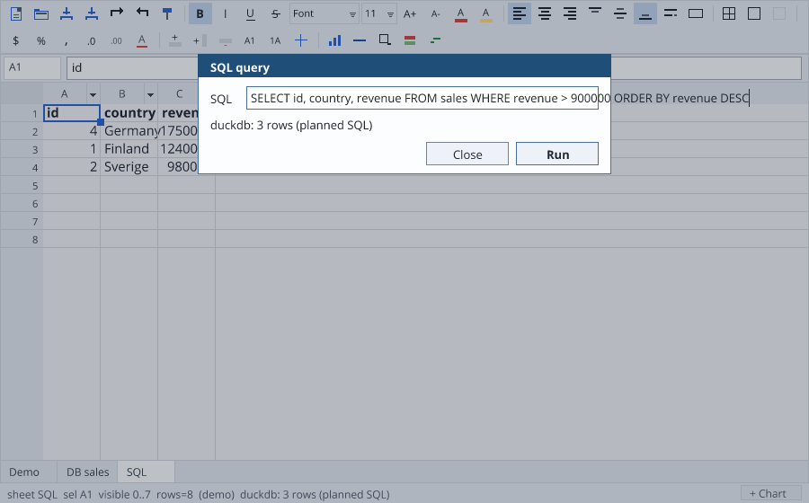

# RangerSQL — a SQL parser, generator and transpiler in Ranger

SQLGlot-inspired, not a SQLGlot port: the same architecture, at the scale one
language runtime can carry, and measured against SQLGlot's own test corpus.

```text
SQL text
   ↓
Tokenizer          one tokenizer, dialect-configured
   ↓
Parser             precedence climbing + recursive descent
   ↓
Common AST         a flat arena of nodes addressed by int
   ↓
 ┌──────────────┬────────────────┬──────────────┐
 ↓              ↓                ↓
Generator     Analysis         Planner
 ↓            (later)            ↓
SQLite / Postgres / MySQL     RangerDB QuerySpec
```

```bash
npm run rangersql:test       # the pieces: tokenizer, tree, generator, dialects
npm run rangersql:identity   # SQLGlot's 980-statement identity corpus
npm run rangersql:oracle     # …and what SQLGlot itself says about our output
npm run rangerdb:ddl:test    # the DDL, applied to a schema and compared with SQLite
```

## DDL

`CREATE TABLE` / `VIEW` / `INDEX`, `ALTER TABLE`, `DROP` — the statements a
schema is made of, and the largest single item this scoreboard has ever had.

A column's constraints are an ordered **list** of small nodes whose text is the
keyword phrase, rather than a set of booleans on the column. `INT NOT NULL
DEFAULT 1` and `INT DEFAULT 1 NOT NULL` mean the same thing and are not the same
text, and a formatter that cannot tell them apart cannot round-trip either.

What reads it is [`DdlToSchema`](../rangerdb/src/schema/DdlToSchema.rgr), which
lives in `rangerdb` rather than here: it needs a parser *and* a
`DatabaseSchema`, and `rangerdb` already imports this library. The other way
round would make the parser depend on the database layer that depends on the
parser.

`CREATE FUNCTION` is deliberately absent. Its body is a dialect's own
procedural language, which is a different grammar rather than more of this one,
and none of it describes the shape of a table.

## Where it is

Against [SQLGlot's own `tests/fixtures/identity.sql`](tests/fixtures/README.md)
— 980 statements it parses and regenerates character for character:

| | count | |
| --- | ---: | --- |
| **identical** | **611** | parsed and came back out the same |
| differs | 3 | parsed, regenerated differently (2 are optimizer hints) |
| unparsed | 366 | the grammar does not cover it yet |

Cross-checked against SQLGlot itself — for the 522 statements RangerSQL parses,
does SQLGlot read our output as the *same query*?

```text
byte-identical output        611
SQLGlot reads it the same    609
SQLGlot reads it DIFFERENTLY   2      (optimizer hints: we print the comment
                                       after the SELECT list, not before it)
SQLGlot could not read ours    0
(SQLGlot cannot read 3 of its own corpus lines either)
```

That last line is not a footnote. `DROP TABLE a, b` is in SQLGlot's own
`identity.sql` and sqlglot 30.x raises on it, so the oracle used to parse the
original and our output inside one `try` and report a failure on the *original*
as "could not read OURS". Our output there is byte-identical to the corpus, so
a stated invariant looked broken by a change that had changed nothing. The two
are parsed separately now, and the two facts are counted apart.

That distinction is the point of the oracle: a different spelling is a
formatting difference; a different tree would be a bug.

What the 458 are, largest first — this is the roadmap, measured rather than
guessed:

| lines | feature |
| ---: | --- |
| 35 | `(` after a statement: Teradata's index tails on `CREATE TABLE … AS` |
| 13 | `CREATE FUNCTION` — a body in a dialect's own procedural language |
| 7 | `GENERATED … AS IDENTITY` and its option list |
| 32 | `(` after a statement: `VALUES` lists, `PIVOT`, table functions |
| 9 | `INSERT OVERWRITE` |
| 9 | `:` — struct / map / slice syntax |
| 7 | `GROUPING SETS` |
| ~6 each | `AT TIME ZONE`, array slices `x[1:2]`, `UNION` inside `IN`, `LATERAL` |

## The decisions

### The AST is an arena, not an object graph

```ranger
def id (ast.newNode((SqlKind.binary()) "+"))
ast.attach(id (SqlRole.leftOperand()) left)
```

`SqlAst.nodes[45]`, not `node.parent.args["expressions"][0]`. A tree of objects
with parent pointers is pleasant on a garbage-collected target and painful on
Rust, C++ and Swift — and this library exists to compile to all of them. A node
carries a kind, its text, flags, and `(role, child)` pairs. Roles rather than
named slots, because a `SELECT` has nine kinds of child and inventing nine int
fields would be a worse version of the same list.

### Expressions climb precedence

One table of binding powers instead of a nest of rules called term / factor /
comparison / conjunction:

```text
OR 1   AND 2   NOT 3   comparisons, IS, IN, LIKE, BETWEEN 4
|| & | ^ << >> 5   + - 6   * / % 7   -> ->> 8   :: 9
```

`x BETWEEN 1 AND 2 AND y` parses the way SQL means it because the bounds are
parsed above `AND`'s power, not because of a special case.

### Comments belong to nodes

A comment is a token the parser hands to whatever it was written beside, and
the generator writes it back:

```sql
SELECT 1 /* c1 */ + 2 /* c2 */, 3 /* c3 */
```

round-trips exactly. A formatter that drops the one comment in a query is not a
formatter.

### One tokenizer, one generator, a dialect for the differences

```ranger
Sql.transpile("SELECT IFNULL(a, 0) FROM t" "sqlite" "postgres")
;; SELECT COALESCE(a, 0) FROM t

Sql.transpile("SELECT a FROM t LIMIT 10, 20" "mysql" "postgres")
;; SELECT a FROM t LIMIT 20 OFFSET 10

Sql.transpile("SELECT x::INT FROM t" "postgres" "sqlite")
;; SELECT CAST(x AS INT) FROM t
```

`SqlDialect` answers the handful of questions engines disagree on — which
characters quote a name, whether a backslash escapes inside a string, what a
function is called here, whether `NULLS LAST` exists. Adding MySQL was thirty
lines, not a second tokenizer.

### It is also RangerDB's query engine

[`gallery/rangerdb/src/SqlFront.rgr`](../rangerdb/src/SqlFront.rgr) plans a
parsed `SELECT` into the `QuerySpec` RangerDB already executes, and an
`INSERT` / `UPDATE` / `DELETE` into a `DBMutation`. SQL became a front end over
the existing execution rather than a second way into the engine — which is
exactly what a structured-first database API is for.

The planner refuses rather than guesses: a join, a subquery, an expression in
the projection, `OR` in a `WHERE`, an `UPDATE` with no `WHERE` — each comes back
as an error naming what was in the way. A planner that silently drops a clause
returns the wrong rows and looks like it worked.

And because the plan is a `QuerySpec`, a query typed into the spreadsheet's
**Ctrl+Q box** produces an ordinary editable sheet — sort, filter and
write-back keep working on it, rather than a read-only dump of a result set:



```bash
npm run datagrid:db:window          # …then Ctrl+Q
npm run datagrid:db:window:smoke    # the same box, driven headlessly
```

## Milestones

| | | status |
| --- | --- | --- |
| M0 | AST + JSON dump | done |
| M1 | tokenizer | done |
| M2 | precedence-climbing expression parser | done |
| M3 | SELECT / FROM / WHERE | done |
| M4 | JOIN / GROUP / HAVING / ORDER / LIMIT | done |
| M5 | AST → SQL generator | done |
| M6 | SQLite dialect | done |
| M7 | PostgreSQL dialect | done |
| M8 | SQLite ↔ Postgres transpile | done |
| M9 | INSERT / UPDATE / DELETE | done |
| — | window functions, CTEs, set operations, comments | done |
| M10 | CREATE / DDL | next, and the largest corpus bucket |
| M11 | AST visitors and transforms | `walk` / `findKind` exist; `transform` does not |
| M12 | table and column analysis | not started |
| M13 | scope resolver | not started |
| M14 | lineage | not started |
| M15 | simplify / normalize optimizer | not started |
| M16 | MySQL dialect | quoting and NULLS ordering only |
| M17 | wider SQLGlot compatibility | the 458 above |

## Portability

The whole library is ordinary Ranger: no host bindings, no operator templates.
It compiles for all 12 Ranger targets, and the RangerDB suite that now includes
the SQL front end passes identically on **JavaScript, Python and native C++**
(94/94 each) from this same source.

## Files

| File | What is in it |
| --- | --- |
| `src/core/Token.rgr` | the token, and what kinds there are |
| `src/core/Tokenizer.rgr` | text → tokens, comments and string prefixes included |
| `src/core/Parser.rgr` | precedence climbing, statements, error positions |
| `src/core/Sql.rgr` | `parse` / `format` / `transpile` |
| `src/ast/SqlAst.rgr` | the arena: kinds, roles, flags, `walk`, JSON |
| `src/dialects/Dialect.rgr` | generic, SQLite, Postgres, MySQL |
| `src/generators/Generator.rgr` | AST → SQL |
| `tests/RangerSqlTest.rgr` | the pieces, in the small |
| `tests/IdentityTest.rgr` | the corpus, with a baseline that fails on regression |
| `tools/sqlglot_oracle.py` | what SQLGlot says about our output |
