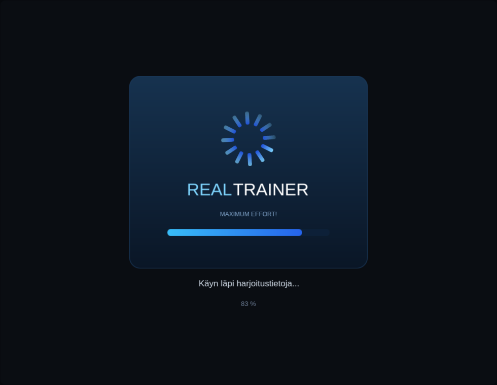
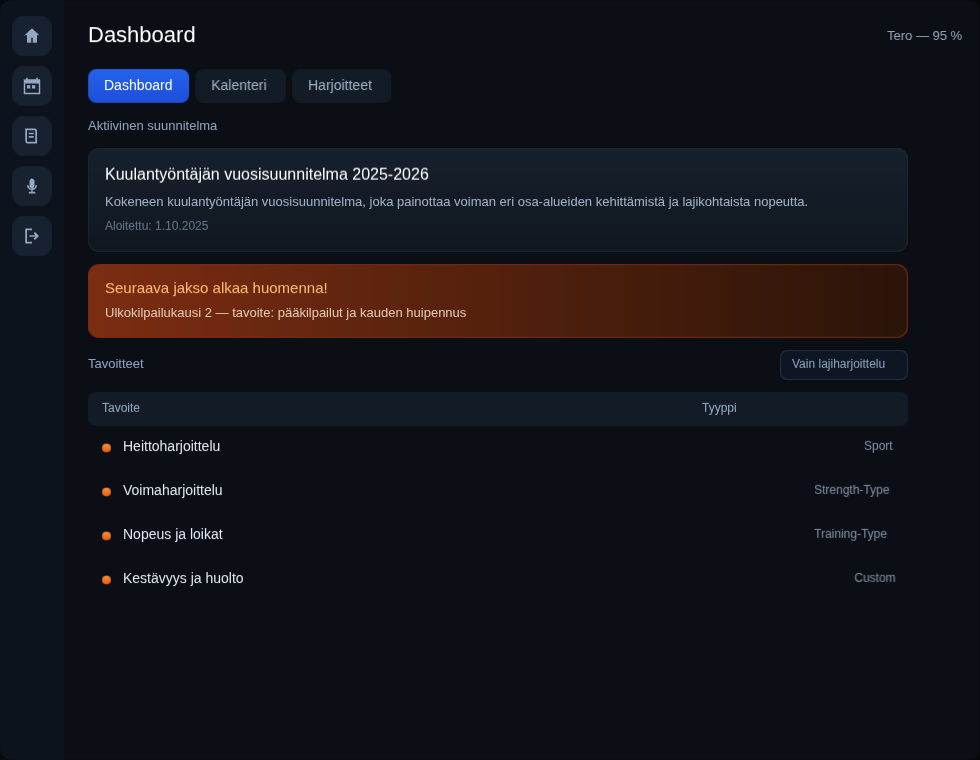
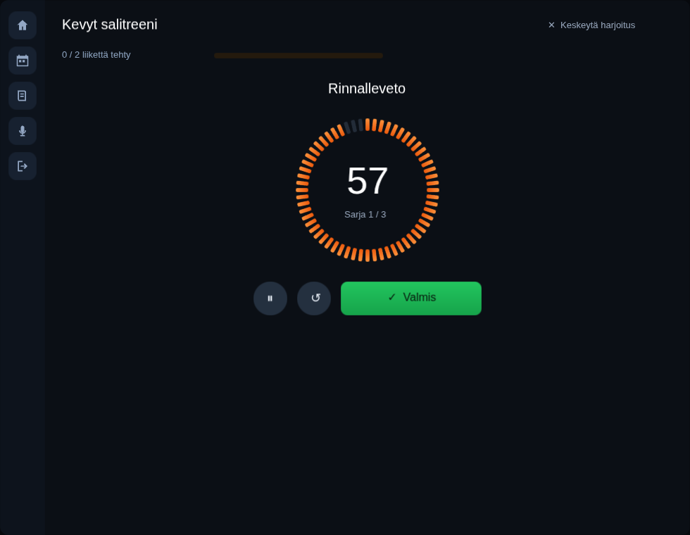
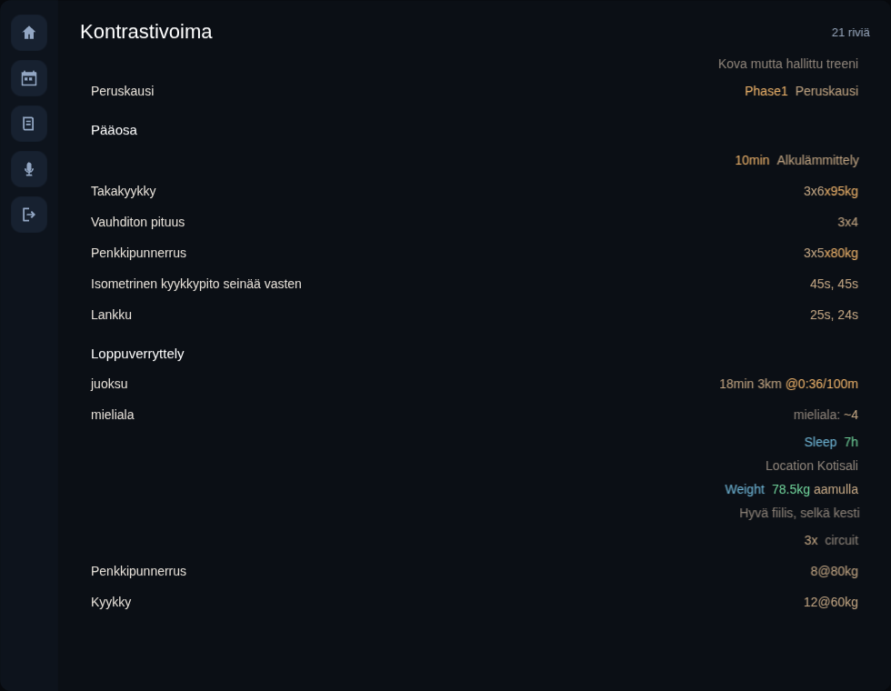
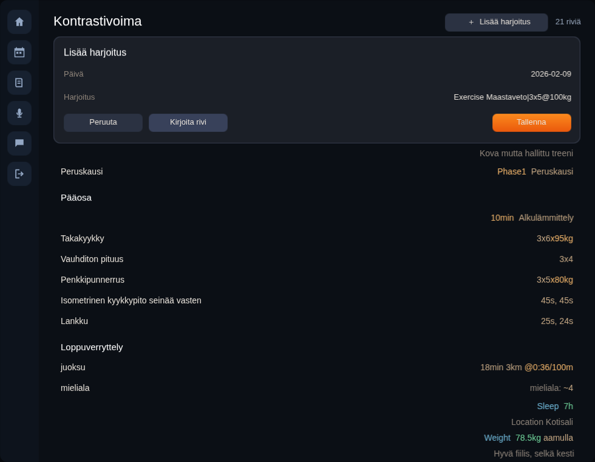
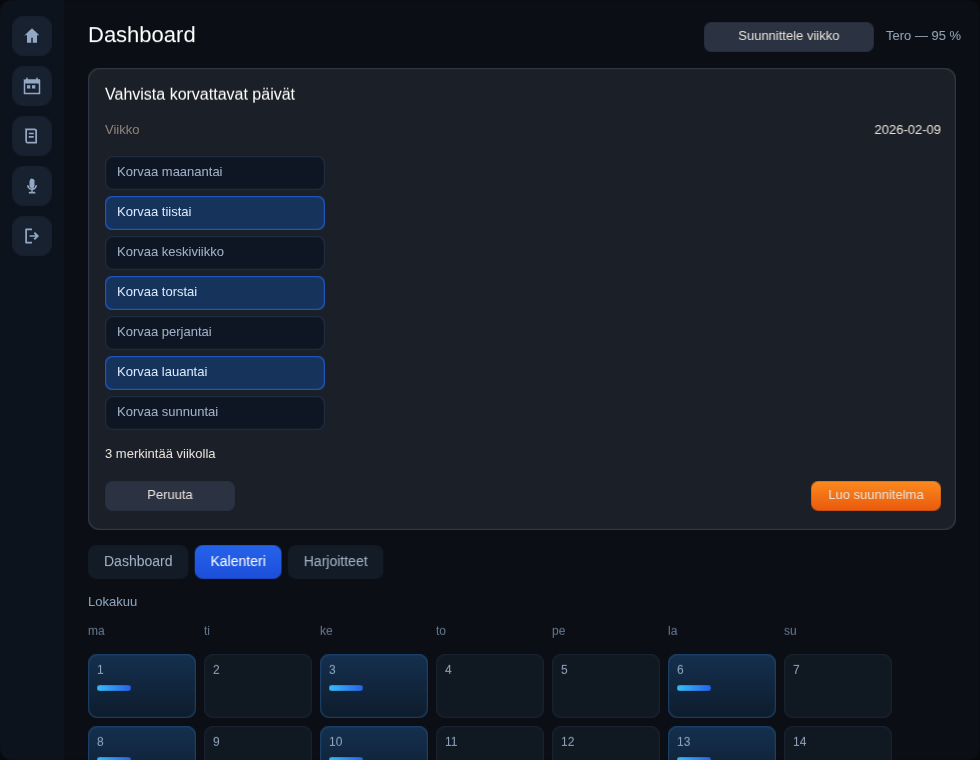
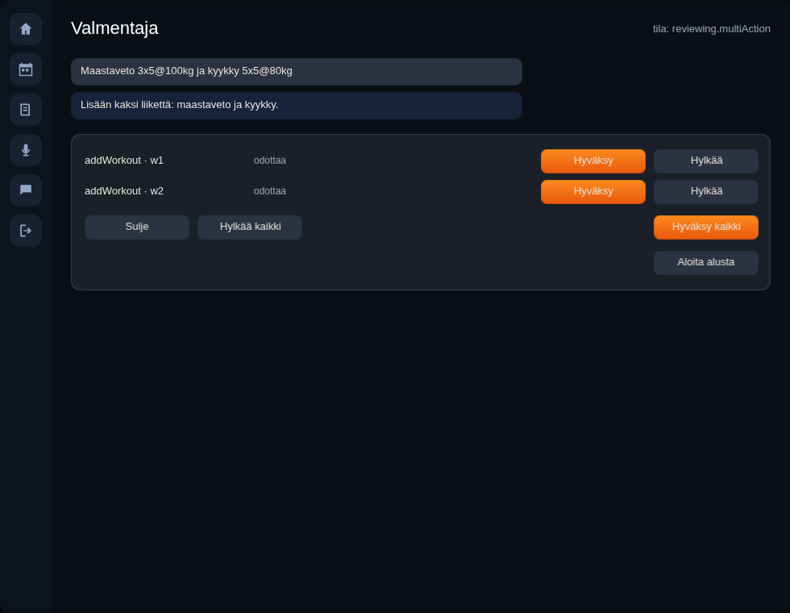

# gallery/realtrainer — an app, on the GPU

A five-scene application built from `gallery/ui`'s components and painted by
EVG's WebGL painter: a loading screen with a spinning ring, the sign-in page it
hands over to, a dashboard, one training session with a countdown dial, and the
parsed document behind all of it.

**License: AGPL-3.0-or-later** (Gallery).

```bash
npm run rt:web      # build, serve, print the URL
# the bare URL is the window: laid out again on every resize (a
# ResizeObserver on the stage, as gallery/evg/web/responsive does it), the
# rail or the bottom bar folded by the stylesheet's @media blocks at 768px,
# the targets grown under @media (pointer: coarse) when the browser reports
# a finger, and the shell opens on Home; ?route=/calendar/cal-plan?week=2026-02-09 opens it on
# a route, ?page=390x844 pins a phone's size inside any browser, and
# ?page=980x760 is the desktop demo the checks measure
npm run rt:check    # the app driven with a made-up clock, no browser  (CI)
npm run rt:scroll   # the scroll shortcut, the culling, who lays out, and how far a swipe throws
npm run rt:bench 40 # what a scroll frame costs, stage by stage, on a long diary
npm run rt:frame    # the same app in Chromium, checked at the pixels
```









`npm run rt:shots` regenerates every screenshot in `web/shots/` from the page
that is running, so a picture in this file cannot drift from what the app
draws.

## The COMPACT layer

The app's training content is parsed, not typed in. `Exercise Takakyykky|3x5@90kg`
is what a user writes; `3x5` and `x90kg` — two runs, two tones — is what the
screen draws.

```
.compact text
   │  parser/            the Ranger COMPACT v1 parser, vendored (see parser/README.md)
   ▼
AstNode                  subclasses tagged by a `type` STRING, narrowed with `cast`
   │  CompactRowMapper
   ▼
CompactRow               a `shape`: `match` over it is checked for exhaustiveness
   │  CompactStatBuilder
   ▼
[StatPart]               { text, tone, kind } — all formatting already done
```

**Why a shape and not the parser's own nodes.** A string tag is right for a
parser, where a new row family must not break a build, and wrong for a
renderer, where a family nobody drew is a blank line in the app. COMPACT has
thirty-one row families; the bug being designed out is the thirty-second one
rendering as nothing. `match` will not compile until every case has an arm.

Each case lowers to its own class — `__rg_kind` on ES6, a `sealed interface` on
Kotlin, a native `enum` on Swift — so thirty-one families cost neither a wide
record with everything optional nor a class hierarchy.

**Why parts and not a string.** `StatPart` is the three fields the TypeScript
library's `CompactStatPart` has, and `CompactStatBuilder` is a port of its
`formatExerciseSchemeParts` — same branches, same order. That library is this
port's test oracle, and the comparison is only cheap while the two agree on a
structure. A builder that returned `"3x5x90kg"` would pass a text assertion and
lose the distinction the theme actually draws.

```bash
npm run rt:compact         # text in, rows out, the spec line each row draws
npm run rt:l0              # the same rows against the TypeScript library  (CI)
npm run rt:l0:record       # re-record that reference
npm run rt:parser:sync     # refresh the vendored parser
npm run rt:parser:check    # fail if the copy is stale
```

## A ported state machine, and how it is checked

`src/AddWorkoutDialog.rgr` is a port of `addWorkoutDialogMachine.ts` from the
RealTrainer monorepo — an XState v5 machine of three states and seven events,
the smallest the app has, which is why it went first.

`npm run rt:machine` drives it through **all twenty-one cells** of the
transition table transcribed in `fixtures/machines/`. Thirteen of them are
IGNORES, and they are the point: `OPEN` while already open must not re-blank
what someone typed, `ERROR` out of `saving` must keep the input rather than
throw it away, and `START_SAVING` while saving must do nothing. A port tested
only on its happy path passes while being wrong about every one of them.

One deliberate difference, and it is the reason this is testable at all: the
machine calls `new Date()` inside its own reducer, so its reset depends on when
it ran. Here "today" is handed in by the host — a clock belongs outside a state
machine for the same reason it belongs outside a workout controller.

The table is run through **three** implementations:

| | |
| --- | --- |
| `src/AddWorkoutDialog.rgr` | the machine hand-written as branches |
| `src/AddWorkoutChart.rgr` | the same machine as data, on [`gallery/statechart`](../statechart/README.md) |
| `fixtures/machines/addWorkoutDialog.machine.json` | the config XState itself takes, loaded and run |

…and a fourth: **the same config executed by `xstate` itself**, which is the
oracle the other three are measured against rather than against each other.

The table is not the whole test. Twenty-one cells from three seeds only ask
what happens from three contexts someone thought to write down, so the gate
also walks 400 seeded random sequences of twelve events and requires every
implementation to stay in lockstep with XState after each one.

The third one closes the loop, because the config is checked against the real
machine rather than trusted: `npm run rt:machine:config` evaluates
`addWorkoutDialogMachine.ts` with `xstate` stubbed and diffs the structure —
states, the events each handles, and where each goes.



The dialog is drawn from the machine's state and nothing else: no local "is it
open" flag, no second copy of the text.

### The plan-week dialog, from its own definition

`src/PlanDialogHost.rgr` is the second machine on a screen, and it is not a
port: `fixtures/machines/planDialog.machine.json` — six states, eighteen
events, the file `rt:machine:live` runs through XState itself — is read by
[`gallery/statechart`](../statechart/README.md)'s runner as it is. What the
host adds is the two things the machine names and does not do: the clock
(the original computes its default week with `new Date()` inside the reducer),
and the named action `selectFetchedDaysForReplacement`, which turns the
calendar's entries for the week into the map of weekdays to replace.

That action is the part worth knowing about. The runner **stops while a named
action is owed**, because the state it settles into depends on what the action
puts in the context; so every send from the view is `send → run what pending
names → resume`, not `send`. `PlanDialogHost.send` is that loop, and
`ranActions` is what a test reads to see it happened.

The sheet on the dashboard — *Suunnittele viikko* — draws whichever of the six
states the machine is in: the week and its type, the seven days with a
checkbox each on confirmation, the feedback and per-day instructions and two
switches on the edit sheet, and a status while the simulated job runs. The
checkboxes are `CheckboxCtl`s and the week type is a `RadioGroupCtl`, drawn
**from** the context on every rebuild and never toggled on their own: a press
sends the event, and the machine is the only place the answer lives.



Two scenarios walk it, `plan-week` and `plan-edit`, and `rt:trace` now checks
the machine's state after every step against the one the scenario says it
should be in — the same field the reference recorder reads from
`window.__machineState` on the React side.

### The conversation, and a reply that streams on the clock

`src/ChatHost.rgr` hosts `chat.machine.json` the same way: eight leaf states
on three levels, sixteen events, guards, an `always` fork and an `onDone`,
read as they are. Its six named actions — `newRequestId`, `appendChunk`,
`takeResponse`, `acceptAll`, `acceptAt`, `rejectAt` — are the ones the
manifest gives XState, and each needs the event that caused it; the runner
keeps names, not events, so the host remembers the event it just sent and runs
the action against that.

The reply comes from `RtChatSim`, the original's mock adapter made
deterministic: a prompt becomes a canned reply, streamed a word per `chunkMs`
on the app's own clock as `STREAM_CHUNK` events, then `STREAM_COMPLETE` with
the actions it proposes — none for a question, two for a prompt with " ja "
in it, one otherwise. That number is what `reviewing` forks on, so the three
scenarios (`chat-single`, `chat-multi`, `chat-error`) land in all three
branches, and the debug switch on the rail — *Kaada seuraava tallennus* — fails
the next stream instead of the next save, which is how `error`, `RETRY` and
`CANCEL` get walked.



The screen is the rail's *Valmentaja*: the transcript, the reply streaming in
with a border while it does, the proposed actions with a verdict each, a
status while the accepted ones are saved, and the error with its two ways out.
Nothing on it is kept anywhere but in the machine's context, except the
transcript, which the machine does not keep because the original's UI does.

### The calendar wizard, and a gate per step

`/new-calendar` is a page of its own in the original — `CalendarWizard.tsx`,
four steps and a dozen `useState`s, no machine. What it does have is a gate
per step: the name must not be blank, an encrypted calendar needs a password
of strength two that matches its confirmation, and a step cannot be passed
until its gate opens. That is a linear stepper, and `src/CalendarWizard.rgr`
runs the four steps on `gallery/ui`'s `StepperCtl` — the one that clamps
instead of wrapping and refuses to advance past an incomplete step — with
the gates computed from the form exactly as the component's `canGoNext` does
and the strength score by the same five rules. The stepper is told a step is
complete the moment its gate opens; the dots in the header are the app's.

The screen is drawn from the wizard alone: the thirteen type cards (a card's
name is its label and its description, as the tree reads a button with both),
the four fields, the encryption card with its switch and the password fields
behind it, the preview, ten swatches and three visibilities. "Luo kalenteri"
starts a job; when it answers, the calendar joins the seed's, is selected, and
Home opens with a toast — `navigateTo('home')` and `toast.success`. The seed
now carries its calendars and every entry's owner, so the new calendar's Home
says "Kirjoita yllä olevaan kenttään…" where the plan calendar's counts its
past entries.

`calendar-wizard` matches the reference 100 % on every frame. The encryption
gate is a Ranger-only scenario (`calendar-wizard-encrypted`): the original's
toggle is a box with no role, so the reference cannot be driven through it.

### The year sheet, and the sums its grid shows

`/summary/yearsheet` is `YearSheetPageV2.tsx` — 1 926 lines around three
things: the list of the user's sheets, one sheet as a grid of rows by periods,
and two editors folded into its header. `src/RtYearSheet.rgr` keeps the
state, which is small (which view, which editor, which periods are unfolded
and to which example week, the rows), and computes the grid's sums: the
monorepo's `app-ranger/lib/yearsheet` collects them from workout snapshots,
and this side counts the seed's entries in a period and adds their minutes —
the two metrics (`count`, `duration`) the default row carries, which the
storage layer gives a sheet with no rows the moment the page opens it (and
which the dashboard's "Tavoitteet" then lists, as the reference's does after
the page has saved). Period dates are the simple case only: a start and
durations in weeks or days, one after the other; the library's fixed-date
segments are not ported, since the seed has none.

The page draws inside the shell without its header, as the original does:
the list's card is named by everything on it (the created date included),
the sheet's toolbar is the original's seven buttons, the period editor uses
the library's `SelectCtl` for the unit and the type and `NumberCtl` for the
duration (drawn here as a spinbutton with a step either side), the row editor
lists the chart's rows, and each period unfolds to its goals, the week-type
switch and the week. Back is `onBack`: the dashboard.

`yearsheet` and `yearsheet-detail` match the reference 100 % in order. The
list's card cannot be pressed on the reference — it reloads the page and
loses the test sign-in — so the sheet is opened by route. The modals behind
"Lisää kausi", "Muokkaa vuosisuunnitelmaa" and the toolbar's clipboard and
reset buttons are not ported; they answer nothing.

### A day, opened — a card per workout

The seed's training calendar carries realtrainer-compact's `sample.compact`
(`scripts/seed-from-compact.mjs`: ninety-nine workouts over four months, each
`[date] ## title` block one entry), so the week list shows what a week of a
real diary looks like: titles, tags, and on a day with several workouts the
titles joined and the count. Pressing a day opens it — `handleDayClick`: one
workout opens it directly, several open the day with each of them — and the
port draws what `WorkoutBlogView` draws: the heading, the date, the notes
button, the tags, a row per movement with its stats and comment buttons, the
count and the tonnage ("7 liikettä • Yht. 2.5 t"; the tenths are cut, as
`toFixed(1)` cuts 2.55), and Compact / JSON / Poista. The rows come from the
same COMPACT parser the document screen uses, and `CompactStatBuilder.text`
already says "3x5x90kg" and "25s, 24s" the way the original's row does.

`calendar-diary` matches the reference 100 % on every frame. The buttons on a
card answer nothing yet — the notes, the stats, the comments, the exports and
the delete are the next asks.

### Home on a training calendar — the diary feed

Home reads the selected calendar's type. A plan calendar gets the coming
events and the past ones behind a counting button; a training calendar gets
what `HomeView` gives it — the quick entry with the diary's own placeholder
("treeni 60min"), the Päiväkirja / Harjoitteet / Tilastot tabs, and on
Päiväkirja every workout as a card, newest first. The cards are the day
view's, with `WorkoutBlogView`'s row rules: an exercise, a pyramid or a run
gets the stats and comment buttons; a custom value or a timed block gets the
comment button alone; a line of text is a paragraph with its edit and comment
buttons; splits right under a run fold into it, numbered, and splits after a
text line stand alone. An entry tagged as a reading — `hrv`, `paino`,
`mittaus`, `leposyke`, `weight` — is the measurement card instead: the date
over a level-3 title, the menu, the tags, and a box per value.

`home-diary` matches the reference 100 % — 1032 compared nodes per frame,
in order.

**Harjoitteet** is `ExerciseListPanel`: every exercise the diaries hold,
summarised by the app's own statistics — its Ranger modules `ExerciseStats`,
`StatsMath` and the date helpers came across as they are, under `src/stats`
— in three categories with a sort. The items the statistics count come from
the parsed rows, as the app's bridge builds them (an exercise, a pyramid as
one exercise with its totals, a timed block, a move), not from the line
walker the modules also carry, which reads more lines as moves than the
parser does. A row reads as the app's does: the name, the count, and by
category the best weight, the RM1 and the tonnage, the best pace and the
distance, or the longest hold, with last week's tonnage at the end where
the sparkline labels it. Ties in the sort keep the order the app's store
hands the calendars over in — by id, descending — and the category an
exercise lands in is decided by its newest occurrence, so that order is
what the port walks too. `home-tabs` matches the reference 100 %.

**Tilastot** is `TrainingStatsPanel` over `FeatureVectorsPanel`: the last
seven dated days (the tonnage of the exercises, the distance and time of
the moves), then a `StatsMiniCard` per series — the daily volume, distance
and time over the last twenty-one dated days, the custom fields two days
share, and the features the diary's Derived lines give over the last
fourteen days, in the app's order with the app's labels. A card is the
title and the trend against the day before, the latest value, the curve,
its date, and the average, the least and the most; a series with fewer
than two points says it lacks data, as the original does before its
vectors run.

The curve is a **Vela chart, called rather than written**
(`gallery/vela`, `src/VlChart.rgr`): the points as a dataset, an area under
a monotone line, and the latest point marked — two views over one explicit
domain so the point sits on the line — with no axes, since the card
carries the numbers. The tree holds a placeholder box per card; once the
layout has placed it, `emitCharts` runs the chart through `VlCompile`,
`VlRuntime` and `VlSceneCommands` and appends its commands to the display
list at the box, clipped to the main area by hand, as the dashboard demo
does. The commands are kept by data and size, so a paint that changed
nothing about the data draws the same picture. Building this found that a
module compiled without `-keep-examples` still exported its example-only
classes by name and failed to load; the compiler leaves the export out
with the class now.

The card is styled after `WorkoutBlogView` and the row components of
`realtrainer-compact/ui`: the title centred over its short rule, the date
and the notes button under it, the tags as a pill cloud in the app's
palette; a section as a brand-coloured bar and capitals; an exercise's
scheme in mono with the loads in orange — on the same row on a wide page,
under the name on a narrow one, as `PyramidRow` stacks below `sm`; a timed
block's time as an orange chip; a custom value behind a band with its
`~value`; a line of text as a wrapped paragraph; the comment control under
each row; and the Derived lines last, as `DerivedTable` shows them — the
value, its unit, its short label and its goodness as a coloured word.

## On a phone or a tablet, for real

The same source compiles to Kotlin and Swift as it is — `-l=kotlin` without
an error, `-l=swift6` the same once one control stopped overriding a method
with a different arity — and [`ios/`](ios/README.md) is the Apple port: a
viewport facade over the demo, the texts the browser bundle embeds packaged as
resources, a touch that presses and a drag that scrolls, and the keyboard
through the same text bridge the browser uses. `npm run rt:ios:verify` drives
it on Node, 42 checks; `npm run rt:ios:run` needs a Mac with Xcode and puts it
on a simulator, `rt:ios:device` on the iPad on the cable.
[`android/`](android/README.md) is the same shape over
`gallery/evg/android`'s painter, as `gallery/ui/android` is for the dashboard:
the page is the view in dp, a `GestureDetector` drag scrolls, the soft
keyboard commits through an `InputConnection` into the same text bridge.
`npm run rt:android:verify` drives it on Node, 40 checks;
`rt:android:desktop` paints seven frames with Java2D through the shared
painter and `rt:android:typecheck` checks the two Android-only files, both
with `kotlinc`; `npm run rt:android:run` needs an SDK and puts it on an
emulator.

## Traces: the app itself as the oracle

A machine that passes its transition table can still be wired to the wrong
screen. The benchmark for that is the app as it really runs — `frontend --mode
test` on 5175 with the Firebase emulators — driven through the same scenario
and compared frame for frame.

```bash
npm run rt:trace            # replay the scenarios on this side  (CI)
npm run rt:trace:record     # re-record this side
npm run rt:trace:diff       # this side against the reference, frame by frame
# and, with the monorepo beside this one and the emulators up:
npm run rt:trace:reference  # re-record the reference (--only, --shots, --url)
```

Steps are clicked **by role and name**, not by test id: the views in scope
carry zero `data-testid` attributes, so ids would mean changing the private
repository for every node measured. Roles and names are already there, and they
are what the EVG side publishes through `UiCtl.rows()` anyway — the same key
`gallery/ui` diffs against Radix.

The recorder seeds the emulator from `fixtures/reference/seed.json` and the
Ranger side draws from the same file, so the two are looking at the same
data. In it: the plan calendar with its week and its yearsheet, the training
calendar with realtrainer-compact's `sample.compact`
(`scripts/seed-from-compact.mjs`), the app's own three fixture calendars, and
a real diary — eight calendars and 630 entries exported from RealTrainer,
converted by `scripts/seed-from-backup.mjs`. The converter writes every
workout as COMPACT text through the compact package's own serializer
(bundled from that repository on the fly, since it is GPL and this one is
not), keeps each entry's score and the coach's feedback, and leaves out the
account (ids, e-mail), the signed image links, the chats and the year sheets.
The export carries no calendar on a workout; it lists them calendar by
calendar, newest first, so a calendar boundary is where the dates start over.
An entry with a score shows it under its date, and one with feedback shows
"AI-valmentajan palaute" at the end, as the blog view does. A frame is the accessibility tree: every button, heading,
textbox, checkbox and landmark, in order, with `disabled` and `checked`. The
diff is a longest common subsequence over that order, per frame, and the gate is
the worst frame against `RT_TRACE_FLOOR` (0.9).

What the traces found, in the order they found it: the reference's dialogs sit
*before* the bottom bar in the tree and the add sheet *after* it; the bar's
"Lisää" is a sheet over the current section, not a section; the bar's
"Kalenteri" opens this week, not the route's; the confirmation step has no close
cross and says "Viikko on tyhjä" for a week with nothing in it; the AI chat with
no backend fails at once and puts the failure in the log as the assistant's
message, with the composer free again; and every icon button in the original
has an empty name. The port copies that last one so the traces line up; the
lint lists them.

Two frames are not 100 % and are left so on purpose. The edit sheet's tree
sits inside the example-week panel in the original — between its buttons and
the week-type switch — where EVG's absolute box would cover the panel, not the
page; and the plan dialog's `creating` state is a state here, drawn, where the
reference closes at once because its job fails without a backend. A scenario
the reference cannot play at all — a reply the AI would have to write — says
`noReference` and is this side's alone (`chat-review`).

The Ranger trace is committed for the reason the L0 oracle is: this
repository's CI has neither the emulators nor the private frontend.

## The coverage table, measured

[`COVERAGE.md`](COVERAGE.md) is what this demo does with each of COMPACT's row
families — generated, not maintained. `COMPACT_FEATURE_MATRIX.md` upstream
lists the same families against seven columns and every cell in it is `❓`,
because it is a checklist someone has to remember to update. This one runs
every family's line through the parser and the row layer on the way to being
printed.

```bash
npm run rt:coverage         # regenerate it
npm run rt:coverage:check   # fail if it is stale  (CI)
```

Reaching `text` is not scored as a gap: the reference gives a row type of its
own only to what it draws specially. The column that shows real work left is
**Drawn** — the families the demo's own document does not yet contain.

## Saving, and why it does not serialise the rows

A view model is lossy on purpose: fourteen life families come out as a line of
text with their structure thrown away, because that is what the reference
draws. Writing the rows back would rewrite `Sleep 7h` as `Text Sleep 7h` and
quietly change someone's training log.

So the document keeps the text it was read from, and an edit **patches the one
line it touched**. `CompactDocument.rowLines` is how a row finds that line: the
parser hands back content in order and each node came from exactly one line, so
the lines are handed out in the same walk that builds the rows — including a
circuit's `>` children.

`CompactWrite` writes back only what it can write, and `rt:compact` pins the
guarantee that makes this safe: an editable row, written back with nothing
changed, gives the SAME LINE it was read from. A form that arrives and does not
round-trip fails there instead. A measured row answers with "" — it records
what happened, and the caller does not save what it cannot write.

The backend is `RtBackendSim`: no network and no cloud, because this demo has
neither and wants neither. What a screen still needs is the SHAPE of one — a
wait with a state on it and a failure that can be reached on purpose, since a
demo that cannot be made to fail is a demo whose error state nobody has looked
at. It runs off the app's clock, so a save takes the same milliseconds in the
browser and in the headless check, and no test sleeps.

## Measured against the library it is a port of

`realtrainer-compact/ui/react` renders COMPACT in React, and this renders it on
the GPU. The two agree or one of them is wrong, so `rt:l0` says which: every
case in `fixtures/cases.json` goes through both sides and the parts are diffed.

Parts, not strings. `3x5` and `x80kg` print as `3x5x80kg` either way, and a port
that returned the one string would pass every text assertion while having lost
the only distinction a theme draws. Tone and kind are compared too.

The reference is RECORDED — `oracle/record.mjs` bundles the library's own
`parsedRowMapping`, `formatters` and row utils, runs the corpus through them and
writes `oracle/expected.json`, which is committed. That is what lets the gate run
in CI, where the library is not checked out, instead of quietly passing because
the oracle went missing. What the recorder imports and what it transcribes from
the components is written at the top of that file, because move, pyramid and
split build their parts inside JSX and there is no function to call.

Fifty-five cases, matching part for part. Two more are deliberate deviations —
recorded in the corpus with their reason and printed on every run — and one is
an `interval`, which that library has no renderer for at all. Both are listed
rather than left out: a family with no reference is a gap and not a pass, and a
deviation nobody prints is a difference nobody remembers.

Thirteen row types, and every family COMPACT has reaches one of them. That is the
reference's own arrangement and worth knowing before reading the shape: it gives
a row type of its own only to what it draws specially — section, text, exercise,
move, pyramid, split, summary, phase, custom, duration, circuit, unknown — and
turns the
fourteen life families into a line of TEXT with a fixed shape (`Sleep 7h`,
`Expense 45EUR | sali`). So `Sleep` is not a case here either; it is a text row
whose wording is a port of `fallbackTextForEntry`, family by family, because a
port that invented its own wording would look right and compare wrong.

Tags, emojis and derived values are deliberately NOT rows. The reference lifts
them onto the workout and filters them out of the row list, so a renderer
walking rows never meets one, and this does the same.

A life row is drawn the way `Text.tsx` draws it: `Weight 78.5kg tänään` is three
parts — the label, the number, and the words after it — because a reader looking
for the number should not have to find it inside a sentence.

**The document screen** (the rail's third button) is the row library with
nothing on top of it: every row the parser produced, drawn by its family. It is
where a family that renders as a blank line would be obvious, which is the
reason to have it.

It scrolls, and how far is the LAYOUT's answer rather than the app's: the
viewport is a clipped box with a `scrollTop` on it, `EVGLayout` clamps that
offset against the content it measured and translates the subtree, and the app
reads back what it got. There is no scrollbar — a canvas app that draws one has
to make it work, and this needs none to be readable.

Whether two runs touch is a property of the family and not a choice the renderer
makes. `3x5` and `x80kg` are one reading and must not be prised apart; a phase
marker and its name, a duration and its description, and a split's fields are
separate words, and the reference spaces them. So the gap is a class the row
picks by family.

The session screen is built from this and nothing else. `fixtures/session.compact`
names the workout, its exercise rows are the moves, the section headings are shown
above them, and the plan's length is counted rather than assumed. The steppers write
into the ROW — there is no second copy of the numbers for them to disagree with —
and the spec line is rebuilt from it, so a press moves what the document says.

A measured row — `Lankku|2x25s,24s`, what was done rather than what was planned —
prints `25s, 24s`, and a set that measured zero is dropped rather than written as
`0s`. Reading those numbers needed a change in the parser: they used to be JSON
strings built during the parse. The parser is a copy, so the change was made
upstream and re-synced, and it is written down in [PATCHES.md](PATCHES.md) —
which is where every change this demo needs in someone else's source goes.

## What is the library's and what is the app's

The point of this directory is that almost nothing here is a control. Seven of
them are `gallery/ui`'s — the same controllers the conformance harness measures
against Radix, dnd-kit and TanStack — and what this app adds is a theme, a
layout, four screens, and a parser.

| From `gallery/ui` | Doing what here |
| --- | --- |
| `ProgressCtl` | the loading bar, and the session's "0 / 2 liikettä tehty" |
| `CheckboxCtl` | *muista minut tällä laitteella* |
| `CollapsibleCtl` | the tips the sign-in page hides until asked |
| `TabsCtl` | the dashboard's three sections, with its roving focus |
| `TableCtl` | the goals table's sort — three clicks per column |
| `ToggleCtl` | the filter above that table |
| `AccordionCtl` | the training plans, one open at a time |
| `RadioGroupCtl` | the rest between sets: 30 / 60 / 90 / 120 s |

A controller writes class names and never a colour, so dressing one for a dark
product is a stylesheet and not a fork: `web/realtrainer.css` themes every
`ui-*` class in this app's palette. `gallery/ui/theme/base.css` is the
library's own pale default and is not loaded here.

Everything else is layout — flex rows and columns, and one CSS grid for the
calendar.

## The two rings, and why there is no `position: absolute`

The loader's ring is twelve boxes stacked in **one grid cell**, each turned
about a point 54 px below its own top edge. EVG has no absolute positioning,
and grid placement is the layout that lets children share a rectangle.

Only the *container* is turned, once per frame. `EVGDisplayList` composes a
parent's rotation onto every command its subtree emitted, so twelve blades cost
one angle and no per-blade arithmetic.

The session's dial is the same arrangement at 220 px with sixty ticks — and the
angles are computed in Ranger and written inline, because sixty CSS rules that
differ by a number are sixty rules. Both ways are here on purpose.

## The clock is in the app, not in the page

`tick(dtMs)` is the whole animation. The progress, the ring's angle, the
countdown and the scene change are all read off one elapsed-time counter, so
the browser host does nothing but hand over the real time between two frames
and paint what comes back — and the headless check drives the same app with a
made-up clock and asserts on the same picture. An app whose animation lives in
its JavaScript host has two versions of itself.

## What this demo found

**An element's gradient never reached the display list.** `hasGrad`, the
`gd`/`c2` JSON and the shader's two-stop mix have all been there for a long
time, and nothing wrote one from an element: `background: linear-gradient(…)`
came out flat when there was a `background-color` beside it and emitted no
rectangle at all when there was not. `EVGDisplayList.applyGradient` is the walk
that was missing, and `EVGJsonTest` now covers both halves. Two directions and
two stops is what the list can say, so an angle is snapped to the nearer axis
and the stops swapped when it points the other way; a radial gradient is left
flat rather than turned into a lie.

**A class that goes away does not undo what it wrote.** The cascade writes the
properties the *current* classes ask for, so a state rule may only override a
property its base rule also sets — and `background-color` is a different
property from `background`. With only `.ui-tab-state-active` carrying a
gradient, the tab you clicked away from kept it and two tabs looked active at
once; the dial filled up and never emptied for the same reason. Both are one
line of stylesheet discipline, and both are checked now.

**`activate` rebuilds a controller's subtree even when nothing changed.**
Pressing the tab that is *already* open cleared the panel — and because the
value had not changed, the app did not put its content back. The page went
blank under a tab strip that looked right. The rule that falls out: a press
that reached a controller is a press that rebuilt it.

**A controller's semantics do not travel with its elements.** `gallery/ui`
publishes what a control means as `rows()`, because that is what the
conformance harness diffs against Radix; `EVGA11yFromTree` reads the element
tree instead. So a controller dropped into an app's tree paints perfectly and
says *nothing at all* — which is the one thing a canvas app cannot afford, the
pixels being unreadable already. `RealTrainerDemo.adopt` copies one onto the
other by id, and it is the app's job: a controller cannot know it is being used
inside a tree someone will walk.

## The two checks

`web/loader-check.mjs` drives the app in Node with no browser and reads the
display list: the bar's rectangle grows, the twelve blades carry twelve angles
about one pivot, three clicks on a column header return the rows to the order
they arrived in, the dial empties as the clock runs, and a reader is told what
each control is.

`web/frame-check.mjs` loads the page Chromium loads and reads the framebuffer,
because rotation lives in a vertex shader and the gradient in a fragment shader
and the only honest way to check GLSL is to run it. It clicks at the rectangles
the accessibility tree reports — the same path a pointer takes — and it writes
the screenshots in `web/shots/` with `--png`.

## Files

```
src/RealTrainerDemo.rgr   the app: four scenes, the clock, the hit routing
src/CompactRows.rgr       COMPACT text → rows → the parts a row draws
src/AddWorkoutDialog.rgr  the add-workout machine, ported by hand
src/PlanDialogHost.rgr    the plan-week machine, run from its definition; the host's clock and named action
src/ChatHost.rgr          the conversation machine, likewise, and the mock adapter that streams on the clock
src/RtCalendar.rgr        the seed and its calendars, the week, an entry's title and tags, the icons
src/CalendarWizard.rgr    the calendar wizard: four steps on StepperCtl, a gate each, the strength score
src/RtYearSheet.rgr       the year sheet: its view state, period dates, and the grid's sums from the seed
fixtures/reference/       seed.json — what the recorder puts in the emulator and this side draws
traces/reference/         the reference's recorded traces, diffed by rt:trace:diff
scripts/record-reference-trace.mjs  the reference recorder: seeds, signs in, drives, snapshots
web/trace-diff.mjs        the diff, frame by frame, and the floor
fixtures/machines/        the machines in the shape createMachine() takes
fixtures/scenarios/       the scripts both sides are driven through
traces/                   this side's recorded traces, checked by rt:trace
PATCHES.md                what this demo changed in the parser, and why
patches/                  those changes as diffs, to apply upstream
parser/                   the COMPACT v1 parser, vendored from its own repo
fixtures/                 .compact input the checks read
web/compact-check.mjs     the COMPACT layer, with no app around it
web/realtrainer.css       the theme, this app's and the library's classes
web/main.js               the browser host: a clock, a pointer, one canvas
web/loader-check.mjs      the headless gate
web/frame-check.mjs       the browser gate, and the screenshots
web/serve.mjs             a static server rooted at the repository
```
