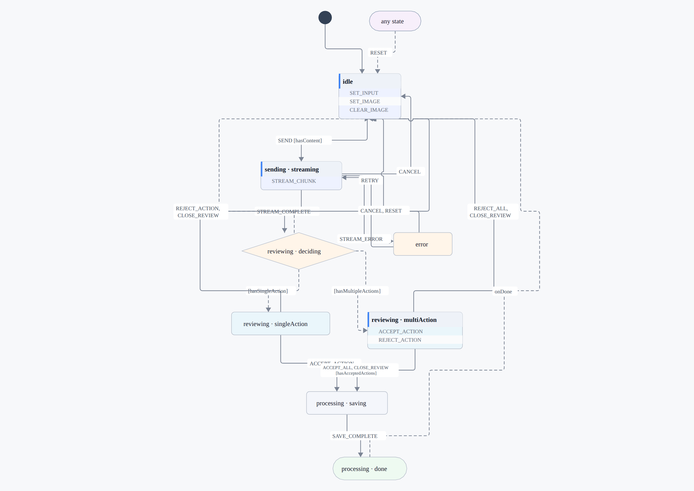
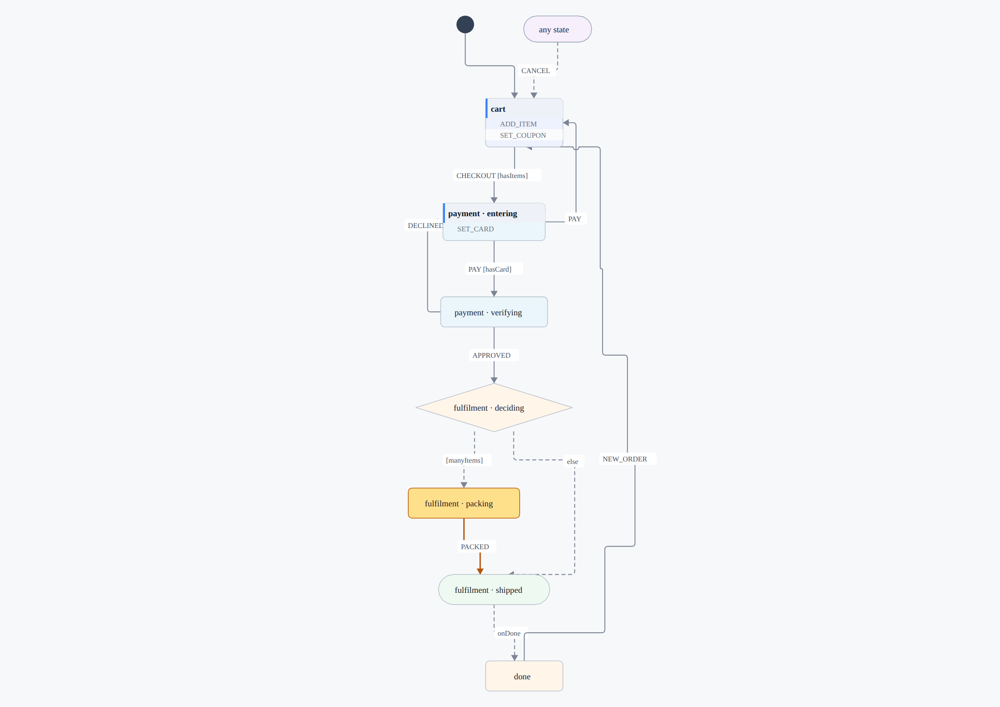

# gallery/statechart — a machine as data

A small statechart runtime in Ranger: a machine is a **definition** and the
runner walks it. Written for porting RealTrainer's XState machines
(see [`../../PLAN_REALTRAINER_STATE_PARITY.md`](../../PLAN_REALTRAINER_STATE_PARITY.md)),
and useful anywhere a Ranger program has states rather than flags.

**License: AGPL-3.0-or-later** (Gallery).

```bash
npm run statechart:test          # both gates below
npm run statechart:parity        #   the runner against xstate itself
npm run statechart:viz:check     #   the drawing, checked
npm run statechart:viz           # draw the fixture machines
npm run statechart:viz -- <machine.json> --run SEND STREAM_COMPLETE …
```

## A machine, drawn



A statechart is a picture that has been written down as text. Holding six
states, sixteen events, two levels of nesting and a fork in your head is work;
looking at it is not. So `viz/StatechartGraph.rgr` is a **RangerFlow domain** —
the same mapping `domains/erd` and `domains/flowchart` do, from a vocabulary to
nodes and edges — and from there it is [RangerFlow](../rangerflow/README.md)'s
layered layout, lane router and four backends.

What is drawn is the same `Statechart` object the runner walks, not a second
description of it. A picture that could disagree with the machine would be
worse than no picture.

Four choices are what make it readable rather than a plate of noodles:

- **Only states the machine can be in.** A compound state is *where its
  children are*, never a place of its own. The first draft drew one box per
  state, and the parents floated above the diagram joined to it by a dashed
  line each.
- **An internal transition is a row in the box, not a self-loop.** "Typing here
  does something and leaves you here" is a fact about the state, which is how
  UML has drawn it since UML — and `cart` alone had three loops whose labels
  landed on top of each other.
- **One arrow per pair of states.** A UI machine has several events that mean
  "back to where you started" — `chatMachine` has six landing on `idle` — and
  six lines between the same two boxes is six lines a reader has to check are
  the same line. `CANCEL, RESET` says it.
- **Back-edges leave sideways, and take turns.** A transition back up the page
  goes round the outside rather than back through everything it just came past,
  and when several go straight up they alternate left and right, so their labels
  do not stack in one column on top of the boxes they pass.

### …and a run drawn on it



```bash
npm run statechart:viz -- gallery/statechart/fixtures/machines/checkout.machine.json \
  --run ADD_ITEM:sku=a ADD_ITEM:sku=b CHECKOUT SET_CARD:card=4242 PAY APPROVED
```

That is the one that earns the module. Give it a machine and a sequence of
events and it draws **where that sequence left it**: the state highlighted, its
ancestors with it — a machine in `sending.streaming` is in `sending` too, which
is what nesting MEANS and is invisible if only the leaf is coloured — and the
transitions leaving it in the accent colour.

"Where am I, and what happens if I press this" is the question a UI state
machine is actually asked, and a JSON file answers it worst.

`npm run statechart:viz:check` asks the drawing the questions a reader would:
every state the machine can be in has a box and nothing else does, the entry dot
points where the machine starts, no pair of states has two arrows, every arrow
says which event takes it, and a live run highlights exactly one box while a
drawing of the machine highlights none.

## What this is not

Not a clone of XState. [XState](https://github.com/statelyai/xstate) is MIT
(Copyright © 2015 David Khourshid), so a clone would be *allowed* — it is the
wrong thing to build. A clone means API compatibility with actors, spawning,
the actor system and inspection, none of which the machines being ported use,
and it would be judged against XState's whole semantics rather than against
the behaviour of the app that has to keep working.

No XState source is copied here. What is followed is its *semantics* for the
subset below, and that following is measured rather than asserted: the
transition table transcribed from each machine is run against this runner and
against a hand-written port of the same machine, and all three have to agree.

## The subset, measured rather than guessed

`grep` over the three machines being ported says what is actually used:

| Machine | Uses | Missing here |
| --- | --- | --- |
| `addWorkoutDialogMachine` (123 r) | `id` · `initial` · `states` · `on` · `target` · `actions`/`assign` | — |
| `planDialogMachine` (289 r) | + nothing new (six states of the same) | — |
| `chatMachine` (449 r) | + nested `states` · `initial` per level · `guard`/`guards` · `always` · `onDone` · `type: 'final'` · machine-level `on` | — |

**Nothing is missing.** `after`, `invoke`, `entry` and `exit` appear in none of
the three (`grep -n "after:\|invoke:\|entry:\|exit:"` over all three returns
nothing) — an earlier draft of this table claimed `chatMachine` used `after`
and `invoke` on the strength of a comment in its source that says a state
*would* invoke a save service. It does not; `SAVE_COMPLETE` is an event like
any other. So the subset here is not a subset of what the app needs, it is all
of it.

Were `after` or `invoke` to arrive, they would still not belong in the
definition: both are *time and effects*, which are the host's, and a definition
that compiles to Kotlin and Swift cannot own either. The machine names what it
wants and the host does it, which is XState's own `setup({ actions })`.

All three are ported, so all three tiers are here — and each arrived with the
machine that needed it, never ahead of one. A runtime that grew features nobody
had a machine for would have no way to know it got them right.

| Tier | Arrived with | What it added |
| --- | --- | --- |
| one | `addWorkoutDialogMachine` | states · transitions with an optional target · declarative assignments · events with named fields |
| two | `planDialogMachine` | a typed context (`ScVal`: lists, maps, numbers, booleans) · named host actions |
| three | `chatMachine` | nested states · guards · `always` · `type: "final"` + `onDone` · machine-level `on` · guarded transition arrays |

A transition with no target assigns and stays — XState's internal transition,
and the reason typing into a dialog does not re-enter its state.

### Nesting, and where a state IS

The active state is a **path** — `reviewing.multiAction` — because a name is
not an address: two parents may both have a child called `done`. Entering a
compound state means entering its initial child, and on down; an event is
offered to the active leaf first and then to each ancestor, so a child's
transition wins over its parent's, and the machine's own `on` is last.

### Settling, and why it stops

`always` and `onDone` run to a fixed point after every move, bounded at 64
steps. But settling **stops while a named action is owed**. `reviewing`
forks three ways on how many pending actions there are, and a named action is
what puts them there — settling before the host had run one would ask the guard
about a context a step behind. So the host runs what `pending` names and calls
`resume`, which is the same loop again. That ordering is not a nicety: it is
the difference between landing in `multiAction` and falling through to `idle`.

## It takes the shape XState writes

`StatechartJson.load()` reads `createMachine()`'s own config object:

```json
{ "id": "addWorkoutDialog", "initial": "closed",
  "context": { "today": "", "inputText": "" },
  "states": {
    "closed": { "on": { "OPEN": { "target": "open", "actions": [ … ] } } },
    "open":   { "on": { "START_SAVING": "saving" } } } }
```

Structure, state names, event names, targets and the `"EVENT": "target"`
shorthand are all XState's. A machine is then ONE FILE the app and this can
both hold, neither a transcription of the other.

The one thing that cannot come across as-is is `assign`: in XState it is a
FUNCTION, and a function is not data. So assignments are written declaratively
(below), and `{ "event": "value", "default": { "context": "today" } }` is
`event.targetDate || today` written down instead of run.

That the config is still the machine is checked, not assumed:
`npm run rt:machine:config` evaluates the real TypeScript with `xstate`
stubbed — `createMachine` hands back its config — and diffs the structure:
every state by path, the events each one handles, where each goes and **which
named guard decides**, plus each state's initial child, `type: "final"`,
`always`, `onDone` and the machine's own `on`. It needs the monorepo, so it
exits 0 and says so where the sources are not checked out.

Note what the two gates each cannot do. `rt:machine:live` runs the same config
through both sides, so it measures the RUNNER and can never catch a
mis-transcription — a wrong guard is wrong identically in both. `rt:machine:config`
reads the real TypeScript, so it catches transcription and cannot run anything.
Neither alone is parity.

## Events are objects, and assignments are expressions

XState's events are objects — `{ type: "OPEN", targetDate: "2026-02-09" }` —
and an assignment reads them by name, so this takes the same:

```
ScEvent.of("OPEN").with("targetDate", "2026-02-09")
```

An earlier draft took a single payload string. It worked for one machine and
would have broken on the next: `OPEN` carries a date AND a calendar id, and
nothing tells them apart when they are both "the value".

An assignment's new value is an expression, in the general forms rather than
one per machine:

```
{ "value": "x" }              a literal
{ "event": "targetDate" }     a named field of the event
{ "context": "today" }        a context key
{ "or": [ … ] }               the first part that has anything in it
{ "setKey": { "map": …, "key": …, "value": … } }   `{...m, [k]: v}`
{ "append": { "list": …, "item": … } }             `[...xs, x]`
```

`append` arrived late, and by replacing something worse: a cart appended to a
list through a NAMED action, on the grounds that appending is computation. It
is not — it is exactly as declarable as `setKey` already was, and naming it made
the module's own conformance depend on a host function it had no reason to need.

`{"or": [{"event":"targetDate"}, {"context":"today"}]}` is
`event.targetDate || today`. **`or` is what `||` is**, not a special case for
the machine that needed it first — naming the general form rather than the
instance is the difference between a runtime and a fixture.

A guard is a predicate in the same shape:

```
{ "present": { "context": "image" } }              carries something
{ "nonBlank": { "context": "inputText" } }         .trim().length > 0
{ "countGt": { "of": …, "n": 1 } }                 more than one
{ "some": { "of": …, "field": "processedAs", "eq": "accepted" } }
{ "or": [ … ] }  { "and": [ … ] }  { "not": … }
```

`present` and `nonBlank` are separate on purpose: `present` on a string is
"has characters", and `hasContent` in the original says
`inputText.trim().length > 0`, which is not the same question and would have
sent an empty message on a space.

Each guard also carries `named` — the name the original gives it
(`"named": "hasContent"`) — which is what `rt:machine:config` compares. The
predicate says what the guard *does*; the name says *which* guard it is, and
only the second can be checked against a TypeScript function.

**Context values are typed.** `ScVal` is a closed family — nothing, string,
boolean, number, list, map — so `match` over it is checked for exhaustiveness
and a kind added later cannot be silently unhandled in the runner, the JSON
bridge or a comparison. The first machine ported had a context of four strings
and the context was four strings; `planDialogMachine` has a list of day
indices, three maps keyed by day, a boolean and a list of fetched entries, and
that is where "everything is a string" stops being a simplification.

## Conformance — against XState itself

The oracle is the real library, never this module's own opinion:

```bash
npm run statechart:parity   # this module's own machines
npm run rt:machine          # four implementations of one ported machine
npm run rt:machine:live     # …and the two too big to transcribe
```

`tests/xstate-parity.mjs` takes a **manifest** saying which machines to run and
what the host provides. Conformance used to be measured only where the runner
was USED — three machines ported from one app — which meant this module could
not be checked without that app's fixtures, and a semantic nobody's machine
happened to use had nowhere to be tested. It now has two machines of its own:
`trafficLight`, the smallest thing that is still a machine, and `checkout`,
which uses everything the runner has and needs no host at all.

`gallery/realtrainer` passes its own manifest for the three machines it ported.

Four readings of one specification: the machine hand-written as branches, the
same machine as data, the config loaded and run by this runner, and **the same
config executed by `xstate` itself**. All twenty-one cells of the transition
table agree in all four.

A table is not a parity test, though — twenty-one cells from three seeds only
ask what happens from the three contexts someone thought to write down. So the
gate also walks **400 random event sequences of twelve events** and requires
every implementation to stay in lockstep with XState after every step, state
and whole context. The sequences are seeded, so a divergence is reproducible.

That fuzz earned its place on the run that introduced it. It caught a
divergence immediately — in the harness, not the runner: the XState adapter was
answering "did anything change" where every other implementation answers "did
the current state handle this event", and `SET_INPUT_TEXT { text: "" }` when
the text is already empty is handled and changes nothing. `snapshot.can(event)`
is the question the others answer, and asking XState the same question is what
made the comparison mean anything.

Without `xstate` installed the gate still runs and says so, rather than passing
quietly on a transcription.

### And a machine too big to transcribe

A hand-written table proves a machine was READ right, once. It does not scale:
`planDialogMachine` is six states and eighteen events, and a hundred and eight
cells transcribed by hand is a hundred and eight chances to write down what you
assumed. So `npm run rt:machine:live` asks XState instead — the same config in
both, every state crossed with every event from a seeded path, then 300 random
sequences of fourteen events.

It found the thing reading could not, on its first run: **`a || b` yields its
LAST operand when everything is falsy.** `undefined || false` is `false`, and
this runner returned nothing — so a context held `null` where the machine holds
`false`. One character of semantics, in eighty-four cells that do nothing and
twenty-four that do, and no amount of re-reading the source would have shown
it.

`chatMachine` runs in the same gate: six states it can rest in crossed with
sixteen events, ninety-six cells, then the same 300 sequences. The states it
is left out of are named and justified — `reviewing.deciding` is an `always`
fork and `processing.done` a final child whose `onDone` leaves immediately —
and the gate FAILS if any other leaf has no seed, so a state cannot be quietly
skipped.

Two harness bugs came out of that run, both of which had been silently making
the gate weaker:

- **The fuzz was not random.** `seed * 1103515245` runs past 2⁵³, the low bits
  stop moving, and `next() % n` was returning the same event over and over —
  every "random sequence" was one event repeated fourteen times. xorshift32
  now, and the sequences reach every state the machine can rest in.
- **XState hands a guard one argument**, `{ context, event }`, and the adapter's
  predicates took the two positionally. Every guard read `undefined` and
  answered false. It went unnoticed because the first machine with a guard was
  the one that found it.
